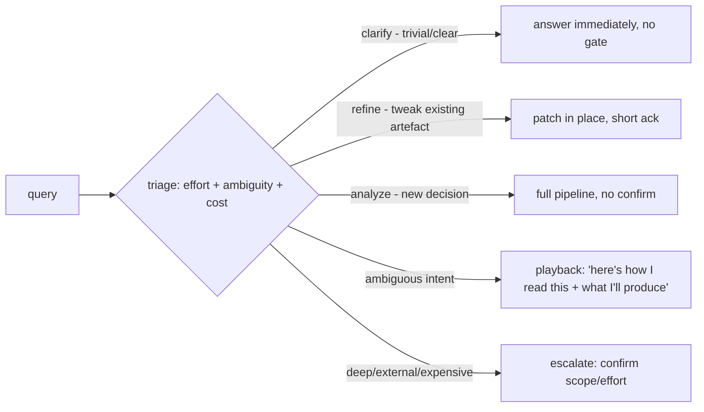
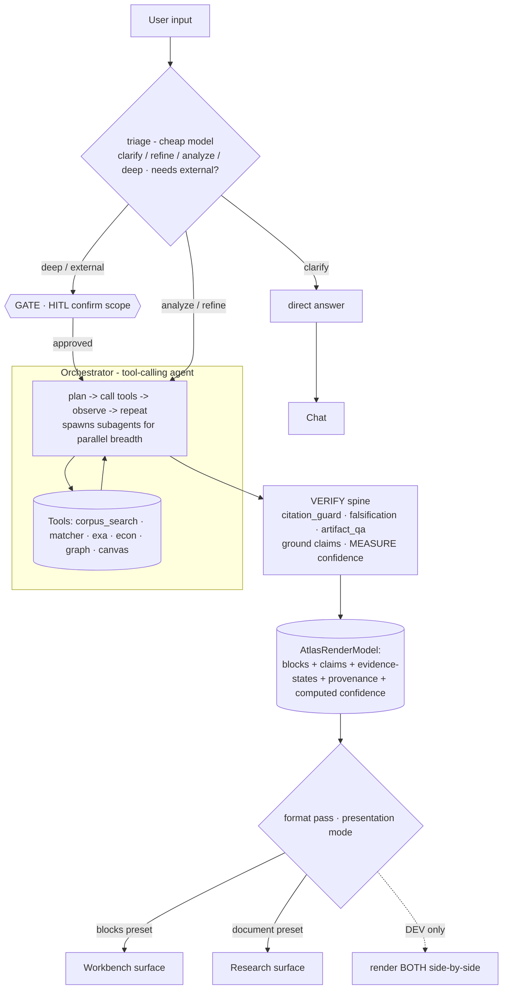
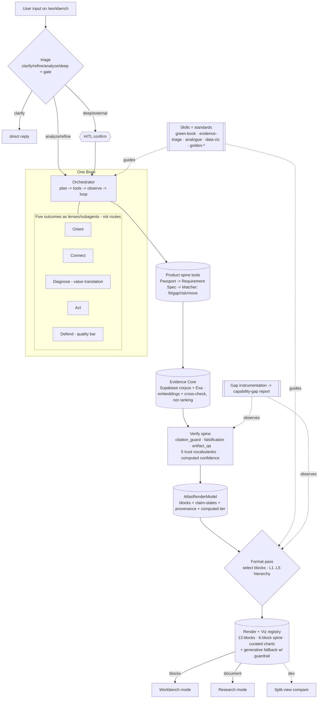

# ADR-0001 — The Atlas 5 Brain: One Pipeline, Presentation Modes

> **Status:** Proposed (awaiting Dayo approval)
> **Date:** 2026-06-15
> **Authority:** This ADR is the **gold-standard** for the *brain and rendering paradigm*. It reconciles the new-paradigm session (Jun 2026) with the canonical Notion spec. Where it touches the brain/control-flow, it is authoritative; the product **outcomes** remain governed by the canonical North Star v3.1 (unchanged).
> **Supersedes:** the workbench hard-router control flow (`agents/workbench/graph.py` `classify_route` + per-route nodes) and the block-schema authoring cage (`_PROPOSE_SYSTEM_SUFFIX`).
 > **Companion docs (in-repo, canonical):** `ATLAS5_NORTH_STAR.md` (product outcomes — mirrored from Notion North Star v3.1) · `ATLAS5_IMPLEMENTATION_PLAN.md` (sequenced work) · `CLAUDE.md` (stack anchor) · `AGENTS.md`.
> **Additional canonical sources (Notion, to be harmonised once MCP is back):** State of Play (dev handoff), Omega Block Library, Evidence Architecture v2.0.

---

## 0. TL;DR

**The outcomes have not changed. Only *how* we reach them has.**

Canonical Atlas v5 already specifies: the product spine (Passport → Requirement Spec → Match → Artefact → Action), five outcomes (Orient / Connect / Diagnose / Act / Defend), computed confidence, claim states, and a composable-block render model assembled per question. The planning work converged on a *composer over a block library* — we are not contradicting it.

What this ADR changes is the **control flow that drives that render model**:

1. Replace the **intent→fixed-route→fixed-schema** pipeline with **one tool-calling orchestrator** that plans, calls tools (corpus, external, matcher, econ, graph), and handles compound queries (e.g. *Diagnose + Connect*) in a single pass.
2. A cheap **triage** right-sizes effort (clarify / refine / analyze / deep), and only the deep/external end is **gated** with a human confirm.
3. **Verify after synthesis** — ground every claim, *measure* confidence from evidence states (already mandated: "confidence must be COMPUTED, not hardcoded").
4. **Choose shape last** — the same verified `AtlasRenderModel` renders as Workbench blocks or a Research document.

**The rails do not disappear — they move from controlling the *shape* of the output to verifying the *truth* of the output.** "Workbench" and "Research" are two presets of the final format node over one shared artifact.

**Net-new vs canonical:** (a) the tool-calling orchestrator replacing the linear router/composer-lookup; (b) the explicit gating spectrum; (c) self-revealing gap instrumentation. Everything else is *promotion of parts that already exist.*

---

## 1. Alignment with the canonical North Star (unchanged outcomes)

These are **not up for re-litigation** — the brain serves them.

**Product spine** (every capability traces to a step):
```
Entity Passport → Requirement Spec → Atlas Match → Strategic Artefact → Defensible Action
```

**Governing principle (canonical, and it refines our "no cage"):**
> **Structure goes in the objects. Intelligence goes in the matcher and the artefact.**

This resolves an apparent tension in our session. The **object layer** (Passport, Requirement Spec, claim states) *stays structured and governed* — that is the moat. The **authoring cage we are removing** is on the **artefact/output** only: we stop forcing the LLM's synthesis into rigid block-input schemas. Objects structured; artefact free-then-verified-then-formatted. Both are true.

**Five outcomes = the canonical modes** (lenses, not products; users escalate):

| Outcome | User question | Maps to our session's "modes" |
|---|---|---|
| **Orient** | What terrain matters to this decision? | "Explore the innovation landscape" |
| **Connect** | Where are the non-obvious routes, funders, partners? | part of "Passport mode" |
| **Diagnose** | What proof would unlock value here? (**value translation, not gap-detection**) | "Passport → where can it transfer → gap → value" |
| **Act** | What is the decision-ready move? | decision support |
| **Defend** | Does it hold up under scrutiny? | the quality bar across all of it |

Your "introspect / SWOT / claims registry" mode = **building the Entity Passport itself** (structuring the user's own object), then running Diagnose/Act on it.

**Design rules carried in:** orientation over visibility; explain the route; gaps must be value-linked; artefacts decision-ready; confidence must mean something; *do not build a landscape, build a route-finder.*

---

## 2. The principle (one idea, applied at every layer)

> **Replace forced *output* structure with described capability + verification — while keeping the *object* layer structured.**
>
> Content first → verify → choose shape last. Tools, lenses (the five outcomes), visualisations, and render blocks are *declarative capabilities the orchestrator selects from*, governed by **skills** (standards) and checked by the **trust layer** (truth).

| Old mechanism (cage) | New mechanism (capability + verification) |
|---|---|
| Hard classifier picks one route | Orchestrator plans, calls many tools, aggregates |
| Block schema forces model output | Model writes freely; format pass *selects* a renderer |
| Tier asserted by model | Tier **computed** from evidence states (`citation_guard`) |
| SWOT/chart templates enforce consistency | Skills enforce standards; verification enforces truth |
| (unchanged) Passport/Spec objects | (unchanged) **stay structured** — claim-stated, provenanced |

---

## 3. The gating spectrum (resolving "where is research gated?")

"Gate" is not a switch — it is a dial the triage sets. It maps onto the canonical **clarify / refine / analyze** lanes, extended with a deep-research escalation.



- **Default = flow through and answer** (clarify/refine/analyze) — keeps today's fluid feel.
- **Escalation gate** fires *only* at the deep/external end (multi-step + outside corpus). This is the ChatGPT/Claude "deep research" model.
- **Playback** is used *adaptively* — only when intent is ambiguous or the deliverable is costly. Never every turn (the ANA failure mode).
- A corrected playback is a **labelled intent-miss** → feeds §9 instrumentation.

---

## 4. The brain



- **Where research is gated:** at `TRI`/`GATE` — before spending on external + multi-step, or before a long report.
- **Where research is aggregated:** at `VER → ART` — one node merges everything into one verified `AtlasRenderModel`. No second brain run.
- **Mixed queries (Diagnose + Connect):** the orchestrator calls both capabilities in one pass and aggregates. It does **not** fire the router twice and does **not** force one label.
- **The bound that keeps it gov-grade** is not a route taxonomy: it is (1) cheap effort triage, (2) a fixed trusted tool set (model cannot invent data sources), (3) the verification spine, (4) a latency budget with early-exit. (`CLAUDE.md`: < 8s; product north-star: headline < 3s.)

**Matcher-vs-Workbench (canonical open decision) — resolved:** the orchestrator subsumes both. The **matcher is a tool**; "Workbench-one" and "Browse-many" are operating modes of the same block grammar; the same brain serves matcher-first (Phase 1) and workbench (Phase 2).

### Honest trade-offs (accepted)
1. **Latency:** deep queries can exceed budget → effort budget + early-exit + parallel calls + stream the trace so deep *feels* fast.
2. **Determinism:** agentic paths vary → low temperature + full trace logging.
3. **Eval:** no fixed routes to unit-test → eval on outcomes (§10).

---

## 5. Trust vocabularies — the honesty layer (never blend these five)

Canonical (State of Play §8 + North Star). The verify spine emits all five; the UI must keep them distinct:

| Vocabulary | Scope | Values |
|---|---|---|
| **Evidence state** | per claim | verified / self-reported / inferred / unknown / contested |
| **Provenance** | per claim/dimension | stored / derived / live-gap |
| **Gap magnitude** | per dimension | small / medium / large / unknown |
| **Transfer outcome** | per claim (value translation) | travels-as-is / needs-reframing / not-credible-here / evidence-needed |
| **Confidence tier** | per surface (**computed**) | Speculative / Indicative / Supported / Robust |

**Three risk types (never collapse into one score):** evidence risk · fit risk · entry risk. **Fit / Gap / Risk / Move** are the matcher's outputs.

**Discipline (canonical, validated on live fixtures):** dimensions are the spine of truth; **embedding distance is a falsification cross-check, not a ranking source**. Confidence is **computed** from evidence states present, never hardcoded.

---

## 6. Downstream: components, skills, visualisations

### 6a. Components = render registry (the 13 blocks; keep pixels, flip the contract)

Canonical block set (State of Play §1c) — **already implemented** in `src/components/workbench/blocks/**`:

> ContextCard · OpportunityList · ClaimLedger · EvidenceStateSummary · ProvenanceTrace · MatchBench · DimensionGap · ComparisonMatrix · NetworkMap · TransferLanes · RecommendationConfidence · ActionPlan · ObjectionResponse

- **Six-block universal spine** (carries the moat): ContextCard · ClaimLedger · EvidenceStateSummary · ProvenanceTrace · DimensionGap · RecommendationConfidence. This *is* the "decision spine" — it already encodes what-evidence / how-confident / what's-missing / recommended-move.
- **SWOT is a layout recipe of existing blocks, not a 14th block.** Snapshot/Brief is a workflow, not a block.
- The contract flips: a block stops being **an input schema the model must satisfy** and becomes **a renderer the format pass selects**. Same React, inverted contract.
- A render registry is **not** a cage (that was *authoring*); selecting a vetted block to *display* verified content is fine.

### 6b. Skills = standards (not templates)

Skill = *how to think/write* (`skills/*.md`); component = *how to display*. Consistency comes from **skill + verification**, never a template. Skills and the registry are **orthogonal** (the chooser's guidance vs the thing chosen).

### 6c. Visualisations — data verified like prose; encoding made safe

Two trust surfaces, different problems:
1. **Data** → same verification as prose (grounded + cited). No special case.
2. **Encoding** → not reliably checkable after the fact ("is this axis misleading?").

Therefore: **curated registry as default** (encoding correct *by construction* — already exists as `visual_recipe_director.build_visual_blocks` / the dormant `select_visual_recipe` "art director") + **generative (ECharts MCP) for the long tail behind an encoding guardrail.** 80/20 risk-and-cost optimisation, not cage nostalgia.

**Network graphs specifically:** high-value for this domain (a landscape *is* a graph), already built (`NetworkMap` + `_vb_knowledge_graph`). The rule that reconciles "beautiful visuals" with "info solid first": **visuals lead when the underlying structure is verified; prose leads when it's interpretive.** Graphs build from *verified edges* only, never LLM-imagined links.

---

## 7. Keep / promote / rebuild / delete

Test for keeping: *is this the moat / paradigm-agnostic, or does it encode the old control flow?*

### 7a. KEEP — substrate
Supabase corpus + `atlas`/`hive` schemas + embeddings · `atlas.blocks` (already a composable-block table; `canonical_question_ids` empty, ready to fill) · `atlas.briefs` · MCP wrappers (`agents/mcp_client.py`, `mcps/cpc_corpus/**`) · `agents/external_search.py` · `agents/passport_loader.py`, `agents/citation_helpers.py` · skills `skills/*.md` · presentational React (the 13 blocks) · tldraw · `eval/**`.

### 7b. KEEP + PROMOTE — trust spine + viz registry + render model (built, wrong place)
| Asset | Path | Today → After |
|---|---|---|
| Citation/tier guard | `agents/atlas/citation_guard.py` | ATLAS-only → shared verify node (computes tier for all) |
| Falsification lane | `agents/atlas/falsification.py` | flag-gated OFF → standard red-team on deep queries |
| Artifact QA | `agents/atlas/artifact_qa.py` | ATLAS-only → shared QA gate |
| Viz registry / art director | `agents/visual_recipe_director.py`, `select_visual_recipe` | audit-only/dormant → live curated viz selection |
| Compound handling | `visual_recipe_director.select_recipes()` | proves multi-output aggregation already works |
| Render model | (planned) `buildAtlasRenderModel(match_id, canonical_question_id)` | **build it** — the keystone backend function; output = `AtlasRenderModel` |

### 7c. REBUILD — control flow (the actual work)
`agents/workbench/graph.py` (`classify_route` + per-route nodes) → new `agents/orchestrator/graph.py` (tool-calling loop). Archive old graph on a reference branch; do not extend.

### 7d. DELETE / ARCHIVE — old-paradigm encodings
`classify_route` + `_ROUTE_PROMPT` + `route_to_node` (→ orchestrator tool selection; keep only cheap effort-triage) · per-route nodes (logic survives as **tools/render builders**, not routes) · `_PROPOSE_SYSTEM_SUFFIX` block authoring cage · 4-agent **routing split** (survive as lenses/subagents; CICERONE = prime subagent for parallel breadth) · regex intent→recipe classifier (`_INTENT_PATTERNS`) demoted to optional fast heuristic.

> We delete the **brain and the cages**, archive (not erase) the old graph, keep the **substrate + trust spine + viz registry + block library**. If we were clinging, §7d would be empty. It isn't.

---

## 8. One surface + the render model

- **One page** (`/workbench`). "Research" is a **render mode of the format pass**, not a separate app/route.
- The shared artifact is the canonical **`AtlasRenderModel`** (normalised: blocks + claims + evidence-states + provenance + computed confidence). Layout hierarchy (locked, State of Play §4): **L1 answer → L2 trust rail → L3 gaps/reasoning → L4 claim audit → L5 debug (drawer)**.
- **Dev/eval split-view:** both modes consume the *same* `AtlasRenderModel`, so **run the brain once, render twice** (blocks ‖ document). Proof, not waste.

---

## 9. Self-revealing instrumentation (bridging the "is the spec good enough?" gap)

The paradox ("if it reveals its own gaps, why doesn't it just work?") dissolves: **detecting a gap is cheap and reliable; filling it well needs domain judgment.** Detection ≠ solution.

Instrument from day one — the verify spine *already emits the signals*:
- low computed tier / citations dropped (`citation_guard`)
- QA issues (`artifact_qa`); falsification findings
- format pass fell back to prose (no block fit → **render gap**)
- generated chart kept hitting the guardrail (**encoding gap**)
- user corrected the playback (**intent-miss**)

Aggregate into a **capability-gap report** (which CanonicalQuestions get low confidence, which fall to prose, which skills are thin). Improvement = a human (or an offline "improver" agent) strengthening a skill/block. **Define the skeleton + one vertical fully; let the rest reveal their own gaps as we expand.**

---

## 10. Evals (outcome-based, not path-based)

Extends `eval/**` (corpus recall audit, contract tests, four-horsemen, parity). The **Four Horsemen** CI gates (honesty, attribution, CPC-inward) remain CI checks, not runtime personality.

1. **Citation accuracy** — every cited ID exists in Supabase (not just UUID-shaped); zero fabrication.
2. **Grounding** — every quantitative claim traces to a source; unsupported claims dropped/flagged.
3. **Confidence calibration** — computed tier matches evidence states; no over-claiming.
4. **Compound handling** — Diagnose+Connect produces both, aggregated.
5. **Effort routing** — trivial → cheap path; deep → gates correctly.
6. **Latency budget** — analyze path < 8s; headline < 3s; deep streams within budget.
7. **Encoding safety** — generated charts pass the guardrail.
8. **Render parity** — split-view shows the same verified facts in both modes.
9. **Value-translation quality** — the Phase-1 vertical: does the Evidence Gap & Value Translation Report reveal a non-obvious gap/route/risk a user trusts? (the canonical product-proof.)

Each deliverable owns its own tests (`CLAUDE.md` rule 8).

---

## 11. Comprehensive anchor diagram



---

## 12. Open decisions for the implementation plan

1. **Transport:** canonical lean is **CopilotKit + AG-UI** as the control layer *because the AI must drive the canvas/blocks* (the render model IS the synced `useCoAgent` state); assistant-ui is the chat-only fallback. **Do not run both.** (Recommend CopilotKit+AG-UI for the orchestrator surface.)
2. **Orchestrator runtime:** LangGraph tool-calling loop (recommended) vs hand-rolled plan/act nodes.
3. **Subagent boundary:** CICERONE = real subagent (parallel breadth); others = prompt/skill lenses.
4. **Effort dial UI:** auto-only vs expose `clarify/analyze/deep` to the analyst.
5. **Module layout:** `agents/orchestrator/` (new brain) + `agents/spine/` (promoted verify) + `agents/registry/` (promoted viz) + `buildAtlasRenderModel` keystone. Archive `agents/workbench/graph.py`.
6. **First vertical:** **Value Translation / Diagnose** (canonical "densest exemplar, best first slice") → the Evidence Gap & Value Translation Report. Prove it end-to-end before lighting up Orient/Connect/Act/Defend.

These are resolved in the implementation plan, not here.
