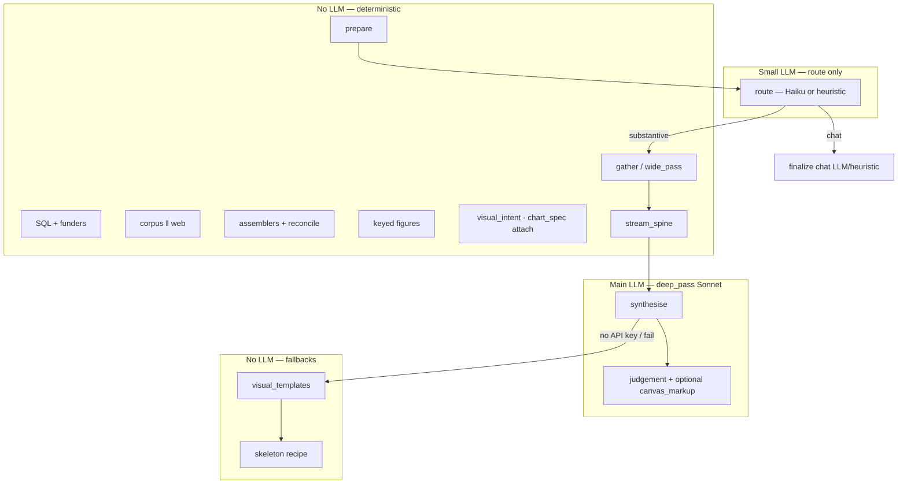
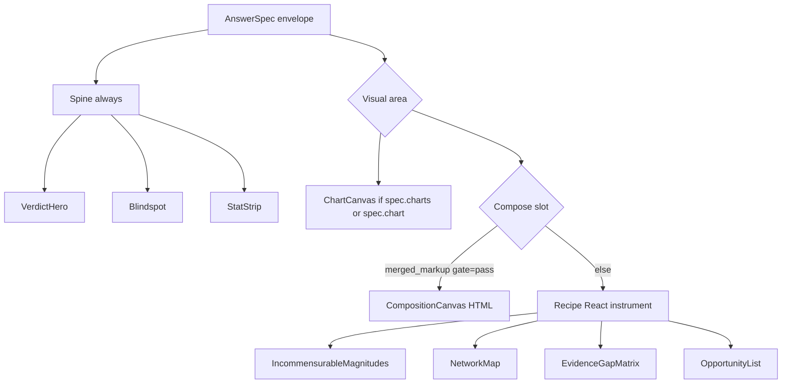
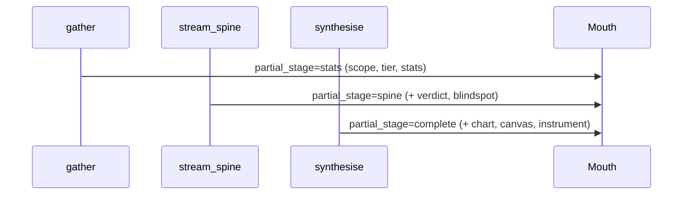

# Atlas v5 — System blueprint

> **Purpose:** Single source of truth for `/atlas` — architecture, trust, inventory, and navigation.  
> **Audience:** You, engineers, designers, eval. Update when AnswerSpec, graph topology, or inventory changes.  
> **Canonical path:** CopilotKit agent `atlas_v5` → `agents/atlas_v5/graph.py` → `run_turn.py`

---

## How to use this doc

| You want to… | Read section |
|--------------|--------------|
| Understand the whole in one paragraph | [§0 System at a glance](#0-system-at-a-glance) |
| Know what we **recommend** vs what exists today | [§1 Architecture stance](#1-architecture-stance-hub-vs-pipeline) |
| See where the LLM starts and LangGraph ends | [§2 LLM boundary](#2-llm-boundary-where-cognition-lives) |
| Understand trust & peer lanes | [§4 Evidence lanes](#4-evidence-lanes-peer-model) · [TRUST_MODEL_V2.md](./TRUST_MODEL_V2.md) |
| Implement trust v2 or multi-lane charts | [§17 Trust v2 + visual rollout](#17-trust-v2--visual-rollout) |
| Add/remove a recipe, chart, or template | [§10 Element inventory](#10-element-inventory) |
| Navigate by metaphor | [§11 Analogy map](#11-analogy-map-standardized) |
| Product north star & decision surfaces | [§16 Product north star](#16-product-north-star) |
| **Case File programme (current priority)** | [§18 Product direction](#18-product-direction--case-file-centre-june-2026) · [CASE_FILE_PLAN.md](./ATLAS_V5_CASE_FILE_PLAN.md) |
| Change code | [§14 File map](#14-file-map) |

**Blueprint term is always source of truth.** Metaphors (Restaurant, Body) are translation layers — same row in every column.

---

## 0. System at a glance

**One sentence:** User asks on `/atlas` → LangGraph wires a turn → a **shopper** (light model) sets a per-lane shopping list → the **always-run wide pass** fetches corpus ‖ web per that list and builds a locked skeleton → **hub LLM (Sonnet)** judges and optionally composes HTML → **gate** verifies figures → mouth renders AnswerSpec (spine + chart / compose / recipe).

> **"Deterministic" clarified:** the wide pass is *deterministic in structure, not in content* — every lane is **always visited** (this is the gate's guarantee), but *what each lane fetches and how it's weighted* is shaped per query/outcome-mode by the shopper. Markets are fixed; the shopping list adapts; the model never decides *whether* a lane runs. See [§4 Evidence lanes](#4-evidence-lanes-peer-model).

**Three layers:**

| Layer | Name | Role |
|-------|------|------|
| **Mouth** | Next.js + CopilotKit | Display only — never invents data |
| **Brain graph** | LangGraph `atlas_v5` | Schedules nodes, streams partials — **not** the cognition hub |
| **Brain work** | `wide_pass` + `deep_pass` | Evidence (code) + judgement (LLM) |

**Unified visual vocabulary** (use everywhere):

| Blueprint | Plain English | Same slot? |
|-----------|---------------|------------|
| **Recipe** | Standard arrangement (React) | `instrument` |
| **Template** | Prep kit (deterministic HTML) | `canvas.merged_markup` |
| **Compose** | Custom plate (LLM HTML) | `canvas.merged_markup` |
| **Chart** | Inset chart(s) (ECharts) | `charts[]` + `chart` (first) — can coexist above compose/recipe |

Template and compose share one slot; template is fallback when LLM is off or compose fails.

---

## 1. Architecture stance: hub vs pipeline

### What exists today (two brains in the repo)

| Path | Pattern | Active when | Used by |
|------|---------|-------------|---------|
| **`atlas_v5`** | **Pipeline evidence + hub judgement** | Always for `/atlas/session` | CopilotKit `atlas_v5` |
| **`orchestrator`** | **Hub-and-spoke tool loop** (`bind_tools`) | `ATLAS5_ORCHESTRATOR_V1=true` | Workbench endpoint |

You are not imagining things: **the repo contains both.** `/atlas` session runs the pipeline path. The orchestrator is the experiment closer to ChatGPT/Claude “pick tools as needed.”

### What we recommend (not just describing — this is the target)

**Hybrid, not pure hub-and-spoke for everything:**

```
┌─────────────────────────────────────────────────────────────┐
│  HUB LLM (Sonnet deep_pass)                                 │
│  Route hint · disposition · verdict · optional compose HTML │
└──────────────────────────▲──────────────────────────────────┘
                           │ reads locked skeleton + keyed figures
┌──────────────────────────┴──────────────────────────────────┐
│  ALWAYS-RUN PIPELINE (wide_pass) — every lane, every turn    │
│  SHOPPER (light model) shapes per-lane list ─┐               │
│  SQL stats ‖ corpus search ‖ web → reconcile │ (never skips) │
│  → assemblers → KeyedFigureIndex → gate       ┘              │
└─────────────────────────────────────────────────────────────┘
```

> **Shopper vs chef (the two minds):** the **shopper** (light model, pre-deep-pass) reasons only about *what to buy in each market* and emits a per-lane shopping list — it has no way to skip a lane (the output schema carries weights/sub-queries per lane, never a set-of-lanes). The **chef** (`deep_pass` Sonnet) reasons freely about *what it all means*. The shopper shops; the chef cooks; only the chef has open judgement.

| Concern | Pure hub-and-spoke (orchestrator-style) | Recommended for `/atlas` |
|---------|----------------------------------------|---------------------------|
| **Parallel corpus + web** | LLM decides whether to call each tool | **Always run both** (peer lanes) — **locked decision** |
| **Which tools / lanes** | LLM picks per turn | **Lanes always run; shopper shapes per-lane sourcing/weighting.** Model never decides *whether* a lane runs |
| **What each lane fetches** | LLM picks per turn | Shopper (light model, pre-deep-pass) sets per-lane list by query/mode; deterministic floor profile when no key |
| **Numbers in the canvas** | LLM may type figures in markup | **Keyed figures** from SQL — LLM fills holes only |
| **Audit / eval** | Hard to replay (“model skipped search”) | Same query → same skeleton → comparable eval |
| **Latency** | Variable tool loops | Bounded wide pass + one deep call |
| **Judgement & voice** | Hub LLM | Hub LLM ✓ |
| **Free HTML layout** | Hub LLM | Hub LLM ✓ (with gate) |

**Your parallel search instinct is correct and is a locked product decision.** The rest does not require abandoning hub-and-spoke — it requires **splitting roles**:

- **Hub** = think, judge, compose (what ChatGPT does well).
- **Pipeline** = fetch, lock, verify (what guardrails need as *inputs*, not as afterthoughts).

### Can guardrails alone fix pure hub-and-spoke?

**Partially — but not enough for Atlas’s product bar.**

The **gate** (`merge` + `composition_pipeline`) is the immune system: it rejects HTML whose `{{stats.project_count}}` holes don’t match the KeyedFigureIndex. That only works if:

1. Figures were **computed before** the LLM spoke.
2. The LLM **did not** skip retrieval that those figures depend on.

In a pure tool loop, the model can:

- Call search once, miss SQL aggregates, still write a confident canvas.
- Omit web lane on “easy” queries — you lose peer richness.
- Take a different tool path each run — eval and demos drift.

**LangGraph is not the guardrail.** LangGraph is the **schedule** (which node runs when). Guardrails are: keyed figures, merge, gate, citation guard, reconcile notes, tier rules.

**Recommendation summary:**

| Keep as code (pipeline) | Keep as hub LLM | Optional future merge |
|-------------------------|-----------------|------------------------|
| Dual lane fetch | Disposition, verdict, compose | Orchestrator tool loop for *workbench* exploration |
| SQL + assemblers | Chat-only replies | More tools behind hub **after** skeleton exists |
| Chart attach (deterministic) | Voice / blindspot | LLM *requests* chart kind; Python still builds option |
| visual_intent regex | | |
| Gate + merge | | |

You are **not** fighting hub-and-spoke for judgement. You **should** fight making the LLM the only thing standing between “user asked” and “evidence fetched.”

---

## 2. LLM boundary: where cognition lives

LangGraph node = **when**; LLM = **who reasons** (only in specific nodes).



| Stage | LLM? | Module |
|-------|------|--------|
| prepare | No | `graph_nodes.py` |
| route | Haiku **or** heuristic | `turn_classifier.py` |
| source shopper | Haiku **or** floor profile | `source_shopper.py` |
| gather / wide_pass | **No** (fetch); shopper is light LLM | `wide_pass.py`, `source_shopper.py`, `retrieval_fabric.py`, `*_assembler.py` |
| stream_spine | No | `progressive_stream.py` |
| synthesise / deep_pass | **Sonnet** | `deep_synthesis.py` |
| Template / recipe fallback | No | `visual_templates.py`, skeleton `instrument` |
| Chart on spec | No | `chart_spec.py` (after deep path) |

**LangGraph finishes** after `synthesise` or `finalize` — it does not “become” the hub; it wires `run_turn()`.

---

## 3. End-to-end flow (one turn)

```mermaid
flowchart TB
  subgraph User
    Q[User query]
  end

  subgraph Mouth["MOUTH — Next.js /atlas"]
    CK[CopilotKit useCoAgent]
    AS[AtlasAnswerSurface]
    CK --> AS
  end

  subgraph Brain["BRAIN — LangGraph atlas_v5"]
    P[prepare]
    R[route — classify_turn]
    G[gather — wide_pass]
    S[stream_spine — partial]
    Y[synthesise — deep_pass]
    P --> R
    R -->|substantive| G --> S --> Y
    R -->|chat/clarify| F[finalize]
  end

  subgraph Wide["wide_pass — parallel"]
    SQL[(Supabase SQL aggregates)]
    RF[retrieval_fabric]
    C[corpus search ‖]
    W[GovUK + Exa ‖]
    SQL --> Skel[skeleton AnswerSpec]
    RF --> C & W
    C & W --> Recon[reconcile_spec dual-peer]
    Skel --> Recon
  end

  subgraph Deep["deep_pass"]
    VI[visual_intent + templates]
    CS[chart_spec]
    Gate[merge + gate]
    Recon --> Deep
    VI --> Gate
    CS --> Spec[AnswerSpec final]
    Gate --> Spec
  end

  Q --> CK
  G --> Wide
  Y --> Deep
  Spec -->|answer_spec_envelope| CK
  AS -->|stats / verdict / chart / compose / recipe| UI[Canvas]
```

---

## 4. Evidence lanes (peer model)

**Default:** `ATLAS_V5_PARALLEL_EVIDENCE=1` + `ATLAS_V5_WEB_LANE=1` → **dual lane every substantive turn**. A **shopper** (light model, pre-deep-pass) shapes *what each lane fetches and how it's weighted* per query/outcome-mode. **Lanes always run** — the shopper cannot skip one.

```mermaid
flowchart LR
  subgraph Shop["Shopper (light model, pre-fetch)"]
    SHOP[per-lane shopping list\nweights + sub-queries\nNO skip field]
  end
  subgraph Parallel["Always fetched in parallel (ThreadPoolExecutor)"]
    CORPR[Corpus — project rows / SQL]
    CORPD[Corpus — documents / knowledge_chunks]
    GOV[Web — GovUK]
    FUND[Web — funders / partners / Exa]
  end

  SHOP --> CORPR & CORPD & GOV & FUND
  CORPR --> Bag[EvidenceBag]
  CORPD --> Bag
  GOV --> Bag
  FUND --> Bag
  Bag --> Recon[reconcile_spec — fit-weighted]

  Recon -->|owned| Stats[stats.* keys]
  Recon -->|borrowed| Web[web.* keys + web_evidence[]]
  Recon -->|declared| Decl[declared situation claims]
```

> **Corpus is two sub-sources, not one:** structured project rows (SQL) **and** ingested documents (`knowledge_chunks` / `knowledge_documents`, embeddings). The shopper weights structured-vs-document by query type — analyst landscape leans rows; practitioner messy situation leans document chunks.

| | Corpus | Web | Declared |
|--|--------|-----|----------|
| **Role** | Structured CPC project rows + ingested documents | Policy, programme scale, freshness, partners, funders | User's own stated situation (practitioner path) |
| **Authority** | **Peer** — not default | **Peer** — not fallback | **Peer** — never promoted to owned without ingestion |
| **Trust material** | `owned` (solid) | `borrowed` (dashed) | `declared` (◇ "stated by user", max Indicative) |
| **When thin** | Still run; note in reconciliation | Still run; note in reconciliation | Empty until user states situation |
| **Disable** | N/A | `ATLAS_V5_WEB_LANE=0` | N/A (only populates on declared input) |

**Three materials, not two.** `declared` (Increment 0) is a peer trust material rendered visibly distinct and capped at Indicative. Provenance (owned/borrowed/declared = *where it came from*) and epistemic stance (via `claim_subtype` on declared rows) are **orthogonal axes**.

**Tier honesty (Increment 1A):** reconcile fit-weights narrative *lead* by mode. Corroboration tier **+1** applies only when **both** lanes return substantive signal — never when one lane led and the other was thin. See `apply_peer_tier_rules()` in `reconcile_spec.py`.

**Trust marking today (v1):** `owned` / `borrowed` / `declared` encode provenance but read as a quality hierarchy in UI (solid corpus vs dashed web). Fetch is peer; **validation and charts are still corpus-centric.**

**Trust marking target (v2):** Peer lanes with **lane-specific validation** and a shared ledger — no default incumbent. See **[TRUST_MODEL_V2.md](./TRUST_MODEL_V2.md)** for `lane` + `validation_status` + lead-by-question reconcile + lane-aware charts.

| | v1 (live) | v2 (target) |
|--|-----------|-------------|
| Lane fetch | Peer — always run | Same |
| Labels | `owned` / `borrowed` / `declared` | `lane` + `validation_status` + per-claim tier |
| Tier cap | Corpus citation count | Validated evidence across lanes |
| Charts | Corpus SQL + corpus hits | Best validated dataset per question; multi-lane OK |

---

## 5. Prompts, skills, and art direction

One Sonnet call — layered inputs, not three competing systems.

| Layer | What | Always? | File(s) |
|-------|------|---------|---------|
| **System prompt** | Identity, evidence rules, disposition task | Deep pass | `deep_pass_prompt.py` |
| **Skills** | Extra markdown **appended to** system prompt | Visual skill if `FREE_COMPOSE`; chart skill if file exists | `skills/atlas-visual-composition.md`, `skills/atlas-chart-encoding.md` |
| **Runtime addenda** | Dual lane, recipe lock, corpus-only | Per turn meta | `deep_pass_prompt.py`, `composition_policy.py` |
| **Route prompt** | Classify only — no canvas content | Route node | `turn_classifier.py` (Haiku) |

**Skills are not tools.** They do not fetch data. They guide *how* to compose and *when* charts help — but **charts are built in Python** (`chart_spec.py`), not by the skill invoking ECharts.

**Art direction is split** (who picks the visual):

| Decision | Decided by | LLM? |
|----------|------------|------|
| SWOT / journey / bar / connect | `visual_intent.py` (regex) | No |
| Skeleton recipe (NetworkMap, etc.) | `*_assembler.py` by outcome | No |
| free_compose vs reference_recipe | deep_pass disposition | Yes (or heuristic) |
| HTML layout & materials | deep_pass + visual composition skill | Yes |
| SWOT/journey when no LLM | `visual_templates.py` | No |
| Funder bar chart | `visual/` opportunity engine + builders | No |

**Fallback ladder** (compose slot):

```
LLM compose → template (prep kit) → recipe (React) → prose
```

---

## 6. AnswerSpec render fork (mouth)



| Slot | Field | Builder | Skill guides LLM? |
|------|-------|---------|-------------------|
| **Recipe** | `instrument` | `*_assembler.py` | No |
| **Template** | `canvas.merged_markup` | `visual_templates.py` | No |
| **Compose** | `canvas.merged_markup` | Model HTML → merge → gate | `atlas-visual-composition.md` |
| **Chart** | `charts[]`, `chart` | `visual/attach.py` + builders + `viz_guardrail` | `atlas-chart-encoding.md` (LLM hint only); attach is **code** |

### ECharts vs Recharts (what is actually live)

| Renderer | Used where | Atlas v5 `/atlas`? |
|----------|------------|---------------------|
| **ECharts** (`echarts-for-react`) | `chart-canvas.tsx`, `network-map.tsx` | **Yes** — primary chart path |
| **Recharts** | `src/components/ui/chart.tsx`, lab/workbench | **No** — legacy/lab only |

**Why responses can still feel prose-heavy:** compose/templates cover many queries; charts require **validated numeric shape**. Today the Visual Opportunity Engine attaches 0–3 charts from **corpus stats + corpus citations only** — external lane enriches prose/reconcile but not chart series yet. See [§17](#17-trust-v2--visual-rollout).

---

## 7. Progressive streaming (CopilotKit)



Dev overlay: `partial` · `stage` · `lane` · `gate` · `peer=yes` when dual.

---

## 8. Visual intent router

```
Query + outcome
    │
    ├─ swot ──────────────► Template T1 (SWOT prep kit)
    ├─ journey_orient ────► Template T2 (journey strip)
    ├─ funder_bar / bar ──► Chart C1 (funder bar) if stats.funders
    ├─ connect ───────────► Recipe R2 NetworkMap
    └─ default orient ────► Recipe R1 IncommensurableMagnitudes (+ T2 fallback)
```

---

## 9. Core vs additive

### Core (remove → Atlas breaks)

- `AnswerSpec` / `AnswerSpecEnvelope` contract
- `wide_pass` + assemblers + **parallel** `retrieval_fabric`
- `reconcile_spec` (dual-peer)
- `KeyedFigureIndex` + merge + gate
- Turn disposition + deep pass
- CopilotKit coagent state sync
- Mouth spine + render fork

### Additive (polish / coverage)

- Visual templates (SWOT, journey)
- ChartSpec builders beyond C1
- Progressive partials + CountAnimation
- GenUI eval (`npm run eval:genui`)
- Recipe lock / gate mode env flags
- Dev overlay · showcase journeys
- Orchestrator tool loop (separate path)

---

## 10. Element inventory

Living registry — add a row when you add a recipe, chart, or template.

### Brain pipeline (LangGraph)

| ID | Element | File(s) |
|----|---------|---------|
| B1 | prepare | `graph_nodes.py` |
| B2 | route (Haiku / heuristic) | `turn_classifier.py` |
| B3 | gather / wide_pass | `wide_pass.py` |
| B4 | stream_spine | `progressive_stream.py`, `graph_nodes.py` |
| B5 | synthesise / deep_pass | `deep_synthesis.py` |
| B6 | finalize (chat) | `graph_nodes.py`, `chat_router.py` |

### Evidence

| ID | Element | File(s) |
|----|---------|---------|
| E1 | Corpus semantic search (projects) | `retrieval_fabric.py` |
| E1b | Corpus document search | `retrieval_fabric.py` → `evidence_for_claim` |
| E2 | SQL aggregates + funder rows | `j1t1_corpus.py`, `corpus_scope.py` |
| E3 | Web GovUK + Exa (shaped) | `retrieval_fabric.py`, `web_lane.py` |
| E7 | Source shopper (pre-fetch list) | `source_shopper.py` |
| E4 | Fit-weighted reconcile + tier honesty | `reconcile_spec.py` |
| E5 | Keyed figures | `keyed_figures.py` |
| E6 | Merge + gate | `composition_pipeline.py`, `judgement_merge.py` |

### Recipes (`instrument` — React)

| ID | Recipe | Outcome | Assembler | Mouth component |
|----|--------|---------|-----------|-----------------|
| R1 | IncommensurableMagnitudes | orient | `j1t1_assembler.py` | `incommensurable-magnitudes.tsx` |
| R2 | NetworkMap | connect | `connect_assembler.py` | `network-map.tsx` |
| R3 | EvidenceGapMatrix | diagnose | `diagnose_assembler.py` | `evidence-gap-matrix.tsx` |
| R4 | OpportunityList | act | `act_assembler.py` | `opportunity-list.tsx` |
| R5 | (online-only skeleton) | web-led | `online_only_assembler.py` | varies |

### Templates (`canvas` — deterministic HTML)

| ID | Template | Trigger | Builder |
|----|----------|---------|---------|
| T1 | SWOT 2×2 grid | `visual_intent` swot | `build_swot_markup` |
| T2 | Journey orient strip | `visual_intent` journey_orient | `build_journey_orient_markup` |

### Charts (`charts[]` / `chart` — ECharts)

**Engine:** `agents/atlas_v5/visual/` — data profile → opportunity tree → builders → attach (max 3, weak-data suppression). Entry: `chart_spec.attach_charts_with_meta`.

| ID | Chart kind | Status | Data source (today) | Builder |
|----|------------|--------|---------------------|---------|
| C1 | Funder ranking bar | **Live** | `stats.funders` (corpus SQL) | `build_funder_ranking_bar` |
| C1b | Null funding bar | **Live** | `stats.funders` null counts | `build_null_funding_bar` |
| C3 | Pie composition | **Live** | corpus funder floor shares | `build_funder_composition_pie` |
| C5 | Evidence heatmap | **Live** | corpus hits + citations | `build_evidence_heatmap` |
| C6 | Flow sankey | **Live** | corpus hits (connect / flow intent) | `build_flow_sankey` |
| C2 | Line (trend) | Planned | corpus or web time series | not implemented |
| C7 | Web programme bar | **Planned (v2)** | validated `web.*` ledger figures | trust v2 |
| C4 | Network as ChartSpec | N/A | use R2 NetworkMap | by design |

**v2:** charts bind to **ledger keys from any lane** that passed validation; lead lane from reconcile. See [TRUST_MODEL_V2.md](./TRUST_MODEL_V2.md) §3.

### Skills & prompts

| ID | Asset | Role | File |
|----|-------|------|------|
| S1 | Visual composition skill | Compose guardrails | `skills/atlas-visual-composition.md` |
| S2 | Chart encoding skill | Chart *guidance* for LLM | `skills/atlas-chart-encoding.md` |
| P1 | Deep pass system prompt | Identity + evidence + task | `deep_pass_prompt.py` |
| P2 | Route classifier prompt | Route only | `turn_classifier.py` |

### Change checklist

When adding a **recipe:** assembler → `AnswerSpec.instrument` schema → mouth `renderInstrument` → eval case.  
When adding a **template:** `visual_templates.py` + `visual_intent.py` → eval case.  
When adding a **chart:** builder in `visual/builders.py` + opportunity row in `visual/opportunity.py` + `viz_guardrail` + eval in `test_visual_opportunity.py` → mouth unchanged if `ChartBlock` shape holds.

---

## 11. Analogy map (standardized)

Same blueprint row in every column. **Restaurant** = where to put changes. **Body** = trust constraints.

| # | Blueprint part | Restaurant | Body |
|---|----------------|------------|------|
| 1 | User query | Guest order | Stimulus |
| 2 | Mouth (UI) | Front of house | Face & speech |
| 3 | Event stream | Waiter runs | Nervous system |
| 4 | Brain graph | Kitchen line schedule | Cortex pipeline schedule |
| 5 | route | Maître d’ triage | Reflex vs deep thought |
| 6 | wide_pass | Prep station | Parallel intake |
| 7 | Corpus lane | House warehouse | Internal labs |
| 8 | Web lane | Market run (always) | Sensory input |
| 9 | EvidenceBag | Delivery crates | Combined samples |
| 10 | reconcile_spec | Head chef compares deliveries | Signal integration |
| 11 | KeyedFigureIndex | Ticket numbers | Biomarkers on chart |
| 12 | Gate + merge | Expeditor | Immune system |
| 13 | Skeleton AnswerSpec | Blank ticket | Vitals chart draft |
| 14 | Skills | Training manual | Medical school |
| 15 | deep_pass (Sonnet) | Head chef judgement | Executive function |
| 16 | stream_spine | First courses | Monitor beeps |
| 17 | Recipe | Set menu plate | Standard gesture |
| 18 | Template | Prep kit card | Reflex posture |
| 19 | Compose | Chef’s special | Improvised speech |
| 20 | Chart | Nutrition inset | X-ray panel |
| 21 | visual_intent | Menu category picker | Exam type picker |
| 22 | Progressive stream | Course pacing | Pulse → ECG → workup |
| 23 | Dev overlay | Pass window | Monitor overlay |
| 24 | Env flags | Supplier contracts | Medication switches |
| 25 | Core vs additive | Health code vs garnish | Organs vs makeup |

**Validation questions**

- *Restaurant:* “Supplier, ticket number, set menu, prep kit, inset chart, or chef’s special?”
- *Body:* “Does it pass the immune system? Which **lane** validated this figure?” (v2 — not “owned vs borrowed” alone)
- *Architecture:* “Pipeline fix (atlas_v5) or tool-loop fix (orchestrator)? Which path is `/atlas` using?”

---

## 12. Environment flags

| Variable | Default | Effect |
|----------|---------|--------|
| `ATLAS_V5_WEB_LANE` | `1` | GovUK + Exa parallel with corpus |
| `ATLAS_V5_PARALLEL_EVIDENCE` | `1` | Force dual lane (peer model) |
| `ATLAS_V5_FREE_COMPOSE` | `1` | Free HTML compose vs recipe lock |
| `ATLAS_V5_RECIPE_LOCK` | `0` | Golden demo recipe hijack |
| `ATLAS_V5_GATE_MODE` | `warn` | Gate logs vs hard reject |
| `ANTHROPIC_API_KEY` | — | Deep pass; without it → templates/skeleton + floor shopper |
| `ATLAS_V5_SHOPPER_CACHE` | `0` | Pin shopper list per (query, mode) for eval replay |
| `ATLAS5_ORCHESTRATOR_V1` | off | Workbench tool-loop brain (not `/atlas` default) |

---

## 13. Not wired yet (gaps)

- **`visual_intent` is regex** — SWOT/journey/bar/connect chosen by keyword regex on the query (same brittle pattern as the old `is_substantive_canvas_query` bug). **Next increment after practitioner journey (Inc 2):** model *proposes* visual intent, Python still *builds* deterministically, gate still verifies figures (same guardrail shape as the shopper).
- Chart builders C2/C3 (line, pie) — router exists, builders don’t
- ECharts MCP → ChartBlock (workbench only today)
- Academic / paper-search lane — a **new market**, opened by config when built (not model-chosen)
- User-uploaded files → `claim_evidence_links` — a **new market**, parked
- Partial envelope for `visual` stage only (chart in final only)
- Consolidate legacy `src/lib/atlas5/ChartSpec` vs `AnswerSpec.chart`
- **System-wide epistemic stance axis** — verified/inferred/predicted on *all* deep_pass claims (narrow `declared`-only version lives via `claim_subtype`); parked target
- Migrate `passport_claims` + `brief_claims` onto unified `atlas.claims` spine; retire forks
- Packager agent (bid / transferability pack) and Underwriter agent (truth verification) — parked

**Shipped since last blueprint rev (no longer gaps):** `declared` third trust material + case-file spine (Increment 0); source shopper + corpus document surfacing + fit-weighted reconcile with honest tier rules (Increment 1A); **Case File mouth Phase 0–1** (panel, canvas block, entity promote, SWOT-on-claims); session persist (`atlas.threads` / `atlas.turns`).

---

## 14. File map

| Want to change… | Edit |
|-----------------|------|
| Parallel web + corpus + shopper | `source_shopper.py`, `web_lane.py`, `wide_pass.py` |
| Reconciliation + tier honesty | `agents/atlas_v5/reconcile_spec.py` (`apply_peer_tier_rules`) |
| SQL scope (rail vs CPC) | `agents/atlas_v5/corpus_scope.py` |
| New recipe skeleton | `agents/atlas_v5/*_assembler.py` + mouth renderer |
| New chart type | `chart_spec.py`, `chart_router.py`, `viz_guardrail.py` |
| New HTML template | `visual_templates.py`, `visual_intent.py` |
| LLM voice / evidence | `deep_pass_prompt.py`, `skills/*.md` |
| Case File UI + API | `case-file-panel.tsx`, `declared-claims-block.tsx`, `src/app/api/atlas/case-file/` |
| Case entities (Phase 1) | `case-entity-store.ts`, `20260626_atlas_case_entities.sql` |
| Session persist | `thread-store.ts`, `ATLAS_V5_MEMORY_AND_LEARNING.md` |
| Streaming stages | `graph_nodes.py`, `progressive_stream.py` |
| Eval cases | `agents/atlas_v5/genui_eval.py` |
| Tool-loop experiment | `agents/orchestrator/graph.py` |

---

## 15. Quick validation

```bash
npm run eval:genui
python -m pytest agents/test_atlas_v5_abc_features.py agents/test_case_file.py -q
python -m agents.atlas_v5.calibration_eval --case cal_03_lost_rail
```

| Query | Expect |
|-------|--------|
| State of play rail decarbonisation | `lane=dual`, journey template or two-tier; **no declared claims** in case file |
| SWOT on CPC | T1 four-quadrant grid (corpus-led header) |
| **SWOT on my stated claims** | T1 grid; header **declared case file**; quadrants from case file |
| **I've got a rail idea, not sure what I'm asking** | Case file panel + declared canvas block; find-my-path surface |
| Funding by funder breakdown | C1 ChartSpec bar |
| Map hydrogen supply chain | R2 NetworkMap |
| **Show me what you can do** → `demo rail` → `next` | Showcase journey — rich canvas reel (not pre-filled case file) |

Dev overlay: `lane=dual skip=false peer=yes`, `partial=stats→spine→complete`.

---

## 16. Product north star

> **Scope:** Product intent and decision surfaces — does not change architecture in §1–§15.  
> **Canonical path unchanged:** `/atlas` → `atlas_v5` (not orchestrator).

### North-star mantra

```
Pipeline for evidence.
Hub for judgement.
Contract for rendering.
Gate for trust.
```

**One-line product:** Atlas is an evidence-controlled decision kitchen — the chef may be creative on story and layout, but only with ingredients that were fetched, labelled, and weighed before judgement runs.

### Today vs target

| | **Today** | **Target** |
|---|-----------|------------|
| **Canonical path** | `/atlas` uses `atlas_v5`, not orchestrator | Same — orchestrator remains workbench unless deliberately promoted |
| **Routing** | `chat` \| `clarify` \| `substantive` + outcome hints (`orient` / `connect` / `diagnose` / `act` / `defend`) | Richer intent routing (clarify / refine / analyse lanes) without making LLM own evidence fetch |
| **Evidence** | `wide_pass` runs deterministically; corpus, SQL, web are **code-planned**, parallel, not LLM-selected | Same factory model + academic / user-file lanes (planned, not live) |
| **Render contract** | `AnswerSpec` / envelope | Same contract — decision surfaces compile into AnswerSpec fields |
| **Charts** | Visual Opportunity Engine — multi-chart, corpus-only data | Lane-aware charts + dual-series reconcile ([§17](#17-trust-v2--visual-rollout)) |
| **Product framing** | **Case File centre** on `/atlas` — declared claims + sessions + AnswerSpec canvas | Matcher-first UX deprioritised; Diagnose hook Phase 3 |
| **“Compiler”** | **Distributed** — assemblers → reconcile → deep_pass → chart attach → merge → gate | May be named as one concept; no requirement for a single module yet |

**Planned evidence bays (not live today):** academic / paper-search lane; user-uploaded files. Listed in [§13 Gaps](#13-not-wired-yet-gaps).

**Orchestrator:** ChatGPT-style tool loop exists at workbench when `ATLAS5_ORCHESTRATOR_V1=true`. It is **not** the `/atlas` brain. Experiments there do not change canonical architecture unless explicitly promoted.

### Evidence boundary (hub LLM)

The hub LLM may choose **story, emphasis, and layout**, but **cannot create new evidence classes** that `wide_pass` did not produce:

- No invented **owned** figures (must use keyed `stats.*` / verified corpus rows).
- No invented **corpus UUIDs** (citations must exist in skeleton / retrieval).
- No unverified numbers in visual markup (compose uses `{{key}}` holes; gate enforces merge).

Borrowed web context may be **interpreted and synthesised** in prose; trust marking stays `borrowed` / candidate until ingested.

### Governance boundary (trust is not one gate)

| Surface slot | Trust mechanism |
|--------------|-----------------|
| **Spine** (verdict, tier, blindspot) | Tier rules, citation guard, reconciliation notes |
| **Recipe** (`instrument`) | Python assemblers + structured `instrument.data` — React renders typed props |
| **Compose** (`canvas.merged_markup`) | Merge + gate — figures must match KeyedFigureIndex |
| **Chart** (`chart`) | ChartSpec builders + `viz_guardrail` — option built in code, not LLM |
| **Template** (compose fallback) | Deterministic HTML from `visual_templates.py` + same merge/gate path when merged |

LangGraph schedules the turn; **governance lives in these layers**, not in the graph topology alone.

### Layer map (world-class language → current code)

| Layer | Role | Current module(s) | Maturity |
|-------|------|-------------------|----------|
| Evidence factory | Always-on parallel fetch | `wide_pass`, `retrieval_fabric`, `j1t1_corpus` | Strong direction |
| Evidence ledger | Owned / borrowed / reconcile | `EvidenceBag`, `reconcile_spec`, `KeyedFigureIndex` | **v2:** validated ledger — [TRUST_MODEL_V2.md](./TRUST_MODEL_V2.md) |
| Analyst judgement | Meaning, tension, voice, compose | `deep_pass` (Sonnet) | Good — role now explicit |
| Spec compiler *(concept)* | Assemble AnswerSpec | Assemblers, deep_pass, chart attach, merge | Fragmented but functional |
| Trusted surface | Mouth render fork | `atlas-answer-surface.tsx` | Promising — visually thin |
| Eval memory | Golden behaviour | `genui_eval.py`, demo queries in §15 | Needs expansion per surface |

### Decision surface catalogue

Product should ask **“what decision shape?”** before **“chart or recipe?”**

| Decision surface | User need | Dominant visual | Likely implementation path | Today / target |
|------------------|-----------|-----------------|----------------------------|----------------|
| **State of Play / Decision Brief** | Understand landscape, tiers, blindspots | Verdict spine + stat strip + two-tier field | R1 IncommensurableMagnitudes + T2 journey template + compose | **Today** — partial (journey/orient queries) |
| **Strategic Options** | Compare paths, trade-offs | Option board / trade-off columns | Compose (free HTML) or new recipe | **Target** — prose + compose fragments only |
| **Evidence Gap** | What is missing / thin | HAVE–GAP–MOVE matrix | R3 EvidenceGapMatrix + diagnose assembler | **Today** — diagnose outcome |
| **Funding / Funder Breakdown** | Who funds, how much (floor) | Horizontal bar / composition | C1–C3 + Visual Opportunity Engine | **Today** — corpus-only; **v2** — web programme when validated |
| **Partner / Actor Map** | Who connects to whom | Force / network graph | R2 NetworkMap + connect graph fetch | **Today** — connect outcome |
| **Defensible Recommendation** | Defend a move under scrutiny | Claim + evidence + counterclaim pack | Spine + reconciliation notes + compose | **Target** — tier + citations today; pack layout aspirational |
| **Action Plan / Next Moves** | What to do next | Ranked opportunities list | R4 OpportunityList + act assembler | **Today** — act outcome |
| **SWOT / strategic frame** | Strengths, weaknesses, options, threats | 2×2 grid | T1 SWOT template + compose | **Today** — org/topic SWOT; **Case File SWOT** maps declared claims (Jun 2026) |
| **Case File (declared claims)** | User-owned situation, constraints, goals | Rail panel + canvas declared block | `case_file.py` + AnswerSpec `claims[]` | **Today** — Phase 0–1 UI shipped (Jun 2026) |

**Implementation rule:** Pick surface from this table → map to inventory IDs in [§10](#10-element-inventory) (R/T/C) → add eval case in [§15](#15-quick-validation).

> **June 2026 sequencing:** Product implementation priority is [§18 Case File centre](#18-product-direction--case-file-centre-june-2026), not closing every row in this table to matcher-first UX. Decision surfaces still apply to **AnswerSpec rendering**; Case File supplies the durable **declared** input layer.

---

## 18. Product direction — Case File centre (June 2026)

> **Status:** Phase 0–1 **shipped in repo** (Jun 2026). Phase 2–3 per plan.  
> **Full plan:** [ATLAS_V5_CASE_FILE_PLAN.md](./ATLAS_V5_CASE_FILE_PLAN.md)  
> **Session memory:** [ATLAS_V5_MEMORY_AND_LEARNING.md](./ATLAS_V5_MEMORY_AND_LEARNING.md)

### Canonical surface

**Only `/atlas` + `atlas_v5` is the product horse.** `/workbench`, `/passport`, orchestrator, and Brief v2 are **legacy experiments** — extract modules (matcher, claim extract, CPC passport loader), do not extend routes.

### Revised product sentence

**Atlas is an evidence-controlled analyst workstation:** users maintain a **Case File** (structured declared claims), run **Sessions** (chat + AnswerSpec canvas), and every substantive turn reconciles **corpus + web + declared** lanes under gate and tier rules.

This preserves the blueprint mantra:

```
Pipeline for evidence.  Hub for judgement.  Contract for rendering.  Gate for trust.
```

It reframes the Notion North Star spine:

| North Star (2026-05) | `/atlas` interpretation (2026-06) |
|----------------------|-----------------------------------|
| Entity Passport | **Case Entity** — promoted case file with claims + optional uploads |
| Requirement Spec | **On-demand extract** for Diagnose mode (Phase 3), not global corpus |
| Atlas Match | **Optional** `diagnose` outcome — matcher called inside `atlas_v5` |
| Strategic Artefact | **AnswerSpec** canvas (unchanged) |
| Defend | Quality bar on spine + citations + declared honesty (not separate app) |

### Three-layer model

```
┌─────────────────────────────────────────────────────────────┐
│ Case File / Case Entity  — durable declared claims          │
│ (user_situation → case_entity; atlas.claims spine)          │
└───────────────────────────┬─────────────────────────────────┘
                            │ loaded each wide_pass
┌───────────────────────────▼─────────────────────────────────┐
│ Session — threads / turns / chat / AnswerSpec snapshots       │
└───────────────────────────┬─────────────────────────────────┘
                            │ evidence factory
┌───────────────────────────▼─────────────────────────────────┐
│ Corpus + web lanes — owned/borrowed figures, gate, tier     │
└─────────────────────────────────────────────────────────────┘
```

### What we pursue vs deprioritise

| Pursue | Deprioritise |
|--------|--------------|
| Case File UI on `/atlas` | Workbench as primary surface |
| Session persist + entity promote | Full Requirement Spec library |
| Trust pipeline + AnswerSpec modes | 3-second literal SLA |
| Upload → extract → confirm claims | Voice / LiveKit |
| Visual accountability (chart supports verdict) | Canvas hover-expand motion |
| Diagnose matcher hook (Phase 3) | Orchestrator cutover |
| CPC corpus reliability | Recipe promotion ML |

### Brain modules (Case File)

| Module | Role |
|--------|------|
| `case_file.py` | Load/save/merge declared claims |
| `deep_synthesis.py` | Model write-back `case_claims` |
| `wide_pass.py` | Inject session claims into skeleton |
| `find_path_assembler.py` | Uncertainty → structured surface |
| `reconcile_spec.py` | Mirror to AnswerSpec `claims[]` |

**Persist:** `ATLAS_V5_CASEFILE_PERSIST=1` → `atlas.claims` (`entity_type`, `entity_id`).

### Build status (Jun 2026)

| Phase | Deliverable | Status | Key paths |
|-------|-------------|--------|-----------|
| **0** | Case File panel (session rail) | ✅ Shipped | `case-file-panel.tsx`, `atlas-session-rail.tsx` |
| **0** | Declared block on canvas | ✅ Shipped | `declared-claims-block.tsx`, `data-testid="declared-situation"` |
| **0** | Read / patch API | ✅ Shipped | `GET/PATCH /api/atlas/case-file/[threadId]` |
| **0** | Brain ↔ mouth wired | ✅ Shipped | `AnswerSpec.claims` + co-agent `thread_id` / `case_entity_id` |
| **0** | SWOT on stated claims | ✅ Shipped | Panel **SWOT** button; `is_case_file_swot_query()`; declared SWOT header |
| **1** | `atlas.case_entities` + thread FK | ✅ Migration | `20260626_atlas_case_entities.sql` |
| **1** | Promote / attach entity | ✅ Shipped | `/api/atlas/case-entities`, panel promote + attach list |
| **1** | Entity-aware brain load | ✅ Shipped | `load_case_file(thread_id, case_entity_id)` |
| **2** | Upload + extract + review queue | ⏳ Planned | Adapt `claim-extractor.ts` patterns |
| **3** | Diagnose / matcher hook | ⏳ Planned | `agents/matcher/*` inside `atlas_v5` only |

**Enable durable case file edits:** `ATLAS_V5_CASEFILE_PERSIST=1` + Postgres + `atlas.claims` rows. Without persist, claims still appear from live turns via `AnswerSpec.claims`.

### Mouth modules (remaining)

| Module | Phase |
|--------|-------|
| Upload + review queue | 2 |
| Diagnose trigger copy | 3 |
| Pre-built Case File showcase fixture | Eval stretch (not live) |

### CPC Innovation Passport relationship

CPC Data & Digital **Innovation Passport** = ecosystem trust infrastructure (validated solutions reusable across places).  
Atlas **Case Entity** = **operational tooling** to build, refine, and test claims against CPC corpus — complementary, not duplicate. Demo narrative: *“We give analysts and innovators the workstation; CPC programme defines what trusted adoption means at scale.”*

### SWOT on Case File (Jun 2026)

Two SWOT modes — same T1 template, different **provenance contract**:

| Mode | Trigger | Quadrant source | Canvas header |
|------|---------|-----------------|---------------|
| **Analyst SWOT** | e.g. "SWOT on CPC" | Corpus + judgement synthesis | `SWOT · analyst synthesis · corpus stats owned` |
| **Case File SWOT** | Panel button or "SWOT my stated claims" | Declared claims first; corpus only supports/challenges | `SWOT · declared case file · corpus supports only` |

Declared claims never exceed **Indicative** tier regardless of SWOT framing.

### Eval gates (programme)

See [CASE_FILE_PLAN §5](./ATLAS_V5_CASE_FILE_PLAN.md#5-stress-tests--gono-go-is-this-the-right-approach):

1. **A** — No manufactured declared on analyst queries (automated)  
2. **B** — User preference vs chat-only projects (qualitative)  
3. **C** — Matcher-on-demand value (before Phase 3)  
4. **D** — CPC stakeholder alignment ( narrative )

---

## 17. Trust v2 + visual rollout

> **Spec:** [TRUST_MODEL_V2.md](./TRUST_MODEL_V2.md) (full ledger, validators, reconcile, chart rules).  
> **Already shipped:** Visual Opportunity Engine (`agents/atlas_v5/visual/`) — 0–3 charts, data-shape selection, dev overlay meta — **corpus inputs only**.

### Phase map

| Phase | What | Key files | Unblocks |
|-------|------|-----------|----------|
| **T0** | Spec + blueprint | `docs/TRUST_MODEL_V2.md`, this § | Alignment |
| **T1 — Ledger schema** | ✅ `lane`, `validation_status`, `source_refs` on figures | `keyed_figures.py`, `trust/ledger.py` | Lane-aware gate |
| **T2 — Validators** | ✅ Corpus + web validators | `trust/validate_*.py` | External figures in ledger |
| **T3 — Reconcile v2** | ✅ Lead lane, conflict detection, multi-lane tier cap | `reconcile_spec.py`, `trust/reconcile_v2.py`, `trust/tier_from_evidence.py` | Honest external-led answers |
| **T4 — Visual v2** | ✅ Dual-scale + web programme charts; lead-lane selection | `visual/*` | Rich external in charts |
| **T5 — Mouth** | ✅ Lane legend, chart lane badges, peer prompt | `atlas-answer-surface.tsx`, `chart-canvas.tsx`, `deep_pass_prompt.py` | User sees peer model |
| **T6 — Research lane** | New fetch bay + validator (same pattern as web) | `retrieval_fabric.py`, `trust/validate_research.py` | Academic API |

### Visual v2 checklist (after T1–T2)

1. **Extract web figures into ledger** — programme totals, live-call counts from validated external hits (not placeholder `WEB_UPPER_GBP` alone).
2. **Extend `DataProfile.lane_sets`** — profile per lane after validation, not raw bag.
3. **Opportunity selection** — use `lead_lane` from reconcile; allow web-led bar when corpus slice thin but web verified.
4. **New builders** — `build_web_programme_bar`, `build_dual_floor_vs_programme` (corpus + web series, reconciliation note in `ChartBlock.story`).
5. **Schema** — `ChartBlock.series_lane`, `validation_status`, `lead_lane` (additive).
6. **Gate** — composition + chart attach accept any ledger key with `validation_status != absent`.
7. **Tests** — dual-lane chart attach, conflict suppression, web-led when corpus thin (`test_visual_opportunity.py`, `test_reconcile_*.py`).
8. **Prompt** — `deep_pass_prompt.py`: peer validation language; remove “corpus anchors, web decorates” framing.

### What you can ship without full v2

| Increment | Effort | Value |
|-----------|--------|-------|
| Web validated figures in ledger (T1–T2 only) | Medium | External numbers gateable in compose |
| One web-led chart builder + dual-series | Medium | Programme scale visible when corpus blind |
| UI legend v2 (T5 partial) | Small | Stops “corpus good / web bad” signalling |
| Full reconcile + tier v2 | Large | Correct tier when external leads |

**Recommended order:** T1 → T2 → T4 (one web chart) → T5 legend → T3 tier → T6 research lane.

---

*Last updated: §18 Case File Phase 0–1 shipped (Jun 2026); §17 trust v2 rollout; SWOT-on-claims; session persist. Repo: `docs/ATLAS_V5_BLUEPRINT.md`.*
