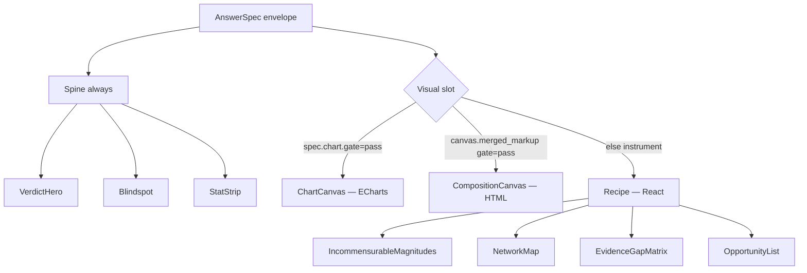

# Atlas v5 — System blueprint

> **Purpose:** One map of how `/atlas` works — core vs additive, trust boundary, evidence lanes, and render paths.  
> **Audience:** Engineers, product, eval. Update when AnswerSpec or graph topology changes.

---

## 1. End-to-end flow (one turn)

```mermaid
flowchart TB
  subgraph User
    Q[User query]
  end

  subgraph Mouth["MOUTH — Next.js /atlas"]
    CK[CopilotKit useCoAgent]
    AS[AtlasAnswerSurface]
    CK --> AS
  end

  subgraph Brain["BRAIN — LangGraph atlas_v5"]
    P[prepare]
    R[route — classify_turn]
    G[gather — wide_pass]
    S[stream_spine — partial]
    Y[synthesise — deep_pass]
    P --> R
    R -->|substantive| G --> S --> Y
    R -->|chat/clarify| F[finalize]
  end

  subgraph Wide["wide_pass — parallel"]
    SQL[(Supabase SQL aggregates)]
    RF[retrieval_fabric]
    C[corpus search ‖]
    W[GovUK + Exa ‖]
    SQL --> Skel[skeleton AnswerSpec]
    RF --> C & W
    C & W --> Recon[reconcile_spec dual-peer]
    Skel --> Recon
  end

  subgraph Deep["deep_pass"]
    VI[visual_intent + templates]
    CS[chart_spec]
    Gate[merge + gate]
    Recon --> Deep
    VI --> Gate
    CS --> Spec[AnswerSpec final]
    Gate --> Spec
  end

  Q --> CK
  G --> Wide
  Y --> Deep
  Spec -->|answer_spec_envelope| CK
  AS -->|stats / verdict / chart / compose / recipe| UI[Canvas]
```

---

## 2. Evidence lanes (peer model)

**Default:** `ATLAS_V5_PARALLEL_EVIDENCE=1` + `ATLAS_V5_WEB_LANE=1` → **dual lane every substantive turn**.

```mermaid
flowchart LR
  subgraph Parallel["Fetched in parallel (ThreadPoolExecutor)"]
    CORP[Corpus — CPC projects semantic search]
    GOV[GovUK]
    EXA[Exa]
  end

  CORP --> Bag[EvidenceBag]
  GOV --> Bag
  EXA --> Bag
  Bag --> Recon[reconcile_spec]

  Recon -->|owned| Stats[stats.* keys]
  Recon -->|borrowed| Web[web.* keys + web_evidence[]]
```

| | Corpus | Web |
|--|--------|-----|
| **Role** | Structured CPC project rows, SQL aggregates | Policy, programme scale, freshness, partners |
| **Authority** | **Peer** — not default | **Peer** — not fallback |
| **Trust material** | `owned` (solid) | `borrowed` (dashed) |
| **When thin** | Still run; note in reconciliation | Still run; note in reconciliation |
| **Disable** | N/A | `ATLAS_V5_WEB_LANE=0` |

**Not equal in trust marking** — equal in **always running**. Corpus UUIDs stay owned; web stays candidate/borrowed.

---

## 3. AnswerSpec render fork (mouth)



| Slot | Contract field | Builder | Skill? |
|------|----------------|---------|--------|
| **Recipe** | `instrument` | Python assemblers | No |
| **ChartSpec** | `chart` | `chart_spec.py` + `viz_guardrail` | `atlas-chart-encoding.md` guides LLM |
| **GenUI compose** | `canvas.merged_markup` | Model HTML → merge → gate | `atlas-visual-composition.md` |
| **Templates** | same as compose | `visual_templates.py` fallback | No |

---

## 4. Progressive streaming (CopilotKit)

```mermaid
sequenceDiagram
  participant G as gather
  participant SP as stream_spine
  participant SY as synthesise
  participant UI as Mouth

  G->>UI: partial_stage=stats (scope, tier, stats)
  SP->>UI: partial_stage=spine (+ verdict, blindspot)
  SY->>UI: partial_stage=complete (+ chart, canvas, instrument)
```



Dev overlay: `partial` · `stage` · `lane` · `gate`.

---

## 5. Visual intent router

```
Query + outcome
    │
    ├─ swot ──────────────► SWOT template
    ├─ journey_orient ────► Journey stat-strip template
    ├─ funder_bar / bar ──► ChartSpec (horizontal bar)
    ├─ connect ───────────► NetworkMap recipe
    └─ default orient ────► IncommensurableMagnitudes + journey template fallback
```

Chart type rules: `skills/atlas-chart-encoding.md` + [data-to-viz.com](https://www.data-to-viz.com/).

---

## 6. Core vs additive

### Core (remove → Atlas breaks)

- `AnswerSpec` / `AnswerSpecEnvelope` contract
- `wide_pass` + assemblers + **parallel** `retrieval_fabric`
- `reconcile_spec` (dual-peer)
- `KeyedFigureIndex` + merge + gate
- Turn disposition + deep pass
- CopilotKit coagent state sync
- Mouth spine + render fork

### Additive (polish / coverage)

- Visual templates (SWOT, journey)
- ChartSpec builders (extensible)
- Progressive partials + CountAnimation
- GenUI eval (`npm run eval:genui`)
- Recipe lock / gate mode env flags
- Dev overlay
- Showcase journeys

---

## 7. Environment flags

| Variable | Default | Effect |
|----------|---------|--------|
| `ATLAS_V5_WEB_LANE` | `1` | GovUK + Exa parallel with corpus |
| `ATLAS_V5_PARALLEL_EVIDENCE` | `1` | Force dual lane (peer model) |
| `ATLAS_V5_FREE_COMPOSE` | `1` | Free HTML compose vs recipe lock |
| `ATLAS_V5_RECIPE_LOCK` | `0` | Golden demo recipe hijack |
| `ATLAS_V5_GATE_MODE` | `warn` | Gate logs vs hard reject |
| `ANTHROPIC_API_KEY` | — | Deep pass; without it → templates/skeleton |

---

## 8. File map (where to change what)

| Want to change… | Edit |
|-----------------|------|
| Parallel web + corpus | `agents/atlas_v5/web_lane.py`, `wide_pass.py` |
| Reconciliation narrative | `agents/atlas_v5/reconcile_spec.py` |
| SQL scope (rail vs CPC) | `agents/atlas_v5/corpus_scope.py` |
| New recipe skeleton | `agents/atlas_v5/*_assembler.py` |
| New chart type | `chart_spec.py`, `chart_router.py`, `viz_guardrail.py` |
| New HTML template | `visual_templates.py`, `visual_intent.py` |
| LLM voice / evidence | `deep_pass_prompt.py`, `skills/*.md` |
| Canvas UI | `src/components/atlas/atlas-answer-surface.tsx` |
| Streaming stages | `graph_nodes.py`, `progressive_stream.py` |
| Eval cases | `agents/atlas_v5/genui_eval.py` |

---

## 9. Not wired yet (gaps)

- ECharts MCP → ChartBlock long tail (`ATLAS5_GENERATIVE_VIZ_V1` workbench path only)
- Academic / paper-search lane in Atlas v5 wide pass
- Partial envelope for `visual` stage only (chart arrives in final)
- CopilotKit generative-ui tool components (we use AnswerSpec state)
- Legacy `src/lib/atlas5/ChartSpec` vs new `AnswerSpec.chart` — consolidate

---

## 10. Quick validation

```bash
npm run eval:genui
python -m pytest agents/test_atlas_v5_abc_features.py -q
```

**Demo queries**

| Query | Expect |
|-------|--------|
| State of play rail decarbonisation | dual lane, journey template or two-tier, web_evidence populated when fetch succeeds |
| SWOT on CPC | 4-quadrant grid |
| Funding by funder breakdown | ChartSpec bar |
| Map hydrogen supply chain | NetworkMap |

Dev overlay should show: `lane=dual skip=false`, `partial=stats→spine→complete`.

---

*Last updated: parallel peer evidence model + ChartSpec + progressive canvas.*
