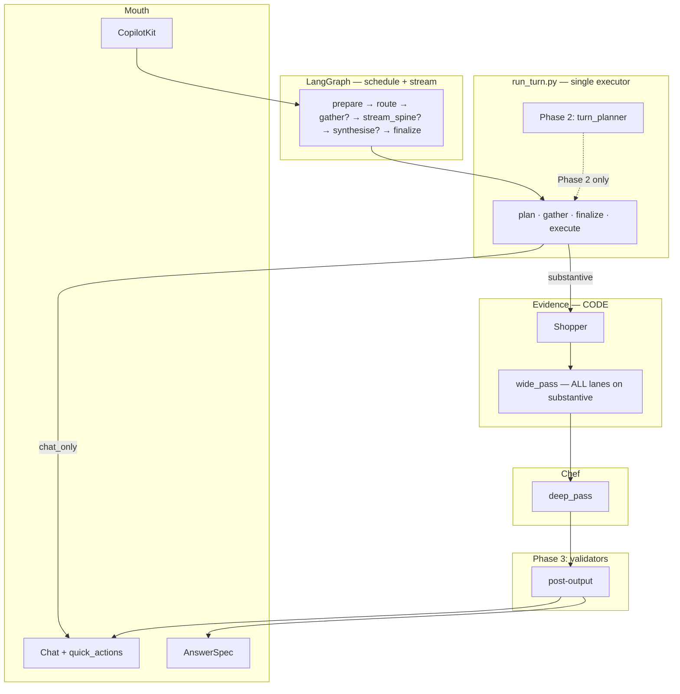

# Atlas v5 — Turn architecture

> **Status:** **Approved — design locked.** Phase 1 in progress.  
> **Audience:** Product owner, engineers, cloud agents  
> **Parent:** [`ATLAS_V5_BLUEPRINT.md`](./ATLAS_V5_BLUEPRINT.md) — stack, lanes, trust model stay locked  
> **Do not reopen:** planner scope, fetch boundary, phase sequence (see §0)

---

## 0. Locked decisions (do not reopen)

| Decision | Rule |
|----------|------|
| **Planner owns** | `surface`, `outcome_hint`, `work_query`, `tier_ceiling`, `honesty_note`, `quick_actions`, `reasoning` |
| **Planner never owns** | Which lanes run — **no `run_corpus` / fetch skip in TurnPlan** |
| **Substantive fetch** | All lanes always run, shopper-shaped (blueprint §4) |
| **Guardrails** | Post-output **validators** (Phase 3) — not pre-route blockers long-term |
| **LangGraph** | Schedule + stream only — **no independent turn brain** |
| **Phase sequence** | Restart → **Phase 1** (single executor) → **verify 1B** → **Phase 2** (planner) → Phase 3 (validators) |

**One sentence target:** User asks → (Phase 2: planner decides surface) → **executor** runs locked fetch + deep pass → **validators** verify output → mouth renders AnswerSpec + chat.

---

## 1. Product outcomes

| Outcome | Requirement |
|---------|-------------|
| **Trust** | Real `atlas.projects` UUIDs when claiming corpus; tier never exceeds evidence |
| **Audit / eval** | Substantive turns always hit the same lane *structure* |
| **Canvas** | AnswerSpec — stats, verdict, blindspot, recipe / compose / charts |
| **Chat** | Reasoned partner voice — meta, clarify, honest degradation |
| **Demo** | Golden paths recordable without surprise |
| **Honesty** | Failures explained — not template loops |

---

## 2. AS-IS (before Phase 1 complete)

CopilotKit → LangGraph → **five pre-LLM routers** + **duplicate executor** (`graph_nodes` ∥ `run_turn`) → pipeline or chat.

**Symptoms:** consent loops, keyword-gated feel, fake “Orient on canvas”, wedged `/health`.

---

## 3. TO-BE — target architecture



### TurnPlan schema (Phase 2 — not built in Phase 1)

```typescript
interface TurnPlan {
  surface: "chat_only" | "chat_primary" | "canvas_primary";
  outcome_hint?: "orient" | "connect" | "diagnose" | "act" | "defend" | "find_path";
  work_query: string;
  tier_ceiling: "Speculative" | "Indicative" | "Supported" | "Robust";
  honesty_note?: string;
  quick_actions?: Array<{ id: string; label: string; command: string }>;
  reasoning: string;
  // NO fetch.* fields — ever
}
```

---

## 4. Phase 1 — single executor (current work)

### Scope

- **`run_turn.py`** owns all turn logic: `plan_turn_pipeline`, `gather_substantive_evidence`, `finalize_turn_payload`, `execute_substantive_turn`, `run_turn_response`
- **`graph_nodes.py`** delegates only — maps AG-UI state ↔ executor payloads
- **Same routers** as today (`turn_classifier`, `chat_router`, etc.) — no planner
- **Bug fixes in scope:** consent loop, misleading empty-canvas copy, `/health/live` + non-blocking `/health` probe timeout

### Out of scope (stop and flag if touched)

- `turn_planner.py`
- Replacing regex routers
- Validator refactor (Phase 3)
- TurnPlan / fetch profile

### Exit criteria

- [x] `graph_nodes.py` imports only `run_turn` brain functions — no `classify_turn`, `run_wide_pass`, `corpus_gate`, etc.
- [x] `run_turn_response` and graph path share `plan_turn_pipeline` / `finalize_turn_payload`
- [x] Consent “yes” → substantive pipeline (not greeting loop)
- [x] Empty canvas greeting says **at rest**, not fake IncommensurableMagnitudes
- [x] `agents/test_online_only.py` + `agents/test_graph_single_executor.py` green
- [ ] `npm run eval:baseline-v06` green (run after restart)

### Implementation map

| Function | Module | Role |
|----------|--------|------|
| `plan_turn_pipeline` | `run_turn.py` | Route (today's classifiers) |
| `gather_substantive_evidence` | `run_turn.py` | Wide pass + gate for streaming |
| `finalize_turn_payload` | `run_turn.py` | Chat / showcase / clear / blocked |
| `execute_substantive_turn` | `run_turn.py` | Deep pass with gather cache |
| `run_turn_response` | `run_turn.py` | REST / turn API |
| Graph nodes | `graph_nodes.py` | SSE partials + state mapping only |

---

## 5. Phase 1B — verify practitioner disposition

**After Phase 1 exit — not before.** Running calibration through dual-executor bugs gives uninterpretable results.

1. `python -m agents.atlas_v5.calibration_eval` — all five cases green
2. Dayo sign-off on disposition voice
3. Baseline: `eval/baselines/calibration_latest.json`

---

## 6. Phase 2 — turn planner

- Replace regex router stack with structured TurnPlan
- **Still no fetch in TurnPlan**
- Gated on §5 complete

---

## 7. Phase 3 — validators

- `corpus_gate` behaviour moves to post-output validation
- Tier capped from fetch health in executor

---

## 8. Cloud agent instruction (Phase 1 only)

```text
Implement ATLAS_V5_TURN_ARCHITECTURE.md Phase 1 only.

Locked:
- No turn_planner.py
- No TurnPlan fetch fields
- graph_nodes delegates to run_turn.py only
- Same classifiers as today

Tests: test_online_only.py, test_graph_single_executor.py, eval:baseline-v06
Stop and flag if planner work is needed.
```

---

## 9. Approval

| Reviewer | Decision | Date |
|----------|----------|------|
| Dayo | ☑ Approved — design locked | 2026-06-29 |

Phase 1 implementation: **complete** (pending baseline-v06 after restart).

---

## 10. Related docs

| Doc | Relationship |
|-----|--------------|
| [`ATLAS_V5_BLUEPRINT.md`](./ATLAS_V5_BLUEPRINT.md) | Parent — lanes, shopper, chef |
| [`RECON_DELTA.md`](./RECON_DELTA.md) | Practitioner / find_path |
| [`ATLAS_V5_CORPUS_POLICY.md`](./ATLAS_V5_CORPUS_POLICY.md) | Corpus rules |
| [`CLOUD_AGENT_HANDOFF.md`](./CLOUD_AGENT_HANDOFF.md) | Demo ROI |
