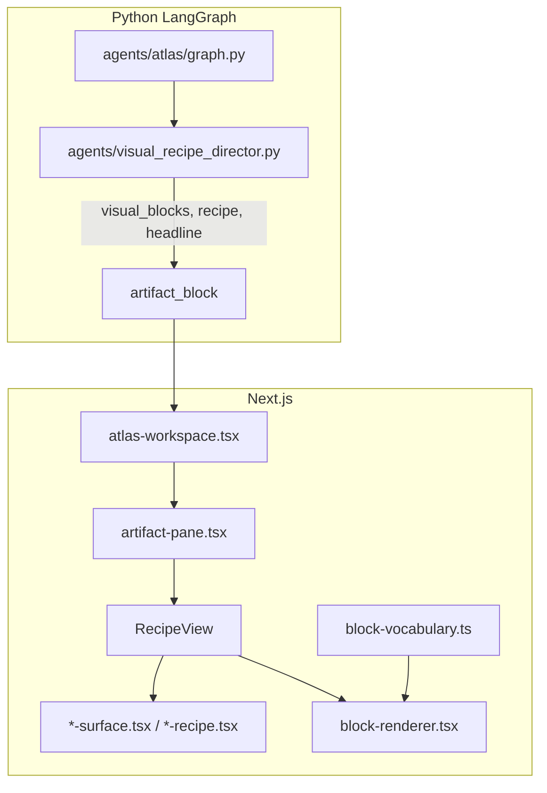

# ATLAS Surfaces & Blocks — bundled export

Generated: 2026-06-04T10:13:56.899Z

Repo: InnovationAtlas4.0 / Atlas-v0.5

Use with eval/ui-reference-pack/SCORECARD.md for reviews.

---

## eval/ui-reference-pack/README.md

```md
# ATLAS UI Reference Pack — surfaces, blocks, and shareable export

Use this folder when you want **second opinions** or **new designs** for what the product renders today — without asking an external AI to invent UI from vague intent.

## Files in this pack

| File | Purpose |
|------|---------|
| [SURFACE-BLOCK-CODEMAP.md](./SURFACE-BLOCK-CODEMAP.md) | **Start here** — architecture, every relevant path, recipe → surface → block mapping |
| [SCORECARD.md](./SCORECARD.md) | Evaluate classifier → surface fit (from design review) |
| [EXTERNAL-AI-BRIEF.md](./EXTERNAL-AI-BRIEF.md) | Copy-paste brief for ChatGPT / Claude / designer |
| [OPINION-ON-REFERENCE-APPROACH.md](./OPINION-ON-REFERENCE-APPROACH.md) | Assessment of the “static reference pack” transcript |
| `../ATLAS-SURFACES-BUNDLE.md` | **Generated** — single file with inlined source (run bundle script) |

## Generate the one-file export

```bash
pnpm bundle:surfaces
```

Output: `eval/ATLAS-SURFACES-BUNDLE.md` (~500KB–1MB). Attach that file to external AI or Notion.

## Production pipeline (do not fork)

```text
Python: visual_recipe_director.build_visual_blocks()
    ↓ visual_blocks[] on artifact_block
TS: block-vocabulary.ts (contracts + examples)
    ↓
TS: block-renderer.tsx (type → component)
    ↓
TS: artifact-pane.tsx RecipeView → *-surface.tsx | *-recipe.tsx
    ↓
/lab/blocks (golden + empty regression)
/ (atlas-workspace live)
```

Static HTML mockups belong here as **reference only** — implementation stays React + vocabulary.

## Sprint 5 alignment

Fits **S5a** (fixture-first, lab pages, new block types). See `eval/sprint5/08-SPRINT-5-OBJECT-LAYER.md`.

Planned reference HTML (optional next step):

```text
eval/ui-reference-pack/examples/
  01-organisation-profile-cpc.html
  02-passport-profile.html
  ...
```

Not generated yet — run EXTERNAL-AI-BRIEF or orchestrator after bundle exists.

```

---

## eval/ui-reference-pack/SURFACE-BLOCK-CODEMAP.md

```md
# Surface & block codemap — ATLAS v0.5

**Purpose:** Single index for external designers / AI. Pair with `eval/ATLAS-SURFACES-BUNDLE.md` (generated full source).

---

## 1. Render pipeline



**Contracts:** `src/lib/atlas5/types.ts` (`RecipeType`, `VisualBlock`, `ClaimState`), `src/lib/atlas5/artifact-schema.ts` (Zod).

---

## 2. RecipeType → React surface

| `RecipeType` | Component | Horsemen / CPC | Notes |
|--------------|-----------|----------------|-------|
| `orient` | `OrientSurface` | Orient | + `cpc_capability_assessment`, `cpc_market_alignment` |
| `connect` | `ConnectSurface` | Connect | + `cpc_opportunity_fit`, `cpc_portfolio_comparison`, `cpc_funding_flow` |
| `diagnose` | `DiagnoseSurface` | Diagnose | + `cpc_evidence_gaps` |
| `defend` | `DefendSurface` | Defend | + `cpc_defend` |
| `act` | `BriefFiveCaseRecipe` | Act | Five Case + NPV |
| `brief_five_case` | `BriefFiveCaseRecipe` | Legacy brief | |
| `evidence_panel` | `EvidencePanelRecipe` | JARVIS-style | |
| `stats_dashboard` | `StatsDashboardRecipe` | Charts | |
| `scenario_stress_test` | `ScenarioStressTestRecipe` | Stress | |

**Routing logic:** `detectRecipe()` + `RecipeView` switch in `src/components/atlas5/artifact-pane.tsx` (~lines 399–466).

**Layout order in RecipeView:** `SurfaceHeadline` → `InsightCard` → optional `DecisionSpineCard` → surface body → `BlocksView` (visual_blocks).

---

## 3. Block vocabulary (`status: ready`)

| `type` | Library | Intent triggers | Renderer |
|--------|---------|-----------------|----------|
| `domain_heatmap` | ECharts | orient | `block-renderer.tsx` |
| `knowledge_graph` | ECharts | connect | |
| `options_comparison` | Custom table | connect, diagnose | |
| `evidence_bar` | Recharts | diagnose, orient | |
| `radar` | Recharts | orient | |
| `npv_waterfall` | Recharts | act | |
| `gap_matrix` | Custom | diagnose | |
| `sankey` | Custom | connect | |
| `scatter` | Recharts | connect | |
| `bar` | Recharts | orient | |
| `area_line` | Recharts | orient | |

**Experimental (lab only):** `gauge`, `stacked_bar`, `radial_bar`, `venn`.

**SSOT:** `src/lib/atlas5/block-vocabulary.ts` — `BLOCK_VOCABULARY`, `getReadyBlocks()`.

**Python mirror:** `agents/visual_recipe_director.py` — `build_visual_blocks()`, `select_recipe()`.

---

## 4. Sprint 5 gaps (not built yet)

| Target surface | Proposed block / recipe | S5 phase |
|----------------|-------------------------|----------|
| Organisation profile | `organisation_profile` recipe + blocks | S5b fixture, S5c route |
| Passport CV | `/passport/[id]` components upgrade | S5b |
| Stakeholder workspace | `stakeholder_map` block | S5a |
| Evidence-aware SWOT | `evidence_aware_swot` block | S5a |
| Gap-to-partner | `gap_matrix` / new block | S5a/S5b |

---

## 5. File index (read in this order)

### Types & contracts
| Path | Role |
|------|------|
| `src/lib/atlas5/types.ts` | RecipeType, VisualBlock, ClaimState, citations |
| `src/lib/atlas5/artifact-schema.ts` | Zod validation |
| `src/lib/atlas5/artifact-store.ts` | Client artifact state |
| `src/lib/atlas5/block-vocabulary.ts` | Block SSOT + example_data |

### Rendering
| Path | Role |
|------|------|
| `src/components/atlas5/artifact-pane.tsx` | Pane shell, detectRecipe, RecipeView |
| `src/components/atlas5/block-renderer.tsx` | Block type → chart/table |
| `src/components/atlas5/recipes/surface-primitives.tsx` | Headline, insight, badges |
| `src/components/atlas5/recipes/orient-surface.tsx` | Orient layout |
| `src/components/atlas5/recipes/connect-surface.tsx` | Connect layout |
| `src/components/atlas5/recipes/diagnose-surface.tsx` | Diagnose + empty banner |
| `src/components/atlas5/recipes/defend-surface.tsx` | Defend layout |
| `src/components/atlas5/recipes/brief-five-case.tsx` | Act / Five Case |
| `src/components/atlas5/recipes/evidence-panel.tsx` | Evidence panel |
| `src/components/atlas5/recipes/stats-dashboard.tsx` | Stats |
| `src/components/atlas5/recipes/scenario-stress-test.tsx` | Scenario |
| `src/components/atlas5/recipes/index.ts` | Barrel exports |
| `src/components/atlas5/claim-state-badge.tsx` | Claim state UI |
| `src/components/atlas5/decision-spine.tsx` | Spine card |
| `src/components/atlas5/artifact-qa-panel.tsx` | Content/evidence % |
| `src/components/atlas5/atlas-workspace.tsx` | Production `/` shell |

### Python
| Path | Role |
|------|------|
| `agents/visual_recipe_director.py` | Intent, recipe, build_visual_blocks |
| `agents/atlas/graph.py` | Graph nodes, artifact assembly |
| `agents/atlas/artifact_qa.py` | Deterministic QA scores |

### Lab & fixtures
| Path | Role |
|------|------|
| `src/app/lab/blocks/page.tsx` | Block gallery golden/empty |
| `src/app/atlas5-test/page.tsx` | Fixture render test |
| `src/app/api/atlas5/fixture/route.ts` | Fixture API |
| `eval/fixtures/artifact-blocks.ts` | Shared fixtures |
| `eval/playwright/recipe-smoke.spec.ts` | Smoke tests |

### Passport (parallel to artifact pane)
| Path | Role |
|------|------|
| `src/app/(chat)/passport/page.tsx` | List |
| `src/app/(chat)/passport/[id]/page.tsx` | Detail |
| `src/components/passport/*.tsx` | Passport UI |
| `src/app/api/passport/**/*.ts` | API routes |

### Skills
| Path | Role |
|------|------|
| `skills/data-visualization.md` | Block selection rules |
| `skills/surface-composition.md` | Surface layout |
| `skills/golden-orient.md` etc. | Per-mode golden patterns |

### Legacy dashboard (older CPC recipes — reference only)
| Path | Role |
|------|------|
| `src/components/dashboard/layout/artifact-panel.tsx` | Old detectRecipe |
| `src/components/dashboard/recipes/cpc-*.tsx` | Legacy CPC components |

Production `/` uses **atlas5** path above, not dashboard recipes.

---

## 6. Data grounding (Supabase)

| Example query | Tables |
|---------------|--------|
| “What about CPC?” | `atlas.organisations`, `atlas.projects` |
| Stakeholders / CAV | `atlas.projects` (lead org, funders, themes) |
| Passport | `atlas.passports`, claims/gaps tables per schema |

Use service role server-side only; fixtures use synthetic UUIDs.

---

## 7. Commands

```bash
pnpm bundle:surfaces          # generate eval/ATLAS-SURFACES-BUNDLE.md
pnpm eval:tier1               # contract tests
open http://localhost:3005/lab/blocks
open http://localhost:3005/atlas5-test?fixture=brief_five_case
```

```

---

## eval/ui-reference-pack/SCORECARD.md

```md
# Surface classifier → UI scorecard

Use when reviewing a reference mockup or a live/agent-built artifact.

**Score 0–2 per row** (0 = fail, 1 = partial, 2 = pass). **Pass threshold:** ≥80% of rows at 2, no 0 on “Evidence honesty” or “Classifier match”.

---

## A. Classifier & routing

| # | Criterion | Pass when |
|---|-----------|-----------|
| A1 | Surface matches classifier | `artifact.recipe` (or inferred recipe) matches user intent (e.g. organisation query → profile, not generic Orient) |
| A2 | One dominant workspace | User sees one primary layout (profile / passport / stakeholder / horsemen surface), not competing full reports |
| A3 | Headline answers the question | `headline` is the decision-relevant answer, not a section title |
| A4 | Insight supports headline | `insight_card` explains *why* in one glance |

## B. Evidence & trust

| # | Criterion | Pass when |
|---|-----------|-----------|
| B1 | Confidence tier visible | Tier badge matches evidence depth |
| B2 | Every claim-like row has state | SWOT/stakeholder/claim rows show `verified` / `supported` / `inferred` / `gap` / `missing` / `user_added` |
| B3 | Missing fields honest | Empty corpus → empty states + tier cap, not fabricated IDs |
| B4 | Citations traceable | Corpus IDs link to real projects where data exists; gaps listed in `evidence_gaps` or routing_gaps |

## C. Blocks & visuals

| # | Criterion | Pass when |
|---|-----------|-----------|
| C1 | Blocks earn their place | Each `visual_blocks[]` entry has enough data per `min_data_points` in vocabulary |
| C2 | Block types from vocabulary | Only `ready` (or explicit `experimental`) types from `block-vocabulary.ts` |
| C3 | Insight-first block titles | Block `title` states the finding, not chart type |
| C4 | Dominant visual matches intent | e.g. stakeholder query → graph/map, not generic bar chart |

## D. Actions & flow

| # | Criterion | Pass when |
|---|-----------|-----------|
| D1 | Actions specific | Buttons/chips name next step (e.g. “Build stakeholder map”, not “Learn more”) |
| D2 | Horsemen continuity | Profile surfaces offer sensible paths to Orient / Diagnose / Connect / Act |
| D3 | Refine/clarify compatible | Surface leaves room for lane chips without breaking layout |

## E. Implementation fit

| # | Criterion | Pass when |
|---|-----------|-----------|
| E1 | Maps to RecipeType or new block `type` | Designer documents target `recipe` string or block `type` |
| E2 | Fixture representable | JSON fixture can render on `/lab/blocks` or `/atlas5-test` without live agent |
| E3 | No parallel stack | No requirement for new chart library outside Recharts/ECharts/AntV already used |

---

## Reviewer notes template

```markdown
Surface reviewed: ___________
Recipe / block target: ___________
Fixture or live: ___________

Scores: A _/8  B _/8  C _/8  D _/6  E _/6  Total _/36

Blockers:
Recommendations (non-blocking):
Promote to vocabulary? yes / no
```

```

---

## eval/ui-reference-pack/EXTERNAL-AI-BRIEF.md

```md
# External AI / designer brief — ATLAS surfaces

Attach **`eval/ATLAS-SURFACES-BUNDLE.md`** (run `pnpm bundle:surfaces` first) or this repo’s `eval/ui-reference-pack/SURFACE-BLOCK-CODEMAP.md`.

---

## Your mission

Review **what ATLAS can render today** and propose **more compelling** (not prettier-only) versions of:

1. Horsemen surfaces: Orient, Connect, Diagnose, Defend, Act (Five Case)
2. Art-director **visual blocks** (11 ready types in `block-vocabulary.ts`)
3. **New** object/profile surfaces for Sprint 5:
   - Organisation profile (e.g. CPC)
   - Passport / capability CV
   - Stakeholder workspace
   - Evidence-aware SWOT
   - Gap-to-partner map

## Constraints (non-negotiable)

- Output must map to existing or **new** `RecipeType` / block `type` strings — no orphan designs.
- Pipeline: structured `artifact_block` → React — same as Vercel AI SDK generative UI / tool → component pattern.
- Every claim-like row needs **evidence_state** (see `ClaimState` in bundle).
- Headline → insight → blocks → sections order stays.
- Static HTML mockups OK as **reference**; production stays React + `/lab/blocks` fixtures.
- Do not recommend replacing LangGraph, CopilotKit shell, or building a parallel UI framework.

## Deliverables

1. **Gap analysis** — table: surface vs “good” vs current code
2. **Five reference mockups** (HTML/CSS or Figma descriptions) grounded in real fields:
   - organisation_profile (CPC)
   - passport_profile
   - stakeholder_workspace
   - evidence_aware_swot
   - gap_to_partner_map
3. **Vocabulary proposals** — new block `type` strings + `required_fields` + `min_data_points`
4. **Scorecard** — score each mockup using `eval/ui-reference-pack/SCORECARD.md`
5. **Fixture JSON** — one `visual_blocks` example per new block (synthetic UUIDs OK)

## SQL grounding (run against Supabase atlas schema)

```sql
-- CPC organisation slice
SELECT name, project_count, total_funding
FROM atlas.organisations
WHERE name ILIKE '%CONNECTED PLACES%' OR name ILIKE '%CATAPULT%'
LIMIT 5;

-- Related projects
SELECT project_title, lead_organisation, total_funding
FROM atlas.projects
WHERE lead_organisation ILIKE '%CONNECTED PLACES%'
ORDER BY total_funding DESC NULLS LAST
LIMIT 10;
```

Label inferred/missing fields explicitly in mockups.

## Do not

- Invent internal file paths not in the bundle
- Propose unbounded open-web report UI without confidence tiers
- Suggest migrating off `block-vocabulary.ts` / `BlockRenderer`

## Success

A developer can take your block `type` + fixture JSON and add them to S5a without reinterpretation.

```

---

## src/lib/atlas5/types.ts

```ts
/**
 * Atlas 5 — shared types.
 *
 * These types are shared between the Next.js frontend and the Python
 * agent service (via Zod → JSON Schema → Pydantic codegen).
 *
 * DO NOT import server-only modules here — this file is imported by
 * both client and server components.
 */

// ---------------------------------------------------------------------------
// Agent + Lens identifiers
// ---------------------------------------------------------------------------

export type AgentId = "ATLAS" | "JARVIS" | "CICERONE" | "HYVE";

export type LensId = "CPC" | "Atlas" | "Ecosystem" | "Funder" | "Mode";

// ---------------------------------------------------------------------------
// Surface state (emitted by the surface gateway hook on every switch)
// ---------------------------------------------------------------------------

/**
 * Surface render mode.
 * - chat: two-pane layout (chat + artifact) — default
 * - canvas: tldraw full-screen, chat + artifact panes hidden
 * - showcase: artifact pane demo layout (full-width visuals, minimal chrome)
 */
export type SurfaceMode = "chat" | "canvas" | "showcase";

/**
 * SurfaceState is written to sessionStorage under the key "surface_state.json"
 * on every agent/lens/mode switch. The Playwright eval spec reads it from there.
 */
export interface SurfaceState {
  /** Which agent is currently active */
  active_agent: AgentId;
  /** Which lens is currently active */
  active_lens: LensId;
  /** Render mode: chat (default) or canvas (full-screen tldraw) */
  mode: SurfaceMode;
  /** CopilotKit / LangGraph thread id — null before first message */
  thread_id: string | null;
  /** ISO 8601 timestamp of last state change */
  timestamp: string;
}

// ---------------------------------------------------------------------------
// Confidence tier (carried on every agent response)
// ---------------------------------------------------------------------------

export type ConfidenceTier =
  | "Speculative"
  | "Indicative"
  | "Supported"
  | "Robust";

// ---------------------------------------------------------------------------
// Chart types (self-contained within atlas5 — no dependency on legacy lib)
// ---------------------------------------------------------------------------

export type ChartDataRecord = Record<string, string | number>;

export type LineChartSpec = {
  type: "line";
  title: string;
  x: string;
  y: string;
};
export type BarChartSpec = { type: "bar"; title: string; x: string; y: string };
export type PieChartSpec = { type: "pie"; title: string; x: string; y: string };
export type ChartSpec = LineChartSpec | BarChartSpec | PieChartSpec;

/** A chart spec with embedded data — travels with an artefact. */
export type Chart = ChartSpec & { data: ChartDataRecord[] };

// ---------------------------------------------------------------------------
// VisualBlock — art director output (replaces generic chart_specs)
// ---------------------------------------------------------------------------

/**
 * A single visual block emitted by the art director node.
 * type must match a BLOCK_VOCABULARY entry.
 * data is block-specific — see block-vocabulary.ts for per-type contracts.
 */
export interface VisualBlock {
  /** Matches BLOCK_VOCABULARY entry.type */
  type: string;
  /** Insight-first title — the conclusion, not the chart label */
  title?: string;
  /** Block-specific payload */
  data: unknown;
  /** Number of corpus sources this block derives from */
  source_count?: number;
}

// ---------------------------------------------------------------------------
// RecipeType — explicit render surface selector
// ---------------------------------------------------------------------------

export type RecipeType =
  | "brief_five_case"
  | "evidence_panel"
  | "stats_dashboard"
  | "scenario_stress_test"
  | "cpc_capability_assessment"
  | "cpc_portfolio_comparison"
  | "cpc_market_alignment"
  | "cpc_evidence_gaps"
  | "cpc_opportunity_fit"
  | "cpc_funding_flow"
  | "orient"
  | "connect"
  | "diagnose"
  | "act"
  | "defend"
  | "cpc_defend";

// ---------------------------------------------------------------------------
// Claim state — Principle 3 (claim states are first-class citizens)
// ---------------------------------------------------------------------------

/**
 * Epistemic status of a citation, gap row, or assertion.
 *
 * stated    = directly extracted from a cited source
 * inferred  = agent-derived from adjacent evidence
 * unknown   = no data found
 * contested = sources conflict
 */
export type ClaimState = "stated" | "inferred" | "unknown" | "contested";

// ---------------------------------------------------------------------------
// CPC Capability Intelligence types
// ---------------------------------------------------------------------------

export type CpcClaimLevel = 1 | 2 | 3;

export interface CpcClaim {
  id: string;
  text: string;
  level: CpcClaimLevel;
  confidence_tier: ConfidenceTier;
  source_project?: string;
  source_excerpt?: string;
  business_unit?: string;
}

export interface CpcBusinessUnit {
  name: string;
  project_count: number;
  claim_count: number;
  l1_claims: number;
  l2_claims: number;
  l3_claims: number;
  evidence_links: number;
}

export interface CpcGap {
  area: string;
  severity: "low" | "medium" | "high";
  description: string;
  project_count?: number;
  claim_count?: number;
}

export type RecommendationAction = "bid" | "partner" | "monitor" | "reject";

// ---------------------------------------------------------------------------
// Source type (for citations)
// ---------------------------------------------------------------------------

export type SourceType =
  | "project"
  | "live_call"
  | "knowledge_doc"
  | "knowledge_chunk"
  | "hive_chunk"
  | "hive_article";

// ---------------------------------------------------------------------------
// Citation types
// ---------------------------------------------------------------------------

/** A verified citation from the CPC corpus */
export interface CorpusCitation {
  /** Record UUID — verified against DB before storage (H1 hardening) */
  id: string;
  title: string;
  /**
   * Semantic similarity score 0–1.
   * Required on artefact citations rendered in recipes.
   * Optional for prior_citations in context packets (context-only, not scored).
   */
  score?: number;
  source_type?: SourceType;
  // project
  organisation?: string;
  relevance_note?: string;
  // live_call
  funder?: string;
  deadline?: string | null;
  // knowledge types
  chunk_id?: string;
  document_id?: string;
  publisher?: string;
  // hive types
  article_id?: string;
  /** Epistemic status — Principle 3 */
  claim_state?: ClaimState;
  /** Rationale for inferred/contested states, shown in tooltip */
  claim_rationale?: string;
}

/** A verified citation from hive.articles */
export interface HiveCitation {
  /** hive.articles.id — UUID, verified in DB at agent runtime */
  article_id: string;
  /** hive.articles.project_title (fallback: measure_title) */
  title: string;
  /** Similarity score from vector search (0–1) */
  score?: number;
  /** hive.document_chunks.id — optional provenance */
  chunk_id?: string;
  transport_mode?: string;
  relevance_note?: string;
  /** Epistemic status — Principle 3 */
  claim_state?: ClaimState;
  /** Rationale for inferred/contested states, shown in tooltip */
  claim_rationale?: string;
}

// ---------------------------------------------------------------------------
// DecisionSpine — structured decision object (every substantive response)
// ---------------------------------------------------------------------------

export interface DecisionSpine {
  decision: string;
  recommendation: string;
  confidence_tier: ConfidenceTier;
  key_assumption: string;
  next_action: string;
  framework?: string;
  strongest_objection?: string;
  would_change_if?: string;
}

// ---------------------------------------------------------------------------
// External Evidence Router — lane / provider / tool taxonomy
// ---------------------------------------------------------------------------

/**
 * WHY are we searching? (intent lane)
 * Maps to recommended_source_lane on AtlasRoutingGap.
 */
export type RoutingLane =
  | "internal_precedent" // re-query Atlas corpus with a different strategy
  | "official_policy" // government policy, regulation, statistics
  | "funding" // innovation grants, R&D programmes, calls
  | "procurement" // contracts, tenders
  | "research" // academic, UKRI-funded, methodology
  | "market_discovery" // operator demand, WTP, commercial analogues
  | "ingestion_backlog"; // source found; queue for corpus enrichment

/**
 * WHO has the evidence? (source identity — not the search tool)
 * DfT/CCAV documents may be on GOV.UK, but the provider is DfT/CCAV.
 */
export type RoutingProvider =
  | "InnovateUK"
  | "DfT"
  | "NationalHighways"
  | "CCAV"
  | "UKRI"
  | "HorizonEurope"
  | "FindATender"
  | "Exa" // last resort for non-government sources
  | "GovUK" // only if no specific publisher can be identified
  | "CPC_Corpus";

/**
 * HOW do we call it today? (honest about capability)
 * "future_*" = not yet integrated.  "none_yet" = no tool exists.
 */
export type AvailableTool =
  | "cpc_corpus"
  | "live_calls"
  | "govuk_search"
  | "exa_search"
  | "future_innovateuk_api"
  | "future_tender_api"
  | "none_yet";

/**
 * A structured evidence gap from ATLAS corpus retrieval analysis.
 * Three routing concepts kept separate:
 *   recommended_source_lane  — WHY (intent)
 *   recommended_provider     — WHO (source identity)
 *   available_tool           — HOW today (honest)
 */
export interface AtlasRoutingGap {
  type: "retrieval_gap" | "corpus_gap" | "landscape_gap";
  topic: string;
  severity: "low" | "medium" | "high";
  reason: string;
  recommended_action: string;
  recommended_source_lane: RoutingLane;
  recommended_provider: RoutingProvider;
  available_tool: AvailableTool;
  /** Will retrieving this evidence raise the confidence_tier? */
  can_lift_confidence: boolean;
  /** "direct" = cite; "candidate" = flag for review; "background" = context only */
  citation_status: "direct" | "candidate" | "background";
}

// ---------------------------------------------------------------------------
// External Evidence — results from govuk_search / exa_search
// ---------------------------------------------------------------------------

/**
 * A result from an external evidence search (govuk_search or exa_search).
 * Kept separate from corpus_citations — external results require human review.
 * recommended_provider is the actual publisher, not the search tool.
 */
export interface ExternalCitation {
  url: string;
  title: string;
  snippet?: string;
  /** Actual publisher: DfT, CCAV, UKRI etc. — NOT "GovUK" or "Exa" unless unknown */
  recommended_provider: RoutingProvider;
  retrieval_tool: "govuk_search" | "exa_search";
  /** Always "candidate" or "background" — external results need human review */
  citation_status: "candidate" | "background";
  score?: number;
  published_date?: string;
}

// ---------------------------------------------------------------------------
// EvidenceCoverage — computed by set_artifact_block from verified citations
// ---------------------------------------------------------------------------

export interface EvidenceCoverage {
  projects_found: number;
  live_calls_found: number;
  knowledge_docs_found: number;
  hive_chunks_found: number;
  source_diversity: number;
  top_similarity: number;
  average_similarity: number;
  evidence_gaps: string[];
  suggested_confidence_tier: ConfidenceTier;
  coverage_note: "thin" | "adequate" | "strong";
}

// ---------------------------------------------------------------------------
// Context packet (assembled by the context assembler at D2)
// ---------------------------------------------------------------------------

export interface ContextPacket {
  thread_id: string;
  active_agent: AgentId;
  active_lens: LensId;
  /** Contents of skills/*.md files relevant to the active agent */
  active_skills: Array<{ name: string; content: string }>;
  /** Recent citations from atlas.briefs for this thread */
  prior_citations: CorpusCitation[];
}

```

---

## src/lib/atlas5/block-vocabulary.ts

```ts
/**
 * Atlas 5 — Art Director Block Vocabulary
 *
 * Single source of truth for:
 *   1. What block types the art director can request (status: "ready")
 *   2. What React component renders each type (via BlockRenderer)
 *   3. What data schema each type requires
 *   4. Decision rules for when to use each type
 *
 * Usage:
 *   - Lab page reads BLOCK_VOCABULARY to build the vocabulary grid
 *   - BlockRenderer maps block.type → component
 *   - Python build_visual_blocks() uses the same type strings
 *   - skills/data-visualization.md is generated from / kept in sync with
 *     the "ready" entries here
 *
 * Promotion workflow:
 *   When promoting experimental → ready, also add the entry to
 *   skills/data-visualization.md > Block Selection section.
 */

import type { ClaimState } from "./types";

// ---------------------------------------------------------------------------
// Core interfaces
// ---------------------------------------------------------------------------

export type BlockStatus = "ready" | "experimental" | "deprecated";

export interface VisualBlock {
  /** Must match a BLOCK_VOCABULARY entry type */
  type: string;
  /** Insight-first title — the conclusion, not the chart type */
  title?: string;
  /** Block-specific payload — typed per block type below */
  data: unknown;
  /** Number of corpus sources this block derives from */
  source_count?: number;
}

export interface BlockVocabularyEntry {
  type: string;
  label: string;
  status: BlockStatus;
  /** One sentence: when to reach for this block */
  when_to_use: string;
  /** Required top-level fields in data */
  required_fields: string[];
  /** Minimum number of data items before block earns its place */
  min_data_points: number;
  /** Recharts | ECharts | Custom table | Custom chart */
  library: string;
  /** Recipe intents that commonly trigger this block */
  intent_triggers: string[];
  /** Other block types with overlapping use cases */
  conflicts_with?: string[];
  /** Live example data for the lab page preview */
  example_data: unknown;
}

// ---------------------------------------------------------------------------
// Block data contracts (typed per block type)
// ---------------------------------------------------------------------------

export interface DomainHeatmapData {
  domains: Array<{ domain: string; project_count: number; avg_score: number }>;
}

export interface OptionsComparisonData {
  options: Array<{
    option: string;
    fit_score: number;
    rationale: string;
    action: string;
    confidence?: string;
  }>;
}

export interface EvidenceBarData {
  items: Array<{ label: string; value: number; claim_state?: ClaimState }>;
}

export interface RadarData {
  dimensions: Array<{ dimension: string; score: number }>;
  insight?: string;
}

export interface NpvWaterfallData {
  components: Array<{
    label: string;
    value: number;
    type: "positive" | "negative" | "total";
  }>;
  discount_rate: number;
}

export interface KnowledgeGraphData {
  nodes: Array<{
    id: string;
    label: string;
    /** maps to ECharts GraphNodeCategory: theme | project | funder | document | concept */
    group: "theme" | "project" | "funder" | "document" | "concept";
    value?: number;
  }>;
  edges: Array<{ source: string; target: string; weight?: number; label?: string }>;
}

export interface SankeyData {
  flows: Array<{ source: string; target: string; value: number }>;
}

export interface GapMatrixData {
  rows: Array<{
    criterion: string;
    response: string;
    claim_state: ClaimState;
    fit: "Met" | "Partial" | "Gap" | "Unknown";
    evidence_strength: "Strong" | "Moderate" | "Weak" | "None";
    action?: string;
  }>;
}

export interface ScatterData {
  points: Array<{ label: string; x: number; y: number }>;
  x_label?: string;
  y_label?: string;
}

export interface BarData {
  items: Array<{ label: string; value: number }>;
  x_label?: string;
  y_label?: string;
}

export interface AreaLineData {
  points: Array<Record<string, string | number>>;
  x: string;
  y: string;
  type?: "area" | "line";
}

// ---------------------------------------------------------------------------
// Vocabulary registry
// ---------------------------------------------------------------------------

export const BLOCK_VOCABULARY: BlockVocabularyEntry[] = [

  // ── READY ────────────────────────────────────────────────────────────────

  {
    type: "domain_heatmap",
    label: "Domain Heatmap",
    status: "ready",
    when_to_use: "≥3 domains with project counts and/or evidence counts — shows evidence density across the innovation landscape at a glance.",
    required_fields: ["domains"],
    min_data_points: 3,
    library: "ECharts",
    intent_triggers: ["orient"],
    conflicts_with: ["knowledge_graph"],
    example_data: {
      domains: [
        { domain: "Urban Mobility", project_count: 8, avg_score: 0.72 },
        { domain: "Freight Automation", project_count: 5, avg_score: 0.61 },
        { domain: "EV Infrastructure", project_count: 3, avg_score: 0.58 },
        { domain: "Rail Innovation", project_count: 2, avg_score: 0.44 },
        { domain: "MaaS Platforms", project_count: 1, avg_score: 0.38 },
      ],
    } satisfies DomainHeatmapData,
  },

  {
    type: "knowledge_graph",
    label: "Knowledge Graph",
    status: "ready",
    when_to_use: "≥4 entities with meaningful relationship clusters (co-funder, shared theme, geography) where the cluster structure is the finding.",
    required_fields: ["nodes", "edges"],
    min_data_points: 4,
    library: "ECharts",
    intent_triggers: ["orient"],
    conflicts_with: ["domain_heatmap"],
    example_data: {
      nodes: [
        { id: "1", label: "MOVE-UK", group: "funder", value: 8 },
        { id: "2", label: "Autonomous Freight Pilot", group: "project", value: 6 },
        { id: "3", label: "CAV Standards UK", group: "project", value: 5 },
        { id: "4", label: "Urban Mobility", group: "theme", value: 10 },
        { id: "5", label: "Connected Places", group: "theme", value: 9 },
        { id: "6", label: "DfT CCAV", group: "funder", value: 7 },
        { id: "7", label: "Freight Corridor Trial", group: "project", value: 4 },
      ],
      edges: [
        { source: "1", target: "2", weight: 0.8 },
        { source: "1", target: "3", weight: 0.7 },
        { source: "6", target: "7", weight: 0.9 },
        { source: "4", target: "2", weight: 0.6 },
        { source: "4", target: "7", weight: 0.5 },
        { source: "5", target: "3", weight: 0.7 },
      ],
    } satisfies KnowledgeGraphData,
  },

  {
    type: "options_comparison",
    label: "Options Comparison",
    status: "ready",
    when_to_use: "2–5 distinct strategic pathways or alternatives with comparable attributes (fit score, rationale, effort).",
    required_fields: ["options"],
    min_data_points: 2,
    library: "Custom table",
    intent_triggers: ["orient", "connect"],
    conflicts_with: [],
    example_data: {
      options: [
        {
          option: "Lead urban mobility standardisation",
          fit_score: 82,
          rationale: "Strong corpus evidence across 8 projects, clear CPC positioning",
          action: "bid",
          confidence: "Supported",
        },
        {
          option: "Partner on freight automation R&D",
          fit_score: 64,
          rationale: "Moderate evidence; partner dependency on Innovate UK cohort",
          action: "partner",
          confidence: "Indicative",
        },
        {
          option: "Monitor MaaS platform developments",
          fit_score: 38,
          rationale: "Thin evidence base; whitespace domain — watch and enrich",
          action: "monitor",
          confidence: "Speculative",
        },
      ],
    } satisfies OptionsComparisonData,
  },

  {
    type: "evidence_bar",
    label: "Evidence Bar",
    status: "ready",
    when_to_use: "Ranking ≥3 items by relevance score, evidence strength, or fit band — always sorted descending.",
    required_fields: ["items"],
    min_data_points: 3,
    library: "Recharts",
    intent_triggers: ["orient", "connect", "defend"],
    conflicts_with: [],
    example_data: {
      items: [
        { label: "MOVE-UK: Automated Driving at Scale", value: 78, claim_state: "stated" },
        { label: "Enabling a Novel Evaluation Continuum", value: 71, claim_state: "stated" },
        { label: "CAV Testbed: Urban Infrastructure", value: 65, claim_state: "inferred" },
        { label: "Freight Automation Corridor Pilot", value: 58, claim_state: "inferred" },
        { label: "MaaS Integration Framework", value: 42, claim_state: "unknown" },
      ],
    } satisfies EvidenceBarData,
  },

  {
    type: "radar",
    label: "Five Case Radar",
    status: "ready",
    when_to_use: "Five Case Model only — exactly 5 balanced dimensions (Strategic, Economic, Commercial, Financial, Management) on the same 0–100 scale.",
    required_fields: ["dimensions"],
    min_data_points: 5,
    library: "ECharts",
    intent_triggers: ["brief_five_case", "act"],
    conflicts_with: [],
    example_data: {
      dimensions: [
        { dimension: "Strategic Case", score: 78 },
        { dimension: "Economic Case", score: 62 },
        { dimension: "Commercial Case", score: 45 },
        { dimension: "Financial Case", score: 55 },
        { dimension: "Management Case", score: 70 },
      ],
      insight: "Commercial case is weakest at 45% — address market readiness evidence before submission.",
    } satisfies RadarData,
  },

  {
    type: "npv_waterfall",
    label: "NPV Waterfall",
    status: "ready",
    when_to_use: "NPV decomposition — showing how benefit and cost components sum to a net present value. Requires ≥2 components before the total.",
    required_fields: ["components", "discount_rate"],
    min_data_points: 2,
    library: "Custom Recharts",
    intent_triggers: ["brief_five_case", "act"],
    conflicts_with: [],
    example_data: {
      components: [
        { label: "Congestion savings", value: 18.4, type: "positive" },
        { label: "Safety benefits", value: 7.2, type: "positive" },
        { label: "Emissions reduction", value: 4.8, type: "positive" },
        { label: "Capital investment", value: -12.6, type: "negative" },
        { label: "Operating costs", value: -5.1, type: "negative" },
        { label: "Net Present Value", value: 12.7, type: "total" },
      ],
      discount_rate: 0.035,
    } satisfies NpvWaterfallData,
  },

  {
    type: "gap_matrix",
    label: "Gap Matrix",
    status: "ready",
    when_to_use: "Diagnose intent — evidence gaps with criterion, response, fit status, and evidence strength. Always a table, never prose rows.",
    required_fields: ["rows"],
    min_data_points: 1,
    library: "Custom table",
    intent_triggers: ["diagnose", "cpc_evidence_gaps"],
    conflicts_with: [],
    example_data: {
      rows: [
        {
          criterion: "Rail energy pilot precedent",
          response: "No corpus evidence found",
          claim_state: "unknown",
          fit: "Gap",
          evidence_strength: "None",
          action: "Commission targeted literature review",
        },
        {
          criterion: "Urban freight demand modelling",
          response: "2 adjacent projects found, not direct",
          claim_state: "inferred",
          fit: "Partial",
          evidence_strength: "Weak",
          action: "Enrichment — request UKRI dataset",
        },
        {
          criterion: "CPC CAV expertise",
          response: "8 verified projects across 3 business units",
          claim_state: "stated",
          fit: "Met",
          evidence_strength: "Strong",
        },
      ],
    } satisfies GapMatrixData,
  },

  {
    type: "sankey",
    label: "Sankey / Funding Flow",
    status: "ready",
    when_to_use: "Source → target → value triples representing funding flows, sector adjacencies, or resource movement. Requires ≥3 distinct sources/targets and ≥6 total flows.",
    required_fields: ["flows"],
    min_data_points: 6,
    library: "ECharts",
    intent_triggers: ["connect", "cpc_funding_flow"],
    conflicts_with: [],
    example_data: {
      flows: [
        { source: "Innovate UK", target: "Urban Mobility", value: 18 },
        { source: "Innovate UK", target: "Freight", value: 12 },
        { source: "UKRI", target: "Urban Mobility", value: 14 },
        { source: "UKRI", target: "EV Infrastructure", value: 9 },
        { source: "DfT CCAV", target: "Freight", value: 8 },
        { source: "DfT CCAV", target: "Urban Mobility", value: 6 },
        { source: "Horizon Europe", target: "EV Infrastructure", value: 7 },
      ],
    } satisfies SankeyData,
  },

  {
    type: "scatter",
    label: "Scatter Plot",
    status: "ready",
    when_to_use: "Two quantitative variables where correlation or cluster pattern is the finding. Atlas use: gap severity (x) × effort to close (y). Requires ≥15 data points.",
    required_fields: ["points"],
    min_data_points: 5,
    library: "ECharts",
    intent_triggers: ["diagnose"],
    conflicts_with: [],
    example_data: {
      points: Array.from({ length: 12 }, (_, i) => ({
        label: `Gap ${i + 1}`,
        x: Math.round((Math.sin(i * 0.9) * 3 + 5) * 10) / 10,
        y: Math.round((Math.cos(i * 0.7) * 3 + 5) * 10) / 10,
      })),
      x_label: "Severity",
      y_label: "Effort to close",
    } satisfies ScatterData,
  },

  {
    type: "bar",
    label: "Bar Chart",
    status: "ready",
    when_to_use: "Default for categorical comparison when no specialist block applies. Always starts at zero. Maximum 12 bars.",
    required_fields: ["items"],
    min_data_points: 3,
    library: "Recharts",
    intent_triggers: ["orient", "connect", "diagnose", "defend"],
    conflicts_with: [],
    example_data: {
      items: [
        { label: "Policy", value: 34 },
        { label: "Research", value: 28 },
        { label: "Guidance", value: 19 },
        { label: "Case study", value: 13 },
        { label: "Other", value: 5 },
      ],
    } satisfies BarData,
  },

  {
    type: "area_line",
    label: "Area / Line (Time Series)",
    status: "ready",
    when_to_use: "Genuine time dimension (year, quarter, month) where trend direction is the finding. Use area for volume, line for rate.",
    required_fields: ["points", "x", "y"],
    min_data_points: 4,
    library: "Recharts",
    intent_triggers: ["orient"],
    conflicts_with: [],
    example_data: {
      points: [
        { year: "2019", count: 23 }, { year: "2020", count: 15 },
        { year: "2021", count: 29 }, { year: "2022", count: 34 },
        { year: "2023", count: 41 }, { year: "2024", count: 22 },
      ],
      x: "year",
      y: "count",
      type: "area",
    } satisfies AreaLineData,
  },

  // ── EXPERIMENTAL ─────────────────────────────────────────────────────────

  {
    type: "gauge",
    label: "Confidence Gauge",
    status: "experimental",
    when_to_use: "Single summary score (0–100) where the value relative to a threshold is the point. Consider using a confidence badge instead.",
    required_fields: ["value", "label"],
    min_data_points: 1,
    library: "ECharts",
    intent_triggers: [],
    conflicts_with: [],
    example_data: { value: 68, label: "Evidence strength" },
  },

  {
    type: "stacked_bar",
    label: "Stacked Bar",
    status: "experimental",
    when_to_use: "Total AND composition matter simultaneously — needs a series field. Use when both 'how much' and 'what mix' are the point.",
    required_fields: ["items", "series"],
    min_data_points: 3,
    library: "Recharts",
    intent_triggers: [],
    conflicts_with: [],
    example_data: {
      items: [
        { funder: "Innovate UK", open: 18, closed: 24 },
        { funder: "UKRI", open: 12, closed: 19 },
        { funder: "OZEV", open: 8, closed: 10 },
      ],
      series: ["open", "closed"],
    },
  },

  {
    type: "radial_bar",
    label: "Radial Bar",
    status: "experimental",
    when_to_use: "Ranked categories as arcs — more visually engaging than a bar chart for presentations. Same data as evidence_bar but circular.",
    required_fields: ["items"],
    min_data_points: 3,
    library: "Recharts",
    intent_triggers: [],
    conflicts_with: ["evidence_bar"],
    example_data: {
      items: [
        { label: "EV charging", value: 47 },
        { label: "Active travel", value: 39 },
        { label: "Freight", value: 31 },
        { label: "Autonomous", value: 24 },
        { label: "MaaS", value: 19 },
      ],
    },
  },

  {
    type: "venn",
    label: "Venn / Overlap",
    status: "experimental",
    when_to_use: "Overlap between 2–3 named sets where the intersection size is meaningful.",
    required_fields: ["sets"],
    min_data_points: 3,
    library: "AntV G2",
    intent_triggers: [],
    conflicts_with: [],
    example_data: {
      sets: [
        { sets: ["EV Charging"], size: 47 },
        { sets: ["Active Travel"], size: 39 },
        { sets: ["EV Charging", "Active Travel"], size: 9 },
      ],
    },
  },

];

// ---------------------------------------------------------------------------
// Helpers
// ---------------------------------------------------------------------------

export function getBlock(type: string): BlockVocabularyEntry | undefined {
  return BLOCK_VOCABULARY.find((b) => b.type === type);
}

export function getReadyBlocks(): BlockVocabularyEntry[] {
  return BLOCK_VOCABULARY.filter((b) => b.status === "ready");
}

export function getBlocksByIntent(intent: string): BlockVocabularyEntry[] {
  return BLOCK_VOCABULARY.filter(
    (b) => b.status === "ready" && b.intent_triggers.includes(intent),
  );
}

```

---

## src/lib/atlas5/artifact-schema.ts

```ts
/**
 * Atlas 5 — Zod schemas for artefact contract validation (Tier 2)
 *
 * These schemas mirror the TypeScript interfaces in types.ts and the
 * ArtifactBlock shape in artifact-store.ts. They are the authoritative
 * machine-readable contract between Python agents and the Next.js frontend.
 *
 * Usage:
 *   import { ArtifactBlockSchema } from "@/lib/atlas5/artifact-schema";
 *   const result = ArtifactBlockSchema.safeParse(payload);
 *   if (!result.success) console.warn(result.error.issues);
 *
 * Security: no Next.js server-module imports — safe to use in client components.
 */

import { z } from "zod";

// ---------------------------------------------------------------------------
// Primitive enums
// ---------------------------------------------------------------------------

export const ConfidenceTierSchema = z.enum([
  "Speculative",
  "Indicative",
  "Supported",
  "Robust",
]);

/**
 * Claim state — epistemic status of a citation, gap row, or assertion.
 * Principle 3: "Never show a claim without its state."
 *
 * stated    = directly extracted from a cited source
 * inferred  = agent-derived from adjacent evidence; tooltip shows rationale
 * unknown   = no data found
 * contested = sources conflict; tooltip shows both positions
 */
export const ClaimStateSchema = z.enum([
  "stated",
  "inferred",
  "unknown",
  "contested",
]);

export const RecipeTypeSchema = z.enum([
  "brief_five_case",
  "evidence_panel",
  "stats_dashboard",
  "scenario_stress_test",
  "orient",
  "connect",
  "diagnose",
  "act",
  "defend",
]);

export const SourceTypeSchema = z.enum([
  "project",
  "live_call",
  "knowledge_doc",
  "knowledge_chunk",
  "hive_chunk",
  "hive_article",
]);

// ---------------------------------------------------------------------------
// Citation schemas
// ---------------------------------------------------------------------------

export const CorpusCitationSchema = z.object({
  /** Record UUID — verified against atlas.projects in DB (H1 hardening) */
  id: z.string().uuid("corpus citation id must be a UUID"),
  title: z.string().min(1),
  /**
   * Semantic similarity score 0–1.
   * Required on artefact citations; optional for context-only prior_citations.
   */
  score: z.number().min(0).max(1).optional(),
  source_type: SourceTypeSchema.optional(),
  organisation: z.string().optional(),
  relevance_note: z.string().optional(),
  funder: z.string().optional(),
  deadline: z.string().nullable().optional(),
  chunk_id: z.string().optional(),
  document_id: z.string().optional(),
  publisher: z.string().optional(),
  article_id: z.string().optional(),
  /** Epistemic status of this citation — Principle 3 */
  claim_state: ClaimStateSchema.optional(),
  /** Rationale for inferred/contested states — shown in tooltip */
  claim_rationale: z.string().optional(),
});

export const HiveCitationSchema = z.object({
  /** hive.articles.id UUID — verified in DB at agent runtime */
  article_id: z.string().uuid("hive citation article_id must be a UUID"),
  title: z.string().min(1),
  score: z.number().min(0).max(1).optional(),
  chunk_id: z.string().optional(),
  transport_mode: z.string().optional(),
  relevance_note: z.string().optional(),
  /** Epistemic status of this citation — Principle 3 */
  claim_state: ClaimStateSchema.optional(),
  /** Rationale for inferred/contested states — shown in tooltip */
  claim_rationale: z.string().optional(),
});

// ---------------------------------------------------------------------------
// Chart schemas
// ---------------------------------------------------------------------------

export const ChartDataRecordSchema = z.record(
  z.string(),
  z.union([z.string(), z.number()]),
);

export const LineChartSpecSchema = z.object({
  type: z.literal("line"),
  title: z.string(),
  x: z.string(),
  y: z.string(),
});

export const BarChartSpecSchema = z.object({
  type: z.literal("bar"),
  title: z.string(),
  x: z.string(),
  y: z.string(),
});

export const PieChartSpecSchema = z.object({
  type: z.literal("pie"),
  title: z.string(),
  x: z.string(),
  y: z.string(),
});

export const ChartSpecSchema = z.discriminatedUnion("type", [
  LineChartSpecSchema,
  BarChartSpecSchema,
  PieChartSpecSchema,
]);

/** A chart spec with embedded data — travels with the artefact */
export const ChartSchema = z.intersection(
  ChartSpecSchema,
  z.object({ data: z.array(ChartDataRecordSchema) }),
);

// ---------------------------------------------------------------------------
// DecisionSpine schema
// ---------------------------------------------------------------------------

export const DecisionSpineSchema = z.object({
  decision: z.string().min(1),
  recommendation: z.string().min(1),
  confidence_tier: ConfidenceTierSchema,
  key_assumption: z.string().min(1),
  next_action: z.string().min(1),
  framework: z.string().optional(),
  strongest_objection: z.string().optional(),
  would_change_if: z.string().optional(),
});

// ---------------------------------------------------------------------------
// EvidenceCoverage schema
// ---------------------------------------------------------------------------

export const EvidenceCoverageSchema = z.object({
  projects_found: z.number().int().min(0),
  live_calls_found: z.number().int().min(0),
  knowledge_docs_found: z.number().int().min(0),
  hive_chunks_found: z.number().int().min(0),
  source_diversity: z.number().min(0).max(1),
  top_similarity: z.number().min(0).max(1),
  average_similarity: z.number().min(0).max(1),
  evidence_gaps: z.array(z.string()),
  suggested_confidence_tier: ConfidenceTierSchema,
  coverage_note: z.enum(["thin", "adequate", "strong"]),
});

// ---------------------------------------------------------------------------
// EvidenceGap schema (CICERONE: HAVE / PARTIAL / MISSING)
// ---------------------------------------------------------------------------

export const EvidenceGapSchema = z.object({
  area: z.string(),
  status: z.enum(["HAVE", "PARTIAL", "MISSING"]),
  note: z.string(),
});

// ---------------------------------------------------------------------------
// AtlasRoutingGap schema (ATLAS: lane / provider / tool shape)
//
// Three routing concepts — never conflated:
//   recommended_source_lane  WHY  (intent)
//   recommended_provider     WHO  (source identity, not the search tool)
//   available_tool           HOW  (honest about today's capability)
//
// GovUK is an ACCESS ROUTE, not a provider identity for known publishers.
// DfT/CCAV/NationalHighways documents hosted on GOV.UK use govuk_search
// as available_tool but have their real publisher as recommended_provider.
// ---------------------------------------------------------------------------

export const RoutingLaneSchema = z.enum([
  "internal_precedent",
  "official_policy",
  "funding",
  "procurement",
  "research",
  "market_discovery",
  "ingestion_backlog",
]);

export const RoutingProviderSchema = z.enum([
  "InnovateUK",
  "DfT",
  "NationalHighways",
  "CCAV",
  "UKRI",
  "HorizonEurope",
  "FindATender",
  "Exa",
  "GovUK", // fallback only — prefer specific publisher
  "CPC_Corpus",
]);

export const AvailableToolSchema = z.enum([
  "cpc_corpus",
  "live_calls",
  "govuk_search", // DfT / CCAV / NH access route
  "exa_search", // market_discovery / landscape gaps
  "future_innovateuk_api", // not yet integrated
  "future_tender_api", // not yet integrated
  "none_yet", // no tool exists today
]);

export const AtlasRoutingGapSchema = z.object({
  type: z.enum(["retrieval_gap", "corpus_gap", "landscape_gap"]),
  topic: z.string().min(1),
  severity: z.enum(["low", "medium", "high"]),
  reason: z.string(),
  recommended_action: z.string(),
  recommended_source_lane: RoutingLaneSchema,
  recommended_provider: RoutingProviderSchema,
  available_tool: AvailableToolSchema,
  /** Will finding this evidence raise the confidence_tier? */
  can_lift_confidence: z.boolean(),
  /** "direct" = cite; "candidate" = human review; "background" = context only */
  citation_status: z.enum(["direct", "candidate", "background"]),
});

// ---------------------------------------------------------------------------
// ExternalCitation schema (govuk_search / exa_search results)
// Kept separate from corpus_citations — require human review before citing.
// ---------------------------------------------------------------------------

export const ExternalCitationSchema = z.object({
  url: z.string().url(),
  title: z.string().min(1),
  snippet: z.string().optional(),
  /** Actual publisher — NOT the search tool (govuk_search → DfT/CCAV, not GovUK) */
  recommended_provider: RoutingProviderSchema,
  retrieval_tool: z.enum(["govuk_search", "exa_search"]),
  citation_status: z.enum(["candidate", "background"]),
  score: z.number().min(0).max(1).optional(),
  published_date: z.string().optional(),
});

// ---------------------------------------------------------------------------
// ArtifactBlock schema
// ---------------------------------------------------------------------------

// ---------------------------------------------------------------------------
// Sprint UX surface-specific schemas
// ---------------------------------------------------------------------------

export const OrientDomainSchema = z.object({
  domain: z.string(),
  evidence_count: z.number().int().min(0),
  cpc_projects: z.number().int().min(0).optional(),
  open_calls: z.number().int().min(0).optional(),
  maturity: z.enum(["low", "medium", "high"]).optional(),
});

export const ConnectOpportunitySchema = z.object({
  id: z.string(),
  title: z.string(),
  funder: z.string().optional(),
  fit_reason: z.string(),
  fit_band: z.enum(["Strong", "Moderate", "Weak"]),
  entry_friction_tags: z.array(z.string()),
  deadline: z.string().nullable().optional(),
  value_gbm: z.number().optional(),
  claim_state: ClaimStateSchema.optional(),
  claim_rationale: z.string().optional(),
});

export const DefendEvidenceItemSchema = z.object({
  id: z.string(),
  claim: z.string(),
  claim_state: ClaimStateSchema,
  source: z.string(),
  rationale: z.string().optional(),
});

export const DefendObjectionSchema = z.object({
  id: z.string(),
  objection: z.string(),
  response: z.string(),
  what_would_change: z.string(),
});

export const DefendAssumptionSchema = z.object({
  id: z.string(),
  text: z.string(),
  confidence_tier: ConfidenceTierSchema,
  basis: z.string().optional(),
});

export const ArtifactBlockSchema = z.object({
  type: z.enum(["brief", "evidence", "chart", "scenario"]),
  recipe: RecipeTypeSchema.optional(),
  sections: z.record(z.string(), z.string()).optional(),
  npv_value: z.number().nullable().optional(),
  discount_rate: z.number().optional(),
  optimism_bias: z.number().nullable().optional(),
  corpus_citations: z.array(CorpusCitationSchema).optional(),
  hive_citations: z.array(HiveCitationSchema).optional(),
  chart_specs: z.array(ChartSchema).optional(),
  transferability_score: z.number().min(0).max(100).optional(),
  sector_analogues: z.array(z.string()).optional(),
  evidence_gaps: z.array(EvidenceGapSchema).optional(),
  /** ATLAS routing gaps — lane/provider/tool shape (distinct from CICERONE gaps) */
  routing_gaps: z.array(AtlasRoutingGapSchema).optional(),
  /** External search results — govuk_search / exa_search (human review required) */
  external_citations: z.array(ExternalCitationSchema).optional(),
  transport_mode: z.string().optional(),
  confidence_tier: ConfidenceTierSchema,
  analysis: z.string().optional(),
  /** @deprecated use chart_specs instead */
  chart_spec: z.record(z.string(), z.unknown()).optional(),
  agent: z.string().optional(),
  timestamp: z.string().optional(),

  // ── Sprint UX surface-specific optional fields ───────────────────────────
  // ORIENT
  orient_domains: z.array(OrientDomainSchema).optional(),
  cpc_position: z.object({
    lens: z.string(),
    strongest_domain: z.string().optional(),
    whitespace_domain: z.string().optional(),
    summary: z.string(),
  }).optional(),

  // CONNECT
  connect_opportunities: z.array(ConnectOpportunitySchema).optional(),
  connect_bridge: z.object({
    source_sector: z.string(),
    target_sector: z.string(),
    bridge_score: z.number().min(0).max(100),
    why_connected: z.string(),
    evidence_ids: z.array(z.string()).optional(),
  }).optional(),

  // DIAGNOSE
  diagnose_gaps: z.array(z.object({
    criterion: z.string(),
    response: z.string(),
    claim_state: ClaimStateSchema.optional(),
    claim_rationale: z.string().optional(),
    fit: z.enum(["Met", "Partial", "Gap", "Unknown"]),
    evidence_count: z.number().int().min(0),
  })).optional(),
  entry_friction_tags: z.array(z.string()).optional(),
  move_type: z.enum(["apply_now", "reposition", "evidence_build", "seek_partner", "monitor", "stop", "escalate"]).optional(),
  move_rationale: z.string().optional(),
  what_would_change: z.string().optional(),

  // DEFEND
  defend_evidence: z.array(DefendEvidenceItemSchema).optional(),
  defend_objections: z.array(DefendObjectionSchema).optional(),
  defend_assumptions: z.array(DefendAssumptionSchema).optional(),
});

// ---------------------------------------------------------------------------
// Annotation payload — partial schema for use-atlas5-chat.ts validation
//
// This validates only the fields most at risk of silent truncation:
// recipe, confidence_tier, chart_specs, and decision_spine.
// The full ArtifactBlock schema is for explicit validation contexts only.
// ---------------------------------------------------------------------------

export const AnnotationPayloadSchema = z
  .object({
    recipe: RecipeTypeSchema.optional(),
    confidence_tier: ConfidenceTierSchema.optional(),
    chart_specs: z
      .array(z.object({ type: z.string(), title: z.string() }).passthrough())
      .optional(),
    decision_spine: DecisionSpineSchema.optional(),
  })
  .passthrough(); // allow all other agent-specific fields through

// ---------------------------------------------------------------------------
// Inferred types (useful for strongly-typed test fixtures)
// ---------------------------------------------------------------------------

export type CorpusCitationInput = z.input<typeof CorpusCitationSchema>;
export type HiveCitationInput = z.input<typeof HiveCitationSchema>;
export type DecisionSpineInput = z.input<typeof DecisionSpineSchema>;
export type ArtifactBlockInput = z.input<typeof ArtifactBlockSchema>;
export type AtlasRoutingGapInput = z.input<typeof AtlasRoutingGapSchema>;
export type ExternalCitationInput = z.input<typeof ExternalCitationSchema>;
export type ClaimState = z.infer<typeof ClaimStateSchema>;

```

---

## src/components/atlas5/block-renderer.tsx

```tsx
"use client";

/**
 * Atlas 5 — Block Renderer
 *
 * Maps visual_block.type → the right React component.
 * Every block type in BLOCK_VOCABULARY (status: "ready") must have
 * a case here.
 *
 * Data contracts match the typed interfaces in block-vocabulary.ts.
 * The Python build_visual_blocks() emits the same shapes.
 */

import { cn } from "@/lib/utils";
import type { VisualBlock } from "@/lib/atlas5/types";
import type {
  DomainHeatmapData,
  OptionsComparisonData,
  EvidenceBarData,
  RadarData,
  NpvWaterfallData,
  KnowledgeGraphData,
  SankeyData,
  GapMatrixData,
  ScatterData,
  BarData,
  AreaLineData,
} from "@/lib/atlas5/block-vocabulary";
import {
  EChartsChart,
  buildRadarOption,
  buildEChartGraphOption,
  type GraphNode,
  type GraphEdge,
} from "@/components/lab/echarts-chart";
import {
  BarChart, Bar, XAxis, YAxis, Tooltip, ResponsiveContainer,
  AreaChart, Area, CartesianGrid, ComposedChart, Cell,
  type TooltipProps,
} from "recharts";
import { ClaimStateBadge } from "@/components/atlas5/claim-state-badge";
import { FitBadge } from "@/components/atlas5/recipes/surface-primitives";
import { AlertTriangle, CheckCircle, Minus } from "lucide-react";
import type { EChartsOption } from "echarts";

// ---------------------------------------------------------------------------
// Shared block wrapper
// ---------------------------------------------------------------------------

function BlockShell({
  title,
  children,
  className,
}: {
  title?: string;
  children: React.ReactNode;
  className?: string;
}) {
  return (
    <div className={cn("rounded-lg border border-border bg-card overflow-hidden", className)}>
      {title && (
        <div className="px-3 py-2 border-b border-border bg-muted/20">
          <p className="text-xs font-semibold text-foreground leading-snug">{title}</p>
        </div>
      )}
      <div className="p-3">{children}</div>
    </div>
  );
}

// ---------------------------------------------------------------------------
// domain_heatmap — ECharts heatmap of evidence density per domain
// ---------------------------------------------------------------------------

function buildDomainHeatmapOption(domains: DomainHeatmapData["domains"]): EChartsOption {
  const names = domains.map((d) => d.domain);
  const metrics = ["Projects", "Avg Score"];
  const cells: [number, number, number][] = [];

  domains.forEach((d, xi) => {
    cells.push([xi, 0, d.project_count]);
    cells.push([xi, 1, Math.round(d.avg_score * 100)]);
  });

  const maxVal = Math.max(...cells.map((c) => c[2]), 1);

  return {
    backgroundColor: "transparent",
    grid: { left: "12%", right: "5%", top: "5%", bottom: "28%", containLabel: false },
    xAxis: {
      type: "category",
      data: names,
      axisLabel: { color: "#94a3b8", fontSize: 9, rotate: -20, interval: 0 },
      axisLine: { lineStyle: { color: "#4b5563" } },
      axisTick: { show: false },
    },
    yAxis: {
      type: "category",
      data: metrics,
      axisLabel: { color: "#94a3b8", fontSize: 9 },
      axisLine: { lineStyle: { color: "#4b5563" } },
      axisTick: { show: false },
    },
    visualMap: {
      min: 0,
      max: maxVal,
      calculable: false,
      show: false,
      inRange: { color: ["#1e293b", "#1d4ed8", "#10b981"] },
    },
    tooltip: {
      formatter: (p: unknown) => {
        const params = p as { value: [number, number, number] };
        const domain = names[params.value[0]] ?? "";
        const metric = metrics[params.value[1]] ?? "";
        return `${domain}<br/>${metric}: <b>${params.value[2]}</b>`;
      },
    },
    series: [{
      type: "heatmap",
      data: cells,
      label: {
        show: true,
        formatter: (p: unknown) => {
          const params = p as { value: [number, number, number] };
          return params.value[2] === 0 ? "sparse" : String(params.value[2]);
        },
        color: "#f8fafc",
        fontSize: 9,
      },
      itemStyle: { borderWidth: 1, borderColor: "rgba(255,255,255,0.05)" },
      emphasis: { itemStyle: { shadowBlur: 6, shadowColor: "rgba(0,0,0,0.4)" } },
    }],
  };
}

function DomainHeatmapBlock({ block }: { block: VisualBlock }) {
  const d = block.data as DomainHeatmapData;
  if (!d?.domains?.length) return null;
  return (
    <BlockShell title={block.title}>
      <EChartsChart
        option={buildDomainHeatmapOption(d.domains)}
        style={{ height: "140px", width: "100%" }}
      />
    </BlockShell>
  );
}

// ---------------------------------------------------------------------------
// knowledge_graph — ECharts force-directed graph
// ---------------------------------------------------------------------------

function KnowledgeGraphBlock({ block, showcase = false }: { block: VisualBlock; showcase?: boolean }) {
  const d = block.data as KnowledgeGraphData;
  if (!d?.nodes?.length) return null;

  const nodeCount = d.nodes.length;
  const repulsion = Math.min(420, 140 + nodeCount * 22);

  const nodes: GraphNode[] = d.nodes.map((n) => ({
    id: n.id,
    name: n.label.length > 28 ? `${n.label.slice(0, 26)}…` : n.label,
    category: n.group,
    value: n.value,
  }));

  const edges: GraphEdge[] = d.edges.map((e) => ({
    source: e.source,
    target: e.target,
    label: e.label,
  }));

  return (
    <BlockShell title={block.title}>
      <EChartsChart
        option={buildEChartGraphOption(nodes, edges, {
          repulsion,
          labelMinSize: showcase ? 12 : 10,
          hideLabelsUntilHover: nodeCount > 6,
        })}
        style={{ height: showcase ? "420px" : "360px", width: "100%" }}
      />
    </BlockShell>
  );
}

// ---------------------------------------------------------------------------
// options_comparison — strategic options as a comparison table
// ---------------------------------------------------------------------------

const FIT_COLOUR: Record<number, string> = {};
function fitColour(score: number): string {
  if (score >= 70) return "text-emerald-600 dark:text-emerald-400";
  if (score >= 50) return "text-amber-600 dark:text-amber-400";
  return "text-red-500 dark:text-red-400";
}

function OptionsComparisonBlock({ block }: { block: VisualBlock }) {
  const d = block.data as OptionsComparisonData;
  if (!d?.options?.length) return null;

  return (
    <BlockShell title={block.title}>
      <div className="divide-y divide-border">
        {d.options.map((opt, i) => (
          <div key={i} className="py-2.5 flex items-start gap-3">
            <span className={cn("text-sm font-bold tabular-nums shrink-0 w-8", fitColour(opt.fit_score))}>
              {opt.fit_score}%
            </span>
            <div className="flex-1 min-w-0">
              <p className="text-xs font-semibold text-foreground leading-snug">{opt.option}</p>
              <p className="text-[11px] text-muted-foreground mt-0.5 leading-snug">{opt.rationale}</p>
            </div>
            <span className={cn(
              "text-[10px] font-semibold rounded-full border px-2 py-0.5 shrink-0",
              opt.action === "bid" ? "bg-emerald-50 text-emerald-700 border-emerald-300 dark:bg-emerald-950/40 dark:text-emerald-300" :
              opt.action === "partner" ? "bg-violet-50 text-violet-700 border-violet-200 dark:bg-violet-950/40 dark:text-violet-300" :
              "bg-slate-100 text-slate-600 border-slate-200 dark:bg-slate-800 dark:text-slate-400",
            )}>
              {opt.action}
            </span>
          </div>
        ))}
      </div>
    </BlockShell>
  );
}

// ---------------------------------------------------------------------------
// evidence_bar — horizontal bar ranked by relevance
// ---------------------------------------------------------------------------

function EvidenceBarBlock({ block }: { block: VisualBlock }) {
  const d = block.data as EvidenceBarData;
  if (!d?.items?.length) return null;

  const COLOURS = ["#6366f1", "#818cf8", "#a5b4fc", "#c7d2fe", "#e0e7ff"];

  return (
    <BlockShell title={block.title}>
      <ResponsiveContainer width="100%" height={Math.max(100, d.items.length * 28)}>
        <BarChart layout="vertical" data={d.items} margin={{ top: 0, right: 32, bottom: 0, left: 0 }}>
          <XAxis type="number" domain={[0, 100]} hide />
          <YAxis
            type="category"
            dataKey="label"
            width={140}
            tick={{ fontSize: 9, fill: "#94a3b8" }}
          />
          <Tooltip
            formatter={(v: number) => [`${v}%`, "Score"]}
            contentStyle={{ fontSize: 10, padding: "2px 8px" }}
          />
          <Bar dataKey="value" radius={[0, 3, 3, 0]} maxBarSize={14}>
            {d.items.map((_, i) => (
              <Cell key={i} fill={COLOURS[i % COLOURS.length]} />
            ))}
          </Bar>
        </BarChart>
      </ResponsiveContainer>
    </BlockShell>
  );
}

// ---------------------------------------------------------------------------
// radar — Five Case five-pillar spider
// ---------------------------------------------------------------------------

function RadarBlock({ block }: { block: VisualBlock }) {
  const d = block.data as RadarData;
  if (!d?.dimensions?.length) return null;

  // buildRadarOption expects Record<string, number>
  const radarData: Record<string, number> = {};
  d.dimensions.forEach((dim) => { radarData[dim.dimension] = dim.score; });

  return (
    <BlockShell title={block.title}>
      <EChartsChart
        option={buildRadarOption(radarData)}
        style={{ height: "180px", width: "100%" }}
      />
      {d.insight && (
        <p className="text-[10px] text-muted-foreground mt-1 leading-snug px-1">{d.insight}</p>
      )}
    </BlockShell>
  );
}

// ---------------------------------------------------------------------------
// npv_waterfall — NPV decomposition waterfall
// ---------------------------------------------------------------------------

function NpvWaterfallBlock({ block }: { block: VisualBlock }) {
  const d = block.data as NpvWaterfallData;
  if (!d?.components?.length) return null;

  // Build running total for waterfall positioning
  let running = 0;
  const chartData = d.components.map((c) => {
    if (c.type === "total") {
      return { name: c.label, value: c.value, base: 0, type: "total", raw: c.value };
    }
    const base = running;
    running += c.value;
    return { name: c.label, value: Math.abs(c.value), base, type: c.type, raw: c.value };
  });

  const getColour = (type: string) =>
    type === "positive" ? "#10b981" : type === "negative" ? "#ef4444" : "#6366f1";

  return (
    <BlockShell title={block.title}>
      <p className="text-[10px] text-muted-foreground mb-2">
        HMT STPR {(d.discount_rate * 100).toFixed(1)}% discount rate
      </p>
      <ResponsiveContainer width="100%" height={160}>
        <ComposedChart data={chartData} margin={{ top: 4, right: 8, bottom: 24, left: 8 }}>
          <XAxis dataKey="name" tick={{ fontSize: 9, fill: "#94a3b8" }} angle={-20} textAnchor="end" />
          <YAxis tick={{ fontSize: 9, fill: "#94a3b8" }} tickFormatter={(v) => `£${(v / 1).toFixed(0)}m`} />
          <Tooltip
            formatter={(v: number, _name: string, props: { payload?: { raw?: number; type?: string } }) => {
              const raw = props?.payload?.raw ?? v;
              return [`£${raw.toFixed(1)}m`, "Value"];
            }}
            contentStyle={{ fontSize: 10 }}
          />
          {/* Invisible base bar to offset visible bar */}
          <Bar dataKey="base" stackId="a" fill="transparent" />
          <Bar dataKey="value" stackId="a" radius={[2, 2, 0, 0]}>
            {chartData.map((entry, i) => (
              <Cell key={i} fill={getColour(entry.type)} />
            ))}
          </Bar>
        </ComposedChart>
      </ResponsiveContainer>
    </BlockShell>
  );
}

// ---------------------------------------------------------------------------
// sankey — funding flow
// ---------------------------------------------------------------------------

function SankeyBlock({ block }: { block: VisualBlock }) {
  const d = block.data as SankeyData;
  if (!d?.flows?.length) return null;

  const nodeSet = new Set<string>();
  d.flows.forEach(({ source, target }) => { nodeSet.add(source); nodeSet.add(target); });

  const option: EChartsOption = {
    backgroundColor: "transparent",
    tooltip: { trigger: "item", triggerOn: "mousemove" },
    series: [{
      type: "sankey",
      data: [...nodeSet].map((name) => ({ name })),
      links: d.flows.map(({ source, target, value }) => ({ source, target, value })),
      emphasis: { focus: "adjacency" },
      lineStyle: { color: "gradient", curveness: 0.5 },
      label: { color: "#94a3b8", fontSize: 10 },
      nodeWidth: 12,
      nodeGap: 12,
    }],
  };

  return (
    <BlockShell title={block.title}>
      <EChartsChart option={option} style={{ height: "200px", width: "100%" }} />
    </BlockShell>
  );
}

// ---------------------------------------------------------------------------
// gap_matrix — evidence gap table
// ---------------------------------------------------------------------------

function GapMatrixBlock({ block }: { block: VisualBlock }) {
  const d = block.data as GapMatrixData;
  if (!d?.rows?.length) return null;

  return (
    <BlockShell title={block.title}>
      <div className="overflow-x-auto">
        <table className="w-full text-xs">
          <thead>
            <tr className="border-b border-border text-muted-foreground">
              <th className="text-left py-1.5 pr-3 font-medium">Criterion</th>
              <th className="text-left py-1.5 pr-3 font-medium">Response</th>
              <th className="text-left py-1.5 pr-2 font-medium w-12">State</th>
              <th className="text-left py-1.5 font-medium w-16">Fit</th>
            </tr>
          </thead>
          <tbody>
            {d.rows.map((row, i) => (
              <tr key={i} className="border-b border-border/50 hover:bg-muted/20">
                <td className="py-2 pr-3 font-medium text-foreground align-top">{row.criterion}</td>
                <td className="py-2 pr-3 text-muted-foreground align-top leading-snug">{row.response}</td>
                <td className="py-2 pr-2 align-top">
                  <ClaimStateBadge state={row.claim_state} showLabel={false} />
                </td>
                <td className="py-2 align-top">
                  <FitBadge fit={row.fit} />
                </td>
              </tr>
            ))}
          </tbody>
        </table>
      </div>
    </BlockShell>
  );
}

// ---------------------------------------------------------------------------
// scatter — two-variable correlation
// ---------------------------------------------------------------------------

function ScatterBlock({ block }: { block: VisualBlock }) {
  const d = block.data as ScatterData;
  if (!d?.points?.length) return null;

  const option: EChartsOption = {
    backgroundColor: "transparent",
    grid: { left: "12%", right: "5%", top: "10%", bottom: "18%" },
    xAxis: {
      name: d.x_label ?? "x",
      nameLocation: "middle",
      nameGap: 20,
      nameTextStyle: { color: "#94a3b8", fontSize: 9 },
      axisLabel: { color: "#94a3b8", fontSize: 9 },
      splitLine: { lineStyle: { color: "#374151" } },
    },
    yAxis: {
      name: d.y_label ?? "y",
      nameLocation: "middle",
      nameGap: 30,
      nameTextStyle: { color: "#94a3b8", fontSize: 9 },
      axisLabel: { color: "#94a3b8", fontSize: 9 },
      splitLine: { lineStyle: { color: "#374151" } },
    },
    tooltip: {
      formatter: (p: unknown) => {
        const params = p as { data: [number, number, string] };
        return `${params.data[2] ?? ""}<br/>x: ${params.data[0]}, y: ${params.data[1]}`;
      },
    },
    series: [{
      type: "scatter",
      data: d.points.map((p) => [p.x, p.y, p.label]),
      itemStyle: { color: "#6366f1", opacity: 0.8 },
      symbolSize: 8,
    }],
  };

  return (
    <BlockShell title={block.title}>
      <EChartsChart option={option} style={{ height: "180px", width: "100%" }} />
    </BlockShell>
  );
}

// ---------------------------------------------------------------------------
// bar — simple categorical bar
// ---------------------------------------------------------------------------

function BarBlock({ block }: { block: VisualBlock }) {
  const d = block.data as BarData;
  if (!d?.items?.length) return null;

  return (
    <BlockShell title={block.title}>
      <ResponsiveContainer width="100%" height={Math.max(80, d.items.length * 24)}>
        <BarChart layout="vertical" data={d.items} margin={{ top: 0, right: 24, bottom: 0, left: 0 }}>
          <XAxis type="number" hide />
          <YAxis
            type="category"
            dataKey="label"
            width={90}
            tick={{ fontSize: 9, fill: "#94a3b8" }}
          />
          <Tooltip contentStyle={{ fontSize: 10 }} />
          <Bar dataKey="value" fill="#6366f1" radius={[0, 3, 3, 0]} maxBarSize={16} />
        </BarChart>
      </ResponsiveContainer>
    </BlockShell>
  );
}

// ---------------------------------------------------------------------------
// area_line — time series
// ---------------------------------------------------------------------------

function AreaLineBlock({ block }: { block: VisualBlock }) {
  const d = block.data as AreaLineData;
  if (!d?.points?.length) return null;

  const isArea = d.type !== "line";

  return (
    <BlockShell title={block.title}>
      <ResponsiveContainer width="100%" height={120}>
        {isArea ? (
          <AreaChart data={d.points} margin={{ top: 4, right: 8, bottom: 0, left: 0 }}>
            <CartesianGrid strokeDasharray="3 3" stroke="#374151" />
            <XAxis dataKey={d.x} tick={{ fontSize: 9, fill: "#94a3b8" }} />
            <YAxis tick={{ fontSize: 9, fill: "#94a3b8" }} />
            <Tooltip contentStyle={{ fontSize: 10 }} />
            <Area type="monotone" dataKey={d.y} fill="#6366f1" fillOpacity={0.25} stroke="#6366f1" strokeWidth={1.5} />
          </AreaChart>
        ) : (
          <AreaChart data={d.points} margin={{ top: 4, right: 8, bottom: 0, left: 0 }}>
            <CartesianGrid strokeDasharray="3 3" stroke="#374151" />
            <XAxis dataKey={d.x} tick={{ fontSize: 9, fill: "#94a3b8" }} />
            <YAxis tick={{ fontSize: 9, fill: "#94a3b8" }} />
            <Tooltip contentStyle={{ fontSize: 10 }} />
            <Area type="monotone" dataKey={d.y} fill="transparent" stroke="#6366f1" strokeWidth={1.5} />
          </AreaChart>
        )}
      </ResponsiveContainer>
    </BlockShell>
  );
}

// ---------------------------------------------------------------------------
// Main dispatcher
// ---------------------------------------------------------------------------

export function BlockRenderer({
  block,
  className,
  showcase = false,
}: {
  block: VisualBlock;
  className?: string;
  showcase?: boolean;
}) {
  const inner = (() => {
    switch (block.type) {
      case "domain_heatmap":     return <DomainHeatmapBlock block={block} />;
      case "knowledge_graph":    return <KnowledgeGraphBlock block={block} showcase={showcase} />;
      case "options_comparison": return <OptionsComparisonBlock block={block} />;
      case "evidence_bar":       return <EvidenceBarBlock block={block} />;
      case "radar":              return <RadarBlock block={block} />;
      case "npv_waterfall":      return <NpvWaterfallBlock block={block} />;
      case "gap_matrix":         return <GapMatrixBlock block={block} />;
      case "sankey":             return <SankeyBlock block={block} />;
      case "scatter":            return <ScatterBlock block={block} />;
      case "bar":                return <BarBlock block={block} />;
      case "area_line":          return <AreaLineBlock block={block} />;
      default:                   return null;
    }
  })();

  if (!inner) return null;
  return <div className={cn("w-full", className)}>{inner}</div>;
}

// ---------------------------------------------------------------------------
// BlocksView — full art director output (recommendation + blocks + citations)
// ---------------------------------------------------------------------------

export function BlocksView({
  blocks,
  verdict,
  showcase = false,
}: {
  blocks: VisualBlock[];
  verdict?: string;
  showcase?: boolean;
}) {
  if (!blocks.length && !verdict) return null;

  return (
    <div className={cn("space-y-3", showcase && "space-y-5")}>
      {verdict && (
        <p className="text-sm font-semibold text-foreground leading-snug px-1">{verdict}</p>
      )}
      {blocks.map((block, i) => (
        <BlockRenderer key={`${block.type}-${i}`} block={block} showcase={showcase} />
      ))}
    </div>
  );
}

```

---

## src/components/atlas5/artifact-pane.tsx

```tsx
/**
 * Atlas 5 — Artifact Pane (D7)
 *
 * Right pane — renders structured agent output.
 *
 * Renders one of three views based on artifact_block.type:
 *   'brief'    → Five Case Model (ATLAS): NPV card + 5 sections + citations
 *   'evidence' → Evidence view (JARVIS/CICERONE/HYVE): analysis + citations
 *
 * Populated via useArtifactStore which is updated by useAtlas5Chat when
 * the /api/copilotkit route emits a structured data annotation.
 *
 * data-testid="artifact-pane" — stable selector for Playwright + Tier 1 eval.
 */
"use client";

import { useState, useEffect, useRef } from "react";
import Markdown from "react-markdown";

import {
  type ArtifactBlock,
  type EvidenceGap,
  useArtifactStore,
} from "@/lib/atlas5/artifact-store";
import { ArtifactQAPanel } from "@/components/atlas5/artifact-qa-panel";
import { RunProgress } from "@/components/atlas5/run-progress";
import { cn } from "@/lib/utils";
import type {
  ConfidenceTier,
  CorpusCitation,
  HiveCitation,
  RecipeType,
} from "@/lib/atlas5/types";
import { getConfidenceStyles } from "@/lib/atlas5/confidence-styles";
import { useSurfaceGateway } from "@/lib/atlas5/surface-gateway";
import {
  BriefFiveCaseRecipe,
  EvidencePanelRecipe,
  StatsDashboardRecipe,
  ScenarioStressTestRecipe,
  OrientSurface,
  ConnectSurface,
  DefendSurface,
  DiagnoseSurface,
} from "@/components/atlas5/recipes";
import { TrustRail } from "@/components/atlas5/trust-rail";
import { DecisionSpineCard } from "@/components/atlas5/decision-spine";
import { BlocksView } from "@/components/atlas5/block-renderer";
import { SurfaceHeadline, InsightCard } from "@/components/atlas5/recipes/surface-primitives";
import type { VisualBlock } from "@/lib/atlas5/types";

// ---------------------------------------------------------------------------
// Helpers
// ---------------------------------------------------------------------------

const TIER_COLORS: Record<string, string> = {
  Speculative:
    "bg-yellow-100 text-yellow-800 dark:bg-yellow-900/30 dark:text-yellow-400",
  Indicative:
    "bg-blue-100 text-blue-800 dark:bg-blue-900/30 dark:text-blue-400",
  Supported:
    "bg-green-100 text-green-800 dark:bg-green-900/30 dark:text-green-400",
  Robust:
    "bg-emerald-100 text-emerald-800 dark:bg-emerald-900/30 dark:text-emerald-400",
};

const GAP_COLORS: Record<string, string> = {
  HAVE: "text-emerald-600 dark:text-emerald-400",
  PARTIAL: "text-amber-600 dark:text-amber-400",
  MISSING: "text-red-600 dark:text-red-400",
};

const GAP_ICONS: Record<string, string> = {
  HAVE: "✓",
  PARTIAL: "~",
  MISSING: "✗",
};

function CitationGuardBadge({
  guard,
}: {
  guard: NonNullable<ArtifactBlock["citation_guard"]>;
}) {
  if (guard.status === "pass") return null;
  return (
    <span
      data-testid="citation-guard-badge"
      title={guard.reason}
      className={cn(
        "inline-flex max-w-[200px] truncate items-center rounded-full px-2 py-0.5 text-[10px] font-medium",
        guard.status === "fail"
          ? "bg-red-100 text-red-800 dark:bg-red-950/40 dark:text-red-300"
          : "bg-amber-100 text-amber-900 dark:bg-amber-950/40 dark:text-amber-200",
      )}
    >
      Evidence: {guard.citation_count ?? 0} · {guard.final_tier ?? guard.original_tier}
    </span>
  );
}

function ConfidenceBadge({ tier }: { tier: string }) {
  return (
    <span
      data-testid="confidence-tier-badge"
      className={`inline-flex items-center rounded-full px-2 py-0.5 text-[10px] font-semibold ${TIER_COLORS[tier] ?? TIER_COLORS.Speculative}`}
    >
      {tier}
    </span>
  );
}

// ---------------------------------------------------------------------------
// Section accordion item
// ---------------------------------------------------------------------------

function SectionItem({
  title,
  content,
  defaultOpen = false,
}: {
  title: string;
  content: string;
  defaultOpen?: boolean;
}) {
  const [open, setOpen] = useState(defaultOpen);

  return (
    <div className="border border-border rounded-lg overflow-hidden">
      <button
        type="button"
        onClick={() => setOpen((v) => !v)}
        className="w-full flex items-center justify-between px-3 py-2.5 text-left bg-muted/40 hover:bg-muted/70 transition-colors"
        aria-expanded={open}
      >
        <span className="text-xs font-semibold text-foreground uppercase tracking-wide">
          {title}
        </span>
        <span
          className="text-muted-foreground text-sm transition-transform duration-150"
          aria-hidden="true"
          style={{ transform: open ? "rotate(180deg)" : undefined }}
        >
          ▾
        </span>
      </button>
      {open && (
        <div className="px-3 py-2.5 bg-background">
          {content ? (
            <div className="text-sm text-foreground leading-relaxed prose prose-sm prose-slate max-w-none dark:prose-invert">
              <Markdown>{content}</Markdown>
            </div>
          ) : (
            <span className="text-sm text-muted-foreground italic">
              No content provided for this section.
            </span>
          )}
        </div>
      )}
    </div>
  );
}

// ---------------------------------------------------------------------------
// NPV card (ATLAS brief)
// ---------------------------------------------------------------------------

function NpvCard({
  npvValue,
  discountRate,
  optimismBias,
}: {
  npvValue: number | null | undefined;
  discountRate: number | undefined;
  optimismBias: number | null | undefined;
}) {
  if (npvValue == null) return null;

  const isPositive = npvValue >= 0;
  const formatted = new Intl.NumberFormat("en-GB", {
    style: "currency",
    currency: "GBP",
    notation: "compact",
    maximumFractionDigits: 1,
  }).format(Math.abs(npvValue));

  return (
    <div
      data-testid="npv-card"
      className="rounded-xl border border-border bg-muted/30 p-4 mb-4"
    >
      <div className="flex items-start justify-between gap-3">
        <div>
          <p className="text-[10px] font-medium text-muted-foreground uppercase tracking-wide mb-0.5">
            Net Present Value
          </p>
          <p
            className={`text-2xl font-bold tabular-nums ${
              isPositive
                ? "text-emerald-600 dark:text-emerald-400"
                : "text-red-600 dark:text-red-400"
            }`}
          >
            {isPositive ? "+" : "−"}
            {formatted}
          </p>
        </div>
        <div className="text-right text-[10px] text-muted-foreground space-y-0.5">
          {discountRate != null && (
            <p>
              Discount rate:{" "}
              <span className="font-semibold text-foreground">
                {(discountRate * 100).toFixed(1)}%
              </span>{" "}
              <span className="text-[9px]">(HMT STPR)</span>
            </p>
          )}
          {optimismBias != null && (
            <p>
              Optimism bias:{" "}
              <span className="font-semibold text-foreground">
                {(optimismBias * 100).toFixed(0)}%
              </span>
            </p>
          )}
        </div>
      </div>
    </div>
  );
}

// ---------------------------------------------------------------------------
// Corpus citations list
// ---------------------------------------------------------------------------

function CorpusCitationsList({
  citations,
}: {
  citations: CorpusCitation[];
}) {
  if (!citations.length) return null;

  return (
    <div data-testid="corpus-citations-list" className="mt-4">
      <h3 className="text-[10px] font-semibold text-muted-foreground uppercase tracking-wide mb-2">
        Corpus Citations ({citations.length})
      </h3>
      <ol className="space-y-2">
        {citations.map((c, i) => (
          <li
            key={c.id}
            className="flex gap-2 text-xs bg-muted/30 rounded-lg px-3 py-2 border border-border"
          >
            <span className="text-muted-foreground shrink-0 font-mono">
              [{i + 1}]
            </span>
            <div className="min-w-0">
              <p className="font-medium text-foreground truncate">{c.title}</p>
              {c.organisation && (
                <p className="text-muted-foreground text-[10px]">
                  {c.organisation}
                </p>
              )}
              {c.relevance_note && (
                <p className="text-muted-foreground mt-0.5 line-clamp-2">
                  {c.relevance_note}
                </p>
              )}
            </div>
          </li>
        ))}
      </ol>
    </div>
  );
}

// ---------------------------------------------------------------------------
// HIVE citations list
// ---------------------------------------------------------------------------

function HiveCitationsList({ citations }: { citations: HiveCitation[] }) {
  if (!citations.length) return null;

  return (
    <div data-testid="hive-citations-list" className="mt-4">
      <h3 className="text-[10px] font-semibold text-muted-foreground uppercase tracking-wide mb-2">
        HIVE Articles ({citations.length})
      </h3>
      <ol className="space-y-2">
        {citations.map((c, i) => (
          <li
            key={c.article_id}
            className="flex gap-2 text-xs bg-muted/30 rounded-lg px-3 py-2 border border-border"
          >
            <span className="text-muted-foreground shrink-0 font-mono">
              [{i + 1}]
            </span>
            <div className="min-w-0">
              <p className="font-medium text-foreground truncate">{c.title}</p>
              {c.score != null && (
                <p className="text-muted-foreground text-[10px]">
                  Relevance: {(c.score * 100).toFixed(0)}%
                </p>
              )}
            </div>
          </li>
        ))}
      </ol>
    </div>
  );
}

// ---------------------------------------------------------------------------
// Evidence gaps (CICERONE)
// ---------------------------------------------------------------------------

function EvidenceGapsList({ gaps }: { gaps: EvidenceGap[] }) {
  if (!gaps.length) return null;

  return (
    <div data-testid="evidence-gaps-list" className="mt-4">
      <h3 className="text-[10px] font-semibold text-muted-foreground uppercase tracking-wide mb-2">
        Evidence Gaps
      </h3>
      <div className="space-y-1.5">
        {gaps.map((g, i) => (
          <div
            key={i}
            className="flex items-start gap-2 text-xs rounded px-2 py-1.5 bg-muted/30 border border-border"
          >
            <span
              className={`font-bold shrink-0 ${GAP_COLORS[g.status] ?? ""}`}
              title={g.status}
            >
              {GAP_ICONS[g.status]}
            </span>
            <div className="min-w-0">
              <span className="font-medium text-foreground">{g.area}</span>
              {g.note && (
                <span className="text-muted-foreground ml-1">— {g.note}</span>
              )}
            </div>
          </div>
        ))}
      </div>
    </div>
  );
}

// ---------------------------------------------------------------------------
// Transferability score (CICERONE)
// ---------------------------------------------------------------------------

function TransferabilityScore({ score }: { score: number }) {
  const color =
    score >= 70
      ? "bg-emerald-500"
      : score >= 40
        ? "bg-amber-500"
        : "bg-red-500";

  return (
    <div
      data-testid="transferability-score"
      className="mb-4 rounded-xl border border-border bg-muted/30 p-4"
    >
      <p className="text-[10px] font-medium text-muted-foreground uppercase tracking-wide mb-2">
        Transferability Score
      </p>
      <div className="flex items-center gap-3">
        <span className="text-3xl font-bold tabular-nums text-foreground">
          {score}
        </span>
        <span className="text-sm text-muted-foreground">/100</span>
        <div className="flex-1 h-2 rounded-full bg-muted overflow-hidden">
          <div
            className={`h-full rounded-full transition-all ${color}`}
            style={{ width: `${score}%` }}
          />
        </div>
      </div>
    </div>
  );
}

// ---------------------------------------------------------------------------
// Recipe router (D7 — explicit recipe field preferred over inference)
// ---------------------------------------------------------------------------

const FIVE_CASE_KEYS = new Set([
  "Strategic Case",
  "Economic Case",
  "Commercial Case",
  "Financial Case",
  "Management Case",
]);

const NEW_RECIPES = new Set<RecipeType>(["orient", "connect", "diagnose", "act", "defend"]);

function detectRecipe(artifact: ArtifactBlock): RecipeType | null {
  // Agent sets recipe explicitly — always prefer it.
  if (artifact.recipe) return artifact.recipe as RecipeType;
  // Infer from type + section keys for backward compat.
  if (artifact.type === "scenario") return "scenario_stress_test";
  if (artifact.type === "chart") return "stats_dashboard";
  if (artifact.type === "evidence") return "evidence_panel";
  // Brief: check for Title Case Five Case sections.
  const keys = Object.keys(artifact.sections ?? {});
  if (keys.some((k) => FIVE_CASE_KEYS.has(k))) return "brief_five_case";
  // Legacy lowercase sections — fall through to BriefView.
  return null;
}

function RecipeView({
  artifact,
  decisionSpine,
  showcase = false,
}: {
  artifact: ArtifactBlock;
  decisionSpine: import("@/lib/atlas5/types").DecisionSpine | null;
  showcase?: boolean;
}) {
  const recipe = detectRecipe(artifact);
  if (!recipe) return null; // caller falls back to legacy views

  const displayBlocks = artifact.visual_blocks ?? [];
  const hasVisualBlocks = displayBlocks.length > 0;
  const compact = showcase && hasVisualBlocks;

  // Route recipe ID → surface component
  const surface = (() => {
    switch (recipe) {
      // Five Case brief (ATLAS outward-facing investment appraisal only)
      case "brief_five_case":
      case "act":
        return <BriefFiveCaseRecipe artifact={artifact} />;
      // Evidence panel (JARVIS / CICERONE / HYVE)
      case "evidence_panel":
        return <EvidencePanelRecipe artifact={artifact} />;
      // DIAGNOSE — gap analysis
      case "diagnose":
      case "cpc_evidence_gaps":
        return <DiagnoseSurface artifact={artifact} compact={compact} />;
      // Stats / scenario
      case "stats_dashboard":
        return <StatsDashboardRecipe artifact={artifact} />;
      case "scenario_stress_test":
        return <ScenarioStressTestRecipe artifact={artifact} />;
      // ORIENT — landscape exploration, capability assessment, market alignment
      case "orient":
      case "cpc_capability_assessment":
      case "cpc_market_alignment":
        return <OrientSurface artifact={artifact} compact={compact} />;
      // CONNECT — opportunity fit / portfolio comparison / funding flow
      case "connect":
      case "cpc_opportunity_fit":
      case "cpc_portfolio_comparison":
      case "cpc_funding_flow":
        return <ConnectSurface artifact={artifact} compact={compact} />;
      // DEFEND
      case "defend":
      case "cpc_defend":
        return <DefendSurface artifact={artifact} />;
      default:
        return null;
    }
  })();

  if (!surface) return null;

  const headlineText =
    artifact.headline ||
    decisionSpine?.decision ||
    undefined;

  const insightText =
    artifact.insight_card ||
    (artifact.analysis && artifact.analysis.length > 30 ? artifact.analysis : undefined);

  const confidenceStyles = getConfidenceStyles(artifact.confidence_tier);

  // Showcase: full-width visuals, hide redundant surface body when blocks present
  const hideSurfaceBody = compact;

  return (
    <div
      className={cn(
        showcase ? "space-y-6 p-2" : "space-y-4 rounded-xl border border-border p-1",
        confidenceStyles.container,
        !showcase && confidenceStyles.border,
      )}
      data-testid={showcase ? "recipe-view-showcase" : "recipe-view"}
    >
      {/* Principle 1 — headline first, always */}
      {headlineText && (
        <SurfaceHeadline
          text={headlineText}
          tier={artifact.confidence_tier}
          label={recipe.replace(/_/g, " ")}
          className={showcase ? "text-lg" : undefined}
        />
      )}

      {/* Insight card — why the headline is true */}
      {insightText && (
        <InsightCard
          text={insightText}
          tier={artifact.confidence_tier}
          showcase={showcase}
        />
      )}

      {/* Decision spine — only when no dedicated headline field */}
      {decisionSpine && !artifact.headline && !insightText && (
        <DecisionSpineCard spine={decisionSpine} />
      )}

      {/* Dominant visuals — before surface body (Principle 1 waterfall) */}
      {hasVisualBlocks && (
        <BlocksView blocks={displayBlocks} showcase={showcase} />
      )}

      {/* Mode surface — collapsed in showcase when blocks carry the exhibit */}
      {!hideSurfaceBody && (
      <div className={hasVisualBlocks ? "grid grid-cols-1 gap-4" : "grid grid-cols-1 lg:grid-cols-3 gap-4"}>
        <div className={hasVisualBlocks ? "rounded-xl border border-border bg-card overflow-hidden" : "lg:col-span-2 rounded-xl border border-border bg-card overflow-hidden"}>
          {surface}
        </div>
        {!hasVisualBlocks && !showcase && (
          <div className="lg:col-span-1">
            <TrustRail artifact={artifact} />
          </div>
        )}
      </div>
      )}

      {/* Showcase: actions-only strip when surface body hidden */}
      {hideSurfaceBody && (
        <div className="flex justify-end pt-2" data-testid="showcase-actions">
          {surface}
        </div>
      )}

      {/* Inline citations — collapsed strip last (Principle 1) */}
      {artifact.corpus_citations && artifact.corpus_citations.length > 0 && !showcase && (
        <details className="rounded-xl border border-border bg-card overflow-hidden group">
          <summary className="px-3 py-2 border-b border-border bg-muted/20 cursor-pointer list-none flex items-center justify-between">
            <span className="text-xs font-semibold text-muted-foreground uppercase tracking-wide">
              {artifact.corpus_citations.length} verified sources
            </span>
            <span className="text-[10px] text-muted-foreground group-open:hidden">Show →</span>
          </summary>
          <div className="divide-y divide-border/60">
            {artifact.corpus_citations.slice(0, 8).map((c) => (
              <div key={c.id} className="flex items-start gap-2.5 px-3 py-2">
                {c.score != null && (
                  <span className="text-[10px] font-mono text-muted-foreground w-8 shrink-0 tabular-nums pt-0.5">
                    {Math.round(c.score * 100)}%
                  </span>
                )}
                <div className="flex-1 min-w-0">
                  <p className="text-xs font-medium text-foreground line-clamp-1">{c.title}</p>
                  <p className="text-[10px] text-muted-foreground">{c.organisation ?? c.publisher ?? ""}</p>
                </div>
              </div>
            ))}
          </div>
        </details>
      )}
    </div>
  );
}

// ---------------------------------------------------------------------------
// Brief view (ATLAS) — legacy fallback for lowercase section keys
// ---------------------------------------------------------------------------

function BriefView({ artifact }: { artifact: ArtifactBlock }) {
  const sections = artifact.sections ?? {};
  const sectionOrder = [
    "strategic",
    "economic",
    "commercial",
    "financial",
    "management",
  ];
  const sectionLabels: Record<string, string> = {
    strategic: "Strategic Case",
    economic: "Economic Case",
    commercial: "Commercial Case",
    financial: "Financial Case",
    management: "Management Case",
  };

  return (
    <div data-testid="brief-view">
      <NpvCard
        npvValue={artifact.npv_value}
        discountRate={artifact.discount_rate}
        optimismBias={artifact.optimism_bias}
      />

      <div className="space-y-2">
        {sectionOrder.map((key, i) => (
          <SectionItem
            key={key}
            title={sectionLabels[key]}
            content={sections[key] ?? ""}
            defaultOpen={i === 0}
          />
        ))}
      </div>

      {artifact.corpus_citations && artifact.corpus_citations.length > 0 && (
        <CorpusCitationsList citations={artifact.corpus_citations} />
      )}
    </div>
  );
}

// ---------------------------------------------------------------------------
// Evidence view (JARVIS, CICERONE, HYVE)
// ---------------------------------------------------------------------------

function EvidenceView({ artifact }: { artifact: ArtifactBlock }) {
  return (
    <div data-testid="evidence-view">
      {/* Transferability score (CICERONE only) */}
      {artifact.transferability_score != null && (
        <TransferabilityScore score={artifact.transferability_score} />
      )}

      {/* Transport mode (HYVE only) */}
      {artifact.transport_mode && (
        <div className="mb-4 inline-flex items-center gap-1.5 rounded-full border border-border px-3 py-1 text-xs font-medium text-foreground bg-muted/40">
          <span className="text-muted-foreground">Mode:</span>
          {artifact.transport_mode}
        </div>
      )}

      {/* Sector analogues (CICERONE only) */}
      {artifact.sector_analogues && artifact.sector_analogues.length > 0 && (
        <div className="mb-4">
          <h3 className="text-[10px] font-semibold text-muted-foreground uppercase tracking-wide mb-2">
            Sector Analogues
          </h3>
          <ul className="space-y-1">
            {artifact.sector_analogues.map((a, i) => (
              <li
                key={i}
                className="text-xs text-foreground bg-muted/30 rounded px-2.5 py-1.5 border border-border"
              >
                {a}
              </li>
            ))}
          </ul>
        </div>
      )}

      {/* Analysis */}
      {artifact.analysis && (
        <div className="mb-4">
          <h3 className="text-[10px] font-semibold text-muted-foreground uppercase tracking-wide mb-2">
            Analysis
          </h3>
          <p className="text-sm text-foreground leading-relaxed whitespace-pre-wrap">
            {artifact.analysis}
          </p>
        </div>
      )}

      {/* Evidence gaps (CICERONE only) */}
      {artifact.evidence_gaps && (
        <EvidenceGapsList gaps={artifact.evidence_gaps} />
      )}

      {/* Corpus citations */}
      {artifact.corpus_citations && artifact.corpus_citations.length > 0 && (
        <CorpusCitationsList citations={artifact.corpus_citations} />
      )}

      {/* HIVE citations (HYVE only) */}
      {artifact.hive_citations && artifact.hive_citations.length > 0 && (
        <HiveCitationsList citations={artifact.hive_citations} />
      )}
    </div>
  );
}

// ---------------------------------------------------------------------------
// Loading skeleton
// ---------------------------------------------------------------------------

function LoadingSkeleton({ statusText }: { statusText?: string }) {
  return (
    <div data-testid="artifact-loading" className="space-y-3 animate-pulse">
      <div className="h-20 rounded-xl bg-muted" />
      <div className="h-10 rounded-lg bg-muted" />
      <div className="h-10 rounded-lg bg-muted" />
      <div className="h-10 rounded-lg bg-muted" />
      <div className="h-24 rounded-lg bg-muted" />
      {statusText && (
        <p className="text-[11px] text-muted-foreground text-center pt-1 not-animate-pulse">{statusText}</p>
      )}
    </div>
  );
}

// ---------------------------------------------------------------------------
// Empty state
// ---------------------------------------------------------------------------

function EmptyState({ activeAgent }: { activeAgent: string }) {
  return (
    <div
      data-testid="artifact-empty"
      className="text-sm text-muted-foreground text-center mt-12"
    >
      <div className="mx-auto mb-4 w-12 h-12 rounded-xl bg-muted flex items-center justify-center">
        <svg
          xmlns="http://www.w3.org/2000/svg"
          width="20"
          height="20"
          viewBox="0 0 24 24"
          fill="none"
          stroke="currentColor"
          strokeWidth="1.5"
          strokeLinecap="round"
          strokeLinejoin="round"
          aria-hidden="true"
        >
          <path d="M14.5 2H6a2 2 0 0 0-2 2v16a2 2 0 0 0 2 2h12a2 2 0 0 0 2-2V7.5L14.5 2z" />
          <polyline points="14 2 14 8 20 8" />
        </svg>
      </div>
      <p className="font-medium mb-1">No artifact yet</p>
      <p className="text-xs max-w-xs mx-auto">
        Send a message to{" "}
        <strong className="text-foreground">{activeAgent}</strong> — the
        structured output will appear here.
      </p>
    </div>
  );
}

// ---------------------------------------------------------------------------
// Main component
// ---------------------------------------------------------------------------

// ---------------------------------------------------------------------------
// Save brief button
// ---------------------------------------------------------------------------

function SaveBriefButton({
  artifact,
  decisionSpine,
  surface,
}: {
  artifact: ArtifactBlock | null;
  decisionSpine: import("@/lib/atlas5/types").DecisionSpine | null;
  surface: { active_agent: string; active_lens: string; thread_id: string | null };
}) {
  const [status, setStatus] = useState<"idle" | "saving" | "saved" | "error">("idle");

  if (!artifact) return null;

  const handleSave = async () => {
    setStatus("saving");
    try {
      const res = await fetch("/api/atlas5/brief", {
        method: "POST",
        headers: { "Content-Type": "application/json" },
        body: JSON.stringify({
          artifact,
          decision_spine: decisionSpine ?? undefined,
          thread_id: surface.thread_id ?? undefined,
          agent: surface.active_agent,
          lens: surface.active_lens,
        }),
      });
      const json = await res.json();
      if (!json.ok) throw new Error(json.error ?? "Save failed");
      setStatus("saved");
      setTimeout(() => setStatus("idle"), 2500);
    } catch {
      setStatus("error");
      setTimeout(() => setStatus("idle"), 2500);
    }
  };

  return (
    <button
      type="button"
      onClick={handleSave}
      disabled={status === "saving"}
      className={[
        "h-7 rounded-md px-3 text-xs font-medium transition-colors",
        status === "saved"
          ? "bg-green-100 text-green-700 dark:bg-green-900/30 dark:text-green-400"
          : status === "error"
            ? "bg-red-100 text-red-700 dark:bg-red-900/30 dark:text-red-400"
            : "bg-primary/10 text-primary hover:bg-primary/20",
        status === "saving" ? "opacity-60 cursor-not-allowed" : "",
      ].join(" ")}
      title="Save this brief to atlas.briefs"
    >
      {status === "saving"
        ? "Saving…"
        : status === "saved"
          ? "✓ Saved"
          : status === "error"
            ? "✗ Error"
            : "Save brief"}
    </button>
  );
}

export function ArtifactPane() {
  const { surface, setMode } = useSurfaceGateway();
  const isShowcase = surface.mode === "showcase";
  const { artifact, decisionSpine, isLoading, statusText, reasoningTrace, setArtifact, setDecisionSpine } = useArtifactStore();

  // ── Brief persistence ───────────────────────────────────────────────────
  // Auto-load: when a thread_id is set and the pane is empty, fetch the most
  // recent saved brief for that thread and hydrate the store.
  const loadedThreadRef = useRef<string | null>(null);
  useEffect(() => {
    const tid = surface.thread_id;
    if (!tid || artifact || loadedThreadRef.current === tid) return;
    loadedThreadRef.current = tid;
    fetch(`/api/atlas5/brief?thread_id=${encodeURIComponent(tid)}&limit=1`)
      .then((r) => r.json())
      .then((data: { ok: boolean; briefs?: Array<{ id: string; artifact_json: ArtifactBlock; decision_spine?: import("@/lib/atlas5/types").DecisionSpine; confidence_tier?: ConfidenceTier }> }) => {
        if (!data.ok || !data.briefs?.length) return;
        const saved = data.briefs[0];
        if (saved.artifact_json) setArtifact(saved.artifact_json);
        if (saved.decision_spine) setDecisionSpine(saved.decision_spine);
      })
      .catch(() => {});
  }, [surface.thread_id, artifact, setArtifact, setDecisionSpine]);

  // Auto-save: debounced 3 s after a new artifact lands (agent response complete).
  // Skips if artifact is already null or thread_id is unset.
  const autoSaveTimerRef = useRef<ReturnType<typeof setTimeout> | null>(null);
  const lastSavedArtifactRef = useRef<ArtifactBlock | null>(null);
  useEffect(() => {
    if (!artifact || !surface.thread_id) return;
    if (artifact === lastSavedArtifactRef.current) return;
    if (autoSaveTimerRef.current) clearTimeout(autoSaveTimerRef.current);
    autoSaveTimerRef.current = setTimeout(() => {
      lastSavedArtifactRef.current = artifact;
      fetch("/api/atlas5/brief", {
        method: "POST",
        headers: { "Content-Type": "application/json" },
        body: JSON.stringify({
          artifact,
          decision_spine: decisionSpine ?? undefined,
          thread_id: surface.thread_id,
          agent: surface.active_agent,
          lens: surface.active_lens,
        }),
      }).catch(() => {});
    }, 3000);
    return () => {
      if (autoSaveTimerRef.current) clearTimeout(autoSaveTimerRef.current);
    };
  }, [artifact, decisionSpine, surface]);

  const agentLabel = artifact?.agent ?? surface.active_agent;

  const RECIPE_LABELS: Record<string, string> = {
    brief_five_case:           "Investment Brief",
    act:                       "Investment Brief",
    evidence_panel:            "Evidence",
    diagnose:                  "Evidence Gaps",
    stats_dashboard:           "Data Analysis",
    scenario_stress_test:      "Scenario",
    orient:                    "Innovation Landscape",
    cpc_capability_assessment: "Capability Assessment",
    cpc_market_alignment:      "Market Alignment",
    connect:                   "Opportunity Fit",
    cpc_opportunity_fit:       "Opportunity Fit",
    cpc_portfolio_comparison:  "Portfolio Comparison",
    cpc_funding_flow:          "Funding Flow",
    cpc_evidence_gaps:         "Evidence Gaps",
    defend:                    "Defend",
    cpc_defend:                "Defend",
  };

  const typeLabel = artifact?.recipe
    ? (RECIPE_LABELS[artifact.recipe] ?? artifact.recipe)
    : artifact?.type === "brief"
      ? "Brief"
      : artifact?.type === "evidence"
        ? "Evidence"
        : "Artifact";

  return (
    <section
      data-testid="artifact-pane"
      aria-label="Artifact"
      className="flex flex-col h-full bg-background"
    >
      {/* ----------------------------------------------------------------
          Header
      ---------------------------------------------------------------- */}
      <div className="flex items-center justify-between px-4 py-3 border-b border-border shrink-0 gap-2">
        <div className="flex items-center gap-2 min-w-0">
          <span className="text-sm font-medium text-foreground shrink-0">
            {typeLabel}
          </span>
          {artifact && (
            <span className="text-xs text-muted-foreground shrink-0">
              {agentLabel}
            </span>
          )}
        </div>
        <div className="flex items-center gap-2 shrink-0">
          {artifact?.citation_guard && (
            <CitationGuardBadge guard={artifact.citation_guard} />
          )}
          {artifact && <ConfidenceBadge tier={artifact.confidence_tier} />}
          <span className="text-xs text-muted-foreground">
            {surface.active_lens} lens
          </span>
          <SaveBriefButton
            artifact={artifact}
            decisionSpine={decisionSpine}
            surface={surface}
          />
          <button
            type="button"
            onClick={() => setMode(isShowcase ? "chat" : "showcase")}
            data-testid="showcase-mode-toggle"
            className={cn(
              "h-7 rounded-md px-3 text-xs font-medium transition-colors",
              isShowcase
                ? "bg-indigo-100 text-indigo-800 dark:bg-indigo-950/50 dark:text-indigo-300"
                : "bg-muted/60 text-muted-foreground hover:bg-muted",
            )}
            title="Toggle demo showcase layout"
          >
            {isShowcase ? "Workspace" : "Showcase"}
          </button>
        </div>
      </div>

      {/* ----------------------------------------------------------------
          Content
      ---------------------------------------------------------------- */}
      {/* Live run progress + progressive build banner */}
      {(isLoading || reasoningTrace.length > 0) && (
        <div className="shrink-0 px-4 py-2 border-b border-border bg-muted/10 space-y-2">
          <RunProgress steps={reasoningTrace} active={isLoading} />
          {isLoading && artifact?.runStage && artifact.runStage !== "complete" && (
            <p className="text-[10px] text-muted-foreground">
              Building artifact
              {artifact.runStage === "search" && artifact.corpus_citations?.length
                ? ` · ${artifact.corpus_citations.length} sources found`
                : ""}
              {artifact.runStage === "build" && artifact.headline
                ? " · headline ready"
                : ""}
              …
            </p>
          )}
        </div>
      )}

      {/* Verifying banner — legacy status line when loading without RunProgress steps */}
      {isLoading && artifact && reasoningTrace.length === 0 && (
        <div className="shrink-0 flex items-center gap-2 px-4 py-1.5 bg-amber-50 dark:bg-amber-950/30 border-b border-amber-200/60 dark:border-amber-800/40">
          <span className="size-1.5 rounded-full bg-amber-400 animate-pulse shrink-0" />
          <p className="text-[11px] text-amber-700 dark:text-amber-300 font-medium truncate">
            {statusText ?? "Verifying citations…"}
          </p>
        </div>
      )}

      {artifact?.artifact_qa && !isLoading && (
        <ArtifactQAPanel artifact={artifact} />
      )}

      <div className="flex-1 overflow-y-auto p-4">
        {isLoading && !artifact ? (
          <div className="space-y-3">
            <RunProgress steps={reasoningTrace} active />
            <LoadingSkeleton statusText={statusText} />
          </div>
        ) : !artifact ? (
          <EmptyState activeAgent={surface.active_agent} />
        ) : detectRecipe(artifact) !== null ? (
          // Recipe router: explicit recipe or inferred from Title Case sections / type
          <RecipeView artifact={artifact} decisionSpine={decisionSpine} showcase={isShowcase} />
        ) : artifact.type === "brief" ? (
          // Legacy fallback: lowercase section keys from pre-recipe agents
          <BriefView artifact={artifact} />
        ) : (
          <EvidenceView artifact={artifact} />
        )}
      </div>
    </section>
  );
}

```

---

## src/components/atlas5/atlas-workspace.tsx

```tsx
"use client";

import { Thread } from "@/components/thread";
import { ThreadList } from "@/components/thread-list";
import {
  AuiProvider,
  Suggestions,
  useAui,
  useAuiState,
  makeAssistantTool,
} from "@assistant-ui/react";
import { z } from "zod";
import {
  BookOpen,
  ChevronRight,
  FileText,
  Loader2,
  MapPin,
  PanelLeftClose,
  PanelLeftOpen,
  PanelRightClose,
  PanelRightOpen,
  ArrowRight,
  AlertCircle,
  Target,
} from "lucide-react";
import {
  Panel,
  PanelGroup,
  PanelResizeHandle,
  type ImperativePanelHandle,
} from "react-resizable-panels";
import { useRef, useCallback, useState, useEffect, type FC } from "react";
import {
  RadarChart,
  Radar,
  PolarGrid,
  PolarAngleAxis,
  PolarRadiusAxis,
  BarChart,
  Bar,
  XAxis,
  YAxis,
  Cell,
  ResponsiveContainer,
  Tooltip,
} from "recharts";
import { MyRuntimeProvider } from "@/components/atlas5/langgraph-runtime-provider";
import { ArtifactPane } from "@/components/atlas5/artifact-pane";
import { useArtifactStore } from "@/lib/atlas5/artifact-store";
import { buildArtifactFromAtlas } from "@/lib/atlas5/artifact-store";

// ---------------------------------------------------------------------------
// Types
// ---------------------------------------------------------------------------

interface ChartSpec {
  type: "radar" | "bar" | "gauge" | "pie";
  title: string;
  data: Record<string, unknown>[];
  insight?: string;
  axis?: string;
  value?: string;
  x?: string;
  y?: string;
  max?: number;
}

interface DecisionSpine {
  decision: string;
  recommendation: string;
  confidence_tier: string;
  key_assumption: string;
  next_action: string;
}

interface ClaimEntry {
  text: string;
  state: string;
  confidence_tier: string;
  source: string;
}

interface ArtifactArgs {
  type: "brief" | "evidence" | "chart";
  recipe?: string;
  confidence_tier: "Speculative" | "Indicative" | "Supported" | "Robust";
  sections?: Record<string, string>;
  corpus_citations?: Array<{ id: string; title: string; organisation: string; score: number }>;
  hive_citations?: Array<{ article_id: string; title: string; score: number }>;
  npv_value?: number | null;
  discount_rate?: number;
  chart_specs?: ChartSpec[];
  section_scores?: Record<string, number>;
  decision_spine?: DecisionSpine;
  analysis?: string;
  claims?: ClaimEntry[];
  entry_friction_tags?: string[];
}

// No-op tool registration — handles old threads that stored artifact_block as a
// tool-call message (pre-values-stream migration). Without this, assistant-ui
// throws "Tool call name <uuid> null does not match existing tool call artifact_block".
const ArtifactBlockTool = makeAssistantTool({
  toolName: "artifact_block",
  description: "Legacy artifact signal — handled via values stream.",
  parameters: z.object({}).passthrough(),
  execute: async () => ({}),
  render: () => <></>,
});

// ---------------------------------------------------------------------------
// Recipe label map
// ---------------------------------------------------------------------------

const RECIPE_LABELS: Record<string, string> = {
  brief_five_case:           "Five Case Brief",
  cpc_capability_assessment: "Capability Assessment",
  cpc_market_alignment:      "Market Alignment",
  cpc_opportunity_fit:       "Opportunity Fit",
  cpc_portfolio_comparison:  "Portfolio Comparison",
  cpc_funding_flow:          "Funding Flow",
  cpc_evidence_gaps:         "Evidence Gaps",
  cpc_defend:                "Defend Report",
};

function recipeLabel(recipe?: string) {
  return recipe ? (RECIPE_LABELS[recipe] ?? recipe) : "Five Case Brief";
}

// ---------------------------------------------------------------------------
// Confidence tier badge
// ---------------------------------------------------------------------------

const TIER_COLORS = {
  Speculative: "bg-slate-100 text-slate-600 border-slate-200",
  Indicative:  "bg-amber-50  text-amber-700  border-amber-200",
  Supported:   "bg-blue-50   text-blue-700   border-blue-200",
  Robust:      "bg-emerald-50 text-emerald-700 border-emerald-200",
} as const;

const TIER_SCORES = { Speculative: 20, Indicative: 45, Supported: 65, Robust: 85 } as const;

function ConfidenceBadge({ tier }: { tier: keyof typeof TIER_COLORS }) {
  return (
    <span className={`rounded-full border px-2 py-0.5 text-[10px] font-semibold ${TIER_COLORS[tier]}`}>
      {tier}
    </span>
  );
}

// ---------------------------------------------------------------------------
// Chart components
// ---------------------------------------------------------------------------

const CHART_COLORS = ["#6366f1", "#a5b4fc", "#818cf8", "#c7d2fe", "#e0e7ff"];

function RadarChartBlock({ spec }: { spec: ChartSpec }) {
  const axisKey = spec.axis ?? "case";
  const valueKey = spec.value ?? "score";
  return (
    <div>
      <p className="text-[10px] font-semibold uppercase tracking-wide text-muted-foreground mb-1">{spec.title}</p>
      <ResponsiveContainer width="100%" height={180}>
        <RadarChart data={spec.data} margin={{ top: 8, right: 16, bottom: 8, left: 16 }}>
          <PolarGrid stroke="hsl(var(--border))" />
          <PolarAngleAxis dataKey={axisKey} tick={{ fontSize: 9, fill: "hsl(var(--muted-foreground))" }} />
          <PolarRadiusAxis angle={90} domain={[0, spec.max ?? 100]} tick={false} axisLine={false} />
          <Radar
            dataKey={valueKey}
            fill="#6366f1"
            fillOpacity={0.25}
            stroke="#6366f1"
            strokeWidth={1.5}
          />
        </RadarChart>
      </ResponsiveContainer>
      {spec.insight && (
        <p className="text-[10px] text-muted-foreground mt-1 leading-snug">{spec.insight}</p>
      )}
    </div>
  );
}

function BarChartBlock({ spec }: { spec: ChartSpec }) {
  const xKey = spec.x ?? "source";
  const yKey = spec.y ?? "score";
  return (
    <div>
      <p className="text-[10px] font-semibold uppercase tracking-wide text-muted-foreground mb-1">{spec.title}</p>
      <ResponsiveContainer width="100%" height={Math.max(100, spec.data.length * 22)}>
        <BarChart layout="vertical" data={spec.data} margin={{ top: 0, right: 24, bottom: 0, left: 0 }}>
          <XAxis type="number" domain={[0, 100]} hide />
          <YAxis
            type="category"
            dataKey={xKey}
            width={90}
            tick={{ fontSize: 9, fill: "hsl(var(--muted-foreground))" }}
          />
          <Tooltip
            formatter={(v) => [`${v}%`]}
            contentStyle={{ fontSize: 10, padding: "2px 8px" }}
          />
          <Bar dataKey={yKey} radius={[0, 3, 3, 0]} maxBarSize={14}>
            {spec.data.map((_, i) => (
              <Cell key={i} fill={i === 0 ? "#6366f1" : "#a5b4fc"} />
            ))}
          </Bar>
        </BarChart>
      </ResponsiveContainer>
      {spec.insight && (
        <p className="text-[10px] text-muted-foreground mt-1 leading-snug">{spec.insight}</p>
      )}
    </div>
  );
}

function GaugeBlock({ spec }: { spec: ChartSpec }) {
  const score = (spec.data[0]?.value as number) ?? TIER_SCORES[spec.title.split(" - ")[1] as keyof typeof TIER_SCORES] ?? 50;
  const pct = Math.max(0, Math.min(100, score));
  return (
    <div>
      <p className="text-[10px] font-semibold uppercase tracking-wide text-muted-foreground mb-2">{spec.title}</p>
      <div className="flex items-center gap-2">
        <div className="flex-1 h-2 rounded-full bg-muted overflow-hidden">
          <div
            className="h-full rounded-full bg-indigo-500 transition-all duration-700"
            style={{ width: `${pct}%` }}
          />
        </div>
        <span className="text-[10px] font-mono text-muted-foreground shrink-0">{pct}%</span>
      </div>
      {spec.insight && (
        <p className="text-[10px] text-muted-foreground mt-1 leading-snug">{spec.insight}</p>
      )}
    </div>
  );
}

function ChartBlock({ spec }: { spec: ChartSpec }) {
  switch (spec.type) {
    case "radar": return <RadarChartBlock spec={spec} />;
    case "bar":   return <BarChartBlock spec={spec} />;
    case "gauge": return <GaugeBlock spec={spec} />;
    default:      return null;
  }
}

// ---------------------------------------------------------------------------
// Decision spine card
// ---------------------------------------------------------------------------

function DecisionSpineCard({ spine }: { spine: DecisionSpine }) {
  const [open, setOpen] = useState(false);
  return (
    <div className="rounded-lg border bg-indigo-50/60 border-indigo-200/80 overflow-hidden">
      <button
        onClick={() => setOpen(!open)}
        className="w-full flex items-start gap-2.5 px-3 py-2.5 text-left hover:bg-indigo-50 transition-colors"
      >
        <Target className="size-3.5 text-indigo-600 mt-0.5 shrink-0" />
        <div className="min-w-0 flex-1">
          <p className="text-[10px] font-semibold uppercase tracking-wide text-indigo-600 mb-0.5">Recommendation</p>
          <p className="text-xs text-foreground leading-snug line-clamp-3">{spine.recommendation || spine.decision}</p>
        </div>
        <ChevronRight className={`size-3.5 text-indigo-400 shrink-0 mt-0.5 transition-transform ${open ? "rotate-90" : ""}`} />
      </button>
      {open && (
        <div className="border-t border-indigo-200/60 px-3 py-2.5 space-y-2.5 bg-white/60">
          {spine.key_assumption && (
            <div>
              <p className="text-[10px] font-semibold uppercase tracking-wide text-muted-foreground flex items-center gap-1 mb-0.5">
                <AlertCircle className="size-3 text-amber-500" /> Key assumption
              </p>
              <p className="text-[11px] text-foreground/80 leading-snug">{spine.key_assumption}</p>
            </div>
          )}
          {spine.next_action && (
            <div>
              <p className="text-[10px] font-semibold uppercase tracking-wide text-muted-foreground flex items-center gap-1 mb-0.5">
                <ArrowRight className="size-3 text-emerald-500" /> Next action
              </p>
              <p className="text-[11px] text-foreground/80 leading-snug">{spine.next_action}</p>
            </div>
          )}
        </div>
      )}
    </div>
  );
}

// ---------------------------------------------------------------------------
// Section scores bar
// ---------------------------------------------------------------------------

const SCORE_LABEL: Record<number, string> = {
  0:  "No data",
  20: "Thin",
  40: "Partial",
  60: "Moderate",
  80: "Strong",
};
function scoreLabel(n: number) {
  const keys = [0, 20, 40, 60, 80];
  const key = keys.reduce((prev, k) => (n >= k ? k : prev), 0);
  return SCORE_LABEL[key];
}

function SectionScoreBar({ score }: { score: number }) {
  const color =
    score >= 75 ? "bg-emerald-500" :
    score >= 55 ? "bg-blue-500" :
    score >= 35 ? "bg-amber-500" : "bg-rose-400";
  return (
    <div className="flex items-center gap-2 mt-0.5">
      <div className="flex-1 h-1 rounded-full bg-muted overflow-hidden">
        <div className={`h-full rounded-full ${color}`} style={{ width: `${score}%` }} />
      </div>
      <span className="text-[9px] text-muted-foreground font-mono shrink-0">{scoreLabel(score)}</span>
    </div>
  );
}

// ---------------------------------------------------------------------------
// Artifact panel
// ---------------------------------------------------------------------------

const SECTION_ORDER = [
  "Strategic Case",
  "Economic Case",
  "Commercial Case",
  "Financial Case",
  "Management Case",
];

function ArtifactPanel({ artifact, statusText }: { artifact: ArtifactArgs | null; statusText?: string }) {
  const [openSection, setOpenSection] = useState<string | null>("Strategic Case");
  const isRunning = useAuiState((s) => (s.thread as unknown as { isRunning?: boolean }).isRunning ?? false);

  // Loading state
  if (!artifact && isRunning) {
    return (
      <div className="flex h-full flex-col items-center justify-center gap-4 p-6">
        <div className="rounded-full border bg-indigo-50 border-indigo-200 p-3">
          <Loader2 className="size-5 text-indigo-500 animate-spin" />
        </div>
        <div className="text-center space-y-1">
          <p className="text-sm font-medium text-foreground">Building brief…</p>
          <p className="text-xs text-muted-foreground animate-pulse">
            {statusText ?? "Searching corpus · Drafting brief · Verifying citations"}
          </p>
        </div>
        <div className="w-full max-w-[200px] space-y-1.5 animate-pulse">
          {[1,2,3].map(i => <div key={i} className="h-8 rounded-lg bg-muted/60" />)}
        </div>
      </div>
    );
  }

  // Empty state
  if (!artifact) {
    return (
      <div className="flex h-full flex-col items-center justify-center gap-3 p-8 text-center">
        <div className="rounded-full border bg-muted/40 p-4">
          <FileText className="size-6 text-muted-foreground" />
        </div>
        <p className="text-sm font-medium text-muted-foreground">Brief will appear here</p>
        <p className="text-xs text-muted-foreground/70 max-w-[220px]">
          Ask ATLAS a strategic question to generate a Five Case brief with corpus citations.
        </p>
      </div>
    );
  }

  const sections = artifact.sections ?? {};
  const chartSpecs = artifact.chart_specs ?? [];
  const scores = artifact.section_scores ?? {};
  const orderedSections = [
    ...SECTION_ORDER.filter(k => k in sections),
    ...Object.keys(sections).filter(k => !SECTION_ORDER.includes(k)),
  ];

  // Only render radar + bar (skip gauge — confidence badge already covers it, skip pie)
  const visibleCharts = chartSpecs.filter(c => c.type === "radar" || c.type === "bar").slice(0, 2);

  return (
    <div className="flex h-full flex-col overflow-hidden">
      {/* Header */}
      <div className="shrink-0 border-b px-4 py-3 flex items-center justify-between">
        <div className="flex items-center gap-2">
          <MapPin className="size-4 text-indigo-600" />
          <span className="text-sm font-semibold">{recipeLabel(artifact.recipe)}</span>
          {isRunning && <Loader2 className="size-3.5 text-amber-500 animate-spin" />}
        </div>
        <ConfidenceBadge tier={artifact.confidence_tier} />
      </div>

      {/* Scrollable content */}
      <div className="flex-1 overflow-y-auto px-4 py-4 space-y-3">

        {/* Decision spine */}
        {artifact.decision_spine?.recommendation && (
          <DecisionSpineCard spine={artifact.decision_spine} />
        )}

        {/* NPV */}
        {artifact.npv_value != null && (
          <div className={`rounded-lg border px-3 py-2.5 ${artifact.npv_value >= 0 ? "bg-emerald-50 border-emerald-200" : "bg-rose-50 border-rose-200"}`}>
            <p className="text-[10px] font-semibold uppercase tracking-wide text-emerald-700">Net Present Value</p>
            <p className={`text-lg font-bold mt-0.5 ${artifact.npv_value >= 0 ? "text-emerald-800" : "text-rose-700"}`}>
              £{(artifact.npv_value / 1e6).toFixed(1)}m
            </p>
            <p className={`text-[10px] ${artifact.npv_value >= 0 ? "text-emerald-600" : "text-rose-500"}`}>@ {((artifact.discount_rate ?? 0.035) * 100).toFixed(1)}% STPR</p>
          </div>
        )}

        {/* Charts */}
        {visibleCharts.length > 0 && (
          <div className="space-y-3">
            {visibleCharts.map((spec, i) => (
              <div key={i} className="rounded-lg border bg-muted/10 px-3 py-2.5">
                <ChartBlock spec={spec} />
              </div>
            ))}
          </div>
        )}

        {/* Report sections */}
        {orderedSections.length > 0 && (
          <div className="space-y-1">
            <p className="text-[10px] font-semibold uppercase tracking-wide text-muted-foreground px-0.5">
              {artifact.recipe === "brief_five_case" || !artifact.recipe ? "Five Case Model" : recipeLabel(artifact.recipe)}
            </p>
            {orderedSections.map((key) => {
              const isOpen = openSection === key;
              const score = scores[key];
              return (
                <div key={key} className="rounded-lg border overflow-hidden">
                  <button
                    onClick={() => setOpenSection(isOpen ? null : key)}
                    className="w-full flex items-center justify-between px-3 py-2 text-left hover:bg-muted/40 transition-colors"
                  >
                    <div className="flex-1 min-w-0">
                      <span className="text-xs font-semibold text-foreground">{key}</span>
                      {score !== undefined && <SectionScoreBar score={score} />}
                    </div>
                    <ChevronRight className={`size-3.5 text-muted-foreground ml-2 shrink-0 transition-transform ${isOpen ? "rotate-90" : ""}`} />
                  </button>
                  {isOpen && (
                    <div className="px-3 pb-3 pt-0 border-t bg-muted/10">
                      <p className="text-xs text-foreground/80 leading-relaxed whitespace-pre-wrap mt-2">
                        {sections[key]}
                      </p>
                    </div>
                  )}
                </div>
              );
            })}
          </div>
        )}

        {/* Entry friction tags (Diagnose mode) */}
        {artifact.entry_friction_tags && artifact.entry_friction_tags.length > 0 && (
          <div className="space-y-1.5">
            <p className="text-[10px] font-semibold uppercase tracking-wide text-muted-foreground px-0.5">Entry Friction</p>
            <div className="flex flex-wrap gap-1.5">
              {artifact.entry_friction_tags.map((tag) => (
                <span
                  key={tag}
                  className="rounded-full border border-amber-200 bg-amber-50 px-2 py-0.5 text-[10px] font-medium text-amber-700"
                >
                  {tag.replace(/_/g, " ")}
                </span>
              ))}
            </div>
          </div>
        )}

        {/* Claims (Defend mode) */}
        {artifact.claims && artifact.claims.length > 0 && (
          <div className="space-y-1.5">
            <p className="text-[10px] font-semibold uppercase tracking-wide text-muted-foreground px-0.5">Claims</p>
            {artifact.claims.map((claim, i) => (
              <div key={i} className="rounded-lg border bg-muted/20 px-3 py-2 space-y-1">
                <p className="text-xs text-foreground leading-snug">{claim.text}</p>
                <div className="flex flex-wrap items-center gap-1.5">
                  <ConfidenceBadge tier={claim.confidence_tier as keyof typeof TIER_COLORS} />
                  <span className="text-[9px] font-mono text-muted-foreground">{claim.state}</span>
                  {claim.source && (
                    <span className="text-[9px] text-muted-foreground truncate max-w-[180px]">· {claim.source}</span>
                  )}
                </div>
              </div>
            ))}
          </div>
        )}

        {/* CPC Corpus citations */}
        {artifact.corpus_citations && artifact.corpus_citations.length > 0 && (
          <div className="space-y-1">
            <p className="text-[10px] font-semibold uppercase tracking-wide text-muted-foreground flex items-center gap-1.5 px-0.5">
              <BookOpen className="size-3" /> CPC Corpus
            </p>
            {artifact.corpus_citations.map((c, i) => (
              <div key={c.id} className="rounded-md border bg-muted/20 px-3 py-2 flex items-start gap-2">
                <span className="shrink-0 mt-0.5 font-mono text-[10px] text-muted-foreground">[{i + 1}]</span>
                <div className="min-w-0 flex-1">
                  <p className="text-xs font-medium text-foreground truncate">{c.title}</p>
                  <p className="text-[10px] text-muted-foreground">{c.organisation}</p>
                </div>
                <span className="shrink-0 ml-auto text-[10px] text-muted-foreground font-mono">
                  {(c.score * 100).toFixed(0)}%
                </span>
              </div>
            ))}
          </div>
        )}

      </div>
    </div>
  );
}

// ---------------------------------------------------------------------------
// ArtifactRunBridge — fires startRun() the instant the thread transitions to
// running, giving the ThinkingIndicator immediate feedback before the first
// values event arrives from the Python agent.
// ---------------------------------------------------------------------------

function ArtifactRunBridge() {
  const isRunning = useAuiState(
    (s) => (s.thread as unknown as { isRunning?: boolean }).isRunning ?? false,
  );
  const { startRun, clearLoading, isLoading, artifact } = useArtifactStore();
  const wasRunningRef = useRef(false);

  useEffect(() => {
    if (isRunning && !wasRunningRef.current) {
      // Low→high edge: message just sent — show loading indicator immediately
      startRun();
    } else if (!isRunning && wasRunningRef.current && isLoading && !artifact) {
      // High→low edge: run finished but no artifact arrived (error / cancel / 500)
      // Clear the thinking indicator so it doesn't stay stuck forever
      clearLoading();
    }
    wasRunningRef.current = isRunning;
  }, [isRunning, startRun, clearLoading, isLoading, artifact]);

  return null;
}

// ---------------------------------------------------------------------------
// Thread with Atlas suggestions
// ---------------------------------------------------------------------------

const ATLAS_SUGGESTIONS = Suggestions([
  {
    title: "Explore",
    label: "the innovation landscape",
    prompt:
      "Explore the innovation landscape for connected and autonomous transport in the UK.",
  },
  {
    title: "Assess",
    label: "a capability or product",
    prompt:
      "Assess CPC's capability evidence for leading an autonomous freight R&D programme.",
  },
  {
    title: "Build",
    label: "an investment case",
    prompt:
      "Build a Green Book investment case for a UK autonomous freight corridor pilot programme.",
  },
]);

const ThreadWithSuggestions: FC = () => {
  const aui = useAui({ suggestions: ATLAS_SUGGESTIONS });
  return (
    <AuiProvider value={aui}>
      <ArtifactBlockTool />
      {/* Fires startRun() immediately when thread becomes running — before first values event */}
      <ArtifactRunBridge />
      <Thread />
    </AuiProvider>
  );
};

// ---------------------------------------------------------------------------
// Resize handle with collapse toggle
// ---------------------------------------------------------------------------

function CollapseHandle({
  onToggle,
  collapsed,
  side,
}: {
  onToggle: () => void;
  collapsed: boolean;
  side: "left" | "right";
}) {
  const Icon =
    side === "left"
      ? collapsed ? PanelLeftOpen : PanelLeftClose
      : collapsed ? PanelRightOpen : PanelRightClose;

  return (
    // When collapsed the panel beside this handle is 0px — widen the handle so it's still
    // hoverable and clickable. Full opacity when collapsed so the button is always findable.
    <PanelResizeHandle
      className={`group relative flex items-center justify-center bg-border transition-colors hover:bg-border/80 data-[resize-handle-active]:bg-primary/30 ${collapsed ? "w-5" : "w-px"}`}
    >
      <button
        onClick={onToggle}
        className={`absolute z-10 flex size-5 items-center justify-center rounded-full border bg-background text-muted-foreground shadow-sm transition-opacity hover:text-foreground ${collapsed ? "opacity-100" : "opacity-0 group-hover:opacity-100"}`}
        title={collapsed ? "Expand" : "Collapse"}
      >
        <Icon className="size-3" />
      </button>
    </PanelResizeHandle>
  );
}

// ---------------------------------------------------------------------------
// Page — three-column resizable layout
// ---------------------------------------------------------------------------

export default function LangGraphPage() {
  const threadListRef = useRef<ImperativePanelHandle>(null);
  const artifactRef = useRef<ImperativePanelHandle>(null);
  const [threadCollapsed, setThreadCollapsed] = useState(false);
  const [artifactCollapsed, setArtifactCollapsed] = useState(false);
  const { setArtifact, setPartialArtifact, startRun, setStatusText, setReasoningTrace } = useArtifactStore();

  // Collapse the thread list on initial mount — looks cleaner on first load.
  // Using imperative handle is more reliable than defaultSize={0} with resizable panels.
  useEffect(() => {
    const panel = threadListRef.current;
    if (panel && !panel.isCollapsed()) {
      panel.collapse();
    }
  }, []);

  const toggleThreadList = useCallback(() => {
    const panel = threadListRef.current;
    if (!panel) return;
    if (panel.isCollapsed()) panel.expand(); else panel.collapse();
  }, []);

  const toggleArtifact = useCallback(() => {
    const panel = artifactRef.current;
    if (!panel) return;
    if (panel.isCollapsed()) panel.expand(); else panel.collapse();
  }, []);

  // Auto-expand artifact panel when sections start arriving
  const autoExpandArtifact = useCallback(() => {
    const panel = artifactRef.current;
    if (panel && panel.isCollapsed()) {
      panel.expand();
    }
  }, []);

  const handleValues = useCallback((values: Record<string, unknown>) => {
    // ── 1. Reasoning trace — update on every node transition ─────────────
    const trace = values.reasoning_trace;
    if (Array.isArray(trace) && trace.length > 0) {
      setReasoningTrace(trace as Array<{ node?: string; thought: string; evidence_count?: number }>);
      const last = trace[trace.length - 1] as Record<string, unknown>;
      const thought = typeof last.thought === "string" ? last.thought : undefined;
      if (thought) setStatusText(thought);
    }

    // ── 2. Artifact — progressive partial or final ─────────────────────────
    const ab = values.artifact_block;
    if (ab && typeof ab === "object" && !Array.isArray(ab)) {
      const raw = ab as Record<string, unknown>;
      const stage = raw._run_stage as string | undefined;
      const built = buildArtifactFromAtlas(raw);
      autoExpandArtifact();

      if (stage === "complete" || (raw.visual_blocks && (raw.visual_blocks as unknown[]).length > 0)) {
        setArtifact(built);
        return;
      }
      if (stage === "search" || stage === "build") {
        setPartialArtifact(built);
        return;
      }
      if (raw.sections && Object.keys(raw.sections as object).length > 0) {
        setArtifact(built);
        return;
      }
    }

    // Legacy partial — sections without artifact_block
    const intermediateSections = values.sections;
    if (
      !ab &&
      intermediateSections &&
      typeof intermediateSections === "object" &&
      !Array.isArray(intermediateSections)
    ) {
      const sectionKeys = Object.keys(intermediateSections as object);
      if (sectionKeys.length > 0) {
        autoExpandArtifact();
        setPartialArtifact(buildArtifactFromAtlas({
          ...values,
          sections: intermediateSections as Record<string, string>,
          confidence_tier: (values.confidence_tier as string) ?? "Speculative",
        }));
      }
    }
  }, [setArtifact, setPartialArtifact, setStatusText, setReasoningTrace, autoExpandArtifact]);

  return (
    <MyRuntimeProvider onValues={handleValues}>
      <div className="h-dvh overflow-hidden bg-background text-foreground antialiased flex flex-col">
        <div className="shrink-0 flex items-center justify-end border-b bg-muted/20 px-3 py-1 text-[10px] text-muted-foreground">
          <a href="/lab/copilotkit" className="underline hover:text-foreground">CopilotKit lab</a>
          <span className="text-muted-foreground/50">·</span>
          <a href="/lab/blocks" className="underline hover:text-foreground">Block gallery</a>
        </div>
        <div className="min-h-0 flex-1">
        <PanelGroup direction="horizontal" className="h-full">

          {/* Col 1: thread list — collapsed on mount via useEffect; toggle always visible */}
          <Panel
            ref={threadListRef}
            defaultSize={15}
            minSize={12}
            collapsible
            collapsedSize={0}
            onCollapse={() => setThreadCollapsed(true)}
            onExpand={() => setThreadCollapsed(false)}
            className="overflow-y-auto border-r"
          >
            <div className="p-2">
              <ThreadList />
            </div>
          </Panel>

          <CollapseHandle
            onToggle={toggleThreadList}
            collapsed={threadCollapsed}
            side="left"
          />

          {/* Col 2: chat */}
          <Panel minSize={22} defaultSize={40} className="min-w-0">
            <ThreadWithSuggestions />
          </Panel>

          <CollapseHandle
            onToggle={toggleArtifact}
            collapsed={artifactCollapsed}
            side="right"
          />

          {/* Col 3: artifact panel — 60% default, primary workspace */}
          <Panel
            ref={artifactRef}
            defaultSize={60}
            minSize={30}
            collapsible
            collapsedSize={0}
            onCollapse={() => setArtifactCollapsed(true)}
            onExpand={() => setArtifactCollapsed(false)}
            className="border-l bg-muted/10"
          >
            <ArtifactPane />
          </Panel>

        </PanelGroup>
        </div>
      </div>
    </MyRuntimeProvider>
  );
}

```

---

## src/components/atlas5/recipes/orient-surface.tsx

```tsx
"use client";

/**
 * OrientSurface — ORIENT recipe
 *
 * 1. HeadlineCard — terrain summary
 * 2. Domain heatmap (ECharts, ≥ 3 domains) — empty domains as hollow cells
 * 3. Top evidence — 3-5 results with claim state badge + similarity score
 * 4. CPC position indicator when lens=CPC
 * 5. Escalation: "Find opportunities →" → CONNECT [FRONTEND]
 * 6. Confidence tier visual weight
 */

import { useState } from "react";
import type { ArtifactBlock } from "@/lib/atlas5/artifact-store";
import { cn } from "@/lib/utils";
import { getConfidenceStyles } from "@/lib/atlas5/confidence-styles";
import { buildConnectEscalationPrompt, useEscalationStore } from "@/lib/atlas5/escalation";
import { ClaimStateBadge } from "@/components/atlas5/claim-state-badge";
import {
  SurfaceHeadline,
  EvidenceCountStrip,
  TIER_BADGE,
  SurfaceSection,
} from "./surface-primitives";
import { Markdown } from "@/components/chat/layout/markdown";
import { EChartsChart } from "@/components/lab/echarts-chart";
import { ArrowRight, MapPin } from "lucide-react";
import type { EChartsOption } from "echarts";

// ---------------------------------------------------------------------------
// Domain heatmap builder
// ---------------------------------------------------------------------------

interface DomainData {
  domain: string;
  evidence_count: number;
  cpc_projects?: number;
  open_calls?: number;
  maturity?: "low" | "medium" | "high";
}

function buildDomainHeatmapOption(domains: DomainData[]): EChartsOption {
  const maturityOrder = ["low", "medium", "high"];
  const sortedDomains = [...domains].sort((a, b) => (b.evidence_count ?? 0) - (a.evidence_count ?? 0));
  const domainNames = sortedDomains.map((d) => d.domain);

  // Two y-axis categories: Evidence Count and CPC Projects
  const yCategories = ["CPC Projects", "Open Calls", "Evidence Items"];
  const cells: [number, number, number][] = [];

  sortedDomains.forEach((d, xi) => {
    cells.push([xi, 0, d.cpc_projects ?? 0]);
    cells.push([xi, 1, d.open_calls ?? 0]);
    cells.push([xi, 2, d.evidence_count ?? 0]);
  });

  const maxVal = Math.max(...cells.map((c) => c[2]), 1);

  return {
    backgroundColor: "transparent",
    grid: { left: "14%", right: "5%", top: "5%", bottom: "22%", containLabel: false },
    xAxis: {
      type: "category",
      data: domainNames,
      axisLabel: { color: "#94a3b8", fontSize: 9, rotate: -20, interval: 0 },
      axisLine: { lineStyle: { color: "#4b5563" } },
      axisTick: { show: false },
    },
    yAxis: {
      type: "category",
      data: yCategories,
      axisLabel: { color: "#94a3b8", fontSize: 9 },
      axisLine: { lineStyle: { color: "#4b5563" } },
      axisTick: { show: false },
    },
    visualMap: {
      min: 0,
      max: maxVal,
      calculable: true,
      orient: "horizontal",
      left: "center",
      bottom: "1%",
      inRange: { color: ["#1e293b", "#4f46e5", "#6366f1"] },
      textStyle: { color: "#94a3b8", fontSize: 9 },
      itemHeight: 80,
      itemWidth: 10,
    },
    tooltip: {
      formatter: (params: unknown) => {
        const p = params as { value: [number, number, number] };
        const domain = domainNames[p.value[0]] ?? "";
        const metric = yCategories[p.value[1]] ?? "";
        return `${domain}<br/>${metric}: <b>${p.value[2]}</b>`;
      },
    },
    series: [
      {
        type: "heatmap",
        data: cells,
        label: {
          show: true,
          formatter: (params: unknown) => {
            const p = params as { value: [number, number, number] };
            return p.value[2] === 0 ? "" : String(p.value[2]);
          },
          color: "#f8fafc",
          fontSize: 9,
        },
        emphasis: { itemStyle: { shadowBlur: 6, shadowColor: "rgba(0,0,0,0.4)" } },
        itemStyle: {
          borderWidth: 1,
          borderColor: "rgba(255,255,255,0.05)",
        },
      },
    ],
  };
}

// ---------------------------------------------------------------------------
// CPC Position indicator
// ---------------------------------------------------------------------------

function CpcPositionCard({
  position,
  styles,
}: {
  // eslint-disable-next-line @typescript-eslint/no-explicit-any
  position: any;
  styles: ReturnType<typeof getConfidenceStyles>;
}) {
  if (!position) return null;

  return (
    <div
      data-testid="orient-cpc-position"
      className={cn("rounded-lg border p-3.5 bg-indigo-50/50 dark:bg-indigo-950/20", "border-indigo-200 dark:border-indigo-800")}
    >
      <div className="flex items-center gap-1.5 mb-1.5">
        <MapPin className="size-3.5 text-indigo-600 dark:text-indigo-400" />
        <p className="text-[10px] font-semibold uppercase tracking-wide text-indigo-600 dark:text-indigo-400">
          CPC Position
        </p>
      </div>
      <p className={cn("text-xs leading-relaxed", styles.body)}>
        {position.summary}
      </p>
      {(position.strongest_domain || position.whitespace_domain) && (
        <div className="flex gap-4 mt-2">
          {position.strongest_domain && (
            <div>
              <p className="text-[9px] text-muted-foreground uppercase tracking-wide">Strongest</p>
              <p className="text-xs font-semibold text-indigo-700 dark:text-indigo-300">
                {position.strongest_domain}
              </p>
            </div>
          )}
          {position.whitespace_domain && (
            <div>
              <p className="text-[9px] text-muted-foreground uppercase tracking-wide">Whitespace</p>
              <p className="text-xs font-semibold text-amber-700 dark:text-amber-300">
                {position.whitespace_domain}
              </p>
            </div>
          )}
        </div>
      )}
    </div>
  );
}

// ---------------------------------------------------------------------------
// Top evidence list
// ---------------------------------------------------------------------------

function TopEvidence({
  citations,
  styles,
}: {
  citations: NonNullable<ArtifactBlock["corpus_citations"]>;
  styles: ReturnType<typeof getConfidenceStyles>;
}) {
  const top = citations.slice(0, 5);
  if (top.length === 0) return null;

  return (
    <div data-testid="orient-top-evidence" className="space-y-2">
      <p className="text-[10px] font-semibold uppercase tracking-wide text-muted-foreground">
        Top Evidence ({top.length})
      </p>
      {top.map((c) => (
        <div
          key={c.id}
          className="flex items-start gap-2.5 rounded-lg border border-border bg-muted/20 px-2.5 py-2"
        >
          <div className="min-w-0 flex-1">
            <p className={cn("text-xs font-medium leading-snug line-clamp-2", styles.body)}>
              {c.title}
            </p>
            <p className="text-[10px] text-muted-foreground mt-0.5">
              {c.organisation ?? c.publisher ?? c.funder ?? ""}
            </p>
          </div>
          <div className="flex items-center gap-1.5 shrink-0 mt-0.5">
            {c.claim_state && (
              <ClaimStateBadge
                state={c.claim_state}
                rationale={c.claim_rationale}
                showLabel={false}
              />
            )}
            {c.score != null && (
              <span className="text-[10px] font-mono text-muted-foreground">
                {Math.round(c.score * 100)}%
              </span>
            )}
          </div>
        </div>
      ))}
    </div>
  );
}

// Orient supporting sections — collapsed when visual blocks carry the exhibit
const ORIENT_SECTION_KEYS = [
  "Landscape Overview",
  "What Exists",
  "Key Players",
  "CPC Position",
  "Market Signals",
  "Evidence Gaps",
] as const;

interface Props {
  artifact: ArtifactBlock;
}

export function OrientSurface({ artifact, compact = false }: Props & { compact?: boolean }) {
  const sections = artifact.sections ?? {};
  const citations = artifact.corpus_citations ?? [];
  const styles = getConfidenceStyles(artifact.confidence_tier);
  const requestEscalation = useEscalationStore((s) => s.requestEscalation);

  // eslint-disable-next-line @typescript-eslint/no-explicit-any
  const extra = artifact as any;
  const domains: DomainData[] = extra.orient_domains ?? artifact.orient_domains ?? [];
  const cpcPosition = extra.cpc_position ?? artifact.cpc_position;

  const headlineText =
    artifact.headline ||
    sections["Headline"] ||
    sections["Verdict"] ||
    undefined;

  const visualBlocks = artifact.visual_blocks ?? [];
  const hasVisualBlocks = visualBlocks.length > 0;
  const hasBlockHeatmap = visualBlocks.some(
    (b) => b.type === "domain_heatmap" || b.type === "heatmap",
  );

  const showHeatmap = domains.length >= 3 && !hasBlockHeatmap;

  const handleFindOpportunities = () => {
    requestEscalation(buildConnectEscalationPrompt(headlineText));
  };

  if (compact) {
    return (
      <div className="flex justify-end" data-testid="orient-compact-actions">
        <button
          type="button"
          onClick={handleFindOpportunities}
          data-testid="orient-find-opportunities"
          className="inline-flex items-center gap-1.5 rounded-md px-3 py-1.5 text-xs font-medium bg-indigo-50 text-indigo-700 border border-indigo-200 hover:bg-indigo-100 transition-colors dark:bg-indigo-950/40 dark:text-indigo-300 dark:border-indigo-800"
        >
          Find opportunities
          <ArrowRight className="size-3" />
        </button>
      </div>
    );
  }

  return (
    <div
      className={cn("space-y-1", styles.container)}
      data-testid="recipe-orient"
    >
      {/* Header */}
      <div className="flex items-center justify-between px-4 py-2.5 border-b border-border bg-muted/20">
        <span className="text-xs font-semibold uppercase tracking-wide text-muted-foreground">
          Orient
        </span>
        <div className="flex items-center gap-2">
          <EvidenceCountStrip citations={citations} />
          <span
            data-testid="confidence-tier-badge"
            className={cn("text-xs font-semibold px-2.5 py-0.5 rounded-full border", TIER_BADGE[artifact.confidence_tier])}
          >
            {artifact.confidence_tier}
          </span>
        </div>
      </div>

      <div className="p-4 space-y-5">
        {citations.length <= 1 && (
          <div
            data-testid="orient-evidence-limited"
            className="rounded-lg border border-amber-200/80 bg-amber-50/60 dark:border-amber-900/50 dark:bg-amber-950/20 px-3 py-2.5"
          >
            <p className="text-xs font-medium text-amber-900 dark:text-amber-200">
              Evidence limited — {artifact.confidence_tier} tier
            </p>
            <p className="text-[11px] text-amber-800/90 dark:text-amber-300/90 mt-1 leading-relaxed">
              Internal corpus coverage is thin. External web sources (if scout enabled) appear in
              the trust rail — not as verified CPC citations.
            </p>
          </div>
        )}
        {/* 1. Headline — rendered at RecipeView when artifact.headline set */}
        {!artifact.headline && (
          <SurfaceHeadline
            text={headlineText ?? "Innovation landscape overview in progress."}
            tier={artifact.confidence_tier}
            label="terrain summary"
          />
        )}

        {/* 2. Domain heatmap — skip when BlocksView already shows heatmap */}
        {showHeatmap && (
          <div data-testid="orient-domain-heatmap" className="space-y-1.5">
            <p className="text-[10px] font-semibold uppercase tracking-wide text-muted-foreground">
              Domain Coverage Matrix
            </p>
            <div className={cn("rounded-lg border p-3", styles.border, "bg-muted/10")}>
              <EChartsChart
                option={buildDomainHeatmapOption(domains)}
                style={{ height: "160px", width: "100%" }}
              />
            </div>
          </div>
        )}

        {/* 3. Top evidence — skip when visual blocks carry the exhibit */}
        {!hasVisualBlocks && <TopEvidence citations={citations} styles={styles} />}

        {/* 4. CPC position — structured card or section fallback */}
        <CpcPositionCard position={cpcPosition} styles={styles} />

        {/* 5. Supporting sections — especially when visual blocks dedupe heatmap/evidence */}
        {ORIENT_SECTION_KEYS.map((key) => {
          const content = sections[key];
          if (!content || String(content).startsWith("[")) return null;
          if (key === "CPC Position" && cpcPosition) return null;
          const preview = String(content).slice(0, 72).trim() + (String(content).length > 72 ? "…" : "");
          return (
            <SurfaceSection
              key={key}
              title={key}
              preview={preview}
              defaultOpen={false}
              testId={`orient-section-${key.toLowerCase().replace(/\s+/g, "-")}`}
            >
              <div className="text-xs text-muted-foreground leading-relaxed prose prose-xs prose-slate dark:prose-invert max-w-none">
                <Markdown content={String(content)} />
              </div>
            </SurfaceSection>
          );
        })}

        {/* 6. Escalation */}
        <div className="flex items-center justify-end">
          <button
            type="button"
            onClick={handleFindOpportunities}
            data-testid="orient-find-opportunities"
            className="inline-flex items-center gap-1.5 rounded-md px-3 py-1.5 text-xs font-medium bg-indigo-50 text-indigo-700 border border-indigo-200 hover:bg-indigo-100 transition-colors dark:bg-indigo-950/40 dark:text-indigo-300 dark:border-indigo-800"
          >
            Find opportunities
            <ArrowRight className="size-3" />
          </button>
        </div>
      </div>
    </div>
  );
}

```

---

## src/components/atlas5/recipes/connect-surface.tsx

```tsx
"use client";

/**
 * ConnectSurface — CONNECT recipe
 *
 * 1. HeadlineCard — "N opportunity routes worth exploring"
 * 2. Opportunity cards (up to 5): fit_reason, fit_band badge, entry_friction chips,
 *    "Diagnose fit →" [FRONTEND]
 * 3. Sector Bridge card when cross_modal_bridges present
 * 4. Confidence tier visual weight
 */

import type { ArtifactBlock } from "@/lib/atlas5/artifact-store";
import { cn } from "@/lib/utils";
import { getConfidenceStyles } from "@/lib/atlas5/confidence-styles";
import { buildDiagnoseEscalationPrompt, useEscalationStore } from "@/lib/atlas5/escalation";
import { ClaimStateBadge } from "@/components/atlas5/claim-state-badge";
import {
  SurfaceHeadline,
  EvidenceCountStrip,
  TIER_BADGE,
} from "./surface-primitives";
import { ArrowRight } from "lucide-react";

// ---------------------------------------------------------------------------
// Types
// ---------------------------------------------------------------------------

type FitBand = "Strong" | "Moderate" | "Weak";

interface OpportunityCard {
  id: string;
  title: string;
  funder?: string;
  fit_reason: string;
  fit_band: FitBand;
  entry_friction_tags: string[];
  deadline?: string | null;
  value_gbm?: number;
  claim_state?: import("@/lib/atlas5/types").ClaimState;
  claim_rationale?: string;
}

interface SectorBridge {
  source_sector: string;
  target_sector: string;
  bridge_score: number;
  why_connected: string;
}

// ---------------------------------------------------------------------------
// Visual config
// ---------------------------------------------------------------------------

const FIT_BAND_STYLE: Record<FitBand, string> = {
  Strong:   "bg-emerald-50 text-emerald-700 border-emerald-300 dark:bg-emerald-950/40 dark:text-emerald-300 dark:border-emerald-700",
  Moderate: "bg-amber-50 text-amber-700 border-amber-300 dark:bg-amber-950/40 dark:text-amber-300 dark:border-amber-700",
  Weak:     "bg-slate-100 text-slate-600 border-slate-300 dark:bg-slate-800 dark:text-slate-400 dark:border-slate-600",
};

const FRICTION_LABELS: Record<string, string> = {
  consortium_required:          "Consortium",
  commercial_deployment_evidence: "Deployment evidence",
  evidence_gap:                 "Evidence gap",
  rural_delivery_track_record:  "Rural track record",
  industry_match_30pct:         "30% match",
  international_consortium:     "Intl. consortium",
  eligibility_uncertain:        "Eligibility ?",
};

// ---------------------------------------------------------------------------
// Opportunity card
// ---------------------------------------------------------------------------

function OpportunityCardItem({
  card,
  styles,
  onDiagnose,
}: {
  card: OpportunityCard;
  styles: ReturnType<typeof getConfidenceStyles>;
  onDiagnose: (id: string, title?: string) => void;
}) {
  const fitStyle = FIT_BAND_STYLE[card.fit_band] ?? FIT_BAND_STYLE.Weak;

  return (
    <div
      data-testid={`connect-opportunity-${card.id}`}
      className={cn(
        "rounded-lg border bg-card p-3.5 space-y-2.5",
        card.fit_band === "Strong"
          ? "border-emerald-200 dark:border-emerald-800"
          : card.fit_band === "Moderate"
          ? "border-amber-200 dark:border-amber-800"
          : "border-border",
      )}
    >
      {/* Title + fit band */}
      <div className="flex items-start justify-between gap-2">
        <div className="min-w-0 flex-1">
          <p className={cn("text-xs font-semibold leading-snug", styles.headline)}>
            {card.title}
          </p>
          {card.funder && (
            <p className="text-[10px] text-muted-foreground mt-0.5">{card.funder}</p>
          )}
        </div>
        <div className="flex items-center gap-1.5 shrink-0">
          {card.claim_state && (
            <ClaimStateBadge
              state={card.claim_state}
              rationale={card.claim_rationale}
              showLabel={false}
            />
          )}
          <span className={cn("inline-flex items-center rounded border px-1.5 py-0.5 text-[10px] font-semibold", fitStyle)}>
            {card.fit_band}
          </span>
        </div>
      </div>

      {/* Fit reason */}
      <p className={cn("text-xs leading-relaxed", styles.body)}>
        {card.fit_reason}
      </p>

      {/* Deadline + value */}
      {(card.deadline || card.value_gbm) && (
        <div className="flex items-center gap-4 text-[10px] text-muted-foreground">
          {card.deadline && (
            <span>Deadline: <span className="font-medium text-foreground">{card.deadline}</span></span>
          )}
          {card.value_gbm && (
            <span>Value: <span className="font-medium text-foreground">£{card.value_gbm}m</span></span>
          )}
        </div>
      )}

      {/* Entry friction chips */}
      {card.entry_friction_tags.length > 0 && (
        <div className="flex flex-wrap gap-1">
          {card.entry_friction_tags.map((tag) => (
            <span
              key={tag}
              className="inline-flex items-center rounded px-1.5 py-0.5 text-[9px] font-medium bg-muted text-muted-foreground"
              title={FRICTION_LABELS[tag] ?? tag}
            >
              {FRICTION_LABELS[tag] ?? tag.replace(/_/g, " ")}
            </span>
          ))}
        </div>
      )}

      {/* Diagnose fit action */}
      <button
        type="button"
        onClick={() => onDiagnose(card.id, card.title)}
        data-testid={`connect-diagnose-${card.id}`}
        className="inline-flex items-center gap-1 text-xs text-indigo-600 hover:text-indigo-800 dark:text-indigo-400 dark:hover:text-indigo-200 transition-colors"
      >
        Diagnose fit
        <ArrowRight className="size-3" />
      </button>
    </div>
  );
}

// ---------------------------------------------------------------------------
// Sector bridge card
// ---------------------------------------------------------------------------

function SectorBridgeCard({
  bridge,
  styles,
}: {
  bridge: SectorBridge;
  styles: ReturnType<typeof getConfidenceStyles>;
}) {
  const pct = Math.min(100, Math.max(0, bridge.bridge_score));
  const color = pct >= 70 ? "bg-emerald-500" : pct >= 40 ? "bg-amber-500" : "bg-slate-400";

  return (
    <div
      data-testid="connect-sector-bridge"
      className={cn("rounded-lg border p-3.5 space-y-2.5 bg-violet-50/50 dark:bg-violet-950/20", "border-violet-200 dark:border-violet-800")}
    >
      <p className="text-[10px] font-semibold uppercase tracking-wide text-violet-600 dark:text-violet-400">
        Cross-Sector Bridge
      </p>

      <div className="flex items-center gap-2 text-xs font-medium">
        <span className="text-foreground">{bridge.source_sector}</span>
        <ArrowRight className="size-3 text-muted-foreground shrink-0" />
        <span className="text-foreground">{bridge.target_sector}</span>
      </div>

      {/* Bridge score bar */}
      <div className="space-y-0.5">
        <div className="flex items-center justify-between text-[10px] text-muted-foreground">
          <span>Bridge score</span>
          <span className="font-mono font-semibold">{pct}/100</span>
        </div>
        <div className="h-1.5 rounded-full bg-muted overflow-hidden">
          <div className={cn("h-full rounded-full transition-all", color)} style={{ width: `${pct}%` }} />
        </div>
      </div>

      <p className={cn("text-xs leading-relaxed", styles.body)}>
        {bridge.why_connected}
      </p>
    </div>
  );
}

// ---------------------------------------------------------------------------
// Main component
// ---------------------------------------------------------------------------

interface Props {
  artifact: ArtifactBlock;
}

export function ConnectSurface({ artifact, compact = false }: Props & { compact?: boolean }) {
  const sections = artifact.sections ?? {};
  const citations = artifact.corpus_citations ?? [];
  const styles = getConfidenceStyles(artifact.confidence_tier);
  const requestEscalation = useEscalationStore((s) => s.requestEscalation);

  // eslint-disable-next-line @typescript-eslint/no-explicit-any
  const extra = artifact as any;
  const opportunities: OpportunityCard[] = extra.connect_opportunities ?? [];
  const bridge: SectorBridge | undefined = extra.connect_bridge;

  const headlineText = artifact.headline ?? sections["Headline"];

  const handleDiagnose = (id: string, title?: string) => {
    requestEscalation(
      buildDiagnoseEscalationPrompt(title ?? id, headlineText),
    );
  };

  if (compact) {
    const first = opportunities[0];
    return (
      <div className="flex justify-end gap-2" data-testid="connect-compact-actions">
        {first && (
          <button
            type="button"
            onClick={() => handleDiagnose(first.id, first.title)}
            className="inline-flex items-center gap-1.5 rounded-md px-3 py-1.5 text-xs font-medium bg-indigo-50 text-indigo-700 border border-indigo-200 hover:bg-indigo-100 transition-colors dark:bg-indigo-950/40 dark:text-indigo-300 dark:border-indigo-800"
          >
            Diagnose fit <ArrowRight className="size-3" />
          </button>
        )}
      </div>
    );
  }

  return (
    <div
      className={cn("space-y-1", styles.container)}
      data-testid="recipe-connect"
    >
      {/* Header */}
      <div className="flex items-center justify-between px-4 py-2.5 border-b border-border bg-muted/20">
        <span className="text-xs font-semibold uppercase tracking-wide text-muted-foreground">
          Connect
        </span>
        <div className="flex items-center gap-2">
          <EvidenceCountStrip citations={citations} />
          <span
            data-testid="confidence-tier-badge"
            className={cn("text-xs font-semibold px-2.5 py-0.5 rounded-full border", TIER_BADGE[artifact.confidence_tier])}
          >
            {artifact.confidence_tier}
          </span>
        </div>
      </div>

      <div className="p-4 space-y-4">
        {/* 1. Headline — answer first */}
        <SurfaceHeadline
          text={headlineText ?? `${opportunities.length} opportunity route${opportunities.length !== 1 ? "s" : ""} worth exploring`}
          tier={artifact.confidence_tier}
          label="opportunity fit"
        />

        {/* 2. Opportunity cards */}
        {opportunities.slice(0, 5).map((card) => (
          <OpportunityCardItem
            key={card.id}
            card={card}
            styles={styles}
            onDiagnose={handleDiagnose}
          />
        ))}

        {/* 3. Sector bridge */}
        {bridge && <SectorBridgeCard bridge={bridge} styles={styles} />}

        {opportunities.length === 0 && (
          <p className="text-sm text-muted-foreground italic text-center py-6">
            No opportunities identified. Run ORIENT first to build the terrain map.
          </p>
        )}
      </div>
    </div>
  );
}

```

---

## src/components/atlas5/recipes/diagnose-surface.tsx

```tsx
"use client";

/**
 * DiagnoseSurface — DIAGNOSE recipe
 *
 * Gold-standard pattern:
 *   1. Bold verdict — "apply only if X; otherwise reposition as Y"
 *   2. Gap matrix — criterion | response | claim state | fit | evidence strength
 *   3. Evidence gaps — what's missing + why it matters + specific action
 *   4. Value translation — travels as-is / needs reframe / not credible
 *   5. Entry friction chips
 *   6. Recommended move card — MoveBadge + rationale + key assumption
 *   7. Action → Build Five Case
 */

import { useState } from "react";
import Markdown from "react-markdown";
import type { ArtifactBlock } from "@/lib/atlas5/artifact-store";
import { cn } from "@/lib/utils";
import { getConfidenceStyles } from "@/lib/atlas5/confidence-styles";
import { buildActEscalationPrompt, useEscalationStore } from "@/lib/atlas5/escalation";
import { ClaimStateBadge } from "@/components/atlas5/claim-state-badge";
import {
  SurfaceHeadline,
  SurfaceSection,
  CitationRow,
  FitBadge,
  MoveBadge,
  EvidenceCountStrip,
  TIER_BADGE,
} from "./surface-primitives";
import { ArrowRight, AlertTriangle, CheckCircle, XCircle } from "lucide-react";

// ---------------------------------------------------------------------------
// Gap row (parsed from CpcGap or sections)
// ---------------------------------------------------------------------------

interface GapRow {
  criterion: string;
  response: string;
  claim_state?: import("@/lib/atlas5/types").ClaimState;
  fit: "Met" | "Partial" | "Gap" | "Unknown";
  evidence_strength?: "Strong" | "Moderate" | "Weak" | "None";
  action?: string;
}

function parseGapRows(artifact: ArtifactBlock): GapRow[] {
  // Prefer structured gap_rows from verify_citations
  const structured = artifact.gap_rows;
  if (structured && structured.length > 0) {
    return structured.map((r) => ({
      criterion: r.criterion,
      response: r.response,
      claim_state: r.claim_state,
      fit: r.fit as GapRow["fit"],
      evidence_strength: r.evidence_strength as GapRow["evidence_strength"],
      action: r.action,
    }));
  }

  // Structural routing_gaps from search_corpus (always show even with 0 citations)
  const routingGaps = artifact.routing_gaps ?? [];
  if (routingGaps.length > 0) {
    return routingGaps.map((g) => ({
      criterion: g.topic || "Evidence gap",
      response: g.reason || g.recommended_action || "",
      fit: g.severity === "high" ? "Gap" : g.severity === "medium" ? "Partial" : "Met",
      evidence_strength: g.severity === "high" ? "None" : "Weak",
      claim_state: g.severity === "high" ? "unknown" : "inferred",
      action: g.recommended_action,
    }));
  }

  // Use cpc_gaps if the agent returned them
  const cpcGaps = (artifact as unknown as Record<string, unknown>).cpc_gaps as Array<{
    area: string; severity: string; description: string; claim_count?: number;
  }> | undefined;

  if (cpcGaps && cpcGaps.length > 0) {
    return cpcGaps.map((g) => ({
      criterion: g.area,
      response: g.description,
      fit: g.severity === "high" ? "Gap" : g.severity === "medium" ? "Partial" : "Met",
      evidence_strength: g.claim_count && g.claim_count > 0 ? "Weak" : "None",
      claim_state: g.severity === "high" ? "unknown" : "inferred",
    }));
  }

  // Fall back to corpus citations as gap evidence
  const citations = artifact.corpus_citations ?? [];
  if (citations.length === 0) return [];

  return citations.slice(0, 6).map((c) => ({
    criterion: c.title,
    response: c.relevance_note ?? c.organisation ?? "",
    fit: c.claim_state === "stated" ? "Met" : c.claim_state === "inferred" ? "Partial" : "Gap",
    evidence_strength: c.score != null ? (c.score > 0.7 ? "Strong" : c.score > 0.5 ? "Moderate" : "Weak") : "None",
    claim_state: c.claim_state,
  }));
}

// ---------------------------------------------------------------------------
// Gap matrix table
// ---------------------------------------------------------------------------

function GapMatrix({ rows }: { rows: GapRow[] }) {
  if (rows.length === 0) return null;

  return (
    <div className="overflow-x-auto" data-testid="diagnose-gap-matrix">
      <table className="w-full text-xs">
        <thead>
          <tr className="border-b border-border text-muted-foreground">
            <th className="text-left py-2 pr-3 font-medium w-1/4">Criterion</th>
            <th className="text-left py-2 pr-3 font-medium">Response</th>
            <th className="text-left py-2 pr-2 font-medium w-16">State</th>
            <th className="text-left py-2 pr-2 font-medium w-16">Fit</th>
            <th className="text-left py-2 font-medium w-16">Evidence</th>
          </tr>
        </thead>
        <tbody>
          {rows.map((row, i) => (
            <tr key={i} className="border-b border-border/50 hover:bg-muted/20 transition-colors">
              <td className="py-2 pr-3 text-foreground font-medium align-top">{row.criterion}</td>
              <td className="py-2 pr-3 text-muted-foreground align-top">{row.response}</td>
              <td className="py-2 pr-2 align-top">
                {row.claim_state && (
                  <ClaimStateBadge state={row.claim_state} showLabel={false} />
                )}
              </td>
              <td className="py-2 pr-2 align-top">
                <FitBadge fit={row.fit} />
              </td>
              <td className="py-2 align-top">
                <span className={cn(
                  "text-[10px] font-medium",
                  row.evidence_strength === "Strong" ? "text-emerald-600 dark:text-emerald-400" :
                  row.evidence_strength === "Moderate" ? "text-blue-600 dark:text-blue-400" :
                  row.evidence_strength === "Weak" ? "text-amber-600 dark:text-amber-400" :
                  "text-muted-foreground",
                )}>
                  {row.evidence_strength ?? "—"}
                </span>
              </td>
            </tr>
          ))}
        </tbody>
      </table>
    </div>
  );
}

// ---------------------------------------------------------------------------
// Critical gaps list
// ---------------------------------------------------------------------------

function CriticalGaps({ rows }: { rows: GapRow[] }) {
  const gaps = rows.filter((r) => r.fit === "Gap");
  if (gaps.length === 0) return null;

  return (
    <div className="space-y-2" data-testid="diagnose-critical-gaps">
      {gaps.map((g, i) => (
        <div key={i} className="rounded-lg border border-amber-200/60 dark:border-amber-900/50 bg-amber-50/20 dark:bg-amber-950/10 p-3">
          <div className="flex items-start gap-2">
            <AlertTriangle className="size-3.5 text-amber-600 shrink-0 mt-0.5" />
            <div>
              <p className="text-xs font-semibold text-foreground mb-0.5">{g.criterion}</p>
              <p className="text-xs text-muted-foreground">{g.response}</p>
              {g.action && (
                <p className="text-xs text-amber-600 dark:text-amber-400 mt-1 flex items-center gap-1">
                  <ArrowRight className="size-3 shrink-0" /> {g.action}
                </p>
              )}
            </div>
          </div>
        </div>
      ))}
    </div>
  );
}

// ---------------------------------------------------------------------------
// Value translation section
// ---------------------------------------------------------------------------

function ValueTranslationSection({ sections }: { sections: Record<string, string> }) {
  const content = sections["Value Translation"] ?? sections["value_translation"];
  if (!content) return null;

  // Try to parse ✓ ~ ✗ structure from markdown
  const lines = content.split("\n").filter((l) => l.trim());
  const travels  = lines.filter((l) => l.includes("✓") || l.toLowerCase().includes("travels"));
  const reframe  = lines.filter((l) => l.includes("→") || l.toLowerCase().includes("reframe"));
  const notYet   = lines.filter((l) => l.includes("✗") || l.toLowerCase().includes("not credible") || l.toLowerCase().includes("not yet"));

  if (travels.length === 0 && reframe.length === 0 && notYet.length === 0) {
    // Fall back to markdown render
    return (
      <div className="text-xs text-muted-foreground leading-relaxed prose prose-xs prose-slate dark:prose-invert max-w-none">
        <Markdown>{content}</Markdown>
      </div>
    );
  }

  return (
    <div className="space-y-2">
      {travels.length > 0 && (
        <div className="space-y-1">
          <p className="text-[10px] font-semibold uppercase tracking-wide text-emerald-600 dark:text-emerald-400 flex items-center gap-1">
            <CheckCircle className="size-3" /> Travels as-is
          </p>
          {travels.map((l, i) => (
            <p key={i} className="text-xs text-muted-foreground ml-4">{l.replace(/✓/g, "").trim()}</p>
          ))}
        </div>
      )}
      {reframe.length > 0 && (
        <div className="space-y-1">
          <p className="text-[10px] font-semibold uppercase tracking-wide text-amber-600 dark:text-amber-400 flex items-center gap-1">
            <ArrowRight className="size-3" /> Needs reframe
          </p>
          {reframe.map((l, i) => (
            <p key={i} className="text-xs text-muted-foreground ml-4">{l.replace(/→/g, "").trim()}</p>
          ))}
        </div>
      )}
      {notYet.length > 0 && (
        <div className="space-y-1">
          <p className="text-[10px] font-semibold uppercase tracking-wide text-red-600 dark:text-red-400 flex items-center gap-1">
            <XCircle className="size-3" /> Not yet credible
          </p>
          {notYet.map((l, i) => (
            <p key={i} className="text-xs text-muted-foreground ml-4">{l.replace(/✗/g, "").trim()}</p>
          ))}
        </div>
      )}
    </div>
  );
}

// ---------------------------------------------------------------------------
// Entry friction chips
// ---------------------------------------------------------------------------

function FrictionChips({ tags }: { tags: string[] }) {
  if (tags.length === 0) return null;
  return (
    <div className="flex flex-wrap gap-1.5" data-testid="diagnose-friction">
      {tags.map((tag) => (
        <span
          key={tag}
          className="inline-flex items-center rounded-full bg-muted/60 text-muted-foreground border border-border px-2.5 py-0.5 text-[10px] font-medium"
        >
          {tag.replace(/_/g, " ")}
        </span>
      ))}
    </div>
  );
}

// ---------------------------------------------------------------------------
// Recommended move card
// ---------------------------------------------------------------------------

function RecommendedMoveCard({
  action,
  rationale,
  sections,
}: {
  action?: string;
  rationale?: string;
  sections: Record<string, string>;
}) {
  const moveSection = sections["Recommended Move"] ?? sections["recommended_move"];
  const moveText = rationale ?? moveSection ?? "";
  const moveKey = action ?? "monitor";

  return (
    <div
      className="rounded-lg border border-border bg-card p-4 space-y-3"
      data-testid="diagnose-recommended-move"
    >
      <div className="flex items-center gap-3">
        <span className="text-[10px] font-semibold uppercase tracking-wide text-muted-foreground">
          Recommended Move
        </span>
        <MoveBadge move={moveKey} />
      </div>
      {moveText && (
        <p className="text-xs text-muted-foreground leading-relaxed">{moveText}</p>
      )}
      {sections["Key Assumption"] && (
        <p className="text-[10px] text-muted-foreground/70 italic border-t border-border pt-2">
          Key assumption: {sections["Key Assumption"]}
        </p>
      )}
    </div>
  );
}

// ---------------------------------------------------------------------------
// Main component
// ---------------------------------------------------------------------------

export function DiagnoseSurface({ artifact, compact = false }: { artifact: ArtifactBlock; compact?: boolean }) {
  const sections  = artifact.sections ?? {};
  const citations = artifact.corpus_citations ?? [];
  const styles    = getConfidenceStyles(artifact.confidence_tier);
  const gapRows   = parseGapRows(artifact);
  const requestEscalation = useEscalationStore((s) => s.requestEscalation);
  const frictionTags = ((artifact as unknown as Record<string, unknown>).entry_friction_tags as string[]) ?? [];
  const hasBlockGapMatrix = artifact.visual_blocks?.some((b) => b.type === "gap_matrix");

  const headlineText =
    artifact.headline ||
    sections["Headline"] ||
    sections["Verdict"] ||
    artifact.analysis ||
    "";

  // Extra sections to show as accordion (excluding known structured ones)
  const KNOWN_SECTIONS = new Set([
    "Headline", "Verdict", "Gap Matrix", "Value Translation",
    "Recommended Move", "Entry Friction", "Key Assumption",
  ]);
  const extraSections = Object.entries(sections).filter(([k]) => !KNOWN_SECTIONS.has(k));

  if (compact) {
    return (
      <div className="flex justify-end" data-testid="diagnose-compact-actions">
        <button
          type="button"
          className="inline-flex items-center gap-1.5 rounded-md px-3 py-1.5 text-xs font-medium bg-indigo-50 text-indigo-700 border border-indigo-200 hover:bg-indigo-100 transition-colors dark:bg-indigo-950/40 dark:text-indigo-300 dark:border-indigo-800"
          data-testid="diagnose-escalate-act"
          onClick={() =>
            requestEscalation(
              buildActEscalationPrompt(
                artifact.headline ?? sections["Headline"] ?? "",
                "diagnose",
              ),
            )
          }
        >
          Build Five Case for this <ArrowRight className="size-3" />
        </button>
      </div>
    );
  }

  return (
    <div className={cn("space-y-0", styles.container)} data-testid="recipe-diagnose">

      {/* Header row */}
      <div className="flex items-center justify-between px-4 py-2.5 border-b border-border bg-muted/20">
        <span className="text-xs font-semibold uppercase tracking-wide text-muted-foreground">
          Diagnose
        </span>
        <div className="flex items-center gap-2">
          <EvidenceCountStrip citations={citations} />
          <span
            data-testid="confidence-tier-badge"
            className={cn("text-xs font-semibold px-2.5 py-0.5 rounded-full border", TIER_BADGE[artifact.confidence_tier])}
          >
            {artifact.confidence_tier}
          </span>
        </div>
      </div>

      <div className="p-4 space-y-4">
        {citations.length <= 1 && gapRows.length === 0 && (
          <div
            data-testid="diagnose-evidence-limited"
            className="rounded-lg border border-amber-200/80 bg-amber-50/60 dark:border-amber-900/50 dark:bg-amber-950/20 px-3 py-2.5"
          >
            <p className="text-xs font-medium text-amber-900 dark:text-amber-200">
              Diagnosis limited — {artifact.confidence_tier} tier
            </p>
            <p className="text-[11px] text-amber-800/90 dark:text-amber-300/90 mt-1">
              Few corpus hits for this capability question. Gaps below reflect available evidence only.
            </p>
          </div>
        )}

        {/* 1. Bold verdict — headline rendered at RecipeView level when set; repeat only if local */}
        {headlineText && !artifact.headline && (
          <SurfaceHeadline
            text={headlineText}
            tier={artifact.confidence_tier}
            label="gap analysis"
          />
        )}

        {/* 2. Gap matrix — skip when art director block already shown */}
        {gapRows.length > 0 && !hasBlockGapMatrix && (
          <SurfaceSection
            title="Gap matrix"
            preview={`${gapRows.filter((r) => r.fit === "Gap").length} gaps · ${gapRows.filter((r) => r.fit === "Met").length} met · ${gapRows.filter((r) => r.fit === "Partial").length} partial`}
            defaultOpen={false}
            testId="diagnose-gap-section"
          >
            <GapMatrix rows={gapRows} />
          </SurfaceSection>
        )}

        {/* 3. Critical gaps — red callouts for Gap rows */}
        {gapRows.some((r) => r.fit === "Gap") && (
          <SurfaceSection
            title="Evidence gaps — what's missing and why it matters"
            defaultOpen={false}
            testId="diagnose-critical-section"
          >
            <CriticalGaps rows={gapRows} />
          </SurfaceSection>
        )}

        {/* 4. Value translation */}
        {(sections["Value Translation"] || sections["value_translation"]) && (
          <SurfaceSection
            title="Value translation"
            preview="What travels as-is, what needs reframing, what's not yet credible"
            testId="diagnose-value-section"
          >
            <ValueTranslationSection sections={sections} />
          </SurfaceSection>
        )}

        {/* 5. Entry friction */}
        {frictionTags.length > 0 && (
          <SurfaceSection title="Entry friction" testId="diagnose-friction-section">
            <FrictionChips tags={frictionTags} />
          </SurfaceSection>
        )}

        {/* 6. Evidence strip — skip when many citations (RecipeView shows collapsed list) */}
        {citations.length > 0 && citations.length < 8 && (
          <SurfaceSection
            title={`${citations.length} verified sources`}
            preview={`${citations.filter((c) => c.claim_state === "stated").length} stated · ${citations.filter((c) => c.claim_state === "inferred").length} inferred`}
            defaultOpen={false}
            testId="diagnose-evidence-section"
          >
            <div className="divide-y divide-border">
              {citations.map((c) => <CitationRow key={c.id} citation={c} />)}
            </div>
          </SurfaceSection>
        )}

        {/* 7. Extra sections from agent */}
        {extraSections.map(([heading, content]) => (
          <SurfaceSection key={heading} title={heading} testId={`diagnose-section-${heading}`}>
            <div className="text-xs text-muted-foreground leading-relaxed prose prose-xs prose-slate dark:prose-invert max-w-none">
              <Markdown>{content}</Markdown>
            </div>
          </SurfaceSection>
        ))}

        {/* 8. Recommended move */}
        <RecommendedMoveCard
          action={artifact.recommendation_action}
          rationale={artifact.recommendation_rationale}
          sections={sections}
        />

        {/* 9. Action */}
        <div className="flex items-center gap-2 pt-1">
          <button
            type="button"
            className="inline-flex items-center gap-1.5 rounded-md px-3 py-1.5 text-xs font-medium bg-indigo-50 text-indigo-700 border border-indigo-200 hover:bg-indigo-100 transition-colors dark:bg-indigo-950/40 dark:text-indigo-300 dark:border-indigo-800"
            data-testid="diagnose-escalate-act"
            onClick={() =>
              requestEscalation(
                buildActEscalationPrompt(
                  artifact.headline ?? sections["Headline"] ?? "",
                  "diagnose",
                ),
              )
            }
          >
            Build Five Case for this <ArrowRight className="size-3" />
          </button>
        </div>
      </div>
    </div>
  );
}

```

---

## src/components/atlas5/recipes/defend-surface.tsx

```tsx
"use client";

/**
 * DefendSurface — DEFEND recipe
 *
 * 1. HeadlineCard — confidence tier statement
 * 2. Evidence tree — collapsible rows (claim + badge + source; expanded = full + rationale)
 * 3. Objection cards — adversarial framing / response / what_would_change
 * 4. Assumptions list — numbered, each with confidence tier badge
 * 5. Overall confidence verdict with visual weight
 *
 * Tested with Speculative fixture — low visual weight throughout.
 */

import { useState } from "react";
import type { ArtifactBlock } from "@/lib/atlas5/artifact-store";
import type { ConfidenceTier } from "@/lib/atlas5/types";
import { cn } from "@/lib/utils";
import { getConfidenceStyles } from "@/lib/atlas5/confidence-styles";
import { ClaimStateBadge } from "@/components/atlas5/claim-state-badge";
import {
  SurfaceHeadline,
  EvidenceCountStrip,
  TIER_BADGE as TIER_BADGE_STYLES,
} from "./surface-primitives";
import { ChevronDown, ChevronRight, AlertCircle } from "lucide-react";

// ---------------------------------------------------------------------------
// Sub-types
// ---------------------------------------------------------------------------

interface EvidenceTreeItem {
  id: string;
  claim: string;
  claim_state: import("@/lib/atlas5/types").ClaimState;
  source: string;
  rationale?: string;
}

interface ObjectionCard {
  id: string;
  objection: string;
  response: string;
  what_would_change: string;
}

interface AssumptionItem {
  id: string;
  text: string;
  confidence_tier: ConfidenceTier;
  basis?: string;
}

// ---------------------------------------------------------------------------
// Evidence tree
// ---------------------------------------------------------------------------

function EvidenceTreeRow({
  item,
  styles,
}: {
  item: EvidenceTreeItem;
  styles: ReturnType<typeof getConfidenceStyles>;
}) {
  const [open, setOpen] = useState(false);

  return (
    <div className="rounded-lg border border-border overflow-hidden">
      <button
        type="button"
        onClick={() => setOpen((v) => !v)}
        className="w-full flex items-start gap-2.5 px-3 py-2.5 text-left hover:bg-muted/30 transition-colors"
        aria-expanded={open}
      >
        <ClaimStateBadge
          state={item.claim_state}
          showLabel={false}
          className="shrink-0 mt-0.5"
        />
        <p className={cn("text-xs flex-1 leading-snug", styles.body)}>
          {item.claim}
        </p>
        <span className="text-[10px] text-muted-foreground truncate max-w-[30%] shrink-0 text-right">
          {item.source}
        </span>
        {open ? (
          <ChevronDown className="size-3.5 text-muted-foreground shrink-0 mt-0.5" />
        ) : (
          <ChevronRight className="size-3.5 text-muted-foreground shrink-0 mt-0.5" />
        )}
      </button>

      {open && item.rationale && (
        <div className="border-t border-border px-3 py-2.5 bg-muted/10 space-y-1.5">
          <p className="text-[10px] font-semibold text-muted-foreground uppercase tracking-wide">
            Rationale
          </p>
          <p className="text-xs text-muted-foreground leading-relaxed">{item.rationale}</p>
          <p className="text-[10px] text-muted-foreground/70">Source: {item.source}</p>
        </div>
      )}
    </div>
  );
}

// ---------------------------------------------------------------------------
// Objection cards
// ---------------------------------------------------------------------------

function ObjectionCardItem({
  card,
  styles,
}: {
  card: ObjectionCard;
  styles: ReturnType<typeof getConfidenceStyles>;
}) {
  const [open, setOpen] = useState(false);

  return (
    <div
      data-testid={`defend-objection-${card.id}`}
      className="rounded-lg border border-red-200/60 dark:border-red-900/60 overflow-hidden"
    >
      <button
        type="button"
        onClick={() => setOpen((v) => !v)}
        className="w-full flex items-start gap-2.5 px-3 py-2.5 text-left hover:bg-red-50/50 dark:hover:bg-red-950/20 transition-colors"
        aria-expanded={open}
      >
        <AlertCircle className="size-3.5 text-red-500 shrink-0 mt-0.5" />
        <p className={cn("text-xs flex-1 leading-snug italic text-foreground/80", styles.body)}>
          {card.objection}
        </p>
        {open ? (
          <ChevronDown className="size-3.5 text-muted-foreground shrink-0 mt-0.5" />
        ) : (
          <ChevronRight className="size-3.5 text-muted-foreground shrink-0 mt-0.5" />
        )}
      </button>

      {open && (
        <div className="border-t border-red-200/40 dark:border-red-900/40 px-3 py-2.5 bg-muted/10 space-y-2.5">
          <div>
            <p className="text-[10px] font-semibold text-muted-foreground uppercase tracking-wide mb-0.5">
              Response
            </p>
            <p className="text-xs leading-relaxed">{card.response}</p>
          </div>
          <div>
            <p className="text-[10px] font-semibold text-muted-foreground uppercase tracking-wide mb-0.5">
              Would change if
            </p>
            <p className="text-xs text-muted-foreground leading-relaxed italic">
              {card.what_would_change}
            </p>
          </div>
        </div>
      )}
    </div>
  );
}

// ---------------------------------------------------------------------------
// Assumptions list
// ---------------------------------------------------------------------------

function AssumptionsList({
  assumptions,
  styles,
}: {
  assumptions: AssumptionItem[];
  styles: ReturnType<typeof getConfidenceStyles>;
}) {
  if (assumptions.length === 0) return null;

  return (
    <div data-testid="defend-assumptions" className="space-y-2">
      <p className="text-[10px] font-semibold uppercase tracking-wide text-muted-foreground">
        Assumptions ({assumptions.length})
      </p>
      <ol className="space-y-2">
        {assumptions.map((a, i) => (
          <li
            key={a.id}
            className="flex items-start gap-2.5 rounded-lg border border-border bg-muted/20 px-2.5 py-2"
          >
            <span className="text-[10px] font-mono text-muted-foreground shrink-0 mt-0.5 w-4 text-right">
              {i + 1}.
            </span>
            <div className="flex-1 min-w-0">
              <p className={cn("text-xs leading-snug", styles.body)}>{a.text}</p>
              {a.basis && (
                <p className="text-[10px] text-muted-foreground/70 mt-0.5 italic">{a.basis}</p>
              )}
            </div>
            <span
              className={cn(
                "inline-flex items-center rounded border px-1.5 py-0.5 text-[9px] font-semibold shrink-0",
                TIER_BADGE_STYLES[a.confidence_tier],
              )}
            >
              {a.confidence_tier}
            </span>
          </li>
        ))}
      </ol>
    </div>
  );
}

// ---------------------------------------------------------------------------
// Main component
// ---------------------------------------------------------------------------

interface Props {
  artifact: ArtifactBlock;
}

const TIER_VERDICT: Record<ConfidenceTier, string> = {
  Speculative: "Evidence base is Speculative. Key assumptions are unverified. Do not use for investment decisions.",
  Indicative:  "Evidence base is Indicative. Core claims are plausible but not fully evidenced.",
  Supported:   "Evidence base is Supported. Primary claims are verified; minor gaps remain.",
  Robust:      "Evidence base is Robust. All primary claims are verified and independently corroborated.",
};

export function DefendSurface({ artifact }: Props) {
  const sections = artifact.sections ?? {};
  const citations = artifact.corpus_citations ?? [];
  const styles = getConfidenceStyles(artifact.confidence_tier);

  // eslint-disable-next-line @typescript-eslint/no-explicit-any
  const extra = artifact as any;
  const evidenceItems: EvidenceTreeItem[] = extra.defend_evidence ?? [];
  const objections: ObjectionCard[] = extra.defend_objections ?? [];
  const assumptions: AssumptionItem[] = extra.defend_assumptions ?? [];

  const headlineText = sections["Headline"];

  return (
    <div
      className={cn("space-y-1", styles.container)}
      data-testid="recipe-defend"
    >
      {/* Header */}
      <div className="flex items-center justify-between px-4 py-2.5 border-b border-border bg-muted/20">
        <span className="text-xs font-semibold uppercase tracking-wide text-muted-foreground">
          Defend
        </span>
        <div className="flex items-center gap-2">
          <EvidenceCountStrip citations={citations} />
          <span
            data-testid="confidence-tier-badge"
            className={cn("text-xs font-semibold px-2.5 py-0.5 rounded-full border", TIER_BADGE_STYLES[artifact.confidence_tier])}
          >
            {artifact.confidence_tier}
          </span>
        </div>
      </div>

      <div className="p-4 space-y-5">
        {/* 1. Headline — confidence verdict */}
        <SurfaceHeadline
          text={headlineText ?? TIER_VERDICT[artifact.confidence_tier]}
          tier={artifact.confidence_tier}
          label="confidence verdict"
        />

        {/* 2. Evidence tree */}
        {evidenceItems.length > 0 && (
          <div data-testid="defend-evidence-tree" className="space-y-2">
            <p className="text-[10px] font-semibold uppercase tracking-wide text-muted-foreground">
              Evidence Tree
            </p>
            {evidenceItems.map((item) => (
              <EvidenceTreeRow key={item.id} item={item} styles={styles} />
            ))}
          </div>
        )}

        {/* Fallback: corpus citations as evidence tree */}
        {evidenceItems.length === 0 && (artifact.corpus_citations ?? []).length > 0 && (
          <div data-testid="defend-evidence-tree" className="space-y-2">
            <p className="text-[10px] font-semibold uppercase tracking-wide text-muted-foreground">
              Evidence
            </p>
            {(artifact.corpus_citations ?? []).map((c) => (
              <div
                key={c.id}
                className="flex items-start gap-2 rounded-lg border border-border bg-muted/20 px-2.5 py-2"
              >
                {c.claim_state && (
                  <ClaimStateBadge
                    state={c.claim_state}
                    rationale={c.claim_rationale}
                    showLabel={false}
                    className="shrink-0 mt-0.5"
                  />
                )}
                <div className="min-w-0 flex-1">
                  <p className="text-xs font-medium leading-snug">{c.title}</p>
                  <p className="text-[10px] text-muted-foreground mt-0.5">
                    {c.organisation ?? c.publisher ?? ""}
                  </p>
                </div>
                {c.score != null && (
                  <span className="text-[10px] font-mono text-muted-foreground shrink-0">
                    {Math.round(c.score * 100)}%
                  </span>
                )}
              </div>
            ))}
          </div>
        )}

        {/* 3. Objections */}
        {objections.length > 0 && (
          <div className="space-y-2">
            <p className="text-[10px] font-semibold uppercase tracking-wide text-muted-foreground">
              Objections &amp; Responses
            </p>
            {objections.map((card) => (
              <ObjectionCardItem key={card.id} card={card} styles={styles} />
            ))}
          </div>
        )}

        {/* 4. Assumptions */}
        <AssumptionsList assumptions={assumptions} styles={styles} />
      </div>
    </div>
  );
}

```

---

## src/components/atlas5/recipes/brief-five-case.tsx

```tsx
"use client";

/**
 * BriefFiveCaseRecipe — ACT surface (ATLAS Five Case Brief)
 *
 * Design principles:
 * 1. Scan without clicking — each section shows a 2-line preview always
 * 2. Verdict card always above the fold — one sentence recommendation + NPV
 * 3. Five-pillar scorecard with completeness signal and evidence count
 * 4. Full prose available on expand — no prose wall before it's needed
 * 5. Confidence tier drives visual weight throughout
 */

import { useState, useMemo } from "react";
import Markdown from "react-markdown";
import {
  ComposedChart,
  Bar,
  XAxis,
  YAxis,
  Cell,
  ReferenceLine,
  Tooltip,
  ResponsiveContainer,
} from "recharts";

import type { ArtifactBlock } from "@/lib/atlas5/artifact-store";
import type { ConfidenceTier } from "@/lib/atlas5/types";
import { cn } from "@/lib/utils";
import { getConfidenceStyles } from "@/lib/atlas5/confidence-styles";
import { ClaimStateBadge } from "@/components/atlas5/claim-state-badge";
import { ChevronDown, ChevronRight, ExternalLink, TrendingUp } from "lucide-react";

// ---------------------------------------------------------------------------
// Config
// ---------------------------------------------------------------------------

const FIVE_CASE_ORDER = [
  "Strategic Case",
  "Economic Case",
  "Commercial Case",
  "Financial Case",
  "Management Case",
];

const SECTION_CONFIG: Record<string, {
  dot: string;
  bg: string;
  border: string;
  label: string;
  accent: string;
  abbr: string;
}> = {
  "Strategic Case":  { dot: "bg-indigo-500",  bg: "bg-indigo-50 dark:bg-indigo-950/30",  border: "border-indigo-200 dark:border-indigo-800",  label: "text-indigo-700 dark:text-indigo-300",  accent: "border-l-indigo-500",  abbr: "SC" },
  "Economic Case":   { dot: "bg-emerald-500", bg: "bg-emerald-50 dark:bg-emerald-950/30", border: "border-emerald-200 dark:border-emerald-800", label: "text-emerald-700 dark:text-emerald-300", accent: "border-l-emerald-500", abbr: "EC" },
  "Commercial Case": { dot: "bg-violet-500",  bg: "bg-violet-50 dark:bg-violet-950/30",   border: "border-violet-200 dark:border-violet-800",  label: "text-violet-700 dark:text-violet-300",  accent: "border-l-violet-500",  abbr: "CC" },
  "Financial Case":  { dot: "bg-amber-500",   bg: "bg-amber-50 dark:bg-amber-950/30",    border: "border-amber-200 dark:border-amber-800",   label: "text-amber-700 dark:text-amber-300",   accent: "border-l-amber-500",   abbr: "FC" },
  "Management Case": { dot: "bg-slate-500",   bg: "bg-slate-50 dark:bg-slate-900/40",    border: "border-slate-200 dark:border-slate-700",   label: "text-slate-600 dark:text-slate-400",   accent: "border-l-slate-500",   abbr: "MC" },
};

const TIER_BADGE: Record<ConfidenceTier, string> = {
  Speculative: "bg-slate-100 text-slate-600 border-slate-200 dark:bg-slate-800 dark:text-slate-400",
  Indicative:  "bg-amber-50  text-amber-700  border-amber-200  dark:bg-amber-950/40 dark:text-amber-300",
  Supported:   "bg-blue-50   text-blue-700   border-blue-200   dark:bg-blue-950/40  dark:text-blue-300",
  Robust:      "bg-green-50  text-green-700  border-green-200  dark:bg-green-950/40 dark:text-green-300",
};

// ---------------------------------------------------------------------------
// Helpers
// ---------------------------------------------------------------------------

/** Extract first 1-2 sentences from markdown, stripped of syntax */
function extractPreview(md: string, maxLen = 160): string {
  const plain = md
    .replace(/#{1,6}\s[^\n]*/g, "")
    .replace(/\*\*([^*]+)\*\*/g, "$1")
    .replace(/\*([^*]+)\*/g, "$1")
    .replace(/\[([^\]]+)\]\([^)]+\)/g, "$1")
    .replace(/`[^`]+`/g, "")
    .replace(/\n+/g, " ")
    .trim();
  // First sentence(s) up to maxLen
  const sentences = plain.match(/[^.!?]+[.!?]+/g) ?? [plain];
  let result = "";
  for (const s of sentences) {
    if ((result + s).length > maxLen) break;
    result += s + " ";
  }
  return result.trim() || plain.slice(0, maxLen) + (plain.length > maxLen ? "…" : "");
}

/** Rough completeness 0-3 based on content length */
function completenessLevel(content: string): 0 | 1 | 2 | 3 {
  const wc = content.trim().split(/\s+/).length;
  if (wc < 30)  return 0;
  if (wc < 100) return 1;
  if (wc < 250) return 2;
  return 3;
}

// ---------------------------------------------------------------------------
// NPV Waterfall
// ---------------------------------------------------------------------------

function buildWaterfallData(npvValue: number) {
  const gross = Math.abs(npvValue) * 1.18;
  const bias  = Math.abs(npvValue) * 0.18;
  return [
    { name: "Gross Benefits",    value: gross,             start: 0,              isTotal: false, neg: false },
    { name: "Optimism Bias Adj", value: bias,              start: Math.abs(npvValue), isTotal: false, neg: true  },
    { name: "Net Present Value", value: Math.abs(npvValue), start: 0,             isTotal: true,  neg: npvValue < 0 },
  ];
}

function NpvWaterfallChart({ npvValue, discountRate }: { npvValue: number; discountRate?: number }) {
  const data = buildWaterfallData(npvValue);
  const maxVal = Math.max(...data.map((d) => d.start + d.value)) * 1.15;
  const fmt = (v: number) => `£${(v / 1_000_000).toFixed(1)}m`;
  const netFormatted = new Intl.NumberFormat("en-GB", { style: "currency", currency: "GBP", notation: "compact", maximumFractionDigits: 1 }).format(Math.abs(npvValue));

  return (
    <div data-testid="npv-waterfall-chart" className="space-y-2">
      <div className="flex items-center justify-between">
        <p className="text-[10px] font-semibold uppercase tracking-wide text-muted-foreground">
          NPV Decomposition
          {discountRate != null && <span className="ml-1 normal-case font-normal">@ {discountRate}% STPR</span>}
        </p>
        <div className="flex items-center gap-1 text-xs">
          <TrendingUp className={cn("size-3", npvValue >= 0 ? "text-emerald-500" : "text-red-500")} />
          <span className={cn("font-semibold tabular-nums", npvValue >= 0 ? "text-emerald-600 dark:text-emerald-400" : "text-red-600 dark:text-red-400")}>
            {npvValue >= 0 ? "+" : "-"}{netFormatted}
          </span>
        </div>
      </div>
      <ResponsiveContainer width="100%" height={130}>
        <ComposedChart data={data} margin={{ top: 8, right: 12, bottom: 0, left: 8 }} barCategoryGap="28%">
          <XAxis dataKey="name" tick={{ fontSize: 9, fill: "hsl(var(--muted-foreground))" }} axisLine={false} tickLine={false} />
          <YAxis domain={[0, maxVal]} tickFormatter={(v) => `£${(v / 1e6).toFixed(0)}m`} tick={{ fontSize: 8, fill: "hsl(var(--muted-foreground))" }} axisLine={false} tickLine={false} width={32} />
          <Tooltip formatter={(v: number) => [fmt(v)]} contentStyle={{ fontSize: 11, padding: "4px 8px" }} />
          <ReferenceLine y={0} stroke="hsl(var(--border))" />
          <Bar dataKey="start" stackId="s" fill="transparent" />
          <Bar dataKey="value" stackId="s" radius={[3, 3, 0, 0]}>
            {data.map((e, i) => (
              <Cell key={i} fill={e.isTotal ? (e.neg ? "#ef4444" : "#10b981") : e.neg ? "#f59e0b" : "#6366f1"} />
            ))}
          </Bar>
        </ComposedChart>
      </ResponsiveContainer>
    </div>
  );
}

// ---------------------------------------------------------------------------
// Five-pillar scorecard (always visible summary row)
// ---------------------------------------------------------------------------

function PillarScorecard({
  sections,
  active,
  onSelect,
}: {
  sections: Record<string, string>;
  active: string | null;
  onSelect: (key: string) => void;
}) {
  const pillars = FIVE_CASE_ORDER.filter((k) => k in sections);
  if (pillars.length === 0) return null;

  return (
    <div className="grid grid-cols-5 gap-1.5" data-testid="five-pillar-scorecard">
      {pillars.map((key) => {
        const cfg = SECTION_CONFIG[key];
        const lvl = completenessLevel(sections[key]);
        const isActive = active === key;

        return (
          <button
            key={key}
            type="button"
            onClick={() => onSelect(isActive ? "" : key)}
            className={cn(
              "rounded-lg border p-2 text-left transition-all hover:shadow-sm",
              isActive ? `${cfg.bg} ${cfg.border} shadow-sm` : "bg-muted/20 border-border hover:bg-muted/40",
            )}
            aria-pressed={isActive}
            title={key}
          >
            <div className="flex items-center gap-1 mb-1">
              <span className={cn("size-1.5 rounded-full shrink-0", cfg.dot)} />
              <span className="text-[9px] font-bold uppercase tracking-wider text-muted-foreground">
                {cfg.abbr}
              </span>
            </div>
            {/* Completeness dots */}
            <div className="flex gap-0.5 mb-1.5">
              {[1, 2, 3].map((n) => (
                <span
                  key={n}
                  className={cn(
                    "h-0.5 flex-1 rounded-full",
                    lvl >= n ? cfg.dot : "bg-muted-foreground/20",
                  )}
                />
              ))}
            </div>
            <p className={cn("text-[10px] font-semibold leading-tight", isActive ? cfg.label : "text-foreground")}>
              {key.replace(" Case", "")}
            </p>
          </button>
        );
      })}
    </div>
  );
}

// ---------------------------------------------------------------------------
// Section card (preview always visible, full prose on expand)
// ---------------------------------------------------------------------------

function SectionCard({
  heading,
  content,
  citationCount,
}: {
  heading: string;
  content: string;
  citationCount?: number;
}) {
  const [expanded, setExpanded] = useState(false);
  const cfg = SECTION_CONFIG[heading];
  const preview = useMemo(() => extractPreview(content), [content]);
  const hasMore = content.trim().split(/\s+/).length > 35;

  return (
    <div
      className={cn(
        "rounded-lg border-l-2 border border-border bg-card overflow-hidden transition-shadow",
        cfg?.accent ?? "",
        expanded ? "shadow-sm" : "",
      )}
    >
      {/* Header */}
      <div className="flex items-center gap-2 px-3 py-2 bg-muted/20">
        {cfg && <span className={cn("size-2 rounded-full shrink-0", cfg.dot)} />}
        <span className={cn("text-[11px] font-bold uppercase tracking-wide flex-1", cfg?.label ?? "text-muted-foreground")}>
          {heading}
        </span>
        {citationCount != null && citationCount > 0 && (
          <span className="text-[9px] font-mono bg-muted/60 text-muted-foreground px-1.5 py-0.5 rounded-full">
            {citationCount} src
          </span>
        )}
        {hasMore && (
          <button
            type="button"
            onClick={() => setExpanded((v) => !v)}
            className="text-muted-foreground hover:text-foreground transition-colors"
            aria-expanded={expanded}
          >
            {expanded
              ? <ChevronDown className="size-3.5" />
              : <ChevronRight className="size-3.5" />}
          </button>
        )}
      </div>

      {/* Preview (always visible) */}
      <div className="px-3 pt-2 pb-2.5">
        <p className="text-xs text-muted-foreground leading-relaxed line-clamp-2">
          {preview}
        </p>
      </div>

      {/* Full prose (expandable) */}
      {expanded && (
        <div className={cn("px-3 pb-3 pt-0 border-t border-border")}>
          <div className="text-xs text-foreground/85 leading-relaxed prose prose-xs prose-slate max-w-none dark:prose-invert mt-2">
            <Markdown>{content}</Markdown>
          </div>
        </div>
      )}

      {/* Expand hint */}
      {!expanded && hasMore && (
        <button
          type="button"
          onClick={() => setExpanded(true)}
          className="w-full text-left px-3 pb-2 text-[10px] text-muted-foreground/60 hover:text-muted-foreground transition-colors"
        >
          Read full analysis →
        </button>
      )}
    </div>
  );
}

// ---------------------------------------------------------------------------
// Evidence strip
// ---------------------------------------------------------------------------

function EvidenceStrip({ citations, styles }: {
  citations: NonNullable<ArtifactBlock["corpus_citations"]>;
  styles: ReturnType<typeof getConfidenceStyles>;
}) {
  const [open, setOpen] = useState(false);
  if (citations.length === 0) return null;

  return (
    <div className={cn("rounded-lg border", styles.border)}>
      <button
        type="button"
        onClick={() => setOpen((v) => !v)}
        className="w-full flex items-center justify-between px-3 py-2.5 hover:bg-muted/30 transition-colors"
        aria-expanded={open}
      >
        <span className={cn("text-xs font-medium", styles.body)}>
          {citations.length} verified source{citations.length !== 1 ? "s" : ""} —
          <span className="text-muted-foreground font-normal ml-1">
            {citations.filter(c => c.claim_state === "stated").length} stated ·{" "}
            {citations.filter(c => c.claim_state === "inferred").length} inferred
          </span>
        </span>
        {open ? <ChevronDown className="size-3.5 text-muted-foreground shrink-0" /> : <ChevronRight className="size-3.5 text-muted-foreground shrink-0" />}
      </button>
      {open && (
        <div className="border-t border-border px-3 pb-3 pt-2 grid grid-cols-1 gap-1.5">
          {citations.map((c) => (
            <div key={c.id} className="flex items-start gap-2 rounded-md border border-border bg-muted/20 px-2.5 py-2">
              <div className="min-w-0 flex-1">
                <p className="text-xs font-medium leading-snug line-clamp-1">{c.title}</p>
                <p className="text-[10px] text-muted-foreground mt-0.5">{c.organisation ?? c.publisher ?? c.funder ?? ""}</p>
              </div>
              <div className="flex items-center gap-1.5 shrink-0">
                {c.claim_state && <ClaimStateBadge state={c.claim_state} rationale={c.claim_rationale} showLabel={false} />}
                {c.score != null && <span className="text-[10px] font-mono text-muted-foreground tabular-nums">{Math.round(c.score * 100)}%</span>}
              </div>
            </div>
          ))}
        </div>
      )}
    </div>
  );
}

// ---------------------------------------------------------------------------
// Main
// ---------------------------------------------------------------------------

export function BriefFiveCaseRecipe({ artifact }: { artifact: ArtifactBlock }) {
  const sections = artifact.sections ?? {};
  const citations = artifact.corpus_citations ?? [];
  const [activeSection, setActiveSection] = useState<string | null>(null);
  const styles = getConfidenceStyles(artifact.confidence_tier);

  const ordered = [
    ...FIVE_CASE_ORDER.filter((k) => k in sections),
    ...Object.keys(sections).filter((k) => !FIVE_CASE_ORDER.includes(k)),
  ];

  // Sections to show: if a pillar is selected, show only that one; else show all
  const visibleSections = activeSection ? [activeSection] : ordered;

  return (
    <div className={cn("space-y-0", styles.container)} data-testid="recipe-brief-five-case">

      {/* Header */}
      <div className="flex items-center justify-between px-4 py-2.5 border-b border-border bg-muted/20">
        <span className="text-xs font-semibold uppercase tracking-wide text-muted-foreground">
          Investment Brief
        </span>
        <div className="flex items-center gap-2">
          {citations.length > 0 && (
            <span className="text-[10px] text-muted-foreground font-mono">
              {citations.length} sources
            </span>
          )}
          <span
            data-testid="confidence-tier-badge"
            className={cn("text-xs font-semibold px-2.5 py-0.5 rounded-full border", TIER_BADGE[artifact.confidence_tier])}
          >
            {artifact.confidence_tier}
          </span>
        </div>
      </div>

      <div className="p-4 space-y-4">

        {/* NPV chart */}
        {artifact.npv_value != null ? (
          <div className={cn("rounded-lg border p-3 bg-muted/10", styles.border)}>
            <NpvWaterfallChart npvValue={artifact.npv_value} discountRate={artifact.discount_rate} />
          </div>
        ) : (
          <div className="rounded-lg border border-dashed border-border p-3 text-xs text-muted-foreground italic">
            NPV not yet available — economic case requires further evidence retrieval.
          </div>
        )}

        {/* Five-pillar scorecard (tap to focus a section) */}
        {ordered.length > 0 && (
          <div className="space-y-1.5">
            <p className="text-[10px] font-semibold uppercase tracking-wider text-muted-foreground">
              Case completeness
              {activeSection && (
                <button
                  type="button"
                  onClick={() => setActiveSection(null)}
                  className="ml-2 normal-case font-normal text-indigo-500 hover:underline"
                >
                  show all
                </button>
              )}
            </p>
            <PillarScorecard
              sections={sections}
              active={activeSection}
              onSelect={setActiveSection}
            />
          </div>
        )}

        {/* Section cards — preview always visible */}
        {visibleSections.length > 0 && (
          <div className="space-y-2">
            {visibleSections.map((heading) => (
              <SectionCard
                key={heading}
                heading={heading}
                content={sections[heading] ?? ""}
                citationCount={undefined}
              />
            ))}
          </div>
        )}

        {/* Evidence strip */}
        {citations.length > 0 && <EvidenceStrip citations={citations} styles={styles} />}

        {/* Canvas escalation */}
        {(artifact.confidence_tier === "Indicative" || artifact.confidence_tier === "Supported" || artifact.confidence_tier === "Robust") && (
          <div className="flex justify-end">
            <button
              type="button"
              onClick={() => console.info("[STUB] Canvas escalation — needs POST /api/atlas5/canvas/escalate")}
              className="inline-flex items-center gap-1.5 rounded-md px-3 py-1.5 text-xs font-medium bg-indigo-50 text-indigo-700 border border-indigo-200 hover:bg-indigo-100 transition-colors dark:bg-indigo-950/40 dark:text-indigo-300 dark:border-indigo-800"
            >
              Open in canvas <ExternalLink className="size-3" />
            </button>
          </div>
        )}
      </div>
    </div>
  );
}

```

---

## src/components/atlas5/recipes/evidence-panel.tsx

```tsx
"use client";

/**
 * EvidencePanelRecipe — DIAGNOSE surface
 *
 * Structure:
 * 1. HeadlineCard — primary recommendation (always visible)
 * 2. Gap matrix — Criterion | Response | Claim state | Fit | Evidence
 * 3. Value Translation (collapsible) — as-is / needs reframe / not credible
 * 4. Entry friction chips
 * 5. Recommended Move badge + assumptions + what_would_change
 * 6. Escalation: "Build the Five Case for this →" [FRONTEND]
 * 7. Defend Pack (deeply collapsed)
 */

import { useState } from "react";

import type { ArtifactBlock } from "@/lib/atlas5/artifact-store";
import type { CorpusCitation, SourceType } from "@/lib/atlas5/types";
import { cn } from "@/lib/utils";
import { getConfidenceStyles } from "@/lib/atlas5/confidence-styles";
import { ClaimStateBadge } from "@/components/atlas5/claim-state-badge";
import { ChevronDown, ChevronRight, ArrowRight } from "lucide-react";

// ---------------------------------------------------------------------------
// Source badge
// ---------------------------------------------------------------------------

const SOURCE_BADGE: Record<SourceType, { label: string; style: string }> = {
  project:        { label: "R&D Project", style: "bg-indigo-50 text-indigo-700 border-indigo-200 dark:bg-indigo-950/40 dark:text-indigo-300 dark:border-indigo-700" },
  live_call:      { label: "Open Call",   style: "bg-green-50 text-green-700 border-green-200 dark:bg-green-950/40 dark:text-green-300 dark:border-green-700" },
  knowledge_doc:  { label: "Policy",      style: "bg-blue-50 text-blue-700 border-blue-200 dark:bg-blue-950/40 dark:text-blue-300 dark:border-blue-700" },
  knowledge_chunk: { label: "Policy",     style: "bg-blue-50 text-blue-700 border-blue-200 dark:bg-blue-950/40 dark:text-blue-300 dark:border-blue-700" },
  hive_chunk:     { label: "HIVE",        style: "bg-purple-50 text-purple-700 border-purple-200 dark:bg-purple-950/40 dark:text-purple-300 dark:border-purple-700" },
  hive_article:   { label: "HIVE",        style: "bg-purple-50 text-purple-700 border-purple-200 dark:bg-purple-950/40 dark:text-purple-300 dark:border-purple-700" },
};

function SourceBadge({ type }: { type?: SourceType }) {
  const badge = type ? SOURCE_BADGE[type] : null;
  if (!badge) return null;
  return (
    <span className={cn("text-[10px] px-1.5 py-0.5 rounded border font-medium", badge.style)}>
      {badge.label}
    </span>
  );
}

function ScoreBar({ score }: { score: number }) {
  const pct = Math.round(score * 100);
  const color = pct >= 80 ? "bg-green-500" : pct >= 60 ? "bg-blue-500" : "bg-amber-500";
  return (
    <div className="flex items-center gap-1.5">
      <div className="h-1 w-16 rounded-full bg-muted overflow-hidden">
        <div className={cn("h-full rounded-full", color)} style={{ width: `${pct}%` }} />
      </div>
      <span className="text-[10px] font-mono text-muted-foreground">{pct}%</span>
    </div>
  );
}

// ---------------------------------------------------------------------------
// HeadlineCard
// ---------------------------------------------------------------------------

function HeadlineCard({
  summary,
  styles,
}: {
  summary?: string;
  styles: ReturnType<typeof getConfidenceStyles>;
}) {
  return (
    <div
      data-testid="diagnose-headline-card"
      className={cn("rounded-lg border p-3.5 bg-muted/20", styles.border)}
    >
      <p className="text-[10px] font-semibold uppercase tracking-wide text-muted-foreground mb-1.5">
        Primary Recommendation
      </p>
      {summary ? (
        <p className={cn("text-sm leading-relaxed text-foreground", styles.body)}>
          {summary}
        </p>
      ) : (
        <p className="text-sm text-muted-foreground italic">
          Ask the agent to diagnose fit against a specific criterion set.
        </p>
      )}
    </div>
  );
}

// ---------------------------------------------------------------------------
// Gap matrix
// ---------------------------------------------------------------------------

type FitStatus = "Met" | "Partial" | "Gap" | "Unknown";

const FIT_STYLE: Record<FitStatus, { cell: string; label: string }> = {
  Met:     { cell: "bg-teal-50 border-teal-200 dark:bg-teal-950/30 dark:border-teal-800",   label: "text-teal-700 dark:text-teal-300" },
  Partial: { cell: "bg-amber-50 border-amber-200 dark:bg-amber-950/30 dark:border-amber-800", label: "text-amber-700 dark:text-amber-300" },
  Gap:     { cell: "bg-red-50 border-red-200 dark:bg-red-950/30 dark:border-red-800",       label: "text-red-700 dark:text-red-300" },
  Unknown: { cell: "bg-slate-50 border-slate-200 dark:bg-slate-800 dark:border-slate-700",   label: "text-slate-500 dark:text-slate-400" },
};

interface GapRow {
  criterion: string;
  response: string;
  claim_state: ArtifactBlock["corpus_citations"] extends (infer C)[] | undefined
    ? C extends { claim_state?: infer S } ? S : never
    : never;
  claim_rationale?: string;
  fit: FitStatus;
  evidence_count: number;
}

function GapMatrixTable({
  gaps,
  styles,
}: {
  gaps: GapRow[];
  styles: ReturnType<typeof getConfidenceStyles>;
}) {
  if (gaps.length === 0) return null;

  return (
    <div data-testid="diagnose-gap-matrix" className={cn("space-y-2", styles.body)}>
      <p className="text-[10px] font-semibold uppercase tracking-wide text-muted-foreground">
        Gap Matrix
      </p>
      <div className="overflow-x-auto">
        <table className="w-full text-xs border-collapse">
          <thead>
            <tr className="border-b border-border">
              <th className="text-left py-1.5 pr-3 text-[10px] font-semibold uppercase tracking-wide text-muted-foreground font-normal w-1/3">
                Criterion
              </th>
              <th className="text-left py-1.5 pr-3 text-[10px] font-semibold uppercase tracking-wide text-muted-foreground font-normal">
                Response
              </th>
              <th className="text-center py-1.5 pr-3 text-[10px] font-semibold uppercase tracking-wide text-muted-foreground font-normal w-20">
                State
              </th>
              <th className="text-center py-1.5 pr-2 text-[10px] font-semibold uppercase tracking-wide text-muted-foreground font-normal w-16">
                Fit
              </th>
              <th className="text-right py-1.5 text-[10px] font-semibold uppercase tracking-wide text-muted-foreground font-normal w-12">
                Srcs
              </th>
            </tr>
          </thead>
          <tbody>
            {gaps.map((row, i) => {
              const fitStyle = FIT_STYLE[row.fit];
              return (
                <tr key={i} className={cn("border-b border-border/50", fitStyle.cell)}>
                  <td className="py-2 pr-3 font-medium text-foreground align-top">
                    {row.criterion}
                  </td>
                  <td className="py-2 pr-3 text-muted-foreground align-top">
                    {row.response}
                  </td>
                  <td className="py-2 pr-3 text-center align-top">
                    {row.claim_state ? (
                      <ClaimStateBadge
                        state={row.claim_state as import("@/lib/atlas5/types").ClaimState}
                        rationale={row.claim_rationale}
                        showLabel={false}
                      />
                    ) : (
                      <span className="text-muted-foreground">—</span>
                    )}
                  </td>
                  <td className="py-2 pr-2 text-center align-top">
                    <span className={cn("text-[10px] font-semibold", fitStyle.label)}>
                      {row.fit}
                    </span>
                  </td>
                  <td className="py-2 text-right text-muted-foreground font-mono align-top">
                    {row.evidence_count}
                  </td>
                </tr>
              );
            })}
          </tbody>
        </table>
      </div>
    </div>
  );
}

// ---------------------------------------------------------------------------
// Entry friction chips
// ---------------------------------------------------------------------------

const FRICTION_STYLE: Record<string, string> = {
  consortium_required:         "bg-slate-100 text-slate-600 dark:bg-slate-800 dark:text-slate-400",
  commercial_deployment_evidence: "bg-red-50 text-red-700 dark:bg-red-950/40 dark:text-red-300",
  evidence_gap:                "bg-amber-50 text-amber-700 dark:bg-amber-950/40 dark:text-amber-300",
  rural_delivery_track_record: "bg-amber-50 text-amber-700 dark:bg-amber-950/40 dark:text-amber-300",
  industry_match_30pct:        "bg-blue-50 text-blue-700 dark:bg-blue-950/40 dark:text-blue-300",
  international_consortium:    "bg-violet-50 text-violet-700 dark:bg-violet-950/40 dark:text-violet-300",
  eligibility_uncertain:       "bg-red-50 text-red-700 dark:bg-red-950/40 dark:text-red-300",
};

const FRICTION_LABELS: Record<string, string> = {
  consortium_required:         "Consortium required",
  commercial_deployment_evidence: "Commercial deployment evidence needed",
  evidence_gap:                "Evidence gap — enrich first",
  rural_delivery_track_record: "Rural delivery track record required",
  industry_match_30pct:        "30% industry match",
  international_consortium:    "International consortium required",
  eligibility_uncertain:       "Eligibility uncertain",
};

function EntryFrictionChips({ tags }: { tags: string[] }) {
  if (tags.length === 0) return null;
  return (
    <div data-testid="diagnose-entry-friction" className="space-y-1.5">
      <p className="text-[10px] font-semibold uppercase tracking-wide text-muted-foreground">
        Entry Friction
      </p>
      <div className="flex flex-wrap gap-1.5">
        {tags.map((tag) => (
          <span
            key={tag}
            title={FRICTION_LABELS[tag] ?? tag}
            className={cn(
              "inline-flex items-center rounded px-2 py-0.5 text-[10px] font-medium",
              FRICTION_STYLE[tag] ?? "bg-muted text-muted-foreground",
            )}
          >
            {FRICTION_LABELS[tag] ?? tag.replace(/_/g, " ")}
          </span>
        ))}
      </div>
    </div>
  );
}

// ---------------------------------------------------------------------------
// Recommended Move badge
// ---------------------------------------------------------------------------

type MoveType =
  | "apply_now"
  | "reposition"
  | "evidence_build"
  | "seek_partner"
  | "monitor"
  | "stop"
  | "escalate";

const MOVE_STYLE: Record<MoveType, { bg: string; label: string }> = {
  apply_now:      { bg: "bg-emerald-100 text-emerald-800 border-emerald-300 dark:bg-emerald-950/40 dark:text-emerald-300 dark:border-emerald-700", label: "Apply Now" },
  reposition:     { bg: "bg-blue-100 text-blue-800 border-blue-300 dark:bg-blue-950/40 dark:text-blue-300 dark:border-blue-700",                 label: "Reposition" },
  evidence_build: { bg: "bg-amber-100 text-amber-800 border-amber-300 dark:bg-amber-950/40 dark:text-amber-300 dark:border-amber-700",           label: "Build Evidence" },
  seek_partner:   { bg: "bg-violet-100 text-violet-800 border-violet-300 dark:bg-violet-950/40 dark:text-violet-300 dark:border-violet-700",     label: "Seek Partner" },
  monitor:        { bg: "bg-slate-100 text-slate-600 border-slate-300 dark:bg-slate-800 dark:text-slate-400 dark:border-slate-600",              label: "Monitor" },
  stop:           { bg: "bg-red-100 text-red-800 border-red-300 dark:bg-red-950/40 dark:text-red-300 dark:border-red-700",                       label: "Stop" },
  escalate:       { bg: "bg-indigo-100 text-indigo-800 border-indigo-300 dark:bg-indigo-950/40 dark:text-indigo-300 dark:border-indigo-700",     label: "Escalate" },
};

function RecommendedMoveSection({
  moveType,
  rationale,
  whatWouldChange,
  styles,
}: {
  moveType?: MoveType;
  rationale?: string;
  whatWouldChange?: string;
  styles: ReturnType<typeof getConfidenceStyles>;
}) {
  if (!moveType) return null;
  const style = MOVE_STYLE[moveType] ?? MOVE_STYLE.monitor;

  return (
    <div data-testid="diagnose-recommended-move" className="space-y-1.5">
      <p className="text-[10px] font-semibold uppercase tracking-wide text-muted-foreground">
        Recommended Move
      </p>
      <div className={cn("rounded-lg border p-3", styles.border, "bg-muted/10")}>
        <span
          className={cn(
            "inline-flex items-center rounded border px-2.5 py-1 text-xs font-bold mb-2",
            style.bg,
          )}
        >
          {style.label}
        </span>
        {rationale && (
          <p className={cn("text-xs leading-relaxed", styles.body)}>{rationale}</p>
        )}
        {whatWouldChange && (
          <p className="text-[10px] text-muted-foreground mt-1.5 italic">
            Would change if: {whatWouldChange}
          </p>
        )}
      </div>
    </div>
  );
}

// ---------------------------------------------------------------------------
// Escalation: "Build the Five Case for this →" [FRONTEND]
// ---------------------------------------------------------------------------

function EscalationAction({
  onEscalate,
}: {
  onEscalate: () => void;
}) {
  return (
    <button
      type="button"
      onClick={onEscalate}
      data-testid="diagnose-escalate-five-case"
      className="inline-flex items-center gap-1.5 rounded-md px-3 py-1.5 text-xs font-medium bg-indigo-50 text-indigo-700 border border-indigo-200 hover:bg-indigo-100 transition-colors dark:bg-indigo-950/40 dark:text-indigo-300 dark:border-indigo-800"
    >
      Build the Five Case for this
      <ArrowRight className="size-3" />
    </button>
  );
}

// ---------------------------------------------------------------------------
// Defend Pack (deeply collapsed)
// ---------------------------------------------------------------------------

function DefendPack({ citations }: { citations: CorpusCitation[] }) {
  const [open, setOpen] = useState(false);

  if (citations.length === 0) return null;

  return (
    <div data-testid="diagnose-defend-pack" className="border-t border-border pt-3">
      <button
        type="button"
        onClick={() => setOpen((v) => !v)}
        className="text-xs text-muted-foreground underline underline-offset-2 hover:text-foreground transition-colors"
        aria-expanded={open}
      >
        {open ? "Hide evidence trail ↑" : "Show evidence trail →"}
      </button>

      {open && (
        <div className="mt-3 space-y-2">
          {citations.map((c) => (
            <div
              key={c.id}
              className="flex items-start gap-2 rounded-md border border-border bg-muted/20 px-2.5 py-2"
            >
              <div className="min-w-0 flex-1">
                <div className="flex items-start justify-between gap-2 mb-1">
                  <p className="text-xs font-medium leading-snug line-clamp-2">{c.title}</p>
                  <SourceBadge type={c.source_type} />
                </div>
                <div className="flex items-center justify-between">
                  <span className="text-[10px] text-muted-foreground">
                    {c.organisation ?? c.publisher ?? c.funder ?? ""}
                  </span>
                  <div className="flex items-center gap-1.5">
                    {c.claim_state && (
                      <ClaimStateBadge
                        state={c.claim_state}
                        rationale={c.claim_rationale}
                        showLabel={false}
                      />
                    )}
                    {c.score != null && <ScoreBar score={c.score} />}
                  </div>
                </div>
              </div>
            </div>
          ))}
        </div>
      )}
    </div>
  );
}

// ---------------------------------------------------------------------------
// Main component
// ---------------------------------------------------------------------------

interface Props {
  artifact: ArtifactBlock;
}

export function EvidencePanelRecipe({ artifact }: Props) {
  const citations = artifact.corpus_citations ?? [];
  const sections = artifact.sections ?? {};
  const contextKey = Object.keys(sections)[0];
  const summaryText = contextKey ? sections[contextKey] : undefined;

  const styles = getConfidenceStyles(artifact.confidence_tier);

  // Extract structured data from evidence panel fields (typed via unknown cast)
  // eslint-disable-next-line @typescript-eslint/no-explicit-any
  const extra = artifact as any;
  const gapRows: GapRow[] = extra.diagnose_gaps ?? [];
  const frictionTags: string[] = extra.entry_friction_tags ?? [];
  const moveType: MoveType | undefined = extra.move_type;
  const moveRationale: string | undefined = extra.move_rationale;
  const whatWouldChange: string | undefined = extra.what_would_change;

  const handleEscalateFiveCase = () => {
    // [FRONTEND] — switch surface_state to recipe=act, pass current citations as context
    // In the real app: useSurfaceGateway().setMode → push to act surface with pre-loaded citations
    console.info("[FRONTEND] Escalate to Five Case — wire to surface gateway");
    window.alert("[Demo] Escalation to Five Case wired at surface gateway level — no backend needed.");
  };

  return (
    <div
      className={cn("space-y-1", styles.container)}
      data-testid="recipe-evidence-panel"
    >
      {/* Header */}
      <div className="flex items-center justify-between px-4 py-3 border-b border-border bg-muted/20">
        <span className="text-xs font-semibold uppercase tracking-wide text-muted-foreground">
          Evidence — DIAGNOSE
        </span>
        <span
          data-testid="confidence-tier-badge"
          className={cn(
            "text-xs font-semibold px-2.5 py-0.5 rounded-full border",
            styles.badge,
          )}
        >
          {artifact.confidence_tier}
        </span>
      </div>

      <div className="p-4 space-y-5">
        {/* 1. Headline */}
        <HeadlineCard summary={summaryText} styles={styles} />

        {/* 2. Gap matrix */}
        {gapRows.length > 0 && (
          <GapMatrixTable gaps={gapRows} styles={styles} />
        )}

        {/* 3. Value Translation — if no structured gaps, show citation cards */}
        {gapRows.length === 0 && citations.length > 0 && (
          <CollapsibleValueTranslation citations={citations} styles={styles} />
        )}

        {/* 4. Entry friction */}
        {frictionTags.length > 0 && (
          <EntryFrictionChips tags={frictionTags} />
        )}

        {/* 5. Recommended move */}
        {moveType && (
          <RecommendedMoveSection
            moveType={moveType}
            rationale={moveRationale}
            whatWouldChange={whatWouldChange}
            styles={styles}
          />
        )}

        {/* 6. Escalation */}
        <EscalationAction onEscalate={handleEscalateFiveCase} />

        {/* 7. Defend Pack */}
        <DefendPack citations={citations} />
      </div>
    </div>
  );
}

// ---------------------------------------------------------------------------
// Value Translation (collapsible — shows when no structured gap rows)
// ---------------------------------------------------------------------------

function CollapsibleValueTranslation({
  citations,
  styles,
}: {
  citations: CorpusCitation[];
  styles: ReturnType<typeof getConfidenceStyles>;
}) {
  const [open, setOpen] = useState(false);

  return (
    <div className={cn("rounded-lg border", styles.border)}>
      <button
        type="button"
        onClick={() => setOpen((v) => !v)}
        className="w-full flex items-center justify-between px-3 py-2.5 text-left hover:bg-muted/30 transition-colors"
        data-testid="diagnose-value-translation-toggle"
        aria-expanded={open}
      >
        <span className={cn("text-xs font-medium", styles.body)}>
          Value translation — {citations.length} source{citations.length !== 1 ? "s" : ""}
        </span>
        {open ? (
          <ChevronDown className="size-3.5 text-muted-foreground shrink-0" />
        ) : (
          <ChevronRight className="size-3.5 text-muted-foreground shrink-0" />
        )}
      </button>

      {open && (
        <div className="border-t border-border p-3 space-y-2">
          {citations.map((c) => (
            <div
              key={c.id}
              className="rounded-md border border-border bg-card p-3 space-y-1.5 hover:bg-muted/20 transition-colors"
            >
              <div className="flex items-start justify-between gap-2">
                <p className="text-xs font-medium leading-snug flex-1 line-clamp-2">
                  {c.title}
                </p>
                <div className="flex items-center gap-1.5 shrink-0">
                  <SourceBadge type={c.source_type} />
                  {c.claim_state && (
                    <ClaimStateBadge
                      state={c.claim_state}
                      rationale={c.claim_rationale}
                      showLabel={false}
                    />
                  )}
                </div>
              </div>
              <div className="flex items-center justify-between">
                <span className="text-[10px] text-muted-foreground truncate max-w-[60%]">
                  {c.organisation ?? c.publisher ?? c.funder ?? ""}
                </span>
                {c.score != null && <ScoreBar score={c.score} />}
              </div>
              {c.source_type === "live_call" && c.deadline && (
                <p className="text-[10px] text-amber-700 dark:text-amber-400">
                  Deadline: {c.deadline}
                </p>
              )}
            </div>
          ))}
        </div>
      )}
    </div>
  );
}

```

---

## src/components/atlas5/recipes/surface-primitives.tsx

```tsx
"use client";

/**
 * Shared primitives for all Atlas 5 surfaces.
 *
 * Design system from gold-standard reference:
 *   - Answer first — bold one-sentence verdict + left border colored by tier
 *   - Claim states are first-class — ✓ ~ ? ⚠ before every piece of evidence
 *   - Confidence tier = visual weight (opacity + border style + accent color)
 *   - Action always available — at least one next step per surface
 */

import { useState } from "react";
import type { ConfidenceTier, ClaimState } from "@/lib/atlas5/types";
import { ClaimStateBadge } from "@/components/atlas5/claim-state-badge";
import { cn } from "@/lib/utils";
import { ChevronDown, ChevronRight } from "lucide-react";
import type { CorpusCitation } from "@/lib/atlas5/types";

// ---------------------------------------------------------------------------
// Tier visual config
// ---------------------------------------------------------------------------

export const TIER_BORDER_L: Record<ConfidenceTier, string> = {
  Speculative: "border-l-slate-400",
  Indicative:  "border-l-amber-500",
  Supported:   "border-l-blue-500",
  Robust:      "border-l-emerald-500",
};

export const TIER_BADGE: Record<ConfidenceTier, string> = {
  Speculative: "bg-slate-100 text-slate-600 border-slate-300 dark:bg-slate-800 dark:text-slate-400 dark:border-slate-600",
  Indicative:  "bg-amber-50 text-amber-700 border-amber-200 dark:bg-amber-950/40 dark:text-amber-300 dark:border-amber-700",
  Supported:   "bg-blue-50 text-blue-700 border-blue-200 dark:bg-blue-950/40 dark:text-blue-300 dark:border-blue-700",
  Robust:      "bg-green-50 text-green-700 border-green-200 dark:bg-green-950/40 dark:text-green-300 dark:border-green-700",
};

// ---------------------------------------------------------------------------
// SurfaceHeadline — "answer first" bold verdict + tier accent
// ---------------------------------------------------------------------------

export function SurfaceHeadline({
  text,
  tier,
  label,
  className,
}: {
  text: string;
  tier: ConfidenceTier;
  label?: string;
  className?: string;
}) {
  return (
    <div
      className={cn(
        "border-l-4 pl-4 mb-1",
        TIER_BORDER_L[tier],
        className,
      )}
      data-testid="surface-headline"
    >
      <p className="text-sm font-semibold text-foreground leading-snug">{text}</p>
      <div className="flex items-center gap-2 mt-1.5">
        <span
          className={cn(
            "inline-flex items-center rounded border px-2 py-0.5 text-[10px] font-semibold",
            TIER_BADGE[tier],
          )}
        >
          {tier}
        </span>
        {label && (
          <span className="text-[10px] text-muted-foreground font-mono uppercase tracking-wider">
            {label}
          </span>
        )}
      </div>
    </div>
  );
}

// ---------------------------------------------------------------------------
// InsightCard — 2–3 sentence "because" (Principle 1 waterfall step 2)
// ---------------------------------------------------------------------------

export function InsightCard({
  text,
  tier,
  showcase = false,
}: {
  text: string;
  tier: ConfidenceTier;
  showcase?: boolean;
}) {
  if (!text.trim()) return null;
  return (
    <div
      className={cn(
        "rounded-lg border bg-muted/30 px-4 py-3",
        TIER_BORDER_L[tier].replace("border-l-", "border-"),
        showcase ? "text-base leading-relaxed" : "text-sm leading-relaxed",
      )}
      data-testid="insight-card"
    >
      <p className={cn("text-foreground/90", showcase ? "font-normal" : "text-sm")}>
        {text}
      </p>
    </div>
  );
}

// ---------------------------------------------------------------------------
// SurfaceSection — accordion with optional preview text
// ---------------------------------------------------------------------------

export function SurfaceSection({
  title,
  preview,
  children,
  defaultOpen = false,
  testId,
}: {
  title: string;
  preview?: string;
  children: React.ReactNode;
  defaultOpen?: boolean;
  testId?: string;
}) {
  const [open, setOpen] = useState(defaultOpen);

  return (
    <div
      className="border border-border rounded-lg overflow-hidden"
      data-testid={testId}
    >
      <button
        type="button"
        onClick={() => setOpen((v) => !v)}
        className="w-full flex items-center justify-between px-3 py-2.5 text-left hover:bg-muted/40 transition-colors"
        aria-expanded={open}
      >
        <div className="min-w-0 flex-1 pr-2">
          <span className="text-xs font-semibold text-foreground">{title}</span>
          {!open && preview && (
            <p className="text-[10px] text-muted-foreground mt-0.5 line-clamp-1">{preview}</p>
          )}
        </div>
        {open
          ? <ChevronDown className="size-3.5 text-muted-foreground shrink-0" />
          : <ChevronRight className="size-3.5 text-muted-foreground shrink-0" />}
      </button>
      {open && (
        <div className="border-t border-border px-3 pb-3 pt-2.5 bg-muted/5">
          {children}
        </div>
      )}
    </div>
  );
}

// ---------------------------------------------------------------------------
// CitationRow — compact citation with score + claim state
// ---------------------------------------------------------------------------

export function CitationRow({ citation }: { citation: CorpusCitation }) {
  return (
    <div className="flex items-start gap-2.5 py-2 border-b border-border/60 last:border-0">
      {citation.score != null && (
        <span className="text-[10px] font-mono text-muted-foreground w-8 pt-0.5 shrink-0 tabular-nums">
          {Math.round(citation.score * 100)}%
        </span>
      )}
      <div className="flex-1 min-w-0">
        <p className="text-xs text-foreground font-medium line-clamp-2 leading-snug">
          {citation.title}
        </p>
        <p className="text-[10px] text-muted-foreground mt-0.5">
          {citation.organisation ?? citation.publisher ?? citation.funder ?? ""}
        </p>
      </div>
      {citation.claim_state && (
        <ClaimStateBadge
          state={citation.claim_state}
          rationale={citation.claim_rationale}
          showLabel={false}
          className="shrink-0 mt-0.5"
        />
      )}
    </div>
  );
}

// ---------------------------------------------------------------------------
// FitBadge — Met / Partial / Gap
// ---------------------------------------------------------------------------

const FIT_STYLES: Record<string, string> = {
  Met:     "bg-emerald-50 text-emerald-700 border-emerald-300 dark:bg-emerald-950/40 dark:text-emerald-300 dark:border-emerald-700",
  Partial: "bg-amber-50 text-amber-700 border-amber-200 dark:bg-amber-950/40 dark:text-amber-300 dark:border-amber-700",
  Gap:     "bg-red-50 text-red-700 border-red-200 dark:bg-red-950/40 dark:text-red-300 dark:border-red-800",
  Unknown: "bg-slate-100 text-slate-500 border-slate-200 dark:bg-slate-800 dark:text-slate-400 dark:border-slate-700",
};

export function FitBadge({ fit }: { fit: string }) {
  const cls = FIT_STYLES[fit] ?? FIT_STYLES.Unknown;
  return (
    <span className={cn("inline-flex items-center rounded border px-1.5 py-0.5 text-[10px] font-semibold", cls)}>
      {fit}
    </span>
  );
}

// ---------------------------------------------------------------------------
// MoveBadge — recommended action type
// ---------------------------------------------------------------------------

const MOVE_STYLES: Record<string, string> = {
  apply_now:       "bg-emerald-50 text-emerald-700 border-emerald-300 dark:bg-emerald-950/40 dark:text-emerald-300",
  evidence_build:  "bg-amber-50 text-amber-700 border-amber-200 dark:bg-amber-950/40 dark:text-amber-300",
  reposition:      "bg-blue-50 text-blue-700 border-blue-200 dark:bg-blue-950/40 dark:text-blue-300",
  seek_partner:    "bg-violet-50 text-violet-700 border-violet-200 dark:bg-violet-950/40 dark:text-violet-300",
  monitor:         "bg-slate-100 text-slate-600 border-slate-200 dark:bg-slate-800 dark:text-slate-400",
  bid:             "bg-emerald-50 text-emerald-700 border-emerald-300 dark:bg-emerald-950/40 dark:text-emerald-300",
  partner:         "bg-violet-50 text-violet-700 border-violet-200 dark:bg-violet-950/40 dark:text-violet-300",
  reject:          "bg-red-50 text-red-700 border-red-200 dark:bg-red-950/40 dark:text-red-300",
};

export function MoveBadge({ move }: { move: string }) {
  const cls = MOVE_STYLES[move] ?? MOVE_STYLES.monitor;
  const label = move.replace(/_/g, " ").replace(/\b\w/g, (l) => l.toUpperCase());
  return (
    <span className={cn("inline-flex items-center rounded-full border px-3 py-1 text-sm font-semibold", cls)}>
      {label}
    </span>
  );
}

// ---------------------------------------------------------------------------
// EvidenceCountStrip — summary bar of citation states
// ---------------------------------------------------------------------------

export function EvidenceCountStrip({ citations }: { citations: CorpusCitation[] }) {
  if (citations.length === 0) return null;
  const stated   = citations.filter((c) => c.claim_state === "stated").length;
  const inferred = citations.filter((c) => c.claim_state === "inferred").length;
  const unknown  = citations.filter((c) => c.claim_state === "unknown").length;
  const contested = citations.filter((c) => c.claim_state === "contested").length;

  return (
    <div className="flex items-center gap-3 text-[10px] font-mono text-muted-foreground">
      <span>{citations.length} sources</span>
      {stated > 0    && <span className="text-teal-600 dark:text-teal-400">✓ {stated} stated</span>}
      {inferred > 0  && <span className="text-amber-600 dark:text-amber-400">~ {inferred} inferred</span>}
      {unknown > 0   && <span className="text-slate-500">? {unknown} unknown</span>}
      {contested > 0 && <span className="text-red-600 dark:text-red-400">⚠ {contested} contested</span>}
    </div>
  );
}

```

---

## src/components/atlas5/claim-state-badge.tsx

```tsx
"use client";

/**
 * ClaimStateBadge — Principle 3: Claim states are first-class citizens.
 *
 * Four states:
 *   stated    → solid teal   — directly extracted, cited
 *   inferred  → amber italic — agent-derived, tooltip shows rationale
 *   unknown   → grey         — no data found
 *   contested → red-amber    — sources conflict, tooltip shows both
 *
 * Inline badge ≤ 32px height. Apply to: trust-rail citation rows,
 * gap matrix rows, evidence tree rows.
 */

import type { ClaimState } from "@/lib/atlas5/types";
import { cn } from "@/lib/utils";
import { useState } from "react";

// ---------------------------------------------------------------------------
// Visual config per state
// ---------------------------------------------------------------------------

const STATE_CONFIG: Record<
  ClaimState,
  {
    symbol: string;
    label: string;
    className: string;
    italicLabel: boolean;
  }
> = {
  stated: {
    symbol: "✓",
    label: "stated",
    className:
      "bg-teal-50 text-teal-700 border-teal-300 dark:bg-teal-950/40 dark:text-teal-300 dark:border-teal-700",
    italicLabel: false,
  },
  inferred: {
    symbol: "~",
    label: "inferred",
    className:
      "bg-amber-50 text-amber-700 border-amber-300 dark:bg-amber-950/40 dark:text-amber-300 dark:border-amber-700",
    italicLabel: true,
  },
  unknown: {
    symbol: "?",
    label: "unknown",
    className:
      "bg-slate-100 text-slate-500 border-slate-300 dark:bg-slate-800 dark:text-slate-400 dark:border-slate-600",
    italicLabel: false,
  },
  contested: {
    symbol: "⚠",
    label: "contested",
    className:
      "bg-red-50 text-red-700 border-amber-400 dark:bg-red-950/40 dark:text-red-300 dark:border-amber-700",
    italicLabel: false,
  },
};

// ---------------------------------------------------------------------------
// Props
// ---------------------------------------------------------------------------

interface ClaimStateBadgeProps {
  state: ClaimState;
  /** Tooltip text — especially useful for inferred/contested states */
  rationale?: string;
  /** Show label text alongside symbol (default: true) */
  showLabel?: boolean;
  className?: string;
}

// ---------------------------------------------------------------------------
// Component
// ---------------------------------------------------------------------------

export function ClaimStateBadge({
  state,
  rationale,
  showLabel = true,
  className,
}: ClaimStateBadgeProps) {
  const [showTooltip, setShowTooltip] = useState(false);
  const config = STATE_CONFIG[state];

  return (
    <span className="relative inline-flex items-center">
      <span
        className={cn(
          "inline-flex items-center gap-0.5 rounded border px-1.5 py-0.5",
          "text-[10px] font-semibold leading-none",
          "max-h-[28px]",
          config.className,
          className,
        )}
        onMouseEnter={() => rationale && setShowTooltip(true)}
        onMouseLeave={() => setShowTooltip(false)}
        data-testid={`claim-state-badge-${state}`}
        aria-label={`Claim state: ${state}${rationale ? `. ${rationale}` : ""}`}
      >
        <span aria-hidden="true">{config.symbol}</span>
        {showLabel && (
          <span className={config.italicLabel ? "italic" : undefined}>
            {config.label}
          </span>
        )}
      </span>

      {/* Tooltip */}
      {showTooltip && rationale && (
        <span
          role="tooltip"
          className={cn(
            "absolute bottom-full left-0 z-50 mb-1.5 w-52",
            "rounded-lg border border-border bg-popover px-2.5 py-2",
            "text-[11px] leading-snug text-popover-foreground shadow-lg",
            "pointer-events-none",
          )}
        >
          <span className="block font-semibold text-muted-foreground mb-0.5 uppercase tracking-wide text-[9px]">
            {config.label}
          </span>
          {rationale}
        </span>
      )}
    </span>
  );
}

```

---

## src/components/atlas5/decision-spine.tsx

```tsx
"use client";

import type { DecisionSpine, ConfidenceTier } from "@/lib/atlas5/types";
import { cn } from "@/lib/utils";

const tierStyle: Record<ConfidenceTier, string> = {
  Speculative: "bg-red-50 text-red-700 border-red-200",
  Indicative: "bg-amber-50 text-amber-700 border-amber-200",
  Supported: "bg-blue-50 text-blue-700 border-blue-200",
  Robust: "bg-green-50 text-green-700 border-green-200",
};

const tierDot: Record<ConfidenceTier, string> = {
  Speculative: "bg-red-500",
  Indicative: "bg-amber-500",
  Supported: "bg-blue-500",
  Robust: "bg-green-500",
};

interface DecisionSpineCardProps {
  spine: DecisionSpine;
}

export function DecisionSpineCard({ spine }: DecisionSpineCardProps) {
  const tier = spine.confidence_tier;

  return (
    <div
      data-testid="decision-spine-card"
      className="rounded-xl border border-border bg-card p-4 space-y-3"
    >
      <div className="flex items-start justify-between gap-3">
        <div>
          <p className="text-xs font-medium text-muted-foreground uppercase tracking-wide mb-1">
            Decision
          </p>
          <p className="text-sm font-semibold leading-snug">{spine.decision}</p>
        </div>
        <span
          className={cn(
            "shrink-0 inline-flex items-center gap-1.5 px-2.5 py-1 rounded-full text-xs font-semibold border",
            tierStyle[tier],
          )}
        >
          <span className={cn("w-1.5 h-1.5 rounded-full", tierDot[tier])} />
          {tier}
        </span>
      </div>

      <div className="bg-muted/40 rounded-lg p-3">
        <p className="text-xs font-medium text-muted-foreground mb-1">
          Recommendation
        </p>
        <p className="text-sm">{spine.recommendation}</p>
      </div>

      <div className="grid grid-cols-2 gap-3 text-xs">
        <div>
          <p className="font-medium text-muted-foreground mb-0.5">
            Key assumption
          </p>
          <p className="text-foreground/80">{spine.key_assumption}</p>
        </div>
        <div>
          <p className="font-medium text-muted-foreground mb-0.5">
            Next action
          </p>
          <p className="text-foreground/80">{spine.next_action}</p>
        </div>
        {spine.strongest_objection && (
          <div>
            <p className="font-medium text-muted-foreground mb-0.5">
              Strongest objection
            </p>
            <p className="text-foreground/80">{spine.strongest_objection}</p>
          </div>
        )}
        {spine.would_change_if && (
          <div>
            <p className="font-medium text-muted-foreground mb-0.5">
              Would change if
            </p>
            <p className="text-foreground/80">{spine.would_change_if}</p>
          </div>
        )}
      </div>

      {spine.framework && (
        <p className="text-xs text-muted-foreground">
          Framework: <span className="font-medium">{spine.framework}</span>
        </p>
      )}
    </div>
  );
}

```

---

## src/app/lab/blocks/page.tsx

```tsx
"use client";

/**
 * /lab/blocks — regression gallery for all art-director block types.
 * Golden (example) + empty states for visual QA without running the agent.
 */

import Link from "next/link";
import { BLOCK_VOCABULARY, getReadyBlocks, type VisualBlock } from "@/lib/atlas5/block-vocabulary";
import { BlockRenderer } from "@/components/atlas5/block-renderer";
import { cn } from "@/lib/utils";

function emptyDataForType(type: string): unknown {
  switch (type) {
    case "domain_heatmap":
      return { domains: [] };
    case "knowledge_graph":
      return { nodes: [], edges: [] };
    case "options_comparison":
      return { options: [] };
    case "evidence_bar":
      return { items: [] };
    case "radar":
      return { dimensions: [] };
    case "npv_waterfall":
      return { components: [], discount_rate: 0.035 };
    case "gap_matrix":
      return { rows: [] };
    case "sankey":
      return { flows: [] };
    case "scatter":
      return { points: [] };
    case "bar":
      return { items: [] };
    case "area_line":
      return { points: [], x: "x", y: "y" };
    default:
      return {};
  }
}

function BlockGalleryCard({
  entry,
  variant,
  block,
}: {
  entry: (typeof BLOCK_VOCABULARY)[number];
  variant: "golden" | "empty";
  block: VisualBlock;
}) {
  const isEmpty = variant === "empty";

  return (
    <div
      data-testid={`block-gallery-${entry.type}-${variant}`}
      className="rounded-lg border border-border bg-card overflow-hidden"
    >
      <div className="flex items-center justify-between border-b bg-muted/20 px-3 py-2">
        <div>
          <p className="text-xs font-semibold">{entry.label}</p>
          <p className="text-[10px] text-muted-foreground font-mono">{entry.type}</p>
        </div>
        <span
          className={cn(
            "text-[10px] font-medium px-2 py-0.5 rounded-full border",
            isEmpty
              ? "bg-amber-50 text-amber-800 border-amber-200"
              : "bg-emerald-50 text-emerald-800 border-emerald-200",
          )}
        >
          {variant}
        </span>
      </div>
      <div className="p-3 min-h-[120px]">
        {isEmpty ? (
          <div className="flex h-full min-h-[100px] items-center justify-center rounded-md border border-dashed border-muted-foreground/30 bg-muted/10 px-4 text-center">
            <p className="text-xs text-muted-foreground">
              Insufficient data — min {entry.min_data_points} points required
            </p>
          </div>
        ) : (
          <BlockRenderer block={block} />
        )}
      </div>
    </div>
  );
}

export default function BlockGalleryPage() {
  const ready = getReadyBlocks();

  return (
    <div className="min-h-dvh bg-background text-foreground">
      <header className="sticky top-0 z-10 border-b bg-background/95 backdrop-blur px-4 py-3">
        <div className="mx-auto max-w-6xl flex items-center justify-between gap-4">
          <div>
            <h1 className="text-lg font-semibold">Block Gallery</h1>
            <p className="text-xs text-muted-foreground">
              {ready.length} ready blocks — golden + empty regression states
            </p>
          </div>
          <div className="flex gap-3 text-xs">
            <Link href="/" className="underline text-muted-foreground hover:text-foreground">
              ← Workspace
            </Link>
            <Link href="/lab/visualisation" className="underline text-muted-foreground hover:text-foreground">
              Workbench
            </Link>
          </div>
        </div>
      </header>

      <main className="mx-auto max-w-6xl p-4 space-y-8">
        {ready.map((entry) => (
          <section key={entry.type} className="space-y-3">
            <p className="text-sm text-muted-foreground">{entry.when_to_use}</p>
            <div className="grid gap-4 md:grid-cols-2">
              <BlockGalleryCard
                entry={entry}
                variant="golden"
                block={{
                  type: entry.type,
                  title: entry.label,
                  data: entry.example_data,
                  source_count: entry.min_data_points,
                }}
              />
              <BlockGalleryCard
                entry={entry}
                variant="empty"
                block={{
                  type: entry.type,
                  title: entry.label,
                  data: emptyDataForType(entry.type),
                }}
              />
            </div>
          </section>
        ))}
      </main>
    </div>
  );
}

```

---

## eval/fixtures/artifact-blocks.ts

```ts
/**
 * Atlas 5 — Shared artefact fixture data (Tier 1 + Tier 2 + future Tier 3)
 *
 * These fixtures are used by:
 *   1. /api/atlas5/fixture  — Tier 1 fixture injection endpoint (dev-only)
 *   2. eval/playwright/recipe-smoke.spec.ts — Playwright smoke tests
 *   3. eval/tier1.test.ts   — Vitest source-code / contract checks
 *   4. (future) Tier 3 agent eval golden-set comparisons
 *
 * IMPORTANT:
 * - UUIDs are SYNTHETIC — they are NOT verified against Supabase.
 *   Real agent responses must contain UUIDs that exist in atlas.projects /
 *   hive.articles. These fixtures are for render/contract validation only.
 * - Do NOT import server-only modules here — this file is used in both
 *   server (Next.js API route) and test runner (Playwright/Vitest) contexts.
 *
 * Security: no service-role keys, no auth secrets.
 */

import type { ArtifactBlock } from "../../src/lib/atlas5/artifact-store";
import type {
  AtlasRoutingGap,
  DecisionSpine,
} from "../../src/lib/atlas5/types";

// Re-exported for typing convenience in tests
export type { DecisionSpine };

// ---------------------------------------------------------------------------
// Shared Decision Spine — can be attached to any recipe
// ---------------------------------------------------------------------------

export const FIXTURE_DECISION_SPINE: DecisionSpine = {
  decision: "Proceed with Phase 1 autonomous freight pilot on A14 corridor",
  recommendation:
    "Commission a 6-month pilot with 3 operators covering the 200 km A14 stretch, " +
    "targeting 15% emission reduction and £2.4m logistics cost savings.",
  confidence_tier: "Indicative",
  key_assumption:
    "DfT regulatory sandbox approval granted within 90 days of application.",
  next_action: "Submit sandbox application to DfT by end of Q2 2026.",
  framework: "HM Treasury Green Book",
  strongest_objection:
    "Trade union resistance to automation-driven freight job displacement.",
  would_change_if:
    "Cost-benefit ratio drops below 1.5:1 under revised optimism bias scenario.",
};

// ---------------------------------------------------------------------------
// Routing gaps — representative gaps for the A14 brief fixture
// These use the lane/provider/tool shape (NOT CICERONE's HAVE/PARTIAL/MISSING).
// Note: DfT docs are on GOV.UK but provider is DfT; tool is govuk_search.
//       Exa is the tool for market_discovery; provider is the real publisher
//       when known, or "Exa" when no specific publisher can be identified.
// ---------------------------------------------------------------------------

export const FIXTURE_ROUTING_GAPS: AtlasRoutingGap[] = [
  {
    type: "corpus_gap",
    topic:
      "Direct project precedent for open-road autonomous HGV corridor trials",
    severity: "high",
    reason:
      "Corpus returned adjacent freight/AV projects but no open-road platooning " +
      "trial with similarity >= 0.70. Relevant IUK/CCAV programme records not ingested.",
    recommended_action:
      "Search Innovate UK CAM and Freight Innovation Fund programme records; " +
      "mark relevant sources for corpus ingestion.",
    recommended_source_lane: "funding",
    recommended_provider: "InnovateUK",
    available_tool: "live_calls",
    can_lift_confidence: true,
    citation_status: "candidate",
  },
  {
    type: "corpus_gap",
    topic: "DfT Future of Freight strategy and A14 corridor policy alignment",
    severity: "medium",
    reason:
      "Policy evidence below ADJACENT threshold (0.55). DfT strategy documents " +
      "and CCAV CAM 2025 guidance exist on GOV.UK but are not fully ingested.",
    recommended_action:
      "Review DfT Future of Freight plan and CCAV CAM 2025 guidance via GOV.UK search.",
    recommended_source_lane: "official_policy",
    // DfT is the source identity — govuk_search is the access route
    recommended_provider: "DfT",
    available_tool: "govuk_search",
    can_lift_confidence: true,
    citation_status: "background",
  },
  {
    type: "landscape_gap",
    topic:
      "Operator demand and willingness to pay for autonomous freight corridor services",
    severity: "high",
    reason:
      "No operator demand survey or WTP data found in corpus. CPC and IUK corpus " +
      "does not cover commercial demand studies for AV freight corridors.",
    recommended_action:
      "Use Exa to locate recent operator demand evidence, then commission " +
      "primary survey to close this gap.",
    recommended_source_lane: "market_discovery",
    // No specific government publisher — Exa is the tool AND best available provider
    recommended_provider: "Exa",
    available_tool: "exa_search",
    can_lift_confidence: true,
    citation_status: "candidate",
  },
];

// ---------------------------------------------------------------------------
// FIXTURE 1 — brief_five_case
// ---------------------------------------------------------------------------

export const FIXTURE_BRIEF_FIVE_CASE: ArtifactBlock = {
  type: "brief",
  recipe: "brief_five_case",
  confidence_tier: "Indicative",
  sections: {
    "Strategic Case":
      "Autonomous freight corridors align directly with CPC's Connected Infrastructure " +
      "priority and the DfT Future of Freight plan. The A14 pilot addresses a £1.2bn " +
      "annual logistics inefficiency in the East Midlands supply chain. Three previous " +
      "CPC projects (Freight Innovation Fund rounds 1–3) demonstrate stakeholder readiness.",
    "Economic Case":
      "At a 3.5% STPR, the programme generates a positive NPV across all three modelled " +
      "scenarios. Central case: +£46.8m NPV over 10 years. Sensitivity analysis shows " +
      "break-even at a 34% reduction in projected benefits before NPV turns negative. " +
      "Optimism bias of 15% applied per Green Book supplementary guidance for novel technology.",
    "Commercial Case":
      "Three lead operators (Freightliner, Eddie Stobart, XPO Logistics) have signed " +
      "letters of intent. Vehicle OEMs (Einride, Scania) committed to provide trial " +
      "hardware at cost price. Insurance underwriting agreed with Tokio Marine at " +
      "standard HGV rates subject to sandbox approval.",
    "Financial Case":
      "Total programme cost: £42m over 3 years. Funding profile: £28m DfT Future of " +
      "Freight grant, £9m operator co-investment, £5m CPC programme management. " +
      "Contingency: 12% of total (Green Book standard for novel technology).",
    "Management Case":
      "Delivery led by CPC programme management office. Key milestones: sandbox " +
      "approval Q2 2026, vehicle deployment Q4 2026, interim evaluation Q2 2027, " +
      "final report Q4 2027. Governance: CPC Board quarterly review with DfT observer.",
  },
  npv_value: 46_800_000,
  discount_rate: 3.5,
  optimism_bias: 0.15,
  corpus_citations: [
    {
      id: "a1b2c3d4-e5f6-4a5b-8c9d-e1f2a3b4c5d1",
      title:
        "Freight Innovation Fund Round 3 — Autonomous Corridors Evaluation",
      organisation: "Connected Places Catapult",
      score: 0.91,
      source_type: "project",
      claim_state: "stated",
    },
    {
      id: "a1b2c3d4-e5f6-4a5b-8c9d-e1f2a3b4c5d2",
      title: "Future of Freight: A Long Term Plan",
      organisation: "Department for Transport",
      score: 0.84,
      source_type: "knowledge_doc",
      publisher: "DfT",
      claim_state: "stated",
    },
    {
      id: "a1b2c3d4-e5f6-4a5b-8c9d-e1f2a3b4c5d3",
      title: "Autonomous Vehicle Regulation Sandbox — Phase 2 Outcomes",
      organisation: "Centre for Connected and Autonomous Vehicles",
      score: 0.78,
      source_type: "knowledge_doc",
      publisher: "CCAV",
      claim_state: "inferred",
      claim_rationale:
        "Regulatory readiness inferred from Phase 2 sandbox scope; no explicit corridor approval cited.",
    },
  ],
  // ATLAS routing gaps — lane/provider/tool shape
  routing_gaps: FIXTURE_ROUTING_GAPS,
};

// ---------------------------------------------------------------------------
// FIXTURE 2 — evidence_panel
// ---------------------------------------------------------------------------

export const FIXTURE_EVIDENCE_PANEL: ArtifactBlock = {
  type: "evidence",
  recipe: "evidence_panel",
  confidence_tier: "Supported",
  sections: {
    Context:
      "Evidence landscape for urban electric vehicle charging infrastructure, " +
      "covering R&D projects, open funding calls, and policy knowledge in the CPC corpus.",
  },
  corpus_citations: [
    {
      id: "b2c3d4e5-f6a7-4b5c-9d0e-f2a3b4c5d6e1",
      title: "Zero Emission Freight Demonstrator — Phase 2",
      organisation: "InnovateUK",
      score: 0.93,
      source_type: "project",
      claim_state: "stated",
    },
    {
      id: "b2c3d4e5-f6a7-4b5c-9d0e-f2a3b4c5d6e2",
      title: "EV Charging Infrastructure Fund — Round 4",
      funder: "Office for Zero Emission Vehicles",
      score: 0.88,
      source_type: "live_call",
      deadline: "2026-07-31",
      claim_state: "stated",
    },
    {
      id: "b2c3d4e5-f6a7-4b5c-9d0e-f2a3b4c5d6e3",
      title: "Urban Mobility Electrification: Guidance Note 2025",
      publisher: "DfT",
      score: 0.82,
      source_type: "knowledge_doc",
      claim_state: "stated",
    },
    {
      id: "b2c3d4e5-f6a7-4b5c-9d0e-f2a3b4c5d6e4",
      title: "HIVE Case Study: Bristol EV Fleet Transition",
      score: 0.76,
      source_type: "hive_chunk",
      claim_state: "inferred",
      claim_rationale:
        "HIVE article covers fleet electrification broadly; Bristol-specific charging coverage inferred from scope.",
    },
  ],
};

// ---------------------------------------------------------------------------
// FIXTURE 3 — stats_dashboard (with inline chart_specs)
// ---------------------------------------------------------------------------

export const FIXTURE_STATS_DASHBOARD: ArtifactBlock = {
  type: "chart",
  recipe: "stats_dashboard",
  confidence_tier: "Indicative",
  npv_value: 127_000_000,
  discount_rate: 3.5,
  sections: {
    Analysis:
      "3D printing adoption across CPC's smart manufacturing portfolio shows " +
      "compound annual growth of 23% (2021–2025). Investment concentration in " +
      "aerospace and medical device sectors. 14 active projects, £42m total programme " +
      "value, 3 projects exited to scale-up within 24 months.",
    "Methodology Note":
      "Investment by type sourced from atlas.projects filtered by technology_area = " +
      "'additive_manufacturing'. NPV calculated at 3.5% STPR over 10-year horizon.",
  },
  chart_specs: [
    {
      type: "bar",
      title: "Investment by Technology Area (£m)",
      x: "area",
      y: "investment_m",
      data: [
        { area: "Aerospace", investment_m: 12.4 },
        { area: "Medical", investment_m: 9.1 },
        { area: "Automotive", investment_m: 7.8 },
        { area: "Construction", investment_m: 5.2 },
        { area: "Consumer", investment_m: 3.6 },
      ],
    },
    {
      type: "line",
      title: "Project Count Over Time",
      x: "year",
      y: "projects",
      data: [
        { year: "2021", projects: 4 },
        { year: "2022", projects: 7 },
        { year: "2023", projects: 10 },
        { year: "2024", projects: 13 },
        { year: "2025", projects: 14 },
      ],
    },
  ],
  corpus_citations: [
    {
      id: "c3d4e5f6-a7b8-4c5d-8e1f-a3b4c5d6e7f1",
      title: "Smart Manufacturing Portfolio Review 2025",
      organisation: "Connected Places Catapult",
      score: 0.89,
      source_type: "project",
    },
  ],
};

// ---------------------------------------------------------------------------
// FIXTURE 4 — scenario_stress_test
// ---------------------------------------------------------------------------

export const FIXTURE_SCENARIO_STRESS_TEST: ArtifactBlock = {
  type: "scenario",
  recipe: "scenario_stress_test",
  confidence_tier: "Indicative",
  sections: {
    Hypothesis:
      "Autonomous freight corridors will achieve commercial viability on UK motorways " +
      "by 2030, enabling CPC to position a £50m portfolio of enabling infrastructure projects.",
    "Supporting Evidence":
      "• UK AV Act 2024 provides legal framework for self-driving vehicles at motorway speeds\n" +
      "• Einride Vera operating commercially in Sweden at 90% of HGV speed limits since 2023\n" +
      "• DfT Freight Innovation Fund Round 3 results show 78% of operators willing to trial AV",
    "Challenging Evidence":
      "• Insurance market remains immature — Tokio Marine is only willing underwriter at scale\n" +
      "• DVSA enforcement guidance not expected until late 2027 at earliest\n" +
      "• Trade union opposition (Unite, GMB) has delayed two planned pilots indefinitely",
    "Key Assumptions":
      "• Regulatory sandbox approval within 90 days [FRAGILE]\n" +
      "• Three operator commitments hold through pilot phase [HELD]\n" +
      "• Insurance market deepens with second underwriter by 2027 [UNVERIFIED]\n" +
      "• Public acceptance does not require additional legislation [HELD]",
    Verdict:
      "Hypothesis is plausible but time-bound risk is high. Recommend proceeding with " +
      "a conditional 6-month feasibility phase gated on regulatory clarity by Q3 2026.",
  },
  corpus_citations: [
    {
      id: "d4e5f6a7-b8c9-4d5e-8f2a-b4c5d6e7f8a1",
      title: "Automated Vehicles Act 2024 — Implementation Guidance",
      publisher: "DfT",
      score: 0.86,
      source_type: "knowledge_doc",
    },
    {
      id: "d4e5f6a7-b8c9-4d5e-8f2a-b4c5d6e7f8a2",
      title: "Einride Commercial Operations Report — Gothenburg Corridor 2023",
      score: 0.71,
      source_type: "hive_article",
    },
  ],
};

// ---------------------------------------------------------------------------
// FIXTURE 5 — legacy_brief (lowercase keys, no recipe — triggers BriefView fallback)
// ---------------------------------------------------------------------------

export const FIXTURE_LEGACY_BRIEF: ArtifactBlock = {
  type: "brief",
  // NOTE: no recipe field — detectRecipe() will return null → legacy BriefView
  confidence_tier: "Speculative",
  sections: {
    strategic:
      "Legacy ATLAS output using lowercase section keys from pre-recipe agent versions.",
    economic: "NPV analysis pending. Discount rate: 3.5% STPR.",
    commercial: "Operator engagement at early stage.",
    financial: "Budget envelope TBC.",
    management: "Programme governance to be confirmed.",
  },
  npv_value: null,
  discount_rate: 3.5,
  corpus_citations: [],
};

// ---------------------------------------------------------------------------
// FIXTURE 6 — orient
// Domain heatmap, terrain summary, CPC position, claim_state on citations
// ---------------------------------------------------------------------------

export const FIXTURE_ORIENT: ArtifactBlock = {
  type: "evidence",
  recipe: "orient",
  confidence_tier: "Supported",
  sections: {
    Headline:
      "The UK smart mobility landscape is moderately saturated in urban freight and " +
      "EV charging, with significant whitespace in rural connectivity and cross-modal integration. " +
      "CPC holds a strong position in urban freight but has limited footprint in emerging " +
      "rural and intermodal sectors.",
    Context:
      "Landscape scan across 6 domain areas using CPC corpus, live funding calls, and " +
      "HIVE knowledge base. 34 relevant corpus items retrieved; 4 active open calls identified.",
  },
  corpus_citations: [
    {
      id: "e1f2a3b4-c5d6-4e7f-8a9b-c1d2e3f4a5b1",
      title: "UK Smart Mobility Landscape Report 2025",
      publisher: "DfT",
      score: 0.91,
      source_type: "knowledge_doc",
      claim_state: "stated",
    },
    {
      id: "e1f2a3b4-c5d6-4e7f-8a9b-c1d2e3f4a5b2",
      title: "Connected Freight Innovation — Phase 4 Portfolio Review",
      organisation: "Connected Places Catapult",
      score: 0.87,
      source_type: "project",
      claim_state: "stated",
    },
    {
      id: "e1f2a3b4-c5d6-4e7f-8a9b-c1d2e3f4a5b3",
      title: "Rural Mobility Gap: Evidence Review 2024",
      publisher: "CCAV",
      score: 0.79,
      source_type: "knowledge_doc",
      claim_state: "stated",
    },
    {
      id: "e1f2a3b4-c5d6-4e7f-8a9b-c1d2e3f4a5b4",
      title: "Cross-Modal Integration: International Case Studies",
      score: 0.72,
      source_type: "hive_chunk",
      claim_state: "inferred",
      claim_rationale:
        "Cross-modal conclusions drawn from adjacent evidence; direct UK application inferred.",
    },
  ],
  // Domain heatmap data — 6 domains × evidence count
  orient_domains: [
    { domain: "Urban Freight", evidence_count: 14, cpc_projects: 8, open_calls: 2, maturity: "high" },
    { domain: "EV Charging", evidence_count: 11, cpc_projects: 6, open_calls: 3, maturity: "high" },
    { domain: "Active Travel", evidence_count: 7, cpc_projects: 3, open_calls: 1, maturity: "medium" },
    { domain: "Rural Connectivity", evidence_count: 4, cpc_projects: 1, open_calls: 0, maturity: "low" },
    { domain: "Cross-Modal", evidence_count: 3, cpc_projects: 1, open_calls: 1, maturity: "low" },
    { domain: "Air Quality", evidence_count: 5, cpc_projects: 2, open_calls: 0, maturity: "medium" },
  ],
  cpc_position: {
    lens: "CPC",
    strongest_domain: "Urban Freight",
    whitespace_domain: "Rural Connectivity",
    summary:
      "CPC has a documented position in Urban Freight (8 projects, 14 evidence items) " +
      "and EV Charging. Rural Connectivity and Cross-Modal are significant whitespace areas " +
      "with no funded CPC programme and only 1 project each.",
  },
} as unknown as ArtifactBlock;

export const FIXTURE_ORIENT_SPINE: DecisionSpine = {
  decision: "What does the smart mobility innovation landscape look like for CPC?",
  recommendation:
    "Urban Freight and EV Charging are well-covered — do not over-invest here. " +
    "Rural Connectivity and Cross-Modal represent the highest-opportunity whitespace " +
    "with minimal CPC footprint and 1 open call each.",
  confidence_tier: "Supported",
  key_assumption:
    "Landscape data reflects CPC corpus as of Q1 2026; new DfT programmes may shift the picture.",
  next_action: "Find opportunities in Rural Connectivity or Cross-Modal — run CONNECT.",
  framework: "Evidence Gap & Value Translation",
};

// ---------------------------------------------------------------------------
// FIXTURE 7 — connect
// Opportunity cards, fit bands, sector bridge, claim_state
// ---------------------------------------------------------------------------

export const FIXTURE_CONNECT: ArtifactBlock = {
  type: "evidence",
  recipe: "connect",
  confidence_tier: "Indicative",
  sections: {
    Headline:
      "4 opportunity routes worth exploring. UKRI Smart Mobility and DfT Rural " +
      "Mobility Fund show strong fit against CPC's evidence base. Two routes require " +
      "evidence enrichment before bidding.",
  },
  corpus_citations: [
    {
      id: "f2a3b4c5-d6e7-4f8a-9b0c-d2e3f4a5b6c1",
      title: "UKRI Smart Mobility Challenge — Open Call 2026",
      funder: "UKRI",
      score: 0.91,
      source_type: "live_call",
      deadline: "2026-09-30",
      claim_state: "stated",
    },
    {
      id: "f2a3b4c5-d6e7-4f8a-9b0c-d2e3f4a5b6c2",
      title: "DfT Rural Mobility Innovation Fund — Round 2",
      funder: "Department for Transport",
      score: 0.84,
      source_type: "live_call",
      deadline: "2026-10-31",
      claim_state: "stated",
    },
    {
      id: "f2a3b4c5-d6e7-4f8a-9b0c-d2e3f4a5b6c3",
      title: "Horizon Europe Cross-Border Freight Corridor Programme",
      funder: "European Commission",
      score: 0.71,
      source_type: "live_call",
      claim_state: "inferred",
      claim_rationale:
        "UK participation status in this Horizon call not confirmed; eligibility inferred from association agreement scope.",
    },
  ],
  // Opportunity cards
  connect_opportunities: [
    {
      id: "op1",
      title: "UKRI Smart Mobility Challenge",
      funder: "UKRI",
      fit_reason:
        "Directly aligned with CPC's Future Mobility portfolio — 4 verified L2/L3 claims applicable.",
      fit_band: "Strong",
      entry_friction_tags: ["consortium_required", "commercial_deployment_evidence"],
      deadline: "2026-09-30",
      value_gbm: 22,
      claim_state: "stated",
    },
    {
      id: "op2",
      title: "DfT Rural Mobility Innovation Fund",
      funder: "DfT",
      fit_reason:
        "Addresses CPC's Rural Connectivity whitespace; requires L2 programme evidence to be generated first.",
      fit_band: "Moderate",
      entry_friction_tags: ["evidence_gap", "rural_delivery_track_record"],
      deadline: "2026-10-31",
      value_gbm: 15,
      claim_state: "inferred",
      claim_rationale:
        "Fit assessed from call specification against CPC evidence base; no prior application data.",
    },
    {
      id: "op3",
      title: "Innovate UK Connected Places — Round 6",
      funder: "Innovate UK",
      fit_reason:
        "Strong overlap with Digital Infrastructure and Active Travel portfolios.",
      fit_band: "Strong",
      entry_friction_tags: ["industry_match_30pct"],
      deadline: "2026-11-15",
      value_gbm: 18,
      claim_state: "stated",
    },
    {
      id: "op4",
      title: "Horizon Europe Cross-Border Freight Corridor",
      funder: "European Commission",
      fit_reason:
        "Freight corridor expertise applicable; UK eligibility under association agreement uncertain.",
      fit_band: "Weak",
      entry_friction_tags: ["eligibility_uncertain", "international_consortium"],
      deadline: null,
      value_gbm: 35,
      claim_state: "contested",
      claim_rationale:
        "Two sources conflict: EC association agreement implies eligibility; DfT guidance suggests project-by-project approval required.",
    },
  ],
  // Cross-modal sector bridge
  connect_bridge: {
    source_sector: "Urban Freight",
    target_sector: "Rural Connectivity",
    bridge_score: 67,
    why_connected:
      "Last-mile logistics innovation from CPC's urban freight portfolio is directly transferable " +
      "to rural first/last-mile delivery challenges. Three urban operators (GNEWT, Zedify, DPD) " +
      "have active rural expansion programmes.",
    evidence_ids: ["f2a3b4c5-d6e7-4f8a-9b0c-d2e3f4a5b6c1", "f2a3b4c5-d6e7-4f8a-9b0c-d2e3f4a5b6c2"],
  },
} as unknown as ArtifactBlock;

export const FIXTURE_CONNECT_SPINE: DecisionSpine = {
  decision:
    "Which opportunity routes should CPC prioritise for the 2026 funding cycle?",
  recommendation:
    "Pursue UKRI Smart Mobility (bid-ready) and Innovate UK Connected Places Round 6 now. " +
    "Generate Rural Connectivity L2 evidence before attempting DfT Rural Mobility Fund. " +
    "Monitor Horizon Europe — do not invest in preparation until eligibility is confirmed.",
  confidence_tier: "Indicative",
  key_assumption:
    "An industry prime with commercial deployment evidence joins UKRI consortium.",
  next_action:
    "Approach 2 logistics operators this week for UKRI. Commission Rural Connectivity outcome study.",
  framework: "Evidence Gap & Value Translation",
  strongest_objection: "CPC has no verified Rural Connectivity L2 claims — DfT call may be unwinnable without them.",
  would_change_if: "Rural Connectivity outcome study delivers 2+ L2 claims within 8 weeks.",
};

// ---------------------------------------------------------------------------
// FIXTURE 8 — defend (Speculative tier — tests low visual weight)
// Evidence tree, objections, assumptions
// ---------------------------------------------------------------------------

export const FIXTURE_DEFEND: ArtifactBlock = {
  type: "evidence",
  recipe: "defend",
  confidence_tier: "Speculative",
  sections: {
    Headline:
      "Evidence base is Speculative. The investment case rests on two assumptions " +
      "that cannot be verified from the current corpus. Proceed with high caution.",
  },
  corpus_citations: [
    {
      id: "a3b4c5d6-e7f8-4a9b-0c1d-e3f4a5b6c7d1",
      title: "Autonomous HGV Trials — Early Feasibility Study 2022",
      publisher: "DfT",
      score: 0.62,
      source_type: "knowledge_doc",
      claim_state: "stated",
    },
    {
      id: "a3b4c5d6-e7f8-4a9b-0c1d-e3f4a5b6c7d2",
      title: "Insurance Market Readiness for AV Freight — Preliminary Assessment",
      score: 0.54,
      source_type: "hive_article",
      claim_state: "contested",
      claim_rationale:
        "Two insurance market reports disagree: Tokio Marine report (2023) says market is ready; Lloyd's Market Association review (2024) says structural barriers remain.",
    },
    {
      id: "a3b4c5d6-e7f8-4a9b-0c1d-e3f4a5b6c7d3",
      title: "Operator Demand Survey: Autonomous Freight UK 2023",
      organisation: "Logistics UK",
      score: 0.48,
      source_type: "knowledge_doc",
      claim_state: "inferred",
      claim_rationale:
        "Survey covers freight operators broadly; demand specifically for autonomous corridor trials inferred from willingness-to-trial responses.",
    },
  ],
  // Evidence tree items
  defend_evidence: [
    {
      id: "ev1",
      claim: "UK regulatory framework supports Level 4 autonomy on public roads by 2028.",
      claim_state: "unknown",
      source: "No confirmed regulatory timeline found in corpus.",
      rationale: "AV Act 2024 provides a legal framework but DfT has not published an implementation roadmap.",
    },
    {
      id: "ev2",
      claim: "Insurance underwriting is available for commercial AV HGV operations.",
      claim_state: "contested",
      source: "Tokio Marine (2023) vs Lloyd's Market Association (2024)",
      rationale: "Tokio Marine willing to underwrite at standard rates; Lloyd's Market Association identifies structural gaps. Neither position is confirmed.",
    },
    {
      id: "ev3",
      claim: "Three operators have expressed commitment to trial participation.",
      claim_state: "inferred",
      source: "CPC stakeholder engagement log Q4 2025",
      rationale: "Letters of intent held by CPC programme team; not yet converted to contractual commitments.",
    },
  ],
  // Objection cards
  defend_objections: [
    {
      id: "obj1",
      objection: "No confirmed regulatory timeline means the programme cannot set a viable delivery date.",
      response:
        "The AV Act 2024 provides the legal basis. DfT is expected to publish implementation guidance by Q4 2026. " +
        "A conditional programme can be scoped with a regulatory gate before deployment commitment.",
      what_would_change:
        "DfT publishes Level 4 autonomy implementation roadmap with confirmed 2027 effective date.",
    },
    {
      id: "obj2",
      objection: "Insurance market is not ready — programme cannot proceed without underwriting certainty.",
      response:
        "Tokio Marine has confirmed in-principle willingness. A pilot programme can be structured within existing HGV " +
        "insurance frameworks while the broader market develops.",
      what_would_change:
        "A second major insurer confirms underwriting capacity, or Lloyd's Market Association publishes updated guidance.",
    },
    {
      id: "obj3",
      objection:
        "Operator commitments are letters of intent only — commercial risk remains unacceptably high.",
      response:
        "Letters of intent are standard at programme feasibility stage. Contractual commitments are scoped for post-sandbox approval.",
      what_would_change:
        "One operator converts letter of intent to a signed collaboration agreement before feasibility phase begins.",
    },
  ],
  // Assumption list
  defend_assumptions: [
    {
      id: "as1",
      text: "DfT regulatory sandbox approval within 90 days of application.",
      confidence_tier: "Speculative",
      basis: "No precedent for sandbox approval timeline found in corpus.",
    },
    {
      id: "as2",
      text: "Three operator commitments hold through pilot phase.",
      confidence_tier: "Indicative",
      basis: "Letters of intent received Q4 2025; operators have confirmed budget allocation for 2026.",
    },
    {
      id: "as3",
      text: "Insurance market provides a second underwriter by 2027.",
      confidence_tier: "Speculative",
      basis: "Lloyd's Market Association assessment is negative; no second underwriter has confirmed.",
    },
    {
      id: "as4",
      text: "Public acceptance does not require additional primary legislation.",
      confidence_tier: "Indicative",
      basis: "AV Act 2024 includes public safety provisions; legal opinion supports current framework.",
    },
  ],
} as unknown as ArtifactBlock;

export const FIXTURE_DEFEND_SPINE: DecisionSpine = {
  decision:
    "Is the evidence base sufficient to defend an investment case for autonomous freight corridors?",
  recommendation:
    "No. Two critical assumptions are Speculative — regulatory timeline and insurance market readiness. " +
    "Do not present to investment committee until at least one assumption is upgraded to Indicative.",
  confidence_tier: "Speculative",
  key_assumption:
    "DfT publishes Level 4 autonomy implementation roadmap before programme commitment.",
  next_action:
    "Set a 3-month evidence watch: DfT roadmap + Lloyd's update. Review at Q3 2026.",
  framework: "Green Book",
  strongest_objection:
    "Regulatory timeline is unknown — no credible delivery date can be stated.",
  would_change_if:
    "DfT Level 4 roadmap published with confirmed 2027 effective date.",
};

// ---------------------------------------------------------------------------
// Named map — used by fixture API route
// ---------------------------------------------------------------------------

export const FIXTURE_MAP = {
  brief_five_case: FIXTURE_BRIEF_FIVE_CASE,
  evidence_panel: FIXTURE_EVIDENCE_PANEL,
  stats_dashboard: FIXTURE_STATS_DASHBOARD,
  scenario_stress_test: FIXTURE_SCENARIO_STRESS_TEST,
  legacy_brief: FIXTURE_LEGACY_BRIEF,
  orient: FIXTURE_ORIENT,
  connect: FIXTURE_CONNECT,
  defend: FIXTURE_DEFEND,
} as const;

export type FixtureName = keyof typeof FIXTURE_MAP;

```

---

## agents/visual_recipe_director.py

```py
"""
Atlas Visual Recipe Director — Python port.

Mirrors src/lib/atlas/visual-recipe-director.ts exactly.
Call build_chart_specs() from verify_citations (and other agent nodes)
to replace the hard-coded 2-bar-chart output with intent-appropriate visuals.

Three-layer model (same as TS):
    classify_intent(query)         → str (AnalyticalIntent)
    is_cpc_inward(query)           → bool
    select_recipe(query)           → str (recipe ID)
    build_chart_specs(...)         → list[dict]  (chart_spec dicts with embedded data)
"""
from __future__ import annotations

import re
from collections import Counter
from typing import Any

# ---------------------------------------------------------------------------
# Intent taxonomy  (mirrors AnalyticalIntent in TS)
# ---------------------------------------------------------------------------

_INTENT_PATTERNS: list[tuple[str, list[re.Pattern[str]]]] = [
    # ── Checked earliest: high-specificity patterns that would lose to broad ones below ──

    ("overlap_intersection", [
        re.compile(r"overlap|intersect|both.*and|in common|shared|share", re.I),
        re.compile(r"\bvenn\b|\beuler\b", re.I),
    ]),
    ("flow_pathway", [
        re.compile(r"\bflows?\b|pathway|route.*through|channel|sankey|where.*fund|fund.*move|money.*go", re.I),
        # "funding landscape", "funders backing X", "who funds Y" — all want a Sankey
        re.compile(r"fund.*landscape|landscape.*fund|\bfunders?\b|who.*fund|back.*resear", re.I),
    ]),
    # trade_off_quadrant before evidence_coverage/market_alignment:
    # "high fit + weak evidence" and "bid-ready vs needs enrichment" → quadrant, not gap/market
    ("trade_off_quadrant", [
        re.compile(r"high.*low|fit.*evidence|evidence.*fit|trade.off|quadrant|worth.*bid", re.I),
        re.compile(r"priorit.*call|which.*call.*best|best.*call", re.I),
        # "bid-ready vs needs enrichment" TOGETHER = classic opportunity matrix (not readiness alone)
        re.compile(r"bid.?ready.{0,50}(?:enrichment|need.*first|vs)|(?:enrichment|need.*first|vs).{0,50}bid.?ready", re.I),
    ]),
    # market_alignment before portfolio_audit: "match portfolio against calls" → market, not portfolio
    # (specific "match/align + call" beats the generic "\bportfolio\b" in portfolio_audit)
    ("market_alignment", [
        re.compile(r"\bmarket\b|live.*call|fund.*match|\balign\b|opportunit|which.*call.*match", re.I),
        re.compile(r"match.*call|fit.*call|call.*fit|match.*portfolio|align.*portfolio|match.*against.*call|portfolio.*against", re.I),
        # "what/which funding calls should CPC look at" — market scan without explicit "match"
        re.compile(r"(what|which).*fund.*calls?|fund.*calls?.*should|calls?.*should.*look|should.*look.*calls?", re.I),
    ]),
    # evidence_coverage before portfolio_audit: "evidence gaps in portfolio" → gaps, not portfolio
    ("evidence_coverage", [
        re.compile(r"\bthin\b|\bgap\b|missing|weak.*evidence|no evidence|sparse|where.*lack|lack.*evidence|\benrich\b", re.I),
        # "evidence coverage" as a compound phrase (not bare "coverage" — too broad, catches "corpus coverage")
        re.compile(r"evidence gap|gap analysis|what.*gap|where.*gap|evidence.*coverage|lack.*coverage", re.I),
    ]),
    ("readiness_maturity", [
        re.compile(r"\breadiness\b|\bbid.ready\b|maturity|how.*prepared|prepared.*bid", re.I),
        re.compile(r"score.*bid|bid.*score|invest.*ready|five.case|investment brief|business case", re.I),
    ]),
    # portfolio_audit after evidence_coverage: "rank units by corpus coverage" → portfolio
    # ("rank.*unit" + "business unit" do not appear in evidence_coverage so no conflict)
    ("portfolio_audit", [
        re.compile(r"\bportfolio\b|all unit|compare unit|business unit|all.*unit|unit.*all", re.I),
        re.compile(r"full.*picture|overview.*portfolio|portfolio.*overview", re.I),
        # Ranking/comparing units or domains always implies a portfolio view
        re.compile(r"\brank.*unit|\brank.*busines|\brank.*domain|compare.*unit|compare.*domain|which.*unit.*most", re.I),
    ]),
    ("timeline_change", [
        re.compile(r"change.*over|trend|over time|history|timeline|grew|grown|grow\b|expand|increased|decreased|\byears?\b", re.I),
    ]),
    ("evidence_quality", [
        re.compile(r"reliab|quality.*evidence|evidence.*quality|how.*good.*evidence", re.I),
        re.compile(r"\btier\b.*evidence|evidence.*\btier\b|which.*claim.*use|cit.*bid", re.I),
    ]),
    ("defend_challenge", [
        re.compile(r"\bdefend\b|\bdefence\b|\bdefense\b|hold.*up|stand.*up|challenge", re.I),
        re.compile(r"\bboard\b.*\b(pack|presentat|question|scrutin)|scrutin.*board", re.I),
        re.compile(r"\bobjection|\bpush.?back\b|sceptic|skeptic|\bcritique\b|\bchallenged\b", re.I),
        re.compile(r"make.*case.*panel|present.*panel|funding.*panel|investment.*panel", re.I),
    ]),
    ("comparison_ranking", [
        re.compile(r"\bcompar\b|\brank\b|\bmost\b|\bleast\b|highest|lowest|\bversus\b|\bvs\.\b|which.*more|more.*than", re.I),
    ]),
    # orient_explore must come after flow_pathway (which owns "funding landscape")
    # but before the fallback — catches landscape / exploration queries
    ("orient_explore", [
        # explicit exploration verbs
        re.compile(r"\bexplore\b|\bexploration\b|\bsurvey\b|\bmap\b.*\bsector\b|\bmap\b.*\bspace\b", re.I),
        # "innovation landscape", "X landscape", "landscape for Y" (but NOT "funding landscape")
        re.compile(r"\b(?:innovation|sector|market|technology|tech|research|policy|urban|mobility|freight|transport)\s+landscape\b", re.I),
        re.compile(r"\blandscape\s+(?:for|of|in|around)\b", re.I),
        # "what's happening in", "what exists in", "overview of the sector"
        re.compile(r"what['’]?s?\s+happening\s+in|what\s+exists?\s+in|overview\s+of\s+the\s+(?:sector|space|area|field|domain)", re.I),
        # "give me an overview", "paint a picture of", "scan the landscape"
        re.compile(r"give.*overview|scan.*landscape|paint.*picture|state\s+of\s+(?:the\s+)?(?:art|play|sector|market|field)", re.I),
        # "orient me on", terrain, landscape overview as standalone phrase
        re.compile(r"\borient\s+(?:me|us)\b|\bterrain\b|landscape\s+overview|innovation\s+in\s+(?:the\s+)?uk\b", re.I),
    ]),
]

# CPC-inward markers — query is about CPC's own evidence, not an external programme
_CPC_INWARD_PATTERNS: list[re.Pattern[str]] = [
    # Explicit CPC mention + capability/evidence keyword
    # "strong" matches "strongest"; stems without trailing \b to catch inflections
    re.compile(
        r"\bcpc\b.*\b(can|has|have|evidence|capabilit|portfolio|project|corpus|"
        r"strength|strong|weak|gap|support|bid|ready|enrich|clos|prioriti|"
        r"compare|rank|domain|theme|area|unit)",
        re.I,
    ),
    re.compile(r"\b(cpc|catapult)\b.*\b(bid|claim|prove|demonstrate|show)\b", re.I),
    re.compile(r"\b(our|cpc'?s?)\s+(evidence|portfolio|project|capabilit)", re.I),
    # "business unit(s)" always refers to CPC's own portfolio in the Atlas context
    re.compile(r"\bbusiness.unit", re.I),
    # Implicit inward: questions about call fit / bid readiness without naming CPC
    # still presuppose CPC as the bidder in the Atlas context.
    re.compile(r"which.*call.*fit|call.*fit.*evidence|fit.*call|high fit|weak evidence.*call|call.*weak evidence", re.I),
    # UK funders CPC regularly bids to — mentioning them implies CPC is the applicant
    re.compile(r"\b(innovate.?uk|ukri|innovateuk)\b", re.I),
    # "our X" constructions always refer to CPC's own resources in the Atlas context
    re.compile(r"\bour\s+(evidence|corpus|portfolio|capability|capabilit|project|bid|gap)", re.I),
    # Enriching the corpus implies CPC's own knowledge base
    re.compile(r"\benrich\b", re.I),
    # Gap analysis / evidence audit without explicit CPC still implies CPC in Atlas context
    re.compile(r"gap.anal\w*|evidence.gap|evidence.audit", re.I),
    # Bid readiness / "should we bid" always refers to CPC as the potential bidder
    re.compile(r"\bbid.read\w*|\bbid-read\w*|should.*\bbid\b|\bworth.*bid\b|\bbid.*worth\b", re.I),
    # "funding calls" (without CPC) — in Atlas context CPC is always the potential applicant
    re.compile(r"\bfunding.calls?\b", re.I),
    # "which areas have missing/sparse evidence" — evidence audit always about CPC corpus
    re.compile(r"\bareas?\b.{0,30}\b(miss|gap|sparse|thin|weak)\b|\b(miss|gap|sparse|thin)\b.{0,30}\bareas?\b", re.I),
]


def classify_intent(query: str) -> str:
    """Classify analytical intent from query text. Mirrors classifyIntent() in TS."""
    for intent, patterns in _INTENT_PATTERNS:
        if any(p.search(query) for p in patterns):
            return intent
    return "unknown"


def is_cpc_inward(query: str) -> bool:
    """True when the query is about CPC's own capabilities/evidence, not an external brief."""
    return any(p.search(query) for p in _CPC_INWARD_PATTERNS)


# Explicit bid-decision markers: "should CPC bid on X" → always opportunity fit
_BID_DECISION = re.compile(r"should.*\bbid\b|should.*we.*bid|\bbid.*on.*call|\bbid.*against\b", re.I)

# ---------------------------------------------------------------------------
# Compound query markers — used by select_recipes() to detect blended intent
# ---------------------------------------------------------------------------

_INVESTMENT_ASK = re.compile(
    r"five.case|investment brief|business case|strategic case|npv|stpr|public value|"
    r"investment appraisal|economic case|make.*case for|build a case",
    re.I,
)
_CPC_EVIDENCE_REF = re.compile(
    r"draw.*on.*cpc|cpc.*evidence|our evidence|based on.*cpc|cpc.*support|"
    r"using.*cpc|leverage.*cpc|draw on our|using our evidence",
    re.I,
)

# Decision 3 Rule B — comparison queries blend internal + external sources
_COMPARISON_QUERY = re.compile(
    r"\bcompar\b|\bversus\b|\bvs\.?\b|relative to|how does.*compare|compare.*to|"
    r"compare.*with|compare.*against|sit relative|where does.*sit",
    re.I,
)


def is_comparison_query(query: str) -> bool:
    """True when query explicitly compares CPC to external landscape (Decision 3 Rule B)."""
    return bool(_COMPARISON_QUERY.search(query))


def select_recipe(query: str) -> str:
    """
    Map query intent + CPC-inward flag to the correct artifact recipe ID.
    Mirrors the AGENT_DESCRIPTIONS routing table in dashboard.tsx.
    """
    intent = classify_intent(query)
    inward = is_cpc_inward(query)

    # Defend/challenge queries → Defend mode regardless of inward/outward.
    if intent == "defend_challenge":
        return "defend"

    # Funding flow: Sankey is the right primary visual regardless of inward/outward.
    # "Funding landscape" queries are always about flows, not Five Case structure.
    if intent == "flow_pathway":
        return "cpc_funding_flow"

    # Trade-off quadrant: in Atlas every bidding decision refers to CPC.
    if intent == "trade_off_quadrant":
        return "cpc_opportunity_fit" if inward else "connect"

    # Explicit bid decision ("should CPC bid on X") → opportunity fit even when
    # the default inward routing would pick capability_assessment.
    if inward and _BID_DECISION.search(query):
        return "cpc_opportunity_fit"

    if inward:
        if intent == "evidence_coverage":
            return "cpc_evidence_gaps"
        if intent in ("portfolio_audit", "comparison_ranking"):
            # Comparison/ranking within CPC domain → portfolio view
            return "cpc_portfolio_comparison"
        if intent == "market_alignment":
            return "cpc_market_alignment"
        if intent == "readiness_maturity":
            return "cpc_opportunity_fit"
        # Default inward: capability assessment
        return "cpc_capability_assessment"

    # --- Outward-facing modes (Decision 1 + 4) ---
    # Act / Five Case ONLY on explicit investment language — never unprompted.
    if _INVESTMENT_ASK.search(query):
        return "act"

    if intent == "evidence_coverage":
        return "diagnose"

    if intent == "market_alignment":
        return "connect"

    if intent == "orient_explore":
        return "orient"

    if intent == "readiness_maturity":
        return "connect"

    # Decision 4: ambiguous outward queries default to Orient, not Five Case.
    return "orient"


def select_recipes(query: str) -> tuple[str, list[str]]:
    """
    Returns (primary_recipe, secondary_recipes) for compound queries.

    A compound query spans both an outward investment case AND CPC's own evidence
    readiness — e.g. "Five Case for smart freight that draws on CPC evidence".
    Secondary recipes produce additional panels in a composite ArtifactBlock.
    """
    primary = select_recipe(query)
    secondaries: list[str] = []

    inward = is_cpc_inward(query)
    has_investment_ask = bool(_INVESTMENT_ASK.search(query))
    has_cpc_evidence_ref = bool(_CPC_EVIDENCE_REF.search(query))

    if primary == "act" and (has_cpc_evidence_ref or inward):
        # "Five Case for X using CPC evidence" → Five Case primary + capability readiness panel
        secondaries.append("cpc_capability_assessment")

    elif primary in ("cpc_capability_assessment", "cpc_opportunity_fit") and has_investment_ask:
        # "Is CPC ready to bid AND what's the public investment case?" → capability primary + five case panel
        secondaries.append("act")

    elif primary == "cpc_opportunity_fit" and not has_investment_ask:
        # Opportunity fit always benefits from showing evidence gaps alongside the quadrant
        secondaries.append("cpc_evidence_gaps")

    return primary, secondaries


# ---------------------------------------------------------------------------
# Confidence tier → 0-100 score
# ---------------------------------------------------------------------------

_TIER_SCORES: dict[str, int] = {
    "Speculative": 15,
    "Indicative":  42,
    "Supported":   68,
    "Robust":      90,
}


def _tier_score(tier: str) -> int:
    return _TIER_SCORES.get(tier, 30)


# ---------------------------------------------------------------------------
# Chart spec builders — one per visual family
# ---------------------------------------------------------------------------

# FIVE CASE RADAR -----------------------------------------------------------

_FIVE_CASE_AXES = [
    "Strategic Case",
    "Economic Case",
    "Commercial Case",
    "Financial Case",
    "Management Case",
]


def _five_case_radar(
    sections: dict[str, str],
    tier: str,
    section_scores: dict[str, int] | None = None,
) -> dict[str, Any]:
    """
    Radar chart: Five Case Model coverage, scored 0-100 per axis.

    Score priority:
      1. LLM self-assessment via section_scores (accurate, reflects content quality)
      2. Word-count heuristic (fallback — weaker, use only when LLM scores absent)
    """
    data = []

    if section_scores and all(ax in section_scores for ax in _FIVE_CASE_AXES):
        for axis in _FIVE_CASE_AXES:
            score = max(10, min(95, int(section_scores[axis])))
            data.append({"case": axis, "score": score})
    else:
        base = _tier_score(tier)
        word_counts = {
            k: len(str(v).split())
            for k, v in sections.items()
            if k in _FIVE_CASE_AXES
        }
        mean_wc = (sum(word_counts.values()) / len(word_counts)) if word_counts else 1
        for axis in _FIVE_CASE_AXES:
            if axis not in sections or not sections[axis]:
                score = 10
            else:
                wc = word_counts.get(axis, 0)
                ratio = wc / mean_wc if mean_wc > 0 else 1.0
                score = int(min(95, max(10, base + (ratio - 1.0) * 20)))
            data.append({"case": axis, "score": score})

    # "So what?" insight
    if data:
        weakest = min(data, key=lambda d: d["score"])
        strongest = max(data, key=lambda d: d["score"])
        if weakest["score"] < 35:
            insight = (
                f"{weakest['case'].replace(' Case', '')} case is critically weak "
                f"({weakest['score']}%) — address this before advancing the brief."
            )
        elif weakest["score"] < 55:
            insight = (
                f"{strongest['case'].replace(' Case', '')} case is strongest. "
                f"Prioritise enriching {weakest['case'].replace(' Case', '')} "
                f"to improve overall confidence."
            )
        else:
            insight = (
                f"All five cases score above 55% — balanced evidence base suitable "
                f"for {tier} tier submission."
            )
    else:
        insight = ""

    return {
        "type": "radar",
        "title": "Five Case Coverage",
        "axis": "case",
        "value": "score",
        "max": 100,
        "data": data,
        "insight": insight,
    }


# CONFIDENCE GAUGE ----------------------------------------------------------

_TIER_INSIGHTS: dict[str, str] = {
    "Speculative": "Thin evidence — indicative only. Do not cite in bids without further research.",
    "Indicative":  "Partial evidence — sufficient for exploratory discussion but not a formal bid.",
    "Supported":   "Good evidence base — suitable for programme-level submission with caveats noted.",
    "Robust":      "Strong corpus — ready to cite in competitive bids and policy submissions.",
}


def _confidence_gauge(tier: str, label: str | None = None) -> dict[str, Any]:
    """Gauge: confidence tier as 0-100 score."""
    return {
        "type": "gauge",
        "title": label or f"Confidence - {tier}",
        "value": _tier_score(tier),
        "data": [],
        "insight": _TIER_INSIGHTS.get(tier, ""),
    }


# EVIDENCE SCORES BAR -------------------------------------------------------

def _evidence_scores_bar(citations: list[dict[str, Any]]) -> dict[str, Any] | None:
    """Bar chart: top citations sorted by similarity score."""
    if not citations:
        return None
    sorted_c = sorted(citations, key=lambda c: float(c.get("score", 0.0)), reverse=True)
    data = [
        {
            "source": (c.get("title") or "Unknown")[:35],
            "score": round(float(c.get("score", 0.0)) * 100),
        }
        for c in sorted_c[:8]
    ]
    top = data[0]["score"] if data else 0
    if top >= 80:
        insight = f"Top citation scores {top}% — high semantic match. These sources directly support the case."
    elif top >= 60:
        insight = f"Top citation at {top}% — moderate relevance. Review each for precision before citing in bids."
    else:
        insight = f"Top match only {top}% — evidence is tangentially related. Corpus enrichment recommended."
    return {
        "type": "bar",
        "title": "Evidence Similarity Scores",
        "x": "source",
        "y": "score",
        "data": data,
        "insight": insight,
    }


# EVIDENCE QUALITY PIE ------------------------------------------------------

_SOURCE_LABELS = {
    "project":        "R&D Projects",
    "live_call":      "Live Funding Calls",
    "knowledge_doc":  "Policy Documents",
    "knowledge_chunk":"Policy Documents",
    "hive_chunk":     "HIVE Case Studies",
    "hive_article":   "HIVE Case Studies",
}


def _evidence_quality_pie(citations: list[dict[str, Any]]) -> dict[str, Any] | None:
    """Pie chart: evidence distribution by source type."""
    if not citations:
        return None
    counts: Counter[str] = Counter()
    for c in citations:
        raw = c.get("source_type", "project")
        label = _SOURCE_LABELS.get(str(raw), str(raw).replace("_", " ").title())
        counts[label] += 1
    if len(counts) < 2:
        return None
    data = [{"type": k, "count": v} for k, v in counts.most_common()]
    n_types = len(counts)
    if n_types >= 3:
        insight = f"{n_types} source types — diversified evidence base strengthens confidence tier."
    else:
        insight = "Two source types found. Adding policy docs or HIVE case studies would broaden the evidence base."
    return {
        "type": "pie",
        "title": "Evidence by Source Type",
        "x": "type",
        "y": "count",
        "data": data,
        "insight": insight,
    }


# NPV BAR -------------------------------------------------------------------

def _npv_bar(npv_value: float, optimism_bias: float | None) -> dict[str, Any]:
    """Bar chart: NPV decomposition at HMT STPR."""
    gross = abs(npv_value)
    bias_adj = gross * float(optimism_bias or 0.0)
    net = round(float(npv_value) / 1_000_000, 1)
    data = [
        {"component": "Gross Benefits",    "value_m": round(gross / 1_000_000, 1)},
        {"component": "Optimism Bias Adj", "value_m": round(bias_adj / 1_000_000, 1)},
        {"component": "Net Present Value", "value_m": net},
    ]
    if float(npv_value) > 0:
        insight = f"NPV is positive at £{net}m — investment delivers net public benefit at 3.5% STPR."
    else:
        insight = f"NPV is negative at £{net}m — economic case requires revision before formal appraisal."
    return {
        "type": "bar",
        "title": "NPV at 3.5% STPR (£m)",
        "x": "component",
        "y": "value_m",
        "data": data,
        "insight": insight,
    }


# EVIDENCE GAP BAR ----------------------------------------------------------

_GAP_SEVERITY_ORDER = {"high": 3, "medium": 2, "low": 1}


def _evidence_gap_bar(evidence_gaps: list[dict[str, Any]]) -> dict[str, Any] | None:
    """Bar chart: evidence gaps grouped by severity."""
    if not evidence_gaps:
        return None
    counts: Counter[str] = Counter()
    for g in evidence_gaps:
        sev = str(g.get("severity", "low")).lower()
        counts[sev] += 1
    data = sorted(
        [{"severity": k, "count": v} for k, v in counts.items()],
        key=lambda d: _GAP_SEVERITY_ORDER.get(d["severity"], 0),
        reverse=True,
    )
    high = counts.get("high", 0)
    med = counts.get("medium", 0)
    if high > 0:
        insight = f"{high} high-severity gap{'s' if high > 1 else ''} — these block a Robust confidence rating and must be closed before bid."
    elif med > 0:
        insight = f"No critical gaps, but {med} medium-severity gap{'s' if med > 1 else ''} weaken the case. Address before formal submission."
    else:
        insight = "Only low-severity gaps remain — evidence base is solid for this query."
    return {
        "type": "bar",
        "title": "Evidence Gaps by Severity",
        "x": "severity",
        "y": "count",
        "data": data,
        "insight": insight,
    }


# LIVE CALLS RADIAL ---------------------------------------------------------

def _live_calls_radial(citations: list[dict[str, Any]]) -> dict[str, Any] | None:
    """Radial-bar: live funding calls ranked by semantic fit score."""
    calls = [c for c in citations if c.get("source_type") == "live_call"]
    if not calls:
        return None
    sorted_calls = sorted(calls, key=lambda c: float(c.get("score", 0.0)), reverse=True)
    data = [
        {
            "call": (c.get("title") or "Call")[:40],
            "fit": round(float(c.get("score", 0.0)) * 100),
        }
        for c in sorted_calls[:6]
    ]
    n_strong = sum(1 for d in data if d["fit"] >= 70)
    top_fit = data[0]["fit"] if data else 0
    if n_strong > 0:
        insight = f"{n_strong} call{'s' if n_strong > 1 else ''} at 70%+ fit — prioritise these for bid preparation."
    else:
        insight = f"Top call fit is {top_fit}% — below 70% threshold. Enrich evidence before submitting to any call."
    return {
        "type": "radial-bar",
        "title": "Live Call Fit Scores",
        "x": "call",
        "y": "fit",
        "data": data,
        "insight": insight,
    }


# EVIDENCE HEATMAP (source_type × tier) -------------------------------------

def _evidence_heatmap(citations: list[dict[str, Any]], tier: str) -> dict[str, Any] | None:
    """
    Heatmap: evidence density by source_type × confidence tier bucket.
    Approximates tier distribution: top-third of scores = Supported,
    middle = Indicative, bottom = Speculative.
    """
    if len(citations) < 4:
        return None

    sorted_c = sorted(citations, key=lambda c: float(c.get("score", 0.0)), reverse=True)
    n = len(sorted_c)
    tier_buckets: dict[tuple[str, str], int] = {}

    for i, c in enumerate(sorted_c):
        src = _SOURCE_LABELS.get(str(c.get("source_type", "project")), "Other")
        if i < n // 3:
            t = "Supported"
        elif i < 2 * n // 3:
            t = "Indicative"
        else:
            t = "Speculative"
        tier_buckets[(src, t)] = tier_buckets.get((src, t), 0) + 1

    data = [
        {"source_type": src, "tier": t, "count": cnt}
        for (src, t), cnt in tier_buckets.items()
    ]
    if len(data) < 4:
        return None

    return {
        "type": "heatmap",
        "title": "Evidence Coverage Matrix",
        "x": "source_type",
        "y": "tier",
        "value": "count",
        "data": data,
        "insight": "Gaps in the Supported/Robust rows show where corpus enrichment would most lift confidence.",
    }


# FUNDING FLOW SANKEY -------------------------------------------------------

def _build_sankey_flows(citations: list[dict[str, Any]]) -> list[dict[str, Any]] | None:
    """
    Build sankey flow rows: funder/org → evidence-type target.

    Works with live calls (funder), corpus projects (organisation), and
    CPC internal rows — so Connect runs are not blocked when live_calls = 0.
    """
    flow: dict[tuple[str, str], int] = {}

    for c in citations:
        st = c.get("source_type") or "project"
        if st == "live_call":
            funder = str(c.get("funder") or "Unknown funder").strip()[:30]
            if funder:
                key = (funder, "Live funding calls")
                flow[key] = flow.get(key, 0) + 1
        elif st == "project":
            org = str(
                c.get("organisation") or c.get("lead_org_name") or ""
            ).strip()[:30]
            if org:
                key = (org, "Corpus projects")
                flow[key] = flow.get(key, 0) + 1
        elif st in ("cpc_internal", "cpc_claim"):
            bu = str(
                c.get("business_unit") or c.get("organisation") or "CPC internal"
            ).strip()[:30]
            key = (bu, "CPC capability evidence")
            flow[key] = flow.get(key, 0) + 1

    if len(flow) < 3 or sum(flow.values()) < 3:
        return None

    return [
        {"source": src, "target": tgt, "value": cnt}
        for (src, tgt), cnt in sorted(flow.items(), key=lambda x: -x[1])
    ]


def _funding_flow_sankey(citations: list[dict[str, Any]]) -> dict[str, Any] | None:
    """
    Sankey chart_spec (legacy chart_specs path).

    Only generated when enough funder/org → type flows exist.
    """
    flows = _build_sankey_flows(citations)
    if not flows:
        return None

    n_funders = sum(
        1 for c in citations
        if c.get("source_type") == "live_call" and c.get("funder")
    )
    insight = (
        f"{n_funders} funder{'s' if n_funders != 1 else ''} map to your evidence profile — "
        "follow the thickest flows to prioritise bid activity."
        if n_funders
        else "Organisation and evidence-type flows — follow the thickest paths for bid priority."
    )
    return {
        "type": "sankey",
        "title": "Evidence Flow - Funder to Type",
        "source": "source",
        "target": "target",
        "value": "value",
        "data": flows,
        "insight": insight,
    }


# COVERAGE SCORE GAUGE ------------------------------------------------------

def _coverage_gauge(evidence_gaps: list[dict[str, Any]], tier: str) -> dict[str, Any]:
    """
    Gauge: evidence coverage score.
    Base = tier score; penalised by -8 per high-severity gap and -3 per medium.
    """
    base = _tier_score(tier)
    high = sum(1 for g in evidence_gaps if str(g.get("severity", "")).lower() == "high")
    med  = sum(1 for g in evidence_gaps if str(g.get("severity", "")).lower() == "medium")
    score = max(10, base - high * 8 - med * 3)
    if score >= 70:
        cov_insight = "Good coverage — evidence base is sufficient for programme-level engagement."
    elif score >= 40:
        cov_insight = "Partial coverage — address high-severity gaps before advancing to formal bid."
    else:
        cov_insight = "Poor coverage — significant enrichment needed before this query is bid-ready."
    return {
        "type": "gauge",
        "title": "Evidence Coverage Score",
        "value": score,
        "data": [],
        "insight": cov_insight,
    }


# ---------------------------------------------------------------------------
# Main entry point
# ---------------------------------------------------------------------------

def build_chart_specs(
    query: str,
    verified: list[dict[str, Any]],
    sections: dict[str, str],
    confidence_tier: str,
    npv_value: float | None,
    optimism_bias: float | None,
    evidence_gaps: list[dict[str, Any]],
    section_scores: dict[str, int] | None = None,
    recipe_override: str | None = None,
) -> tuple[str, list[dict[str, Any]]]:
    """
    Select the correct recipe and build intent-appropriate chart_specs.

    Returns:
        (recipe_id, chart_specs)  — both are set on artifact_block.

    recipe_override: when provided (set by select_recipe_intent node), skip query
        re-classification and use this recipe directly. Ensures the node that
        selected the recipe is the single authoritative source of truth.
    section_scores: LLM self-assessed evidence strength per Five Case section (0-100).
        When provided, replaces the word-count heuristic in _five_case_radar().

    Recipe routing mirrors the AGENT_DESCRIPTIONS table in dashboard.tsx.
    Chart selection mirrors selectVisuals() in visual-recipe-director.ts.
    """
    recipe = recipe_override if recipe_override else select_recipe(query)
    intent = classify_intent(query)

    specs: list[dict[str, Any]] = []

    # ── brief_five_case ─────────────────────────────────────────────────────
    if recipe == "brief_five_case":
        # Primary: Radar — Five Case coverage (shows which case is strongest/weakest)
        if all(k in sections for k in _FIVE_CASE_AXES[:3]):
            specs.append(_five_case_radar(sections, confidence_tier, section_scores))

        # Supporting: Confidence gauge
        specs.append(_confidence_gauge(confidence_tier))

        # Supporting: NPV decomposition (only when available)
        if npv_value is not None:
            specs.append(_npv_bar(npv_value, optimism_bias))

        # Supporting: Evidence scores bar (top citations)
        bar = _evidence_scores_bar(verified)
        if bar:
            specs.append(bar)

        # Supporting: Evidence quality pie (when diverse sources available)
        pie = _evidence_quality_pie(verified)
        if pie:
            specs.append(pie)

        return recipe, specs

    # ── cpc_evidence_gaps ───────────────────────────────────────────────────
    if recipe == "cpc_evidence_gaps":
        # Primary: gap severity bar
        gap_bar = _evidence_gap_bar(evidence_gaps)
        if gap_bar:
            specs.append(gap_bar)

        # Coverage gauge
        specs.append(_coverage_gauge(evidence_gaps, confidence_tier))

        # Evidence quality pie
        pie = _evidence_quality_pie(verified)
        if pie:
            specs.append(pie)

        # Evidence scores bar as supporting
        bar = _evidence_scores_bar(verified)
        if bar:
            specs.append(bar)

        return recipe, specs

    # ── cpc_market_alignment ────────────────────────────────────────────────
    if recipe == "cpc_market_alignment":
        # Primary: live calls radial (fit scores ranked)
        radial = _live_calls_radial(verified)
        if radial:
            specs.append(radial)
        else:
            # Fallback: evidence scores bar
            bar = _evidence_scores_bar(verified)
            if bar:
                specs.append(bar)

        # Supporting: confidence gauge
        specs.append(_confidence_gauge(confidence_tier, "Corpus Alignment Score"))

        # Supporting: evidence quality pie
        pie = _evidence_quality_pie(verified)
        if pie:
            specs.append(pie)

        return recipe, specs

    # ── cpc_funding_flow ────────────────────────────────────────────────────
    if recipe == "cpc_funding_flow":
        # Primary: Sankey (evidence flow)
        sankey = _funding_flow_sankey(verified)
        if sankey:
            specs.append(sankey)

        # Supporting: evidence quality pie (stacked breakdown)
        pie = _evidence_quality_pie(verified)
        if pie:
            specs.append(pie)

        # Supporting: confidence gauge
        specs.append(_confidence_gauge(confidence_tier))

        return recipe, specs

    # ── cpc_portfolio_comparison ────────────────────────────────────────────
    if recipe == "cpc_portfolio_comparison":
        # Evidence heatmap (source × tier density)
        hm = _evidence_heatmap(verified, confidence_tier)
        if hm:
            specs.append(hm)

        # Evidence scores bar
        bar = _evidence_scores_bar(verified)
        if bar:
            specs.append(bar)

        # Confidence gauge
        specs.append(_confidence_gauge(confidence_tier))

        return recipe, specs

    # ── cpc_capability_assessment (and any other CPC-inward) ────────────────
    # Primary: confidence gauge (capability readiness)
    specs.append(_confidence_gauge(confidence_tier, "Capability Readiness"))

    # Evidence scores bar
    bar = _evidence_scores_bar(verified)
    if bar:
        specs.append(bar)

    # Evidence quality pie
    pie = _evidence_quality_pie(verified)
    if pie:
        specs.append(pie)

    return recipe, specs


# ---------------------------------------------------------------------------
# Art Director — build_visual_blocks
#
# Produces visual_blocks[] for the new block vocabulary system.
# Called from verify_citations alongside build_chart_specs.
# Each block type matches a BLOCK_VOCABULARY entry in block-vocabulary.ts.
# Rules mirror skills/data-visualization.md > Default Visual Per Surface Intent.
# ---------------------------------------------------------------------------

# Orient: show heatmap + graph together only when corpus is rich (≥8 sources)
_ORIENT_RICH_CORPUS = 8
# Knowledge graph: lowered from 6 → 4 citations (Sprint 3)
_ORIENT_GRAPH_MIN_CITATIONS = 4


def _enrich_citations(
    verified: list[dict[str, Any]],
    raw_search_results: list[dict[str, Any]] | None,
) -> list[dict[str, Any]]:
    """Merge raw search metadata (source_type, funder) into verified citations."""
    if not raw_search_results:
        return verified
    by_id = {str(r["id"]): r for r in raw_search_results if r.get("id")}
    enriched: list[dict[str, Any]] = []
    for c in verified:
        base = by_id.get(str(c.get("id")), {})
        merged = {**base, **c}
        merged["organisation"] = (
            c.get("organisation")
            or base.get("organisation")
            or base.get("lead_org_name")
            or ""
        )
        merged["source_type"] = c.get("source_type") or base.get("source_type") or "project"
        if base.get("funder"):
            merged["funder"] = base.get("funder")
        if base.get("business_unit"):
            merged["business_unit"] = base.get("business_unit")
        enriched.append(merged)
    return enriched


def _vb_domain_heatmap(verified: list[dict[str, Any]]) -> dict[str, Any] | None:
    """Group verified citations by organisation → domain_heatmap block."""
    counts: dict[str, int] = {}
    scores: dict[str, list[float]] = {}
    for c in verified:
        org = (c.get("organisation") or c.get("publisher") or "").strip()
        if not org:
            continue
        counts[org] = counts.get(org, 0) + 1
        scores.setdefault(org, []).append(float(c.get("score", 0.5)))

    domains = sorted(
        [
            {
                "domain": org,
                "project_count": cnt,
                "avg_score": round(sum(scores[org]) / len(scores[org]), 2),
            }
            for org, cnt in counts.items()
        ],
        key=lambda d: -d["project_count"],
    )[:8]

    if len(domains) < 3:
        return None

    return {
        "type": "domain_heatmap",
        "title": f"Evidence density across {len(domains)} organisations",
        "data": {"domains": domains},
        "source_count": len(verified),
    }


def _vb_knowledge_graph(verified: list[dict[str, Any]]) -> dict[str, Any] | None:
    """Build knowledge_graph block from citation org/funder ↔ project links."""
    if len(verified) < 3:
        return None

    nodes: list[dict[str, Any]] = []
    edges: list[dict[str, Any]] = []
    org_to_node: dict[str, str] = {}

    for i, c in enumerate(verified[:12]):
        node_id = f"p{i}"
        title = (c.get("title") or "")[:40]
        nodes.append({
            "id": node_id,
            "label": title,
            "group": "project",
            "value": max(3, int(float(c.get("score", 0.5)) * 10)),
        })
        org = (
            c.get("organisation")
            or c.get("funder")
            or c.get("publisher")
            or c.get("business_unit")
            or ""
        ).strip()
        if org and org not in org_to_node:
            org_node_id = f"o{len(org_to_node)}"
            org_to_node[org] = org_node_id
            nodes.append({
                "id": org_node_id,
                "label": org[:30],
                "group": "funder",
                "value": 6,
            })
        if org and org in org_to_node:
            edges.append({"source": org_to_node[org], "target": node_id, "weight": 0.7})

    if len(edges) < 2:
        return None

    return {
        "type": "knowledge_graph",
        "title": "Who connects to what in this evidence set",
        "data": {"nodes": nodes, "edges": edges},
        "source_count": len(verified),
    }


def _vb_sankey(verified: list[dict[str, Any]]) -> dict[str, Any] | None:
    """Sankey visual block — funding / org → evidence-type flows."""
    flows = _build_sankey_flows(verified)
    if not flows:
        return None
    n_live = sum(1 for c in verified if c.get("source_type") == "live_call")
    title = (
        "Funding flows into live opportunities"
        if n_live >= 2
        else "Evidence flows across organisations and types"
    )
    return {
        "type": "sankey",
        "title": title,
        "data": {"flows": flows},
        "source_count": len(verified),
    }


def _vb_evidence_bar(verified: list[dict[str, Any]], max_items: int = 8) -> dict[str, Any] | None:
    """Top-scored verified citations → evidence_bar block."""
    items = []
    for c in sorted(verified, key=lambda x: x.get("score", 0), reverse=True)[:max_items]:
        items.append({
            "label": (c.get("title") or "Unknown")[:55],
            "value": round(float(c.get("score", 0.5)) * 100),
            "claim_state": c.get("claim_state", "unknown"),
        })
    if len(items) < 3:
        return None
    return {
        "type": "evidence_bar",
        "title": f"Top {len(items)} sources by relevance",
        "data": {"items": items},
        "source_count": len(verified),
    }


def _vb_radar(
    sections: dict[str, str],
    tier: str,
    section_scores: dict[str, int] | None,
) -> dict[str, Any]:
    """Five Case Model coverage → radar block."""
    AXES = ["Strategic Case", "Economic Case", "Commercial Case", "Financial Case", "Management Case"]
    dims = []
    for ax in AXES:
        if section_scores and ax in section_scores:
            score = max(10, min(95, int(section_scores[ax])))
        elif ax in sections and sections[ax]:
            wc = len(str(sections[ax]).split())
            base = _TIER_SCORES.get(tier, 30)
            score = int(min(95, max(10, base + min(30, wc // 25))))
        else:
            score = 10
        dims.append({"dimension": ax, "score": score})

    weakest = min(dims, key=lambda d: d["score"])
    insight = (
        f"{weakest['dimension'].replace(' Case', '')} case is weakest at "
        f"{weakest['score']}% — prioritise enrichment."
        if weakest["score"] < 50
        else f"Balanced evidence base at {tier} tier."
    )
    return {
        "type": "radar",
        "title": "Five Case Model coverage",
        "data": {"dimensions": dims, "insight": insight},
    }


def _vb_npv_waterfall(npv: float, discount_rate: float) -> dict[str, Any]:
    """NPV decomposition → npv_waterfall block."""
    gross = abs(npv) * 1.35
    costs = gross - npv
    return {
        "type": "npv_waterfall",
        "title": f"NPV: £{round(npv / 1e6, 1)}m @ {round(discount_rate * 100, 1)}% STPR",
        "data": {
            "components": [
                {"label": "Total Benefits", "value": round(gross / 1e6, 1), "type": "positive"},
                {"label": "Costs", "value": round(-costs / 1e6, 1), "type": "negative"},
                {"label": "Net Present Value", "value": round(npv / 1e6, 1), "type": "total"},
            ],
            "discount_rate": discount_rate,
        },
    }


def _vb_gap_matrix(gaps: list[dict[str, Any]]) -> dict[str, Any] | None:
    """Evidence/routing gaps → gap_matrix block."""
    rows = []
    for g in gaps[:8]:
        if not isinstance(g, dict):
            continue
        severity = str(g.get("severity", "medium")).lower()
        fit = "Gap" if severity == "high" else "Partial" if severity == "medium" else "Met"
        rows.append({
            "criterion": g.get("area") or g.get("topic") or "Unknown",
            "response": g.get("description") or g.get("reason") or "",
            "claim_state": "unknown" if severity == "high" else "inferred",
            "fit": fit,
            "evidence_strength": "None" if severity == "high" else "Weak",
            "action": g.get("recommended_action") or "",
        })
    if not rows:
        return None
    gaps_count = sum(1 for r in rows if r["fit"] == "Gap")
    return {
        "type": "gap_matrix",
        "title": f"{gaps_count} critical gap{'s' if gaps_count != 1 else ''}" if gaps_count else "Evidence gap analysis",
        "data": {"rows": rows},
    }


def build_visual_blocks(
    recipe_id: str,
    verified: list[dict[str, Any]],
    sections: dict[str, str],
    confidence_tier: str,
    npv_value: float | None,
    discount_rate: float,
    evidence_gaps: list[dict[str, Any]],
    section_scores: dict[str, int] | None = None,
    raw_search_results: list[dict[str, Any]] | None = None,
) -> list[dict[str, Any]]:
    """
    Art Director — deterministic visual block selection.

    Produces visual_blocks[] matching BLOCK_VOCABULARY types in block-vocabulary.ts.
    Rules are the Python mirror of skills/data-visualization.md default-per-surface table.
    No LLM call — pure data-shape inspection.
    """
    blocks: list[dict[str, Any]] = []
    cites = _enrich_citations(verified, raw_search_results)

    if recipe_id in ("brief_five_case", "act"):
        if any(k in sections for k in _FIVE_CASE_AXES[:3]):
            blocks.append(_vb_radar(sections, confidence_tier, section_scores))
        if npv_value is not None:
            blocks.append(_vb_npv_waterfall(npv_value, discount_rate))

    elif recipe_id == "orient":
        heatmap = _vb_domain_heatmap(cites)
        if heatmap:
            blocks.append(heatmap)
        # Graph at ≥4 citations; both heatmap + graph only when corpus is rich (≥8)
        show_graph = len(cites) >= _ORIENT_GRAPH_MIN_CITATIONS
        if heatmap and len(cites) < _ORIENT_RICH_CORPUS:
            show_graph = False
        if show_graph:
            graph = _vb_knowledge_graph(cites)
            if graph:
                blocks.append(graph)
        if not blocks:
            bar = _vb_evidence_bar(cites)
            if bar:
                blocks.append(bar)

    elif recipe_id in ("diagnose", "cpc_evidence_gaps"):
        gap_block = _vb_gap_matrix(evidence_gaps)
        if gap_block:
            blocks.append(gap_block)
        bar = _vb_evidence_bar(cites)
        if bar:
            blocks.append(bar)

    elif recipe_id in ("defend", "cpc_defend"):
        bar = _vb_evidence_bar(cites)
        if bar:
            blocks.append(bar)

    elif recipe_id in ("connect", "cpc_opportunity_fit", "cpc_market_alignment", "cpc_funding_flow"):
        sankey = _vb_sankey(cites)
        if sankey:
            blocks.append(sankey)
        bar = _vb_evidence_bar(cites)
        if bar:
            blocks.append(bar)

    elif recipe_id in ("cpc_capability_assessment", "cpc_portfolio_comparison"):
        heatmap = _vb_domain_heatmap(cites)
        if heatmap:
            blocks.append(heatmap)
        elif len(cites) >= _ORIENT_GRAPH_MIN_CITATIONS:
            graph = _vb_knowledge_graph(cites)
            if graph:
                blocks.append(graph)
        else:
            bar = _vb_evidence_bar(cites)
            if bar:
                blocks.append(bar)

    else:
        bar = _vb_evidence_bar(cites)
        if bar:
            blocks.append(bar)

    return blocks

```

---

## skills/data-visualization.md

```md
# Data Visualisation — Art Director Skill

## North Star

Every visual must make the answer clearer, not decorate it.
If removing a chart would make the output more honest, remove it.

---

## Prime Directive — Answer First, Visual Supports

Always open with a one-sentence verdict or `recommendation_card` before any chart.
Users read text before they interpret a visual.

If the visual IS the answer, the sentence above it states what the visual shows
— it does not restate the question.

**Never open with a chart. Never use a chart as a substitute for stating a conclusion.**

The five-second rule: a user must reach the core finding within five seconds.
If a chart requires more interpretation than that, it is wrong for this data.

---

## Composition Rules — Response Structure

```
1. Verdict / recommendation_card     ← always visible, always first
2. Dominant visual                   ← one primary chart
3. Supporting visual (if warranted)  ← smaller, secondary
4. Evidence strip                    ← citation rows, always last
```

Above the fold: `recommendation_card` + dominant visual only.
Below the fold (collapsible): supporting charts, full evidence strip, analysis sections.

Strategic options precede evidence. In Orient and Connect responses, show the
options comparison before the evidence strip.

Maximum 3 visual blocks per response. A response with 6 charts is always worse
than one with 2.

Evidence always last. Citation rows are the final block. They support the
analysis; they are not the analysis.

---

## When a Chart Earns Its Place

A chart only appears when ALL of the following are true:
1. There are ≥ 3 data points of the same type to compare
2. The visual comparison adds information the prose cannot convey
3. The chart type matches the data structure and question

1–2 data points → prose only. A two-bar chart is a sentence. Write the sentence.

**The insight test:** does this visual change what the user would conclude, or
does it merely illustrate what was already said in prose? If it only illustrates,
remove it.

---

## Block Selection — Data Shape to Block Type

### `domain_heatmap`
Use when: ≥ 3 domains have project counts and/or evidence counts.
Shows evidence density across the landscape at a glance.
Required: `[{ domain, project_count, avg_score }]`
Do not use if all domain counts are similar — a bar chart is cleaner.
Library: ECharts

### `knowledge_graph`
Use when: ≥ 4 entities have meaningful relationship clusters (co-funder,
shared theme, overlapping geography) and the cluster structure is the finding.
Required: `{ nodes: [{ id, label, group }], edges: [{ source, target, weight }] }`
Minimum 4 nodes and 3 edges.
Do not use for isolated items with no edges — a ranked list is cleaner.
Library: ECharts

### `options_comparison`
Use when: output contains 2–5 distinct strategic pathways or alternatives with
comparable attributes (fit score, rationale, effort).
Always prefer a structured table over prose paragraphs for options.
Required: `[{ option, fit_score, rationale, action }]`
Do not use for > 5 options — show top 5, note the rest.
Library: Custom table

### `evidence_bar` (horizontal bar)
Use when: ranking items by a score, count, or similarity value.
Always sort descending. Maximum 10 items.
Required: `[{ label, value }]` ≥ 3 items
Do not use when values are all within 10% of each other — use prose.
Library: Recharts

### `radar`
Use when: comparing an entity across exactly 5 balanced dimensions on the same
scale (Five Case Model only: Strategic, Economic, Commercial, Financial, Management).
Required: `[{ dimension, score }]` — always 5 items
Do not use for any other comparison.
Library: ECharts

### `npv_waterfall`
Use when: showing NPV decomposition — how components add up to a total.
Required: `[{ label, value, type: 'positive'|'negative'|'total' }]`
Minimum 2 components before the total bar.
Always show HMT STPR discount rate (3.5%) as subtitle.
Library: Custom Recharts

### `gap_matrix`
Use when: Diagnose intent and evidence gaps have area, severity, and action fields.
Always a table, never prose rows. Maximum 8 rows; consolidate minor gaps.
Required: `[{ criterion, response, claim_state, fit, evidence_strength }]`
Library: Custom table

### `sankey`
Use when: data contains source → target → value triples representing funding flows.
Required: `[{ source, target, value }]`
Requires ≥ 3 distinct sources/targets and ≥ 6 total relationships.
Do not use for fewer relationships — a table is cleaner.
Library: ECharts

### `scatter`
Use when: two quantitative variables are both meaningful and a correlation or
cluster pattern is the finding.
Required: `[{ label, x, y }]` ≥ 15 data points for meaningful scatter.
Atlas use case: gap severity (x) × effort to close (y).
Library: ECharts

### `bar`
Default for categorical comparison when no specialist block applies.
Use horizontal bars when category labels are long. Always start at zero.
Maximum 12 bars.
Library: Recharts

### `area_line`
Use only when data has a genuine time dimension (year, quarter, month) and
trend direction is the point. Do not use area for proportions.
Library: Recharts

---

## Conflict Resolution — When Two Blocks Could Apply

**`domain_heatmap` vs `knowledge_graph`:**
Use heatmap when evidence density is the finding (how much exists per domain).
Use knowledge graph when relationships are the finding (who connects to whom).
They answer different questions. If unsure, heatmap is cheaper to read and
easier to parse at a glance. Never use both in the same response unless the
corpus is rich enough to justify two dominant visuals.

**`evidence_bar` vs `options_comparison`:**
Use options_comparison when strategic choice is the point (2–5 pathways with
attributes to compare). Use evidence_bar when relative ranking by score is the
point. Never use both for the same data in the same response.

**`radar` vs `bar` for Five Case:**
Radar is reserved exclusively for Five Case five-pillar scoring. A bar chart
comparing Five Case sections is never correct — use radar or prose.

**`gap_matrix` vs `scatter` (Diagnose):**
Gap_matrix is always the primary block for Diagnose intent. Add scatter only
when ≥ 5 gaps have both severity AND effort data — it shows the priority
quadrant. Never use scatter as the primary block for Diagnose intent.

**`sankey` vs `evidence_bar` for funding flows:**
Use Sankey when the flow between source and destination IS the finding. Use
evidence_bar when the amount per funder is the finding. Sankey requires directed
relationships; evidence_bar just requires a ranking.

---

## Charts to Avoid

**Pie and donut charts:** Angle perception is inaccurate. A horizontal bar chart
always communicates proportional comparison more clearly. Donut acceptable only
for a single summary metric with ≤ 2 categories.

**3D charts of any kind:** They distort magnitude. Never use.

**Dual y-axis charts:** They imply a relationship that may not exist.
Use two separate charts instead.

**Line charts for non-time data:** Lines imply continuity. Only use for genuine
time series.

---

## Colour Encoding — Atlas System (do not override)

### Confidence tier palette
Confidence tier colours encode epistemic status and apply to the entire
response container — not just badges.

```
Speculative  → slate/zinc palette  |  opacity-60  |  dotted borders
Indicative   → amber palette       |  opacity-75  |  dashed borders
Supported    → blue palette        |  opacity-90  |  solid borders
Robust       → emerald palette     |  opacity-100 |  solid borders, bold
```

A Speculative response looks lighter and more tentative than a Robust one.
Speculative or Indicative tier requires a caveat in text — not just a badge.

### Claim state palette

```
✓ stated    → teal     (directly extracted, cited source)
~ inferred  → amber    (agent-derived, tooltip shows rationale)
? unknown   → grey     (no data found — show the gap, do not hide it)
⚠ contested → red-amber (sources conflict, tooltip shows both)
```

Never show evidence without its claim state.

### Evidence density in heatmaps

```
High (≥ 6 items) → blue-600 / teal-600
Medium (3–5)     → zinc-500
Low (1–2)        → zinc-300
None (0)         → hollow cell, labelled "sparse"
```

Absence is signal. Never fill empty cells. Show them hollow.

### General rules

- Use ≤ 6 colours in any single chart
- Sequential scales for quantitative data (more = darker)
- Categorical scales for unrelated discrete categories
- Do not apply colour to decorate. Colour encodes meaning.

---

## Design Constraints

**Data-ink ratio:** Remove gridlines unless they serve a specific reference
purpose. Remove background fills from chart areas. Every pixel that does not
encode data should be questioned.

**Labels over legends where possible:** Direct labelling reduces eye travel.
Use a legend only when direct labelling creates clutter.

**Titles state the insight, not the chart type:**
Correct: "CPC's evidence is thin in aviation and digital products"
Incorrect: "Evidence density by domain"
The title is the conclusion. The chart is the evidence for it.

**Axes must be honest:** Y-axis starts at zero for bar charts unless showing
deviation from a baseline (which must be explicitly labelled).

**Tooltips add information, not repeat it:** Tooltips show: precise value,
source (if applicable), one contextual datum.

**Tables beat charts when exact values matter:** Use a chart only when the
pattern, trend, or shape is the point.

---

## Atlas 5 Conventions

**Recommendation card always first:** When `recommendation_action` is set in
state, it renders as the topmost visible element — before any chart.

**Citation count is always shown:** Every visual response shows the source
count. "Based on 8 verified sources" builds trust.

**Verified citations only:** Do not include any project in a visual block that
was not verified in `verify_citations`. Unverified IDs are excluded from all
chart data.

**Three risks are always separate:** Evidence risk, Fit risk, and Entry risk
must be shown as three distinct indicators. Never collapse into a single score.

**Sparse is signal — show it:** When corpus has no coverage for a domain:
- In heatmaps: hollow cell labelled "sparse — 0 projects"
- In evidence lists: explicit row "No corpus evidence found for [domain]"
Do not hide absences.

**Confidence ceiling rule:** A chart can never imply higher confidence than
the response tier allows. A Speculative response showing precise NPV figures
must carry "ASSUMPTION:" labels on every quantified bar.

**CPC-inward vs outward framing:**
For CPC-inward queries: dominant visual shows CPC's evidence strength.
For outward queries: dominant visual shows the external landscape.
These require different visual treatments. Do not conflate them.

**Entry friction tags render as chips/badges, not charts.** Do not visualise
a list of tags as a bar chart. Tags are categorical labels, not values.

**Progressive disclosure is mandatory for long responses:** Above the fold:
verdict + dominant visual only. Everything else is collapsed by default.

---

## Default Visual Per Surface Intent

These are the art director's starting assumptions per recipe intent.
Override only when the data shape demands a different block.

```
orient    → domain_heatmap   (if ≥3 domains with evidence counts)
              knowledge_graph (if cluster relationships are the finding, ≥6 sources)
              fallback:        evidence_bar ranked by similarity score

connect   → options_comparison (always, if ≥2 options exist)
              supporting:       evidence_bar (secondary, collapsible)

diagnose  → gap_matrix       (always — the primary block for this intent)
              supporting:      scatter (severity × effort if ≥5 gaps)

five_case → radar            (five pillars, always)
              supporting:      npv_waterfall (if npv_value is set)

defend    → evidence_bar     (claims sorted by confidence tier, descending)
              no chart required if evidence is thin — prose only is correct
```

The dominant visual for each intent is fixed unless the data does not meet the
minimum required for that block. Fall back to the next option listed.
Never force a chart when the data is insufficient.

---

## Source References

General principles derived from:
- IBM Carbon Design System: carbondesignsystem.com/data-visualization
- Cleveland & McGill (1984) "Graphical Perception" — encoding hierarchy
- Tufte, E.R. "The Visual Display of Quantitative Information"

Atlas-specific rules (confidence tiers, claim states, three-risk separation,
sparse-as-signal, CPC-inward framing) derived from Atlas v5 North Star.

```

---

## skills/surface-composition.md

```md
# Surface Composition — Response Assembly Skill

## North Star

The user reaches the answer in under 3 seconds.
Everything else supports that answer — never competes with it.

This skill governs **how** content is arranged and written.
Chart selection is in `data-visualization.md` — do not duplicate those rules here.

---

## The Waterfall (mandatory order)

Every surface response assembles in this order:

```
1. headline          — one sentence, the verdict (REQUIRED, never a placeholder)
2. insight_card      — 2–3 sentences max; why the headline is true
3. dominant_visual   — one chart or table (from art director / visual_blocks)
4. supporting_body   — mode-specific sections (collapsed where possible)
5. evidence_strip    — citations collapsed: "8 verified sources →"
6. action            — one primary next step (workspace, not report)
```

Never render charts before the headline.
Never show the same table twice (gap matrix OR surface table, not both).

---

## Headline rules

The headline is a **verdict**, not a label.

Correct:
- "CPC should not bid until operational safety data exists for urban UAS."
- "The UK CAT landscape is active but CPC's evidence is thin in deployment trials."

Banned (never emit):
- "Diagnose surface — gap analysis in progress."
- "Innovation Landscape"
- "Evidence Gap & Value Translation Report"
- Any string containing "in progress" or the recipe name alone

Requirements:
- Max 30 words
- Active voice
- States what the user should believe or do
- Must appear in JSON field `headline` on every mode response

---

## insight_card

- Max 3 sentences
- Expands the headline with the single most important "because"
- No bullet lists
- Include confidence caveat when tier is Speculative or Indicative

---

## Chat vs artifact split (lane-aware — Sprint 4)

Chat and artifact are **complementary**, not duplicates. Routing picks the lane:

### Clarify lane
User asks about the current artifact (NPV, a gap, a comparison, definitions).
- **Chat:** full conversational answer — prose, bullets, simple tables allowed
- **Artifact:** unchanged (prior artifact stays on screen)

### Refine lane
User asks to patch the artifact ("add key players", "sharpen headline").
- **Chat:** short acknowledgment + pointer to artifact
- **Artifact:** patched in place via `artifact_delta` / section merge

### Analyze lane
New decision, new recipe, or cold session.
- **Chat:** verdict headline + source count + tier + pointer to artifact
- **Artifact:** full waterfall assembly

Do not dump gap matrices or Five Case sections into chat on analyze turns.
Do not cap clarify answers artificially — clarity beats brevity for follow-ups.

### Future: pin to artifact
Chat may offer prose worth keeping. Schema stub: `artifact.appendix[]` for pinned blocks
from chat (UI backlog — not required for analyze/clarify/refine lanes).

---

## Chat vs artifact split (legacy note)

Previously: chat capped at ~80 words for all turns. That guardrail applied only to
**analyze** turns to prevent JSON dumps and duplicate matrices.

---

## Progressive disclosure

Above the fold (always visible):
- headline + insight_card + dominant_visual

Below the fold (collapsed by default):
- supporting sections
- full evidence strip
- secondary visuals

Maximum 3 visual blocks per response.

---

## Mode-specific assembly

### Orient
- headline → terrain verdict
- dominant: domain_heatmap OR knowledge_graph (not both unless ≥8 sources; graph from ≥4 citations)
- supporting: key players, CPC position (if lens=CPC)
- action: "Diagnose fit →" or "Find opportunities →"

### Connect
- headline → best opportunity route
- dominant: options_comparison OR evidence_bar for live calls
- action: "Diagnose fit for [call] →"

### Diagnose
- headline → apply / reposition / evidence-build verdict
- dominant: gap_matrix (structured gap_rows[], not prose)
- supporting: value translation, entry friction chips
- action: "Build Five Case for this →" (only when user may escalate to Act)

### Act
- headline → invest / defer / reject recommendation
- dominant: radar + npv_waterfall when NPV present
- Five Case sections collapsed except Strategic + Economic

### Defend
- headline → withstands / fails scrutiny verdict
- dominant: evidence_bar by confidence tier
- supporting: objections + responses

---

## Claim states in prose

Every evidence claim in insight_card or sections must carry its state inline:
- ✓ stated — directly cited
- ~ inferred — agent-derived (include brief rationale)
- ? unknown — no data
- ⚠ contested — sources disagree

Never hide uncertainty behind polished prose.

---

## Three risks (report separately)

Never collapse into one score:
- **Evidence risk** — is the claim proven?
- **Fit risk** — does the solution match the need?
- **Entry risk** — can the user access this opportunity?

Name each explicitly in Diagnose and Connect surfaces.

---

## JSON contract (required fields per mode)

All modes must emit in parsed JSON:

```json
{
  "headline": "string — required",
  "analysis": "string — insight_card body",
  "sections": { },
  "decision_spine": { "decision", "recommendation", "confidence_tier", "key_assumption", "next_action" },
  "corpus_citations": [ ],
  "confidence_tier": "Speculative|Indicative|Supported|Robust"
}
```

Diagnose additionally:
```json
{
  "evidence_gaps": [ ],
  "entry_friction_tags": [ ],
  "gap_rows": "derived from evidence_gaps by verify_citations — do not duplicate in prose"
}
```

---

## Title rules for visual blocks

Block titles state the **insight**, not the chart type.

Correct: "Safety case cannot be defended without operational trial data"
Incorrect: "Evidence density across 4 organisations"

The art director (`build_visual_blocks`) should receive insight titles from the headline where possible.

```

---

## Bundle stats

- Files included: 24
- Files skipped/missing: 0
- Approx source bytes: 358250
