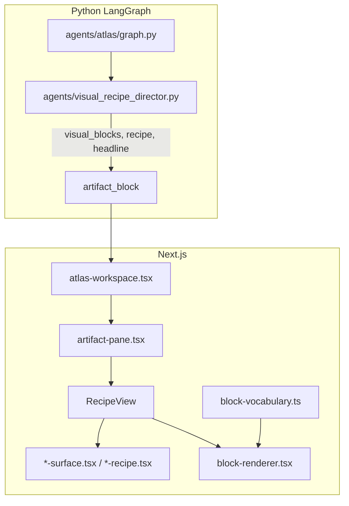

# Surface & block codemap — ATLAS v0.5

**Purpose:** Single index for external designers / AI. Pair with `eval/ATLAS-SURFACES-BUNDLE.md` (generated full source).

---

## 1. Render pipeline



**Contracts:** `src/lib/atlas5/types.ts` (`RecipeType`, `VisualBlock`, `ClaimState`), `src/lib/atlas5/artifact-schema.ts` (Zod).

---

## 2. RecipeType → React surface

| `RecipeType` | Component | Horsemen / CPC | Notes |
|--------------|-----------|----------------|-------|
| `orient` | `OrientSurface` | Orient | + `cpc_capability_assessment`, `cpc_market_alignment` |
| `connect` | `ConnectSurface` | Connect | + `cpc_opportunity_fit`, `cpc_portfolio_comparison`, `cpc_funding_flow` |
| `diagnose` | `DiagnoseSurface` | Diagnose | + `cpc_evidence_gaps` |
| `defend` | `DefendSurface` | Defend | + `cpc_defend` |
| `act` | `BriefFiveCaseRecipe` | Act | Five Case + NPV |
| `brief_five_case` | `BriefFiveCaseRecipe` | Legacy brief | |
| `evidence_panel` | `EvidencePanelRecipe` | JARVIS-style | |
| `stats_dashboard` | `StatsDashboardRecipe` | Charts | |
| `scenario_stress_test` | `ScenarioStressTestRecipe` | Stress | |

**Routing logic:** `detectRecipe()` + `RecipeView` switch in `src/components/atlas5/artifact-pane.tsx` (~lines 399–466).

**Layout order in RecipeView:** `SurfaceHeadline` → `InsightCard` → optional `DecisionSpineCard` → surface body → `BlocksView` (visual_blocks).

---

## 3. Block vocabulary (`status: ready`)

| `type` | Library | Intent triggers | Renderer |
|--------|---------|-----------------|----------|
| `domain_heatmap` | ECharts | orient | `block-renderer.tsx` |
| `knowledge_graph` | ECharts | connect | |
| `options_comparison` | Custom table | connect, diagnose | |
| `evidence_bar` | Recharts | diagnose, orient | |
| `radar` | Recharts | orient | |
| `npv_waterfall` | Recharts | act | |
| `gap_matrix` | Custom | diagnose | |
| `sankey` | Custom | connect | |
| `scatter` | Recharts | connect | |
| `bar` | Recharts | orient | |
| `area_line` | Recharts | orient | |

**Experimental (lab only):** `gauge`, `stacked_bar`, `radial_bar`, `venn`.

**SSOT:** `src/lib/atlas5/block-vocabulary.ts` — `BLOCK_VOCABULARY`, `getReadyBlocks()`.

**Python mirror:** `agents/visual_recipe_director.py` — `build_visual_blocks()`, `select_recipe()`.

---

## 4. Sprint 5 gaps (not built yet)

| Target surface | Proposed block / recipe | S5 phase |
|----------------|-------------------------|----------|
| Organisation profile | `organisation_profile` recipe + blocks | S5b fixture, S5c route |
| Passport CV | `/passport/[id]` components upgrade | S5b |
| Stakeholder workspace | `stakeholder_map` block | S5a |
| Evidence-aware SWOT | `evidence_aware_swot` block | S5a |
| Gap-to-partner | `gap_matrix` / new block | S5a/S5b |

---

## 5. File index (read in this order)

### Types & contracts
| Path | Role |
|------|------|
| `src/lib/atlas5/types.ts` | RecipeType, VisualBlock, ClaimState, citations |
| `src/lib/atlas5/artifact-schema.ts` | Zod validation |
| `src/lib/atlas5/artifact-store.ts` | Client artifact state |
| `src/lib/atlas5/block-vocabulary.ts` | Block SSOT + example_data |

### Rendering
| Path | Role |
|------|------|
| `src/components/atlas5/artifact-pane.tsx` | Pane shell, detectRecipe, RecipeView |
| `src/components/atlas5/block-renderer.tsx` | Block type → chart/table |
| `src/components/atlas5/recipes/surface-primitives.tsx` | Headline, insight, badges |
| `src/components/atlas5/recipes/orient-surface.tsx` | Orient layout |
| `src/components/atlas5/recipes/connect-surface.tsx` | Connect layout |
| `src/components/atlas5/recipes/diagnose-surface.tsx` | Diagnose + empty banner |
| `src/components/atlas5/recipes/defend-surface.tsx` | Defend layout |
| `src/components/atlas5/recipes/brief-five-case.tsx` | Act / Five Case |
| `src/components/atlas5/recipes/evidence-panel.tsx` | Evidence panel |
| `src/components/atlas5/recipes/stats-dashboard.tsx` | Stats |
| `src/components/atlas5/recipes/scenario-stress-test.tsx` | Scenario |
| `src/components/atlas5/recipes/index.ts` | Barrel exports |
| `src/components/atlas5/claim-state-badge.tsx` | Claim state UI |
| `src/components/atlas5/decision-spine.tsx` | Spine card |
| `src/components/atlas5/artifact-qa-panel.tsx` | Content/evidence % |
| `src/components/atlas5/atlas-workspace.tsx` | Production `/` shell |

### Python
| Path | Role |
|------|------|
| `agents/visual_recipe_director.py` | Intent, recipe, build_visual_blocks |
| `agents/atlas/graph.py` | Graph nodes, artifact assembly |
| `agents/atlas/artifact_qa.py` | Deterministic QA scores |

### Lab & fixtures
| Path | Role |
|------|------|
| `src/app/lab/blocks/page.tsx` | Block gallery golden/empty |
| `src/app/atlas5-test/page.tsx` | Fixture render test |
| `src/app/api/atlas5/fixture/route.ts` | Fixture API |
| `eval/fixtures/artifact-blocks.ts` | Shared fixtures |
| `eval/playwright/recipe-smoke.spec.ts` | Smoke tests |

### Passport (parallel to artifact pane)
| Path | Role |
|------|------|
| `src/app/(chat)/passport/page.tsx` | List |
| `src/app/(chat)/passport/[id]/page.tsx` | Detail |
| `src/components/passport/*.tsx` | Passport UI |
| `src/app/api/passport/**/*.ts` | API routes |

### Skills
| Path | Role |
|------|------|
| `skills/data-visualization.md` | Block selection rules |
| `skills/surface-composition.md` | Surface layout |
| `skills/golden-orient.md` etc. | Per-mode golden patterns |

### Legacy dashboard (older CPC recipes — reference only)
| Path | Role |
|------|------|
| `src/components/dashboard/layout/artifact-panel.tsx` | Old detectRecipe |
| `src/components/dashboard/recipes/cpc-*.tsx` | Legacy CPC components |

Production `/` uses **atlas5** path above, not dashboard recipes.

---

## 6. Data grounding (Supabase)

| Example query | Tables |
|---------------|--------|
| “What about CPC?” | `atlas.organisations`, `atlas.projects` |
| Stakeholders / CAV | `atlas.projects` (lead org, funders, themes) |
| Passport | `atlas.passports`, claims/gaps tables per schema |

Use service role server-side only; fixtures use synthetic UUIDs.

---

## 7. Commands

```bash
pnpm bundle:surfaces          # generate eval/ATLAS-SURFACES-BUNDLE.md
pnpm eval:tier1               # contract tests
open http://localhost:3005/lab/blocks
open http://localhost:3005/atlas5-test?fixture=brief_five_case
```
